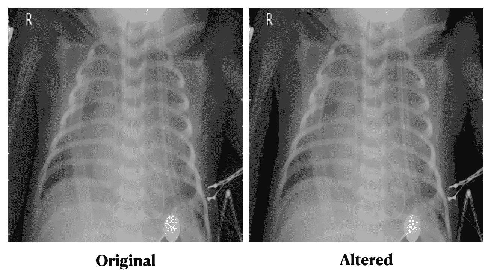
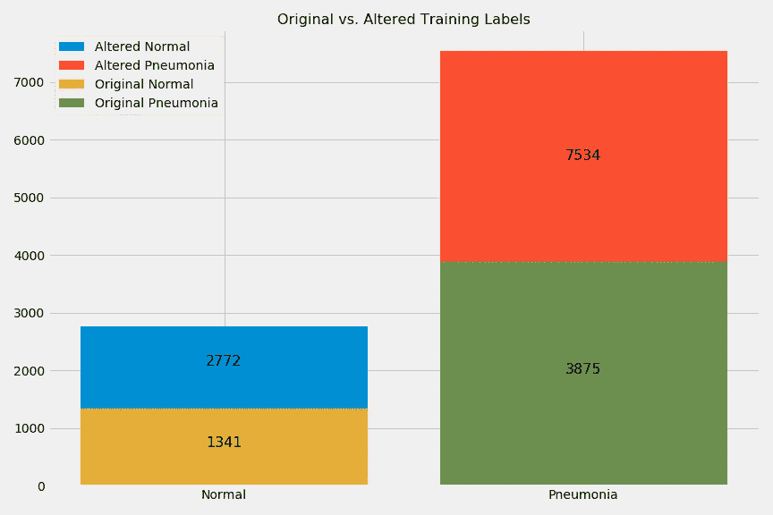
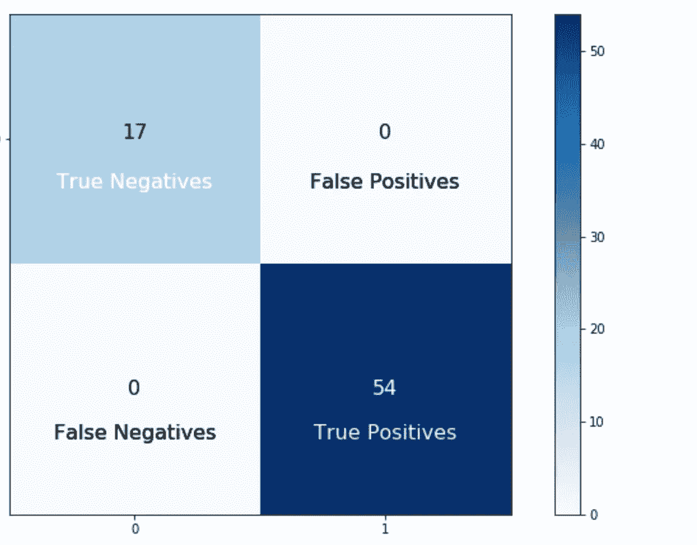

# 在 X 射线图像中检测肺炎

> 原文：<https://medium.com/analytics-vidhya/detecting-pneumonia-in-x-ray-images-with-a-convolutional-neural-network-735f68f40564?source=collection_archive---------17----------------------->


[国家癌症研究所](https://unsplash.com/@nci?utm_source=unsplash&utm_medium=referral&utm_content=creditCopyText)在 [Unsplash](https://unsplash.com/s/photos/x-ray?utm_source=unsplash&utm_medium=referral&utm_content=creditCopyText) 上拍摄的照片

我写这篇文章的主要目的是强调一个实际应用，作为构建一个卷积神经网络(CNN)模型的结果。总的来说，CNN 模型的应用范围很广；在这种情况下，它正在建立一个可以在 x 射线图像中准确检测肺炎的模型。听起来很酷，对吧？但是，当我们有可以执行相同任务的医学专家时，我们为什么需要卷积神经网络呢？

**为什么我们需要 CNN 来检测肺炎？**

在世界范围内，普遍缺乏放射科医生，并且这一数字持续减少，这导致花费大量资源来确定医学成像的结果。在许多情况下，缺乏放射科医生会延误检查结果。这也可能意味着依赖不具备放射学专业知识的医疗专业人员，从而导致错误的结果。在短时间内获得准确的结果对某些患者来说是至关重要的，甚至可能是救命稻草。

这个特殊项目中使用的图像是针对 5 岁以下的儿科患者的。据世界卫生组织统计，肺炎占全球 5 岁以下儿童死亡的 15%。由细菌引起的肺炎可以用抗生素治疗，但是只有三分之一的儿童使用抗生素。简化准确检测儿童肺炎的过程是必要的，这确实可以拯救生命。

现在我们已经理解了 CNN 的必要性，让我们来看看这个项目和最终模型结果的一些细节。在继续之前，如果您对用于构建项目的一些代码不感兴趣，只想看到最终结果(如果您不了解 Python，这是可以理解的)，那么请随意滚动到文章的末尾。

**数据:**
本项目数据直接从[https://www . ka ggle . com/paultimothymiooney/chest-x ray-pneumonia](https://www.kaggle.com/paultimothymooney/chest-xray-pneumonia)下载。该数据包含 5，856 张混合了 RGB 和灰度图像的 x 射线图像。

**调整图像大小:**
在本地机器上运行时，为了提高效率，图像被调整为 75x75。此外，迁移学习与预训练网络 InceptionResNetV2 一起使用，该网络要求最小图像尺寸为 75x75。

**训练、验证和测试集:**
原始训练、测试和验证集是 5，216，624 和 16 幅图像。所有的图像和标签被组合，然后重新分割，以增加测试集的大小，从而更准确地评估模型结果，因为 16 个图像本身不会给出足够清晰的图片。最终的训练集略微减少到 5，153 幅图像，在建模过程中使用总共 632 幅图像的验证集来衡量模型的准确性并进一步调整模型，测试集用于衡量模型如何处理总共 71 幅图像的看不见的数据。

**数据扩充:**
实施数据扩充是为了增加训练集的大小，并为模型提供额外的图像多样性以提高准确性(您可能已经注意到上面的重新分割训练图比原始图大)。初始训练集被加倍，像素值小于 25 的图像被替换为 0。本质上，这将较暗的灰色区域转换为黑色，并允许模型专注于更重要、更亮的区域。下面是原始图像与修改后的图像的比较，以及用于进行这种修改的代码(差异非常细微，但很有效):

```
#Change pixel values for data augmentation
i = (X_train >= 0) & (X_train < 25)
altered = np.where(i, 0, X_train)
```



此外，下面是原始训练集与增强训练集的对比图:



**建立初始模型:**

下面的第一个函数被创建来可视化一个混淆矩阵，以便理解真阳性、真阴性、假阳性和假阴性的分类。下面的第二个函数是为建模过程创建的。如文档所述，该函数用于构建神经网络模型，返回分类报告和混淆矩阵，并使用基于验证准确性的模型检查点回调来保存最佳模型。

```
#Build Plot Confusion Matrix Function
def plot_confusion_matrix(cm, classes=[0, 1], normalize=False, title=None, cmap=plt.cm.Blues, ax=None):
    """
    Print and plot a confusion matrix.
    Normalization can be applied by setting `normalize=True`.
    """
    plt.imshow(cm, interpolation='nearest', cmap=cmap)
    plt.title(title)
    plt.colorbar()
    tick_marks = np.arange(len(classes))
    plt.xticks(tick_marks, classes)
    plt.yticks(np.arange(0, 1), [0, 1])if normalize:
        cm = cm.astype('float') / cm.sum(axis=1)[:, np.newaxis]
    else:
        passthresh = cm.max() / 2.
    j_list = []
    for i in cm:
        for j in i:
            j_list.append(j)
    zero = j_list[:2]
    one = j_list[2:]
    for i, j in enumerate(zero):
        plt.text(x=i, y=0, s=j, horizontalalignment="center", fontsize=16, 
                 color="white" if j > thresh else "black")
        plt.text(x=0, y=0.2, s='True Negatives', horizontalalignment="center",
                 fontsize=16, 
                 color="white" if j > thresh else "black")
        plt.text(x=1, y=0.2, s='False Positives', horizontalalignment="center",
                 fontsize=16, 
                 color="white" if j > thresh else "black")
    for i, j in enumerate(one):
        plt.text(x=i, y=1, s=j, horizontalalignment="center", verticalalignment="center", fontsize=16, 
                 color="white" if j > thresh else "black")
        plt.text(x=0, y=1.2, s='False Negatives', horizontalalignment="center", 
                 fontsize=16, 
                 color="white" if j > thresh else "black")
        plt.text(x=1, y=1.2, s='True Positives', horizontalalignment="center", 
                 fontsize=16, 
                 color="white" if j > thresh else "black")plt.tight_layout()
    plt.ylabel('True label')
```

构建模型的函数:

```
layers_list = []# Create Model Checkpoint 
mc = ModelCheckpoint('best_model_test.h5', monitor='val_accuracy', mode='max', verbose=1, save_best_only=True)def build_model(optimizer, epochs, batch_size, callbacks=mc, weights={0:1,1:1}):
    """
    Build a neural network model, returning classification reports, confusion matrix, 
    and save best model using model checkpoint based on val_accuracy.

    Input Parameters: optimizer, epochs, batch_size, callbacks, weights
    """

    # Initialize a sequential model
    model = Sequential()# Add layers
    for i in layers_list:
        model.add(i)

    # Compile the model
    model.compile(optimizer=optimizer, loss='binary_crossentropy', metrics=['accuracy'])

    results = model.fit(X_train, y_train, callbacks=callbacks, class_weight=weights, epochs=epochs, batch_size=batch_size, 
                        validation_data=(X_test, y_test))
    build_model.results = results

    # Output (probability) predictions for the train and test set
    y_hat_train = model.predict(X_train)
    y_hat_test = model.predict(X_test)
    build_model.y_hat_train = y_hat_train
    build_model.y_hat_test = y_hat_test

    #Visualize Results
    history = results.history
    plt.figure()
    plt.plot(history['val_loss'])
    plt.plot(history['loss'])
    plt.legend(['val_loss', 'loss'])
    plt.title('Loss')
    plt.xlabel('Epochs')
    plt.ylabel('Loss')
    plt.show()

    plt.figure()
    plt.plot(history['val_accuracy'])
    plt.plot(history['accuracy'])
    plt.legend(['val_accuracy', 'accuracy'])
    plt.title('Accuracy')
    plt.xlabel('Epochs')
    plt.ylabel('Accuracy')
    plt.show()

    print('-----------------------------------\n')

    # Print the loss and accuracy for the training set 
    results_train = model.evaluate(X_train, y_train)
    print('Train Results', results_train)
    print('-----------------------------------\n')

    # Print the loss and accuracy for the training set 
    results_test = model.evaluate(X_test, y_test)
    print('Test Results', results_test)
    print('-----------------------------------\n')

    # Print Classification Reports
    print('Train Classification Report')
    print(classification_report(y_train, np.round(y_hat_train, 0), 
                                target_names = ['Normal (Class 0)','Pneumonia (Class 1)']))
    print('-----------------------------------\n')

    print('Test Classification Report')
    print(classification_report(y_test, np.round(y_hat_test, 0), 
                                target_names = ['Normal (Class 0)','Pneumonia (Class 1)']))
    print('-----------------------------------\n')

    # load the saved model
    saved_model = load_model('best_model_test.h5')# evaluate the model
    _, train_acc = saved_model.evaluate(X_train, y_train, verbose=0)
    _, test_acc = saved_model.evaluate(X_test, y_test, verbose=0)
    build_model.saved_model = saved_model
    print('Best Model Results\n')
    print('Train: %.3f, Test: %.3f' % (train_acc, test_acc))
    print('-----------------------------------\n')

    #Create Confusion Matrices
    train_cm = confusion_matrix(y_true=y_train, y_pred=np.round(y_hat_train, 0))
    test_cm = confusion_matrix(y_true=y_test, y_pred=np.round(y_hat_test, 0))
    build_model.train_cm = train_cm
    build_model.test_cm = test_cm

    #Plot Train Confusion Matrices
    plt.figure(figsize=(12, 6))
    plt.subplot(121)
    plot_confusion_matrix(cm=train_cm, 
                          cmap=plt.cm.Blues)

    plt.subplot(122)
    plot_confusion_matrix(cm=test_cm, 
                          cmap=plt.cm.Blues)
    plt.subplots_adjust(wspace=0.4)
```

既然已经设置了函数，下面是第一个模型的结构:

```
#Add layers
layers_list = []layer1 = layers.Conv2D(75, (2, 2), padding='same', activation='relu', input_shape=(75, 75,  3))
layer2 = layers.MaxPooling2D((2, 2), padding='same')
layer3 = layers.Conv2D(75, (2, 2), padding='same', activation='relu')
layer4 = layers.MaxPooling2D((2, 2), padding='same')
layer5 = layers.Conv2D(75, (2, 2), padding='same', activation='relu')
layer6 = layers.MaxPooling2D((2, 2), padding='same')
layer7 = layers.Flatten()
layer8 = layers.Dense(75, activation='relu')
layer9 = layers.Dense(1, activation='sigmoid')layers_list = [layer1, layer2, layer3, layer4, layer5, layer6, layer7, layer8, layer9]#Utilize Stochastic Gradient Descent Optimizer
opt = keras.optimizers.SGD(learning_rate=0.01, momentum=.9)#Build model with pre-built function
build_model(optimizer=opt, epochs=50, batch_size=100, callbacks=mc)
```

该模型表现良好，验证集的准确率为 96.7%。我尝试了没有迁移学习的第二种模式，试图改善这些结果，但无济于事。事实上，我尝试了数百万个不同的参数和超参数，在某些情况下确实取得了更好的结果，但总体上最好的模型结果是由预构建的 InceptionResNetV2 模型确定的。我不会在这里打印整个模型结构，因为它相当大，但是如果您感兴趣，您可以用 Python 查看这个代码的结构(以及在我的 GitHub repo 中，包含在本文的末尾):

```
#Import InceptionResNetV2
from keras.applications import InceptionResNetV2#Build the model base with required input shape 75x75x3
cnn_base = InceptionResNetV2(weights='imagenet', 
                 include_top=False, 
                 input_shape=(75, 75, 3))#View base structure
cnn_base.summary()
```

通常，大多数会冻结预训练网络或至少部分网络，以使用预构建的模型权重并减少训练时间。我决定与众不同，重新训练整个模型以提高准确性。这可以在我的 Mac 上运行，数据集的大小和使用一个较小的图像大小为 75x75x3。我将基本模型作为我的第一层，如下所示:

```
#Set random seed
np.random.seed(123)#Add layers including InceptionResNetV2 base
layers_list = []layer1 = cnn_base
layer2 = layers.Flatten()
layer3 = layers.Dense(75, activation='relu')
layer4 = layers.Dense(1, activation='sigmoid')layers_list = [layer1, layer2, layer3, layer4]#Utilize Stochastic Gradient Descent Optimizer
opt = keras.optimizers.SGD(learning_rate=0.01, momentum=.9)#Build model with pre-built function
build_model(optimizer=opt, epochs=50, batch_size=100, callbacks=mc)
```

**最终模型结果:**

下面是对未知测试集进行预测的函数。测试集一直持续到最终预测，以便消除在训练模型时可能出现的任何偏差。

```
#Build a function to make predictions on unseen data
def predict_new_images(test_img, test_lbls):
    '''Predict saved model results on unseen test set, print classification report and plot confusion matrix.'''

    #Transpose val labels
    test_lbls = test_lbls.T[[1]]
    test_lbls = test_lbls.T

    #Standardize the data
    test_final = test_img/255

    predictions = build_model.saved_model.predict(test_final)
    predict_new_images.predictions = predictions
    test_cm = confusion_matrix(y_true=test_lbls, y_pred=np.round(predictions, 0))

    print('Classification Report')
    print(classification_report(test_lbls, np.round(predictions, 0), 
                                target_names = ['Normal (Class 0)','Pneumonia (Class 1)']))
    print('-----------------------------------\n')

    plt.figure(figsize=(10, 6))
    plot_confusion_matrix(cm=test_cm, 
                      cmap=plt.cm.Blues)
    plt.savefig('images/final_model_result.png')
```

该函数绘制了显示最终结果的混淆矩阵:



在某些方面，我是一个完美主义者，所以在未知的测试集上有 100%的准确率让我很高兴。就我个人而言，我觉得很神奇的是，在看不见的测试集中的 71 张 x 光图像中，这个卷积神经网络模型能够以 100%的准确率检测出儿科患者是否患有肺炎。就像我说的，这很酷。

更多细节和这个项目的完整笔记本，请访问我的 GitHub repo 这里:[https://GitHub . com/dbarth 411/DSC-mod-4-project-v2-1-online-ds-sp-000](https://github.com/dbarth411/dsc-mod-4-project-v2-1-online-ds-sp-000)。