# 使用深度学习探测潜在危险的小行星(第 1 部分)

> 原文：<https://medium.com/analytics-vidhya/detecting-potentially-hazardous-asteroids-using-deep-learning-part-1-9873a0d97ac8?source=collection_archive---------9----------------------->

见证深度学习在巨大数据集上的威力！


类固醇是围绕太阳运行的小型岩石物体。虽然它们像行星一样绕着太阳转，但它们比行星小得多。**具有潜在危险的小行星** ( **PHA** )是一颗近地天体——要么是小行星，要么是彗星——其轨道可以非常接近地球，其大小足以在撞击事件中造成重大的区域破坏。

> 我将解释如何首先使用传统的机器学习分类器检测潜在危险的小行星，然后使用人工神经网络对两者进行比较。为此，我将这篇文章分为两部分-
> 
> 第 1 部分-传统分类器探测危险小行星
> 
> 第 2 部分-通过建立神经网络来探测危险的小行星([https://medium . com/@ jatin . kataria 94/detecting-potentially-Hazardous-asteroids-using-deep-learning-part-2-B3 bfd 1 e 6774 c](/@jatin.kataria94/detecting-potentially-hazardous-asteroids-using-deep-learning-part-2-b3bfd1e6774c))

# 传统 ML 分类

要了解如何进行传统分类、超参数调整和可视化，请参考我以前的文章:

[](/analytics-vidhya/pulsars-detection-hyperparameter-tuning-and-visualization-cb4486812c4d) [## 脉冲星探测、超参数调谐和可视化

### 探索 Yellowbrick 和 mlxtend 的强大功能！

medium.com](/analytics-vidhya/pulsars-detection-hyperparameter-tuning-and-visualization-cb4486812c4d) 

如果您已经从我的文章中了解了如何使用传统方法进行分类，您可以理解以下结果:

有关源代码，请访问以下链接:

[](https://github.com/jatinkataria94/Asteroid-Detection/blob/master/asteroid_traditional_classifier.py) [## jatinkataria 94/小行星探测

### 在 GitHub 上创建一个帐户，为 jatinkataria 94/小行星探测开发做出贡献。

github.com](https://github.com/jatinkataria94/Asteroid-Detection/blob/master/asteroid_traditional_classifier.py) 

要访问数据集，请访问以下链接:

[](https://www.kaggle.com/sakhawat18/asteroid-dataset) [## 小行星数据集

### 美国宇航局 JPL 小行星数据集

www.kaggle.com](https://www.kaggle.com/sakhawat18/asteroid-dataset) 

# **数据描述**

```
The data looks like this: 
   neo pha     H  diameter  ...      sigma_tp     sigma_per class      rms
0   N   0  3.40   939.400  ...  3.782900e-08  9.415900e-09   MBA  0.43301
1   N   0  4.20   545.000  ...  4.078700e-05  3.680700e-06   MBA  0.35936
2   N   0  5.33   246.596  ...  3.528800e-05  3.107200e-06   MBA  0.33848
3   N   0  3.00   525.400  ...  4.103700e-06  1.274900e-06   MBA  0.39980
4   N   0  6.90   106.699  ...  3.474300e-05  3.490500e-06   MBA  0.52191[5 rows x 38 columns]The shape of data is:  (958524, 38)The missing values in data are: 
 albedo            823421
diameter_sigma    822443
diameter          822315
sigma_per          19926
sigma_ad           19926
sigma_q            19922
sigma_e            19922
sigma_a            19922
sigma_i            19922
sigma_om           19922
sigma_w            19922
sigma_ma           19922
sigma_n            19922
sigma_tp           19922
moid               19921
pha                19921
H                   6263
moid_ld              127
neo                    4
per                    4
ad                     4
rms                    2
ma                     1
per_y                  1
w                      0
om                     0
i                      0
q                      0
a                      0
e                      0
epoch_cal              0
epoch_mjd              0
epoch                  0
orbit_id               0
class                  0
tp                     0
tp_cal                 0
n                      0
dtype: int64The summary of data is: 
                    H       diameter  ...     sigma_per            rms
count  952261.000000  136209.000000  ...  9.385980e+05  958522.000000
mean       16.906411       5.506429  ...  8.525815e+04       0.561153
std         1.790405       9.425164  ...  2.767681e+07       2.745700
min        -1.100000       0.002500  ...  9.415900e-09       0.000000
25%        16.100000       2.780000  ...  1.794500e-05       0.518040
50%        16.900000       3.972000  ...  3.501700e-05       0.566280
75%        17.714000       5.765000  ...  9.775475e-05       0.613927
max        33.200000     939.400000  ...  1.910700e+10    2686.600000[8 rows x 34 columns]Some useful data information:<class 'pandas.core.frame.DataFrame'>
RangeIndex: 958524 entries, 0 to 958523
Data columns (total 38 columns):
 #   Column          Non-Null Count   Dtype  
---  ------          --------------   -----  
 0   neo             958520 non-null  object 
 1   pha             938603 non-null  object 
 2   H               952261 non-null  float64
 3   diameter        136209 non-null  float64
 4   albedo          135103 non-null  float64
 5   diameter_sigma  136081 non-null  float64
 6   orbit_id        958524 non-null  object 
 7   epoch           958524 non-null  float64
 8   epoch_mjd       958524 non-null  int64  
 9   epoch_cal       958524 non-null  float64
 10  e               958524 non-null  float64
 11  a               958524 non-null  float64
 12  q               958524 non-null  float64
 13  i               958524 non-null  float64
 14  om              958524 non-null  float64
 15  w               958524 non-null  float64
 16  ma              958523 non-null  float64
 17  ad              958520 non-null  float64
 18  n               958524 non-null  float64
 19  tp              958524 non-null  float64
 20  tp_cal          958524 non-null  float64
 21  per             958520 non-null  float64
 22  per_y           958523 non-null  float64
 23  moid            938603 non-null  float64
 24  moid_ld         958397 non-null  float64
 25  sigma_e         938602 non-null  float64
 26  sigma_a         938602 non-null  float64
 27  sigma_q         938602 non-null  float64
 28  sigma_i         938602 non-null  float64
 29  sigma_om        938602 non-null  float64
 30  sigma_w         938602 non-null  float64
 31  sigma_ma        938602 non-null  float64
 32  sigma_ad        938598 non-null  float64
 33  sigma_n         938602 non-null  float64
 34  sigma_tp        938602 non-null  float64
 35  sigma_per       938598 non-null  float64
 36  class           958524 non-null  object 
 37  rms             958522 non-null  float64
dtypes: float64(33), int64(1), object(4)
memory usage: 277.9+ MB
NoneThe columns in data are: 
 ['neo' 'pha' 'H' 'diameter' 'albedo' 'diameter_sigma' 'orbit_id' 'epoch'
 'epoch_mjd' 'epoch_cal' 'e' 'a' 'q' 'i' 'om' 'w' 'ma' 'ad' 'n' 'tp'
 'tp_cal' 'per' 'per_y' 'moid' 'moid_ld' 'sigma_e' 'sigma_a' 'sigma_q'
 'sigma_i' 'sigma_om' 'sigma_w' 'sigma_ma' 'sigma_ad' 'sigma_n' 'sigma_tp'
 'sigma_per' 'class' 'rms']The target variable is divided into: 
 0    930269
1      2066
Name: pha, dtype: int64The numerical features are: 
 ['pha', 'H', 'epoch', 'epoch_mjd', 'epoch_cal', 'e', 'a', 'q', 'i', 'om', 'w', 'ma', 'ad', 'n', 'tp', 'tp_cal', 'per', 'per_y', 'moid', 'moid_ld', 'sigma_e', 'sigma_a', 'sigma_q', 'sigma_i', 'sigma_om', 'sigma_w', 'sigma_ma', 'sigma_ad', 'sigma_n', 'sigma_tp', 'sigma_per', 'rms']The categorical features are: 
 ['neo', 'orbit_id', 'class']The categorical variable is divided into: 
 N    909452
Y     22883
Name: neo, dtype: int64The categorical variable is divided into: 
 1          50142
JPL 1      47494
JPL 2      34563
JPL 3      29905
12         29136

JPL 453        1
204            1
JPL 480        1
JPL 528        1
241            1
Name: orbit_id, Length: 525, dtype: int64The categorical variable orbit_id has too many divisions to plotThe categorical variable is divided into: 
 MBA    832650
OMB     27170
IMB     19702
MCA     17789
APO     12684
AMO      8448
TJN      8122
TNO      3459
ATE      1729
CEN       503
AST        57
IEO        22
Name: class, dtype: int64Execution Time for EDA: 7.86 minutes
```

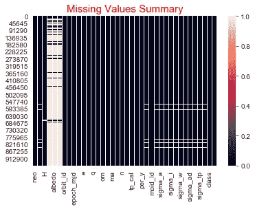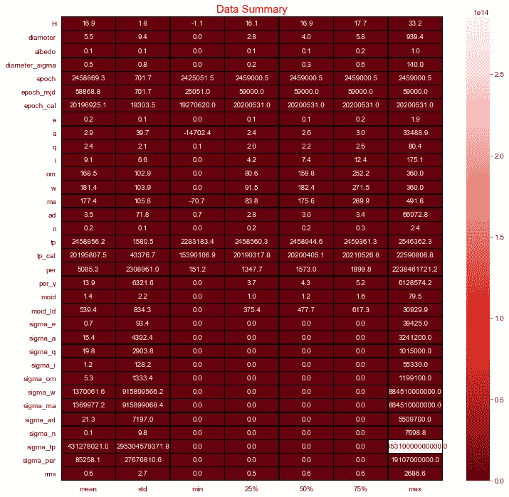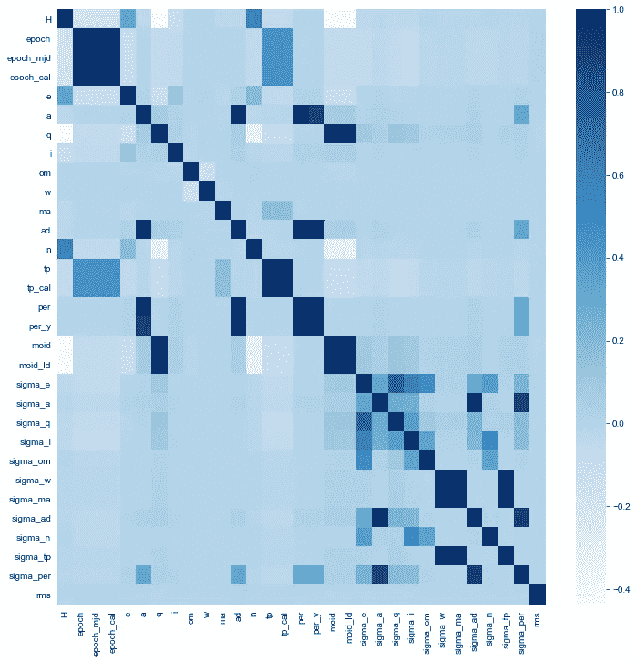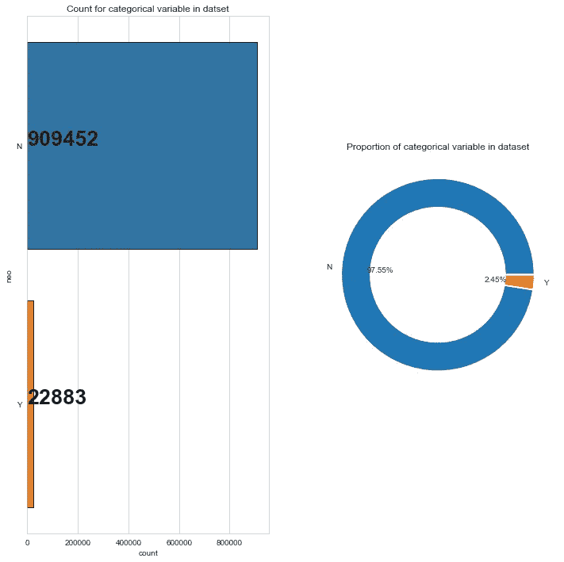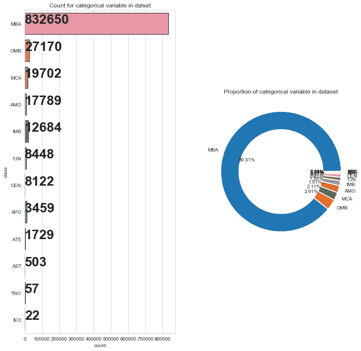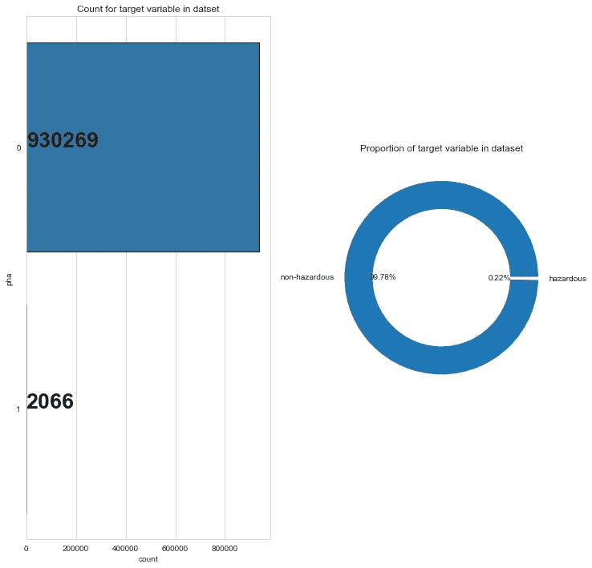

# 观察

*   看上面的结果，我们可以清楚地看到，这是一个拥有近百万条目的庞大数据集(958，524)！
*   不平衡的阶级
*   三个分类特征
*   少数要素中存在大量空值

# 结果

**用于选择特征的特征重要性图**

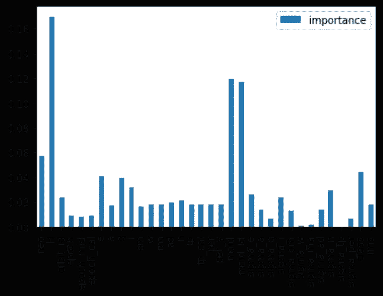

**混淆矩阵热图和不平衡数据分类报告**

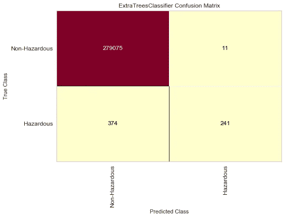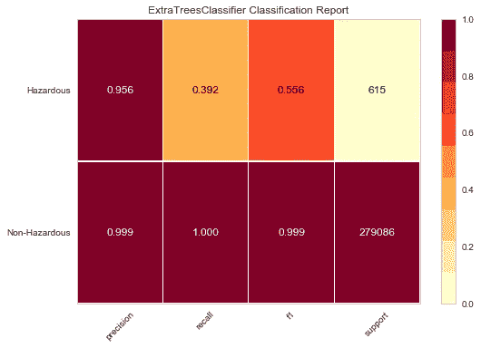

**混淆矩阵热图和平衡数据分类报告**

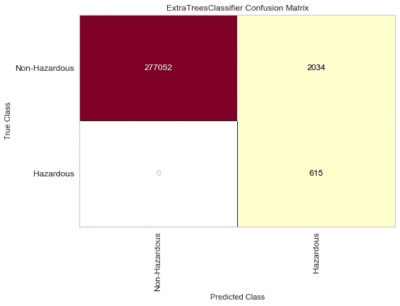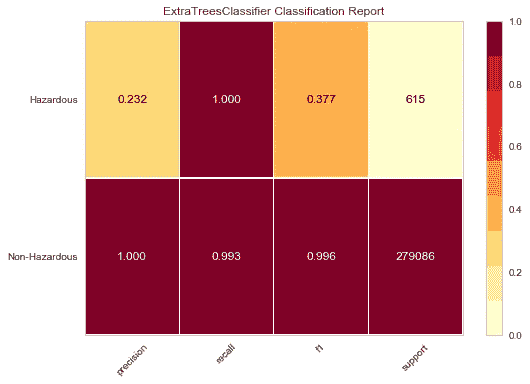

**决定区域的绘图**

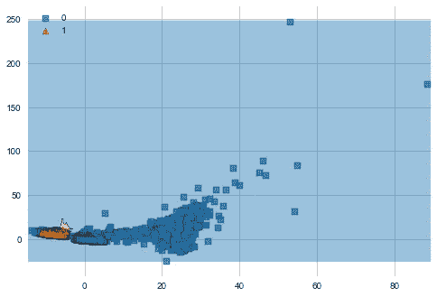

# 传统分类器的性能

不平衡数据

*   准确度— 99.86%
*   **精度— 95.6%**
*   **召回率——39.2%**

平衡数据

*   准确度— 99.27%
*   **精度— 23.2%**
*   **召回— 100%**

校正类别不平衡后的模型以仅 23.2%的精度召回危险小行星，这意味着大量非危险小行星被错误分类为危险小行星。如果每次一颗不危险的小行星被标记为潜在危险的，这种情况会导致大众的恐慌和恐惧。

我们将尝试使用深度学习模型来提高精确度。

# 深度学习

深度学习处理受大脑结构和功能启发的算法，称为人工神经网络。深度学习模型往往在处理大量数据时表现良好，而旧的机器学习模型在饱和点之后就会停止改善。


在第 2 部分中，我们将了解如何构建深度学习人工神经网络模型，并将其性能与本部分中使用的传统分类器进行比较。

[](/@jatin.kataria94/detecting-potentially-hazardous-asteroids-using-deep-learning-part-2-b3bfd1e6774c) [## 使用深度学习探测潜在危险的小行星(第二部分)

### 见证深度学习在巨大数据集上的威力！

medium.com](/@jatin.kataria94/detecting-potentially-hazardous-asteroids-using-deep-learning-part-2-b3bfd1e6774c)