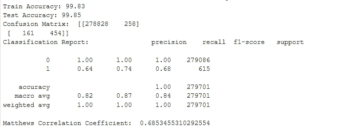
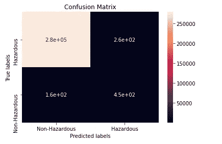
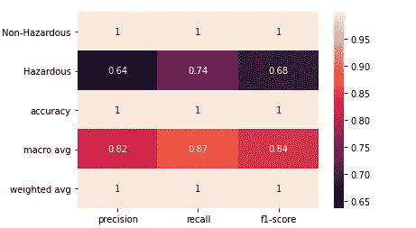
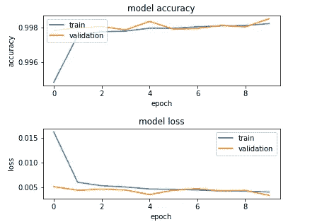
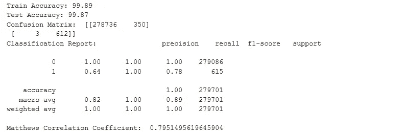
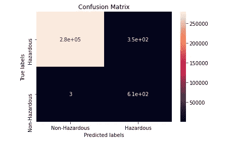
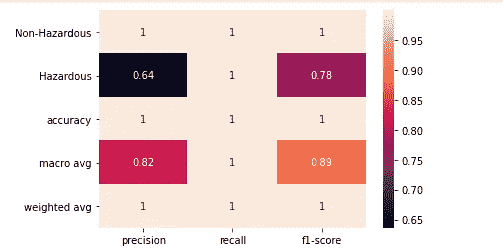
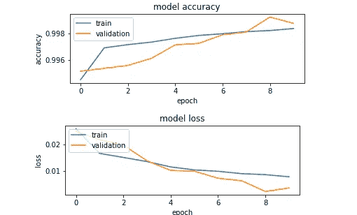

# 使用深度学习探测潜在危险的小行星(第二部分)

> 原文：<https://medium.com/analytics-vidhya/detecting-potentially-hazardous-asteroids-using-deep-learning-part-2-b3bfd1e6774c?source=collection_archive---------11----------------------->

见证深度学习在巨大数据集上的威力！


在这篇文章的第二部分，我们将使用 keras 框架制作我们的神经网络。

对于第 1 部分(使用传统分类器)，请访问以下链接:

[](/@jatin.kataria94/detecting-potentially-hazardous-asteroids-using-deep-learning-part-1-9873a0d97ac8) [## 使用深度学习探测潜在危险的小行星(第 1 部分)

### 见证深度学习在巨大数据集上的威力！

medium.com](/@jatin.kataria94/detecting-potentially-hazardous-asteroids-using-deep-learning-part-1-9873a0d97ac8) 

有关源代码，请访问以下链接:

[](https://github.com/jatinkataria94/Asteroid-Detection/blob/master/asteroid_ANN.py) [## jatinkataria 94/小行星探测

github.com](https://github.com/jatinkataria94/Asteroid-Detection/blob/master/asteroid_ANN.py) 

# 数据处理

我们将使用第 1 部分中处理的数据。处理后的数据集由 20 个选定的特征组成，我们需要对小行星是否有潜在危险进行分类。目标变量分为两类。

# 导入包

Keras 是一个构建神经网络的简单工具。它是一个基于 tensorflow、theano 或 cntk 后端的高级框架。

```
#Dependenciesimport tensorflow as tf
import keras
from keras.models import Sequential
from keras.layers import Dense, Dropout
from keras import optimizers
from sklearn.metrics import  confusion_matrix,classification_report,matthews_corrcoef
```

# 构建神经网络

我们将定义一个包含我们的神经网络模型架构的函数，以便稍后可以轻松地调用它。

```
def NNmodel(init_mode,act,opt,n_top_features=n_top_features):#Setting random.seed for numpy and tensorflow to ensure reproducible results
np.random.seed(42)
tf.random.set_seed(42)# building a linear stack of layers with the sequential modelmodel = Sequential()# hidden layermodel.add(Dense(16,input_dim=n_top_features, kernel_initializer=init_mode, activation=act))model.add(Dropout(0.2))model.add(Dense(16, kernel_initializer=init_mode,activation=act))model.add(Dropout(0.2))# output layermodel.add(Dense(1, activation='sigmoid'))# compiling the sequential modelmodel.compile(loss='binary_crossentropy', metrics=['acc'], optimizer=opt)return model
```

*   **kernel_initializer:** 神经网络需要从一些权重开始，然后迭代地将它们更新为更好的值。这一项是用于初始化权重的函数。(由 NNmodel 函数的 **init_mode** 参数设置)
*   **激活函数:**这是一个传递函数，用于将一层的输出映射到另一层。(由 NNmodel functiom 的 **act** 参数设定)。对于输出层，激活可以是“sigmoid”(二进制类)或“softmax”(多类)。
*   **优化算法:**它们通过响应损失函数的输出更新模型，将损失函数和模型参数联系在一起。他们通过使用权重将你的模型塑造成最精确的形式。(由 NNmodel 功能的 **opt** 参数设定)
*   **损失:**计算得到关于模型权重的梯度，并通过反向传播相应地更新这些权重。(' binary_crossentropy '用于二进制类；多类的“分类交叉熵”)

在我们的数据集中，输入有 20 个维度(使用了 20 个顶级特征)，输出有 2 个值(二进制类)。因此，输入和输出层的维数分别为 20 和 1(但是对于多类，输出层的维数等于类的数目)。在我们的神经网络中，我们使用两个 16 维的隐藏层。

**注意** -选择隐藏层和节点的数量很困难，但是有一些经验法则会有所帮助。

[](https://stats.stackexchange.com/questions/181/how-to-choose-the-number-of-hidden-layers-and-nodes-in-a-feedforward-neural-netw) [## 前馈神经网络的隐层和节点数如何选择？

### begingroup $我意识到这个问题已经被回答了，但是我不认为现存的答案真正涉及到这个问题…

stats.stackexchange.com](https://stats.stackexchange.com/questions/181/how-to-choose-the-number-of-hidden-layers-and-nodes-in-a-feedforward-neural-netw) 

为了更好地理解神经网络，请参考这些全面解释该主题的文章:

[](https://towardsdatascience.com/simple-introduction-to-neural-networks-ac1d7c3d7a2c) [## 神经网络简介

### 神经网络的详细概述，有大量的例子和简单的图像。

towardsdatascience.com](https://towardsdatascience.com/simple-introduction-to-neural-networks-ac1d7c3d7a2c) [](https://towardsdatascience.com/comprehensive-introduction-to-neural-network-architecture-c08c6d8e5d98) [## 神经网络体系结构综合介绍

### 神经架构、激活函数、损失函数、输出单元的详细概述。

towardsdatascience.com](https://towardsdatascience.com/comprehensive-introduction-to-neural-network-architecture-c08c6d8e5d98) [](https://towardsdatascience.com/neural-network-optimization-7ca72d4db3e0) [## 神经网络优化

### 涵盖优化器，动量，自适应学习率，批量标准化，等等。

towardsdatascience.com](https://towardsdatascience.com/neural-network-optimization-7ca72d4db3e0) 

# Keras 超参数调谐

可以通过 Python 中的 scikit-learn 库使用 Keras 的深度学习模型。这将允许您利用 scikit-learn 库的强大功能进行模型超参数优化。

要使用**顺序 Keras 模型**执行随机搜索，您必须通过使用 **Scikit-Learn API** 的 **Keras 包装器**将这些模型转换成 **sklearn 兼容的估计器**:【更多细节请参考[文档](http://keras.io/scikit-learn-api)。Keras 库为深度学习模型提供了一个方便的包装器，可用作 scikit-learn 中的分类或回归估计器。

```
batch_size = 64
epochs = 10from keras.wrappers.scikit_learn import KerasClassifier
model_CV = KerasClassifier(build_fn=NNmodel, epochs=epochs, 
                           batch_size=batch_size, verbose=1)# define the search parameters
init_mode = ['he_uniform','glorot_uniform']
act=['relu','selu','tanh']
opt=['rmsprop','adam']
param_distributions={'init_mode':init_mode,'act':act,'opt':opt}#Use RandomizedSearchCV to tune hyperparameters
rand = RandomizedSearchCV(estimator=model_CV, param_distributions=param_distributions, n_jobs=-1, cv=3,random_state=42,verbose=10)
rand_result = rand.fit(X_train_sfs_scaled, y_train)# print results
print(f'Best Accuracy for {rand_result.best_score_} using {rand_result.best_params_}')#Store the best search results in NNmodel parameters
init_mode=rand_result.best_params_['init_mode']
act=rand_result.best_params_['act']
opt=rand_result.best_params_['opt']
```

我们通过 **build_fn** 参数将函数名(NNmodel)传递给 KerasClassifier 类。我们还传递了额外的参数 **epochs=10** 和 **batch_size=64** 。这些被自动打包并传递给由 KerasClassifier 类内部调用的 **fit()** 函数。

我们数据集的优化超参数结果是: **{init_mode='glorot_uniform '，act='tanh '，opt='adam'}**

# 培训模式

我们将使用调整后的超参数，并使模型符合训练数据。

```
labels=['Non-Hazardous','Hazardous']NNperformance(init_mode,act,opt,n_top_features,epochs,
              batch_size,labels,X_train_sfs_scaled,
              y_train,X_test_sfs_scaled, y_test)
```

这里我们需要指定类标签并适应模型。模型训练的历史由每个时期之后的模型精度和损失组成，其可以被可视化为学习曲线以评估模型性能。

## 模型性能

为了评估和可视化模型性能，我们创建了三个函数:

*   **学习曲线:**在每个时期后绘制模型精度和损失，以了解模型是否合适。
*   **PerformanceReports:** 绘制混淆矩阵和分类报告，评估模型的召回率和准确率。
*   **NNPerformance:** 将模型拟合到训练数据，进行预测，调用上述两个函数进行性能评估。

```
def LearningCurve(history):# summarize history for accuracyplt.subplot(211)
plt.plot(history.history['acc'])
plt.plot(history.history['val_acc'])
plt.title('model accuracy')
plt.ylabel('accuracy')
plt.xlabel('epoch')
plt.legend(['train', 'validation'], loc='upper left')
plt.show()# summarize history for lossplt.subplot(212)
plt.plot(history.history['loss'])
plt.plot(history.history['val_loss'])
plt.title('model loss')
plt.ylabel('loss')
plt.xlabel('epoch')
plt.legend(['train', 'validation'], loc='upper left')
plt.show()def PerformanceReports(conf_matrix,class_report,labels):ax= plt.subplot()
sns.heatmap(conf_matrix, annot=True,ax=ax)
# labels, title and ticks
ax.set_xlabel('Predicted labels')
ax.set_ylabel('True labels')
ax.set_title('Confusion Matrix')
ax.xaxis.set_ticklabels(labels)
ax.yaxis.set_ticklabels(labels[::-1])
plt.show()
sns.heatmap(pd.DataFrame(class_report).iloc[:-1, :].T, annot=True)
plt.show()def NNperformance(init_mode,act,opt,n_top_features,epochs,
                  batch_size,labels,X_train_sfs_scaled, 
                  y_train,X_test_sfs_scaled, y_test): np.random.seed(42)  
    tf.random.set_seed(42)

    #fit the keras model on the dataset
    start_time = timeit.default_timer()

    model=NNmodel(init_mode,act,opt,n_top_features)
    history=model.fit(X_train_sfs_scaled, y_train, epochs=epochs,   
                      batch_size=batch_size,validation_data=
                      (X_test_sfs_scaled, y_test),shuffle=True) scores_train = model.evaluate(X_train_sfs_scaled, y_train)
    scores_test = model.evaluate(X_test_sfs_scaled, y_test)
    print('Train Accuracy: %.2f' % (scores_train[1]*100))
    print('Test Accuracy: %.2f' % (scores_test[1]*100))

    # make class predictions with the model
    y_pred = model.predict_classes(X_test_sfs_scaled)

    cm=confusion_matrix(y_test,y_pred)
    cr=classification_report(y_test, y_pred, target_names=labels,
                             output_dict=True)
    mcc= matthews_corrcoef(y_test, y_pred)
    print('Matthews Correlation Coefficient: ',mcc) PerformanceReports(cm,cr,labels) LearningCurve(history)         

    elapsed = timeit.default_timer() - start_time
    print('Execution Time for deep learning model: %.2f minutes'%
           (elapsed/60))
```



*   查看学习曲线，该模型是很好的拟合，因为训练和测试准确度和损失的曲线彼此接近。
*   **精度— 64%**
*   **召回率— 74%**

从模型性能图中可以看出，尽管精确度很高，但对危险小行星的精确度和召回率却很低。这可以解释为，**数据是不平衡的**，因为小行星的危险等级仅占目标变量的 **0.22%** 。(摘自第 1 部分)

# 纠正阶级不平衡

我们可以使用各种技术，如 SMOTE、未遂事件、随机抽样等来处理类不平衡。我们使用了 BorderlineSMOTE 来解决这个问题，但您可以尝试这些不同的整流器，看看有什么变化。

```
from imblearn.over_sampling import SMOTE,RandomOverSampler,BorderlineSMOTE
from imblearn.under_sampling import NearMiss,RandomUnderSamplersmt = SMOTE()
nr = NearMiss()
bsmt=BorderlineSMOTE(random_state=42)
ros=RandomOverSampler(random_state=42)
rus=RandomUnderSampler(random_state=42)X_train_bal, y_train_bal = bsmt.fit_sample(X_train_sfs_scaled, y_train)

NNperformance(init_mode,act,opt,n_top_features,epochs,
              batch_size,labels,X_train_bal,
              y_train_bal,X_test_sfs_scaled, y_test)
```



*   查看学习曲线，该模型是很好的拟合，因为训练和测试准确度和损失的曲线彼此接近。
*   **精度— 64%**
*   **召回率— 100%(比 74%有所提高)**

让我们将平衡神经网络模型的性能与平衡传统分类器的性能进行比较→

来自第 1 部分(传统分类器)

([https://medium . com/@ jatin . kataria 94/detecting-potential-hazardous-asteroids-using-deep-learning-part-1-9873 a 0d 97 AC 8](/@jatin.kataria94/detecting-potentially-hazardous-asteroids-using-deep-learning-part-1-9873a0d97ac8))

*   **精度— 23.2%**
*   **召回— 100%**

**我们可以清楚地看到，神经网络的精度(64%)比传统分类器的精度(23.2%)高得多。这显示了深度学习在处理庞大数据集时的威力。**

# 在你走之前

***感谢*** 的阅读！请随意将这种方法应用到您的分类问题中。如果你有任何困难或疑问，请在下面评论。非常感谢你的支持。如果你想和我联系，打 jatin.kataria94@gmail.com 找我。