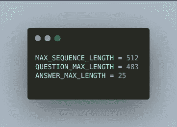
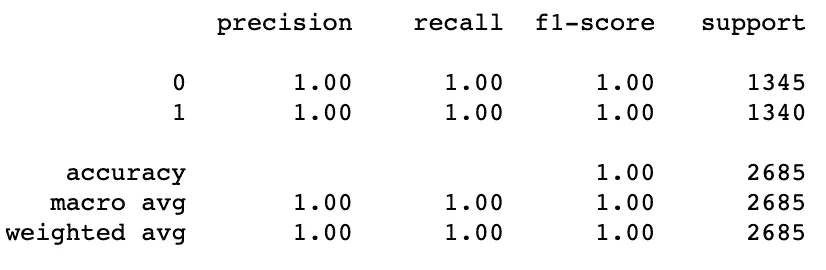

# 检测俄罗斯巨魔并评估 Reddit 上的帖子争议性

> 原文：<https://medium.com/analytics-vidhya/detecting-russian-trolls-and-estimating-post-controversiality-on-reddit-revising-the-nlp-3080cf393131?source=collection_archive---------10----------------------->

## 用 NLP 猎杀巨魔

## **修改 NLP 方法**

TL；博士:[用我的 github](https://github.com/pashadude/troll_detection_nlp) 上的代码检查 ipython 笔记本。

# 1.问题是

巨魔在社交媒体上的存在是 2020 年的一个问题。外国势力利用巨魔作为[一场政治战争](https://www.nytimes.com/interactive/2019/09/18/world/asia/hk-twitter.html)和[选举干预过程](https://www.wired.com/story/russia-ira-propaganda-senate-report/)的一部分。

公众对平台的压力迫使他们实施有毒内容过滤。这导致了巨魔禁令和曝光的浪潮。

社交媒体平台举办了诸如 [Quora 虚假问题分类](https://www.kaggle.com/c/quora-insincere-questions-classification)或 [Jigsaw 毒性分类中的意外偏差](https://www.kaggle.com/c/jigsaw-unintended-bias-in-toxicity-classification/overview)等 Kaggle 竞赛，以便从数据科学家那里获得一些想法。

通过标准许可证购买的 adobe stock image by[Dan 177](https://stock.adobe.com/ru/contributor/201958550/dan177?load_type=author&prev_url=detail&asset_id=105778543)

然而，某些问题仍然存在。

首先，自然语言处理在 2019 年继续取得巨大进展(在模型可用性和规范方面)——你不仅可以从发表的优秀论文中看到，还可以从由 [Google](https://www.kaggle.com/c/google-quest-challenge/overview) 和 [TensorFlow](https://www.kaggle.com/c/tensorflow2-question-answering/overview) 举办的 2019 年末 Kaggle 竞赛的 SOTA 解决方案中看到(它们有很多，但我使用了[这个](https://www.kaggle.com/abhishek/distilbert-use-features-oof)、[这个](https://www.kaggle.com/shuheigoda/23th-place-solusion/comments)、[这个](https://www.kaggle.com/c/google-quest-challenge/discussion/129840)和[这个](https://www.kaggle.com/christofhenkel/inference-v3-224)作为主要来源

第二，预先估计由巨魔帖子引起的不满是至关重要的。Reddit 已经有了一个有趣的指标，叫做帖子争议性。它涵盖了一个帖子获得的支持票和反对票的数量，以及它们的平均比例。我建议用它来衡量巨魔的伤害。

在这篇文章中，我将应用一些来自顶级 kagglers 的新方法来解决 Reddit 俄罗斯巨魔检测问题，并尝试用一个模型来估计 Reddit 帖子的争议性。

# **2。数据和预处理**

我将坚持使用 [Brandon Punturo](http://web.archive.org/web/20190704222221/https://towardsdatascience.com/predicting-russian-trolls-using-reddit-comments-57a707653184) 和 [Henry Weller](https://towardsdatascience.com/using-bert-and-cnns-for-russian-troll-detection-on-reddit-8ae59066b1c) 的伟大文章中使用的问题环境，以便为所取得的结果和使用的方法提供一些基准。该数据由 2 个数据集组成，包含巨魔帖子和普通用户帖子。

左边是普通用户 post 数据帧，右边是 troll post 数据帧

虽然普通用户数据包含更多的帖子，但 troll 数据更详细，包含帖子链接和链接标题等重要功能。

让我们从普通用户的帖子中提取相同的特征，并将所有相关数据放入“link_data”列。

拥有相同格式的子编辑名称也很重要，因为我们将在分类器中广泛使用这个特性。

让我们清除文本字段中的特殊符号和技术垃圾(如链接和 html 标签)。我已经修复了标点符号，并用文本替换了表情符号。表情符号分类部分确实很随意，但它提高了模型性能。我可以用俄罗斯互联网文化的某些特征来解释。表情符号的使用被认为是“蹩脚的”。

一个重要的标志是，普通用户有 2%的争议帖子，而巨魔有 4%。从逻辑上讲，有争议的帖子在可用数据中所占的整体份额相当小。我将在下面的数据选择步骤和一些模型微调中解决这个问题。

现在，让我们用等量的巨魔和非巨魔帖子对我们的实验数据进行采样。

我还把所有有争议的帖子放入实验数据集，以获得足够的训练数据。

请记住，我们的目标不仅是识别巨魔，而且是预测危害。

# 3.从 nlp 的角度解释数据。

为了构建一个具有 BERT 风格的模型的分类模型，该模型向底层提供输入(我使用了[**distil BERT**](https://arxiv.org/abs/1910.01108)**进行初步检查，并在最终模型之后使用 BERT ),我们需要将文本数据裁剪成 BERT 要求的大小(512)的批次，并对其进行标记化。当前数据如下所示:**

****

**我建议将实验文本数据解释为 BERT 模型的问答数据集。其中问题标题为 **'link_data'** 单元格，问题正文为 **'body'** 单元格，答案为 **'subreddit'** 单元格。**

> *****基本上在我们的模型中，一个巨魔获取一些新闻文章或讨论点作为输入(问题)，并搜索最佳子编辑来发布它(答案)。*****

**简而言之，一个数据点的输入如下所示:**

> *****Input =【CLS】+<link _ data>+【SEP】+<body>+【SEP】+<subreddit>+【SEP】*****

**用[CLS]标记表示该数据点用于分类，[SEP]标记用于输入部分分离，<tokenized>数据来自输入数据点的各个单元</tokenized>**

**但是，在标记化之前，我们应该设置输入字段的大小，并根据我们的数据集特征修剪输入字段**

****

**在两个原始数据集中，subreddit 的名称都不超过 25 个符号，所以我将答案的最大长度设置为 25，将问题的最大长度(包括标题和正文)设置为 483。我们还应该为一个[CLS]和 3 个[SEP]标记保留 4 个字符，以便按照 BERT 的要求得到总长度为 512 的输入。**

****

**然后我们应该修剪数据并将其标记化。**

**请注意，我们真正关注的是修剪问题，因为答案长度总是低于或等于限制(由于上面描述的 ANSWER_MAX_LENGTH 值选择)。**

**不熟悉 BERT 的人应该注意，回答和问题部分的标记类型是不同的。**

**下面是一个从数字转换而来的标记化数据的示例，让您有一种感觉:**

****

**我在输入创建函数中添加了一个**‘记号赋予器’**参数，这样你就可以使用不同的记号赋予器了(DistilBERT， [RoBERTa](https://arxiv.org/abs/1907.11692) 等等)**

****

# **4.模型:网络和优化设置。**

**model 类非常简单，但是它在构造函数中还包含一个**‘model _ type’**参数，因此可以使用不同的模型:**

****

**然后，我使用基于[CLS]头隐藏状态输出的分类模型。我假设一个人实际上可以通过额外单独使用[SEP]隐藏状态数据来获得更好的结果。**

**我唯一想强调的是 [**多样本缺失**](https://arxiv.org/abs/1905.09788) 的用法，它提高了模型的泛化能力。**

****

**图片来自原创文章[https://arxiv.org/abs/1905.09788v2](https://arxiv.org/abs/1905.09788v2)**

> **“而原始脱落在每次训练迭代中从输入中创建随机选择的子集(称为脱落样本)，而多样本脱落创建多个脱落样本。计算每个样本的损失，然后对样本损失进行平均，得到最终损失。通过在丢失层之后复制网络的一部分，同时在复制的完全连接的层之间共享权重，这种技术可以很容易地实现，而不需要实现新的运营商。多样本丢失不会显著增加每次迭代的计算成本，因为大部分计算时间消耗在丢失层之前的卷积层中，这些层是不重复的。实验还表明，使用多样本脱落训练的网络对于训练集和验证集都实现了较低的错误率和损失。”**

****

**我使用了具有参数化学习率和权重衰减的 ADAM 优化器。人们当然可以利用这些参数来获得更好的结果。分期数为 3 个，批量为 8 个。**

****

**我使用了`[torch.nn.BCEWithLogitsLoss](https://pytorch.org/docs/stable/nn.html#bcewithlogitsloss)` ，它结合了一个 Sigmoid 层(需要得到属于模型输出的类的概率)和一个单一类中的 BCELoss。这个版本在数值上比使用普通的 Sigmoid 后跟一个 BCELoss 更稳定，因为通过将运算合并到一个层中，pytorch 利用了 log-sum-exp 技巧来获得数值稳定性)。最终损失由负责 troll 检测和争议性预测的模型权重来加权。**

****

**训练/测试分配为 80/20。我使用了基于**子循环**特征值的组 K 折叠。尽管考虑到当前数据集中按子漩涡分布的帖子可能有风险(尽管 K 是 3)，但这种方法更适合于大量的红编辑数据。**

****

# **5.结果:解读与比较。**

**为了验证概念和评估整个模型的性能，我使用了 DistilBERT 作为 NLP 核心模型。它在计算上比其他 BERT 模型便宜得多，但具有相当好的性能。我使用了来自[变形金刚](https://huggingface.co/transformers/model_doc/distilbert.html)的 DistilBERT 实现。**

********

**模型与蒸馏:troll 后预测准确性指标与后争议性预测准确性。**

**与过去的方法相比，集成了 DistilBERT 的整体模型非常适合测试，并提供了很好的结果。**

****

**巨魔检测任务结果 **auc 0.99** 以显著优势超过 Brandon Punturo 和 [Henry Weller](https://towardsdatascience.com/using-bert-and-cnns-for-russian-troll-detection-on-reddit-8ae59066b1c) /Jeff Woo **(分别为 auc 0.74 和 AUC 0.85)**的旧方法结果。基本上 2685 个数据点只有一个预测错了。**

**然而，争议性预测的性能不够好( **auc 0.54** )，部分原因是数据标签差异。**

**现在，让我们将 BERT-BASE-UNCASED 模型作为 NLP 核心运行，这将花费更多的时间。**

********

**使用 DistilBERT 的模型速度与使用 BERT-BASE-UNCASED 的模型速度**

****

**让我们使用不同的 Out-Of-Fold 来估计模型在用于对新数据进行预测时的性能。这项技术将侧重于输出排名，而不是价值(采取无偏的平均)。因此，我们相应地重新调整输出数组。**

****

**troll 检测 AUC 略有下降(**但仍为 0.99** )。然而，我们在争议性预测指标上提高了 15.5 个百分点。**其 AUC 为 0.7** 。这种改进主要是通过改变 OOF 方法实现的。下面您可以找到这两种功能的分类准确性报告。**

********

**具有 BERT 和 OOF 的模型:troll 后预测准确性度量与后争议性预测准确性。**

# **6.结论和未来步骤**

**NLP 的进步提高了我们探测巨魔的能力。我认为争议性预测还有很大的改进空间，因为很多争议性数据可以从[谷歌大查询](https://bigquery.cloud.google.com/table/fh-bigquery:reddit_comments.2015_05?pli=1)获得。**

****

**正如 Brandon 和 Henry 正确指出的，存在 troll 数据可用性的问题。我们可以尝试用一种叫做伪标签的技术来解决这个问题。它在卡格勒人中广为人知，也在一些学术论文中使用，如[这篇](https://arxiv.org/pdf/1911.04252.pdf)。我将使用当前模型作为教师模型，它将从新的普通用户数据中挑选标记为 troll 的帖子。在下一步中，我将使用这些帖子和我们目前拥有的 troll 数据来训练一个新模型。这种方法包含巨大的过度拟合的风险，但是有一定的技术来对抗它。**

**我将更新模型，并在通过上述方法获得的更大数据块上对其进行训练。**

**我鼓励所有阅读这篇文章的人从我的 github 中尝试原始的[代码，报告错误，尝试参数更改，运行一些采样实验，并给我发送改进建议。](https://github.com/pashadude/troll_detection_nlp)**