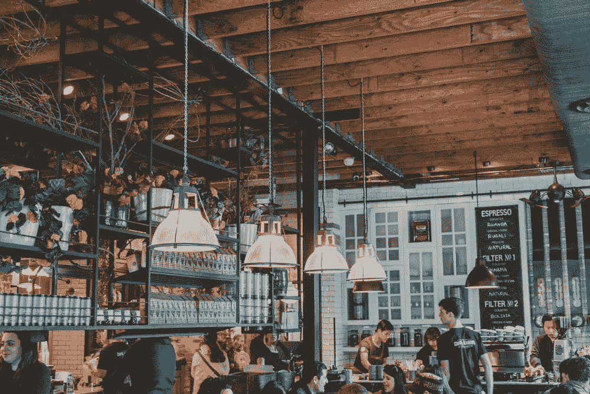
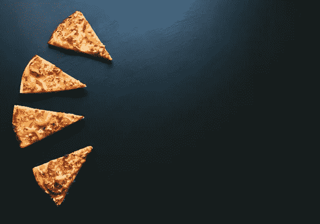
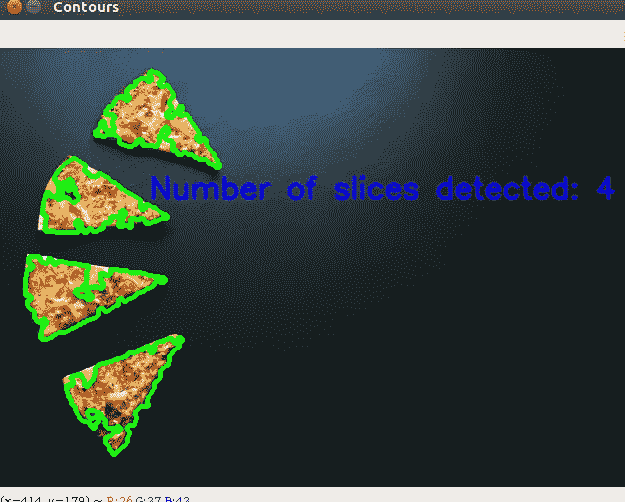

# 利用图像处理技术检测比萨饼切片数量

> 原文：<https://medium.com/analytics-vidhya/detecting-the-number-of-pizza-slices-using-image-processing-5121a23fb672?source=collection_archive---------23----------------------->



深度学习技术对于计数和检测图像中的对象数量非常有用。然而，我们可以利用传统的图像处理方法来做同样的事情，这将具有较低的复杂性。这篇博客解释了一步一步计算一个盘子里披萨片数量的过程。

# 程序:

让我们考虑下面这张有四个切片的图像。



我们的目标是计算切片数，即 4。

首先，我们需要阅读图像。这可以通过 opencv 的 imread 函数来实现。它将图像的路径作为参数。在此之前，我们需要导入执行给定操作所需的库。这些都列在这里。

```
import osimport cv2import numpy as npimport matplotlib.pyplot as plt
```

为了读取图像，我们需要提供图像的路径作为第一个参数。为此，我们可以编写以下代码片段。

```
path = ‘/home/aditya123/image_processing/pizza/food’for images in os.listdir(path): img = cv2.imread(os.path.join(path,images))
```

这里，图像存储在上述路径中。在读取给定变量 img 中的图像后，我们可以访问图像的各种属性。我们可以使用上述变量访问图像的某些属性。下一步，我们将使用 opencv 库将图像转换成灰度。下面的代码片段为我们完成了这项工作。

```
 img = cv2.cvtColor(img, cv2.COLOR_BGR2GRAY)
```

将图像转换为灰度的原因是因为我们想检测出最适合灰度图像的边缘。以下代码片段完成了边缘检测的工作。

```
edge = cv2.Canny(img, 100, 200)
```

让我们明白这里发生了什么。我们应用 canny 边缘检测器来检测图像中的边缘。这里第一个参数是被读取的图像。第二个和第三个参数是强度梯度的阈值。强度梯度大于第三个参数( ***max_val*** )的边缘被确认为边缘，而强度梯度小于第二个值的边缘被丢弃。具有最小和最大值内的强度梯度的边缘被认为是基于它们与确认的边缘或丢弃的边缘的连接的边缘。

在下一步中，我们将应用阈值处理，使得超过某个阈值的像素值将是 1，而低于该阈值的像素值将是 0。下面的代码片段为我们完成了这项工作。

```
_,thresh = cv2.threshold(edged, 130, 255, cv2.THRESH_BINARY)
```

这里我们忽略了第一个值，因为它不是必需的。第二个变量存储阈值二进制图像。

接下来是两个形态学操作，即闭合和打开，这将帮助我们去除噪声并填充图像的孔洞。为此，我们首先要定义一个用于应用形态学的结构化元素。这段代码为我们创建了内核。

```
def build_kernel(kernel_type, kernel_size): if kernel_type == cv2.MORPH_ELLIPSE: return cv2.getStructuringElement(cv2.MORPH_ELLIPSE, kernel_size)
```

上面的代码创建了一个椭圆形的结构元素。在下面的代码片段中，应用了形态学的打开和关闭操作。

```
morph = cv2.morphologyEx(thesh, cv2.MORPH_CLOSE, kernel) #Closemorph = cv2.morphologyEx(morph, cv2.MORPH_OPEN, kernel)
```

现在是在图像中寻找轮廓的时候了。轮廓基本上是具有相似强度的形状边界。为了得到更好的结果，我们应用了 canny 边缘检测器和阈值处理。下面的代码片段为我们完成了这项工作。

```
vals,_ = cv2.findContours(morph, cv2.RETR_EXTERNAL, cv2.CHAIN_APPROX_SIMPLE)
```

考虑最后一个参数 ***cv2。CHAIN_APPROX_SIMPLE*** 通过存储相关点坐标而不是存储所有点来节省内存。另一方面第一个参数 ***cv2。RETR _ 外部*** 只给我们外部轮廓，也就是说它会忽略所有内部轮廓。这对于我们的问题非常重要，因为比萨饼切片之间可能有轮廓。

现在，将被检测的轮廓将具有许多小物体。所以我们需要忽略它们。

这里的 val 是一个包含所有轮廓的边界点的列表。

下面的代码片段将在忽略小对象后绘制所有轮廓。

```
for c in cnts:if cv2.contourArea(c) > 200: # ignore small objects cv2.drawContours(output, [c], -1,(np.random.randint(0,255),np.random.randint(0,255),np.random.randint(0,255)), 2)count += 1
```

我们可以用 ***cv2.putText*** 来写关于图像的检测结果。

下面的代码片段将描述在图像中检测到的切片数量。

```
text = “Number of slices detected: {}”.format(count)cv2.putText(img,text,(150,150),cv2.FONT_HERSHEY_SIMPLEX,1,(255,0,0),2,cv2.LINE_AA)
```

运行完上述所有代码后，我们将得到如下输出



这是如何使用图像处理技术检测比萨饼切片的概述。
在 linkedin 上加我[https://www.linkedin.com/in/aditya-mohanty-7982451a9/](https://www.linkedin.com/in/aditya-mohanty-7982451a9/)。