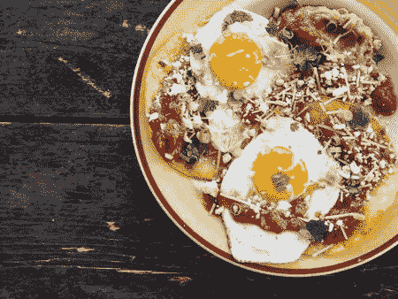
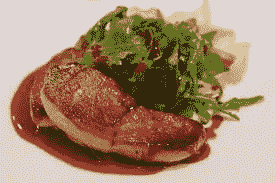
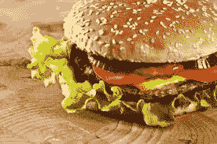
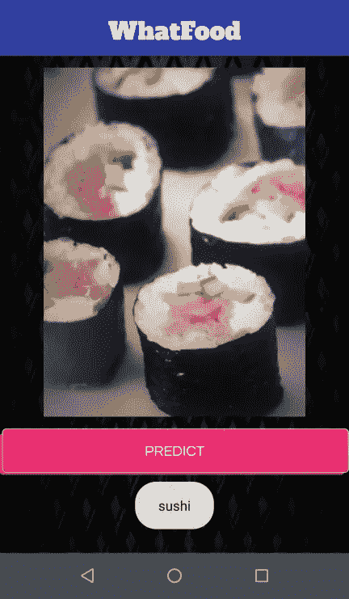

# 用 Keras 检测盘子里有什么

> 原文：<https://medium.com/analytics-vidhya/detecting-whats-on-the-plate-with-keras-64c7cfa70c86?source=collection_archive---------19----------------------->

我是一个吃货，我是一个计算机视觉爱好者。唯一有意义的是，我最终会做这样的事情。在 Kaggle 中筛选有趣的数据集以实现我从 Coursera 上的 [deeplearning.ai 的 tensor flow:Data and Deployment](https://www.coursera.org/learn/device-based-models-tensorflow)中学到的东西后，我偶然发现了 [Food-101 数据集](https://www.kaggle.com/kmader/food41)，瞧！

顾名思义，Food-101 数据集包含从苹果派到华夫饼等 101 种菜肴的 1000 张图片(我有点惭愧地说，尽管我对食物很感兴趣，但我没有听说过其中的很多)。考虑到我不太可能遇到鹅肝或 huevos ranchos，为了简单起见，数据集从 101 个类削减到 20 个。



Huevos 牧场和鹅肝。

```
chicken curry	    fried rice	     samosa
chicken wings	    garlic bread     sandwich
chocolate cake	    hamburger        soup
cup cake	    hot-dog	     spring rolls
donuts	            ice-cream	     sushi
dumplings	    omelette         waffles
french fries	    pizza
```

上述每个类别都有 1000 张图片，数据太少，无法从头开始训练一个准确的模型。引入迁移学习，使用在 ImageNet 数据集上预训练的 MobileNetV1 中的层。

```
conv_base = applications.MobileNet(weights = "imagenet", include_top=False, input_shape = (256, 256, 3))
```

添加 GlobalMaxPooling2D 层和密集层后，模型架构如下所示:

```
Model: "sequential_8" _________________________________________________________________ Layer (type)                 Output Shape              Param #    ================================================================= mobilenet_1.00_224 (Model)   (None, 8, 8, 1024)        3228864    _________________________________________________________________ global_average_pooling2d_6 ( (None, 1024)              0          _________________________________________________________________ dense_13 (Dense)             (None, 1024)              1049600    _________________________________________________________________ dropout_25 (Dropout)         (None, 1024)              0          _________________________________________________________________ dense_14 (Dense)             (None, 20)                20500      ================================================================= Total params: 4,298,964 Trainable params: 4,277,076 Non-trainable params: 21,888
```

为了避免过度拟合，数据增强应用了增强技术，包括图像旋转、线性移位、缩放、照明变化和翻转。

```
from keras.preprocessing.image import ImageDataGeneratortrain_datagen = ImageDataGenerator(rescale = 1./255, rotation_range=360,width_shift_range=0.2,height_shift_range=0.2, shear_range = 0.2,zoom_range = [0.5, 1.0],brightness_range = [0.2, 1.0],horizontal_flip = True,vertical_flip =False,zca_whitening=True, zca_epsilon=1e-06)training_set=train_datagen.flow_from_directory(path_training,target_size =(256,256),batch_size=64,class_mode='categorical',shuffle=True)
```

对于初始时期，转移的层被冻结。

```
for layer in conv_base.layers:
  layer.trainable=False
```

最初的训练是用学习率递减的 Adam Optimizer 完成的，随后[在以后的时期](https://arxiv.org/abs/1712.07628)切换到 SGD。在遇到验证损失的平台期后，被转移的层被解冻，并恢复训练以进一步微调模型。获得了 91.34%的训练准确率和 85.51%的验证准确率。

## 测试

```
imn = '/content/test/testimage.jpg' #test image path
img = load_img(imn, target_size=(256, 256))
img = np.asarray(img)
img = img.astype('float32')
img = img/255
img = np.expand_dims(img, axis=0)
img = img.reshape(1,256,256,3)
res = model2.predict(img)
ord = np.argsort(res)
ind = np.argmax(res)li = ['chicken curry', 'chicken wings', 'ch cake', 'cup cake', 'donuts', 'dumplings', 'fries','fried rice', 'garlic bread', 'hamburger', 'hot-dog', 'ice-cream', 'omelette', 'pizza', 'samosa', 'sandwich','soup','spring rolls', 'sushi', 'waffle']lis = []for i in range(0, 5):
  lis.append(li[(ord[0][19 - i])])print(lis) # Top-5 predictions
```


['披萨'，'寿司'，'蒜味面包'，'三明治'，'煎蛋']



['汉堡包'，'三明治'，'热狗'，'炒饭'，'煎蛋']

现在可以保存 keras .h5 模型。该模型占用大约 32.9 MB 的空间。

## 转换为 TensorFlow lite

```
image_shape = (256, 256, 3)def representative_dataset_gen():
  num_calibration_images = 10
  for i in range(num_calibration_images):
    image = tf.random.normal([1] + list(image_shape))
    yield [image]converter=lite.TFLiteConverter.from_keras_model_file('model.h5')converter.default_ranges_stats=[0,255]
converter.optimizations = [tf.lite.Optimize.DEFAULT]
converter.representative_dataset = representative_dataset_genconverter.target_spec.supported_ops =[tf.lite.OpsSet.TFLITE_BUILTINS_INT8]converter.inference_input_type = tf.uint8
converter.inference_output_type = tf.uint8
model = converter.convert()
file = open( 'model.tflite' , 'wb' )
file.write(model)
```

最终的 tflite 模型大小为 16.29 MB，几乎是 h5 模型大小的一半。

## 用 tflite 测试

```
imn = '/content/test/testimage.jpg'
img = load_img(imn, target_size=(256, 256))
img = np.asarray(img)
img = img.astype('float32')
img = img/255
img = np.expand_dims(img, axis=0)
img = img.reshape(1,256,256,3)interpreter = lite.Interpreter(model_path="model.tflite")
interpreter.allocate_tensors()# Get input and output tensors.
input_details = interpreter.get_input_details()
output_details = interpreter.get_output_details()
interpreter.set_tensor(input_details[0]['index'], img)
interpreter.invoke()output_data = interpreter.get_tensor(output_details[0]['index'])
ord = np.argsort(output_data)
ind = np.argmax(output_data)lis = []
for i in range(0, 5):
  lis.append(li[(ord[0][19 - i])])
print(lis)
```

我们已经完成了 TFlite！

## 机器人

从 [**克隆 github 库到这里**](https://github.com/paarthbir77/WhatFood-Android-App) 。

将 tflite 模型和带有标签的 label.txt 文件添加到应用程序的 assets 目录中。txt 文件应该是这样的:

```
label 1
label 2
label 3
..
..
..
```

在 Kotlin 文件 MainAct.kt 中，根据需要编辑变量 mInputSize、mModelPath 和 mLabelPath。我们正在考虑分类器中指定的阈值分数 0.40，为了获得最佳结果，请随意使用！

以下是应用程序的屏幕截图:



好(App)tit！