# 基于深度学习的人脸篡改视频检测

> 原文：<https://medium.com/analytics-vidhya/detection-of-face-manipulated-videos-using-deep-learning-6bca870f3a6a?source=collection_archive---------5----------------------->

数字内容中的王牌操纵正成为传播虚假信息的主要原因之一，在这种情况下，它还可以诽谤任何人或组织。在没有任何智能系统的帮助下，人眼识别被操纵的视频的机会甚至非常小。针对这个问题，我实现了一个基本的基于深度学习的分类器，可以最大限度地准确识别虚假视频。

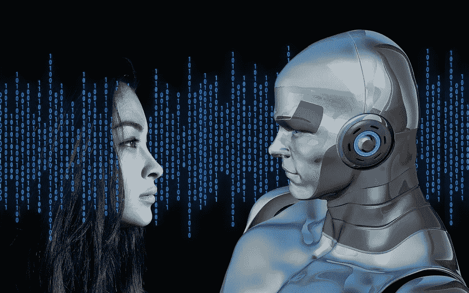

封面图片([来源](https://aer.eu/coding-for-ethics-with-ai/))

# 理解问题

由于在视频/图像生成和处理方面有许多积极的研究正在发展，这些研究公然帮助解决了许多问题，同时这也导致了对数字内容的信任的丧失，它甚至可能通过传播虚假信息和制造假新闻来造成进一步的伤害。

**为了获得更多的理解，请看看下面的视频**

面部操作视频示例([来源](https://www.youtube.com/watch?v=cQ54GDm1eL0))

***注:*** *请理解，我在此收录的视频，并非冒犯任何人。这只是数字内容如何失去信任的一个例子，只是为了解决当前背景下的问题*

视频本身解释了名人被操纵的面部重现的威胁，而这些大多是通过实施一些人工智能技术来操纵或生成的。

如果机器能够学习检测被操纵的视频，那么它可能是解决这个问题的解决方案之一。

# 目标

考虑到这个实时问题，我们的目标是建立一个模型，使其能够识别给定的视频是真的还是假的。

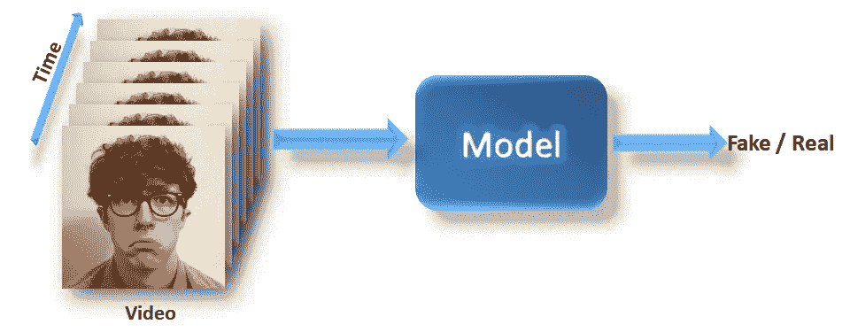

代表目标的流程图

该模型应该能够将视频与置信度值一起分类，显示它是假/真的原因并不重要，这意味着结果解释在这种情况下并不重要，因此我们可以使用深度学习技术轻松解决这个问题，测量精确度和日志损失。

# 数据采集

为了让机器能够思考和学习，我们需要一些合理数量的数据来输入和评估模型。这里我使用的是 FaceForensics++数据，包含真实的和经过处理的人脸视频。

**一些数据背景:**

Faceforensics++数据是由[视觉计算小组](http://niessnerlab.org/)收集的，该小组是一个关于计算机视觉、计算机图形学和机器学习的活跃研究小组。该数据包含 1000 个原始(真实)视频，这些视频是从 YouTube 上有选择地下载的，以便所有视频都具有清晰的面部可视性(视频大多像新闻读者阅读新闻)。

这些原始视频是通过使用 3 种最先进的视频处理技术进行处理的，如 DeepFakes、FaceSwap、Face2Face。要了解更多的数据请参考[这篇论文](https://www.groundai.com/project/faceforensics-learning-to-detect-manipulated-facial-images/1)。

我总共下载了 100 个原始视频(49 个真实+ 51 个虚假)，涵盖了所有类别，这些视频被提取成图像。要下载并提取图片，请浏览[Github](https://github.com/ondyari/FaceForensics)页面并仔细阅读说明。

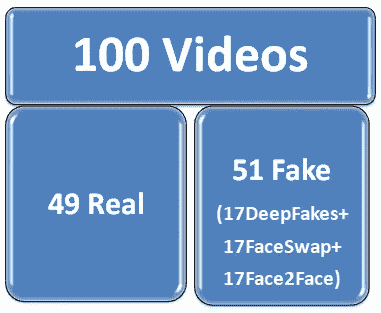

# 探索性数据分析和预处理

在建立任何机器学习/深度学习模型之前，我们需要通过一些数据分析来理解数据。

**让我们了解一下这些数据是如何组织的:**

1.  正如我提到的，我已经下载了 49 个真实+51 个虚假的视频，这些视频中的每一个都是根据其类别在以 **original** 、 **Deepfakes** 、 **FaceSwap** 和 **Face2Face** 命名的目录下分开的
2.  对于每个视频，创建每个文件夹，其中包含所有提取的图像序列。

3.例如，如果视频名称为“485.mp4”，则创建一个名为“485”的目录，其中包含“485.mp4”的所有帧。请看下图，它显示了原始视频的目录结构，我们对 Deepfakes、Face2Face 和 Faceswap 数据遵循相同的结构。

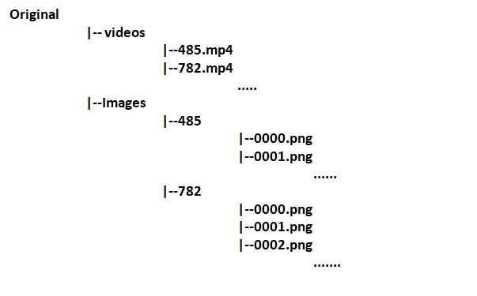

数据收集后的示例目录结构

请随时访问我的 Github 帐户，我在这里解释的每一步都有编码

 [## pothabattulasantosh/检测面部操纵视频

### 这是使用 Faceforensics++数据检测被操纵的面部图像的实现代码，因为有很多…

github.com](https://github.com/pothabattulasantosh/Detection-of-face-Manipulated-videos) 

**让我们观察每个类别的每张图片**

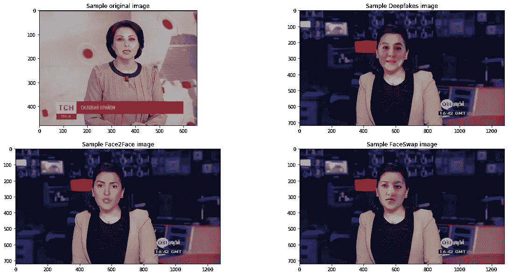

观察结果:

1.  在每张图像中，面部清晰可见，面部和相机之间没有任何物体，所有这些图像都直接面向相机(当然，数据是以这种方式有选择地收集的)
2.  按照目标，我们需要找到人脸处理过的图像，因此我们只对人脸部分感兴趣，忽略所有其他细节，如身体、背景等是个好主意。
3.  因此，我们可以通过跟踪每个图像中的人脸并将其输入分类器来实现这一点，为了实现这一点，我们使用在 python 库**‘dlib’**中实现的人脸跟踪算法之一，您可以从[这里](https://pypi.org/project/dlib/)下载。

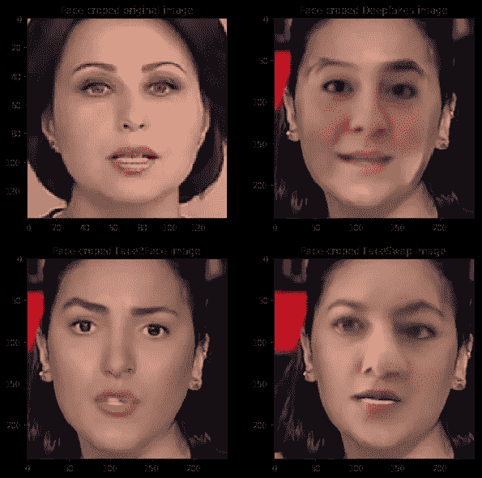

使用在 **dlib 中实现的人脸检测算法的人脸裁剪图像。**

# 数据分割

为了训练和评估模型，我们将数据分为训练、测试和 CV，同时拆分数据，我们还需要考虑数据平衡，我们需要在预处理之前拆分数据。

我已经将 20%的数据分割出来进行测试，剩下的 80%用于训练和验证，请看下面的数据分割图，每个分割都经过了数据平衡处理。

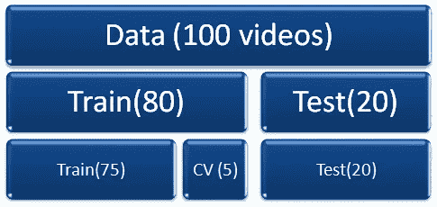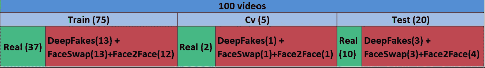

带平衡的数据分割

我们不考虑整个视频序列，而是从每个视频中只取 101 帧，因为这减少了建模期间的计算量。

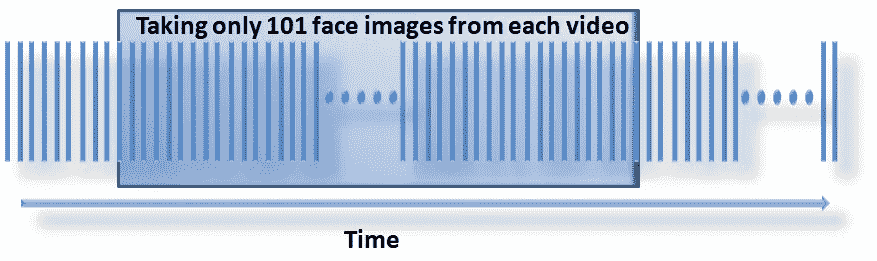

如上图所示，我们从第 10 帧开始仅取 101 帧，这也有助于减少数据冗余。

让我们来看一些面部追踪图像的样本。

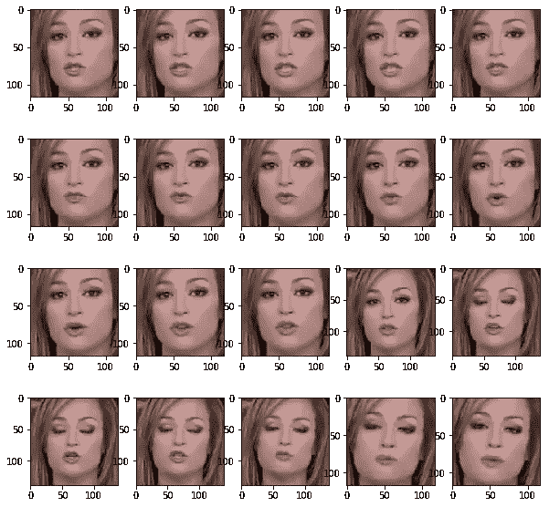

采样从原始视频中提取的人脸序列图像

**简而言之，我们的管道是:**

1.  对于每个视频，我们取 101 个图像序列的集合。
2.  应用人脸追踪器算法对每幅图像进行预处理，检测人脸区域像素。
3.  将人脸追踪图像输入分类器。

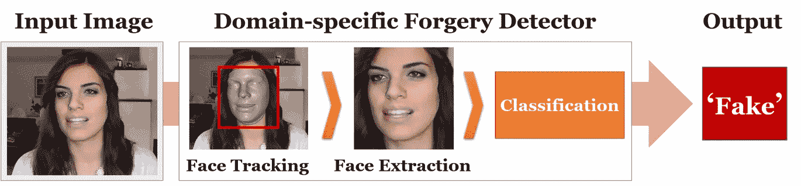

人脸操纵视频检测的整个流程的想法([来源](https://www.groundai.com/project/faceforensics-learning-to-detect-manipulated-facial-images/1))

# 建模

由于我试图将这个问题作为一个二进制分类问题，我们需要将标签 0 固定为真实，1 固定为虚假(Deepfakes 或 Face2face 或 FaceSwap ),并且我们还要测量准确性和分类日志损失。

一旦我们完成数据分析，选择(或至少猜测)哪种模型可能适用于该数据是非常重要的，这里我们有完整的图像数据，因此选择基于**卷积神经网络(CNN)** 的架构是一个好主意

但是，再次选择完美的参数真的是一个巨大的挑战，参数可能包括层数，单位数，辍学率，激活，学习率等。为了确定这一点，我们需要花费更多的时间，并需要非常高的计算能力。

总的来说，我们可以调整任何已经在类似的巨大数据集上训练和测试过的相关模型。例如，基于 CNN 架构的**例外**网络已经在 **imagenet** 数据集上进行了训练和测试。

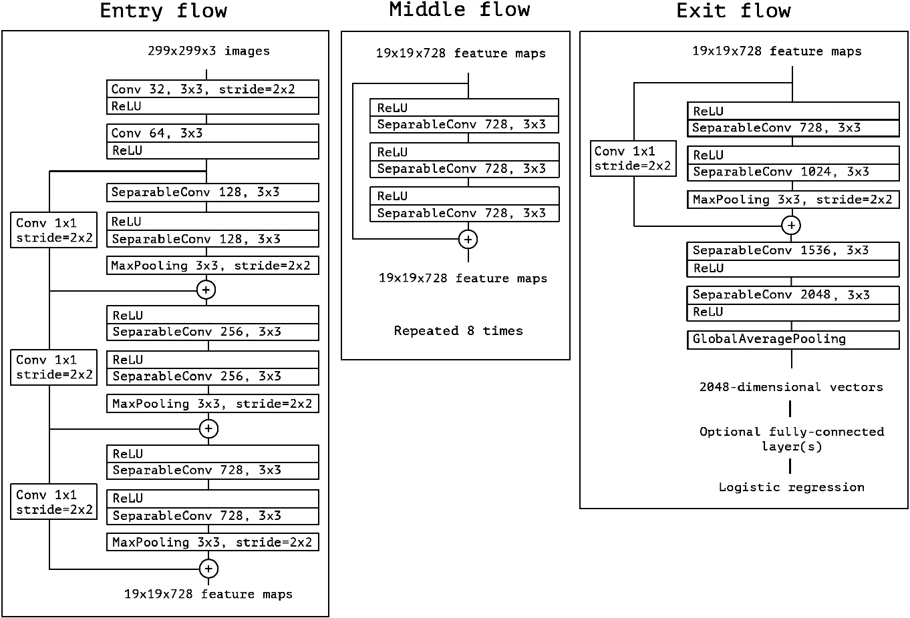

**例外网络架构(** [**来源**](https://www.semanticscholar.org/paper/Xception%3A-Deep-Learning-with-Depthwise-Separable-Chollet/5b6ec746d309b165f9f9def873a2375b6fb40f3d) **)**

为了适应这种架构，我们需要相应地预处理和设置我们的数据。用 3 个颜色通道上相同大小(299X299)的归一化图像来训练 Xception 网络。因此，在输入模型之前，我们需要注意我们的数据也应该被标准化和预处理成相同的大小

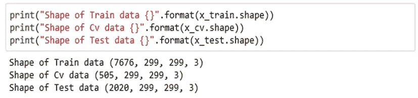

我们训练、验证和测试数据在预处理后成形

在这里，我使用 imagenet 权重初始化异常网络架构，并将通过使用 softmax 激活仅替换具有 2 个输出的最顶层来应用迁移学习。

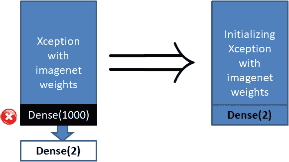

用 2 个输出替换顶层

现在，我们将把它视为基础架构，为了训练它，我们采用了一种叫做贪婪分层预训练的技术

1.  首先，用我们 3 个时期的训练数据训练基础架构中的每一层

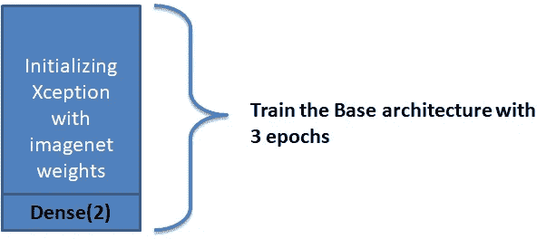

2.此后，移除最上面的层(**密集(2)** )并且从训练中固定剩余的层，并且通过在顶部添加新的(**密集(2)** )层来开始 15 个时期的训练和验证。

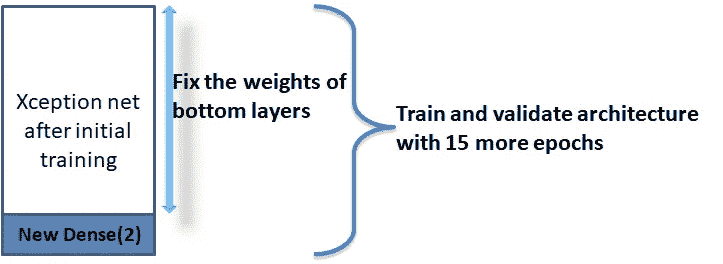

为了训练这个架构，我使用了 Adam，学习率为 0.0002，batch_size 为 16，其他所有参数保持 Keras 默认值。

# 结果

在所有训练阶段之后，以下是结果

*   在训练数据上，我们得到了 100%的准确率，损失是 0.058
*   对于验证数据，我们得到了 96.63%的准确率和 0.133 的损失
*   对于测试数据(看不见的数据),我们达到了 99.10%，损失为 0.078

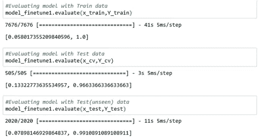

**新视频结果**

# 结论

我们只用了 100 个视频来建立一个分类器，并且取得了很好的准确率。如果你想进一步提高准确率，你可以尝试更多的视频。

该模型现在学会了检测被操纵的图像，并且仅当图像被 DeepFakes、Face2Face 或 FaceSwap 操纵时才表现得非常好，在不久的将来，这些类型的操纵技术可能会增加，在这种情况下，我们应该用新数据重新训练该模型。

**参考文献:**

1.  [https://arxiv.org/abs/1901.08971v1](https://arxiv.org/abs/1901.08971v1)
2.  [https://machine learning mastery . com/greedy-layer-wise-pre training-tutorial/](https://machinelearningmastery.com/greedy-layer-wise-pretraining-tutorial/)
3.  [https://towards data science . com/introduction-to-video-class ification-6 c 6 acbc 57356](https://towardsdatascience.com/introduction-to-video-classification-6c6acbc57356)

请检查我的 Github 档案，以获得完整的代码

 [## pothabattulasantosh -概述

### 热门资料库 11 月 12 月 1 月 2 月 3 月 4 月 5 月 6 月 7 月 8 月 9 月 10 月 11 月 1 日星期三 Fri 在 2 个月内创建了 5 个提交…

github.com](https://github.com/pothabattulasantosh)