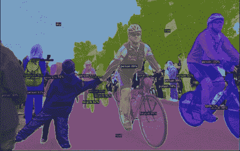
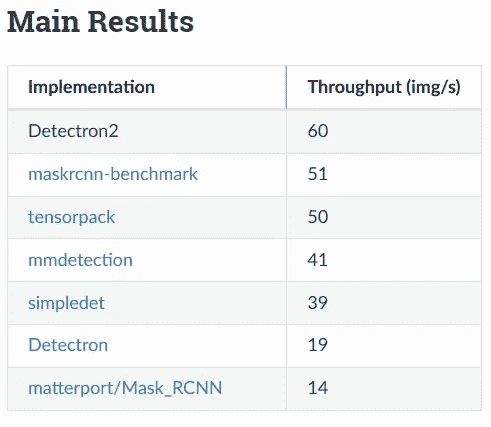
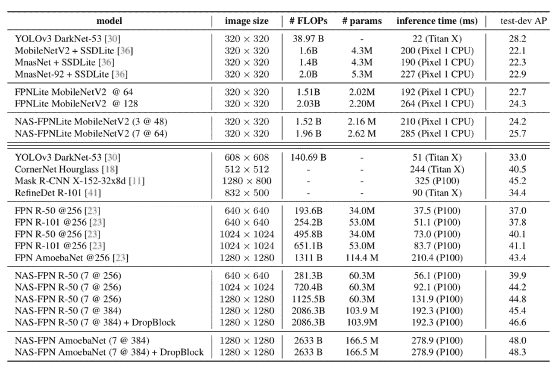
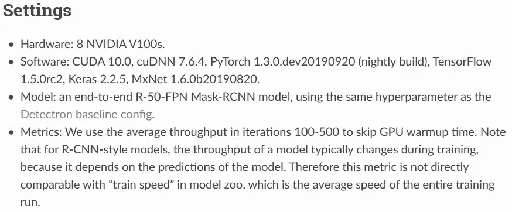
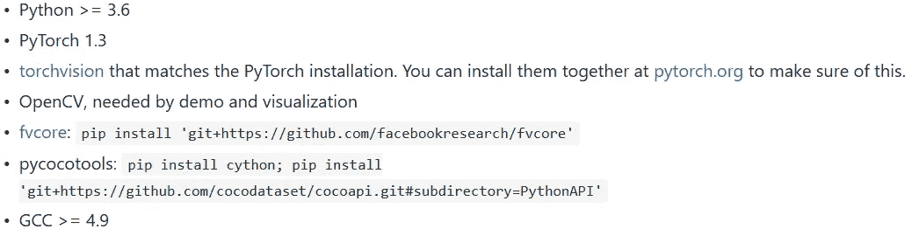
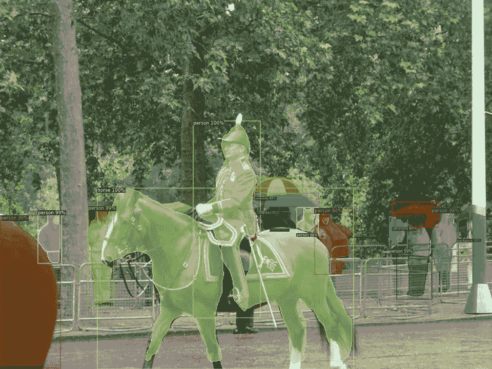

# 脸书人工智能研究所的探测器 2 来了！

> 原文：<https://medium.com/analytics-vidhya/detectron2-by-facebook-ai-research-is-here-b666987ad8b8?source=collection_archive---------10----------------------->

## 组块学习

***【detectron 2】****是脸书 AI Research(FAIR)流行的物体检测平台的最新版本(PyTorch)，是对早期版本(Caffe2)的彻底重写。该平台支持单个或多个 GPU 进行快速训练* *。*

来源:脸书

***新增内容有:***

*   用 PyTorch 深度学习框架实现。
*   配备了更快的 R-CNN、 [Mask R-CNN](https://github.com/facebookresearch/maskrcnn-benchmark/) 、 [RetinaNet](https://github.com/facebookresearch/detectron2/blob/master/MODEL_ZOO.md) 和**新功能**如最先进的(SOTA)对象检测算法，如:-[**dense pose**](https://github.com/facebookresearch/Densepose)**、** [**全景 FPN**](https://github.com/facebookresearch/detectron2/blob/master/MODEL_ZOO.md) 、TensorMask^、网状 R-CNN^ (^-即将发布)。
*   增加了 [*同步批量定额*](https://github.com/vacancy/Synchronized-BatchNorm-PyTorch) 等特性，支持*[*【https://www.lvisdataset.org/*](https://www.lvisdataset.org/)】等新数据集。*
*   *现在训练更快*多 GPU 支持。**
*   *对比图(在检测器 2 中屏蔽 R-CNN):*

**

*来源:脸书*

****SOTA 对照表(2019 年 7 月)*** *:**

**

*来源:必应搜索*

****用于检测探测器 2 的硬件:****

**

*来源:脸书*

****系统设置:****

**

*来源:[https://github . com/Facebook research/detectron 2/blob/master/install . MD](https://github.com/facebookresearch/detectron2/blob/master/INSTALL.md)*

****快速入门使用 Colab:****

*链接-[https://colab . research . Google . com/drive/16 jcajoc 6 bcfaq 96 jde 2 hwtxj 7 BMD _-M5](https://colab.research.google.com/drive/16jcaJoc6bCFAQ96jDe2HwtXj7BMD_-m5)*

*试运行结果:*

**

*实例分割(Mask-RCNN-R-FPN50)*

**

***全景分割***

**

***DensePose***

*很高兴看到大型科技巨头，如**、谷歌、OpenAI、微软、英伟达正在进行越来越多的开源研究，不仅从物体检测，而且扩展到姿态检测、实例&语义分割、自动驾驶汽车等*。**

**继续学习！！！**

****

**如果喜欢:-)**