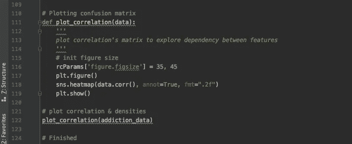

# 用机器学习预测海洛因风险(和使用)

> 原文：<https://medium.com/analytics-vidhya/determining-heroin-risk-and-use-with-machine-learning-36291f335ceb?source=collection_archive---------11----------------------->

## “医学是一门不确定性的科学和概率的艺术。”——威廉·奥斯勒

[图片](https://hrdailyadvisor.blr.com/2019/11/18/best-practices-for-helping-employees-who-suffer-from-addiction/)来自谷歌图片

# **什么是上瘾？**

[成瘾是一种大脑疾病](https://www.psychiatry.org/patients-families/addiction/what-is-addiction)**，其特征是一个人不顾对他们和他们生活的其他方面的有害后果而持续行动以获取某些东西。上瘾的东西多种多样:食物、赌博、性，当然还有毒品。当有人想到上瘾时，他们的脑海中通常会浮现出毒品。**

**毒瘾对个人、他们的家庭以及最终他们周围更大的集体的巨大影响是不可低估的。[美国每年在成瘾和相关费用上花费 7000 亿美元，](https://americanaddictioncenters.org/rehab-guide/addiction-statistics)美国每天有超过 100 人死于药物过量。阿片类药物危机由于其**经济、社会和政治影响，已经成为一个突出的问题。****

**继续加剧这一危机的一个特殊问题是**医生对阿片类药物的过度处方开始转化为许多患者的成瘾，这是一个直接导致阿片类药物危机的问题** [**。**](https://www.ncbi.nlm.nih.gov/pmc/articles/PMC5565848/)**

> **“大约有 21%到 29%为慢性疼痛开阿片类药物的病人误用了它们。8%到 12%的人会患上阿片类药物使用障碍。据估计，4%到 6%滥用处方阿片类药物的人会转变为海洛因。— [国家药物滥用研究所](https://www.drugabuse.gov/drug-topics/opioids/opioid-overdose-crisis)**

# **什么是阿片类药物？**

**阿片类药物是与大脑中的阿片受体结合的物质。正常情况下，我们体内由脑垂体产生的内啡肽——充当天然阿片样物质——附着在这些受体上。这些物质通常具有**止痛和/或欣快效果**。自史前时代以来，人类通过从罂粟花的汁液中提取鸦片(也称为吗啡)来消费阿片类药物。阿片类药物包括像**芬太尼、可待因、羟考酮和海洛因。****

****

**来自昆士兰脑研究所的图表说明了大脑中的一个基本突触。**

**当阿片样物质附着于它们各自的受体时，它们促进钾电导，导致突触后神经元中动作电位的概率降低(由于在动作电位期间钾和钠进出神经元的交换)。阿片类药物还抑制钙电导，从而限制突触前神经元释放神经递质。**

**这些行动的影响包括:**

*   **激活脊柱中的阿片受体，抑制中枢后回(顶叶的一部分，处理包括疼痛在内的躯体感觉信息)和大脑其他部分感受到的疼痛传递**
*   **对用于减轻疼痛的疼痛调节系统的影响:与导水管周围灰质(脑干)中的受体结合，并迅速抑制脊髓中的疼痛信号**
*   **通过作用于大脑前扣带皮层等区域来减少疼痛对情绪的影响**
*   **大脑不同区域的多巴胺信号增加，特别是伏隔核，这有助于这些药物的强化质量**

**阿片类药物引起的多巴胺释放被认为与去抑制有关——这是抑制性的 GABA 能神经元被抑制的地方——这限制了 GABA 的释放量，增加了多巴胺的释放量。这增强了快感和多巴胺的释放。**

****

**来自 CDC 的图片显示了阿片类药物使用的不同“浪潮”以及在这些浪潮中病例增加的原因。**

****阿片类药物的影响非常广泛，并且呈指数级增长。****

****

**[社会资本项目的图表](https://www.lee.senate.gov/public/_cache/files/b54a2abb-978d-4bbb-a868-531cdfaeae7a/the-numbers-behind-the-opioid-crisis-final.pdf)显示了阿片类药物使用的指数增长。**

**目前对阿片类药物的治疗通常包括药物和疗法。**

*   **通常用于逆转药物过量的纳络酮也可以用于预防目的以停止烟瘾**
*   **美沙酮和丁丙诺啡改善戒断症状，即使它们刺激阿片受体，并产生有限的兴奋。研究人员发现，这些疗法有助于阻止人们寻求海洛因或其他滥用的阿片类药物**
*   **心理社会治疗，包括认知行为治疗和行为改变，侧重于积极强化，也可以与药物治疗相结合，以治疗阿片成瘾**

**美国各地阿片类药物使用的持续增长和许多不同国家药物成瘾的总体增加需要改变。需要发生这种变化的一个领域是阿片类药物的过量处方。**

# **我的解决方案**

**目前这一期的 [**阿片类药物**](https://www.ncbi.nlm.nih.gov/pmc/articles/PMC5565848/)**过量服用已经导致数千名患者成瘾。不同的病人会因为各种原因对不同的治疗产生反应，这些原因包括[遗传和环境。](https://www.ncbi.nlm.nih.gov/pmc/articles/PMC2715956/)然而，获取成瘾者的基因信息似乎仅限于公众(这很糟糕，但并不令人惊讶)，对每个潜在患者进行基因筛查对许多医生/医院来说可能不是最实际的选择。周围环境的问题可能会因为被调查的病人而变得有偏见。接受调查的人必须在某个地方(即医院、康复中心等)，这些人的情况可能与那些没有接受治疗的成瘾患者不同。****

****我选择**人格特征(和人口统计)分析**，它的数据更容易被公众获取，并且有可能更适用于当前的实践，因为数据收集过程包括对患者的简单调查——最终**耗时更少，成本更高。******

********

****用于预测教育和健康的[五大人格特征图](https://www.simplypsychology.org/big-five-personality.html)。****

****此分析中包含的功能包括:****

*   ****年龄****
*   ****性****
*   ****教育****
*   ****国家****
*   ****种族划分****
*   ****神经质****
*   ****宜人性****
*   ****公开****
*   ****外翻****
*   ****尽责****
*   ****用 BIS-11 测量冲动性****
*   ****SS 是通过 ImpSS 测量的感觉****

****这些特征用于机器学习模型，并用于预测许多药物的物质滥用(我选择关注海洛因)。物质滥用有多种可能的结果。****

*   ****CL0:物质从未被使用过****
*   ****CL1:十多年前使用****
*   ****CL2:在过去十年中使用****
*   ****CL3:去年使用过****
*   ****CL4:最近一个月使用****
*   ****CL5:在上周使用****
*   ****CL6:在最后一天使用****

****选择的模型是一个逻辑回归模型。还测试了 K 近邻、决策树和支持向量机模型，但是当从测试集中测量准确分类的百分比时，逻辑回归模型被证明是最佳选择。****

****由数据库的原始所有者对[五大人格特征](https://www.simplypsychology.org/big-five-personality.html)的分析也是一个务实的选择，因为它是分析人格心理学中如此突出的方法。也有许多在线可访问的调查，可以让患者对自己的情况有一个大致的了解(理想情况下，在临床环境中应该使用更复杂的方法)。这是我为了好玩而做的事情，用来预测我自己使用海洛因和其他药物的概率。****

# ****什么是逻辑回归？****

****[逻辑回归](https://towardsdatascience.com/logistic-regression-detailed-overview-46c4da4303bc)是一个**有监督的机器学习模型**，它将带标签的数据用于训练。逻辑回归是一种用于**分类**的算法，通过预测可能指示某种状态存在或不存在的各种二元响应变量。****

********

****绘制了 sigmoid 曲线的基本逻辑回归模型图。****

****[逻辑回归使用一个 sigmoid 函数](https://towardsdatascience.com/introduction-to-logistic-regression-66248243c148)，它是一种数学函数，可以取任何实数值，并将其映射到 0 到 1 之间的值。sigmoid 函数创建一条“S”曲线，其阈值通常为 0.5。如果给定值低于阈值，则预测等级 0，当给定值≥ 50%时，则预测等级 1。****

****逻辑回归是用于分类问题的常用模型。使用这种方法的一个特别的好处是**预测属于特定类别的概率**。因为输入被映射到 sigmoid 曲线，所以在一个类中的概率可以通过在该曲线上的放置来找到。****

****机器学习的实现有时会很乏味，但有一些机器学习库可以用 Python 导入**(我就是这么做的)，这有助于简化这个过程。******

# ****代码和结果的分解****

## ****步骤 1:导入必要的库****

*   ****Matplotlib 用于绘制数据****
*   ****Sklearn 用于机器学习实现****
*   ****Numpy 用于数据处理****
*   ****熊猫被用于数据提取****
*   ****Seaborn 和 Pylab 也用于绘制数据****
*   ****随机用于随机选择患者数据****

****通常，StandardScalar 也会被导入来规范化数据，但是数据在下载时已经被规范化了。****

********

****为此项目导入的库包括不同的 sklearn 模块，这使得机器学习的实现更加高效。****

## ****步骤 2:加载和创建机器学习模型****

*   ****数据是从 Excel 文件导入的****
*   ****探索数据/识别特征****
*   ****要素和标签已初始化****
*   ****数据被分成训练特征/标签和测试特征/标签****
*   ****模型初始化时，最大迭代次数设置为 1000****
*   ****训练特征和标签适合模型****

********

****ML 模型已初始化，并适合从 excel 文件导入后拆分的数据。****

## ****第三步:不同药物的分数符合模型****

****药物越稀有，模型就越容易根据个性来确定用途。更多的人更频繁地使用酒精、尼古丁和大麻，这使得更难根据个性来预测使用情况。****

*****Semer (Semeron)是一种假药，用于识别过度索赔者。****

********

****用 ML 模型预测结果的模型得分。****

## ****步骤 4:测试随机生成的患者****

****浏览导入的数据，随机选择 100 名不同患者的每个特征的值。****

****************

****该模型的得分约为 82%,预测 98 名患者从未使用过海洛因，1 名在十年前使用过，1 名在十年内使用过。下面是我的数据，它预测了我自己的结果和每一类的概率。****

****根据 drugpolicy.org 的数据，美国大约有 498 万人在一生中至少尝试过一次海洛因。这相当于总人口的约 1.8%，并且与算法所发现的相匹配。****

****下面的值包括各种百分比，这个模型预测了我在任何特定班级的概率。有 86.2%的可能性我从未使用过海洛因，有 0.9%的可能性在过去一天使用过。****

## ****步骤 5:绘制相关矩阵****

********

****绘制相关矩阵，找出每个特征在结果预测中的权重。****

********

****结果列在最右边，不同特性的相关“数量”显示了它们的重要性。值 1 表示绝对相关。****

# ****为什么这很重要？****

****我的人工智能之旅始于几年前，但直到最近我才学会如何应用我所学的东西。再加上我是在凌晨 12 点到 5 点之间做的这个，这无疑给我留下了改进的空间。然而，该模型对海洛因使用分类的准确度在 81%-89%之间。还不错。****

****像这样的模特有能力改变医生的处方政策和倾向。应该更多地考虑对那些更易感的人进行替代治疗。那些不太敏感的人仍应考虑替代治疗。或许优先考虑(如果有必要的话)更有可能上瘾的病人。****

******对成瘾的治疗通常是广义的**。美国成瘾中心认为治疗的退出率在 70%-80%之间。**个性化治疗和预防**提供了一个减缓阿片类药物危机增长的机会，并彻底改变了成瘾治疗。****