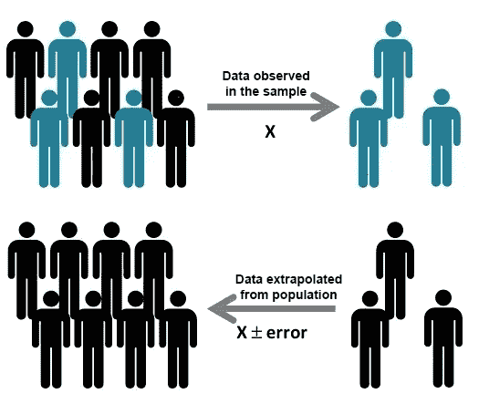
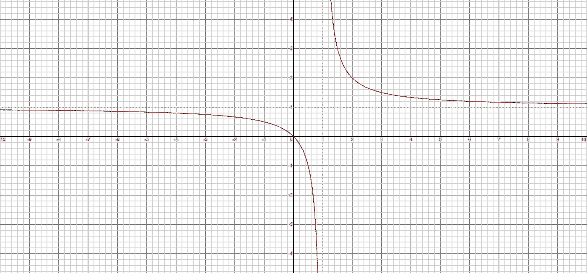

# 确定总体样本量

> 原文：<https://medium.com/analytics-vidhya/determining-sample-size-for-the-population-73b7fb0634d3?source=collection_archive---------13----------------------->

作为分析师或数据科学家，我们经常被我们的企业提出这样的问题:我们能多准确地从样本中确定总体参数？如果我们的人口规模随着时间的推移而增加，样本估计值是否仍然有意义，或者是否应该重新计算？要回答这些问题，我们需要了解样本依赖的因素是什么以及如何依赖的？

**考虑下面的例子**

假设你在大学校园里开了一家咖啡店，想延长营业时间，让咖啡馆在清晨开门营业。你的假设是，参加早课的学生需要在早上喝一口酒来保持清醒:p .为了证明这个假设，你决定对学生样本进行调查(“当然，我不能要求所有的学生都填写你的调查，这几乎是不可能的”)
你面前的问题是——有多少学生应该参与你的调查来接受或拒绝你的假设？或者用技术术语来说，你选择什么样的抽样参数才能得到一个有统计学意义的样本，从而足以得出一个决定？

假设校园里有大约 20，000 名学生，你估计其中 40%的人在上课前需要喝咖啡。(“好！但如果我已经知道有 40%的人赞成，为什么还要进行调查？”)

**请注意** — 40%只是一个近似值，我们需要用它来确定样本量。实际的回答分布将来自您进行的调查。如果你不能做出一个近似值，就选择你的响应分布为 50%，以获得更好的覆盖率。

使用这些信息，让我们尝试为用例确定一个统计上有意义的样本。

**我们应该考虑哪些采样参数？**

1.  **误差幅度**:误差幅度是你能容忍的误差量。例如，在上面的场景中，如果我们认为 MOE 为 5%，40%的受访者回答*是*，那么实际的回答数(如果您询问每个人，您可能会得到)在 35%到 45%之间(即 40 ^ 5)。
    **请注意，较低的误差幅度需要较大的样本量，因此我们需要根据可用资源选择正确的 MOE**
2.  **置信区间:**置信水平是你能容忍的不确定性的数量。这意味着，对于 95%的置信水平，如果一项调查重复 100 次，那么赞成的回答的变化将小于误差幅度，即 100 次中的 95 次。

# 样本计算

从您的计算开始，让我们首先定义我们的采样参数

人口(N)= 20，000
置信区间= 95%
MOE = 5%
有利响应(%)=40%

根据上述标准，您的调查的最小建议规模为 **363** 。(“哦！对 363 名学生进行调查似乎很容易”)

这意味着，如果你创建一个 363 人的样本，并从每个人那里得到回答，你更有可能得到一个正确的答案，而不是从一个大样本中，只有一小部分样本回答你的调查。
**您还可以根据资源的可用性，从上述参数中反向计算 MOE。**

在数字上，样本大小 *n* 和误差范围 *E* 由下式给出

*x*=(*cv*^2)*[*r*(100-*r*))——(一)
*n*=*n x*/(*n*-1)*e^*2+*x*)——(二)
*e*=。

其中 *N* 是总体规模， *r* 是您感兴趣的响应的分数，CV 是 95%置信水平的临界值。

从等式(ii)中，我们可以观察到样本大小不是成正比的。请参考下图

样本量(n) (Y 轴)与总体(N) (X 轴)的关系

因此，我们可以说，在某个阈值之后，即使总体规模发生变化，样本规模也不会发生太大变化，因此不需要重新计算估计值。

# **结论**

当你调查一个人口样本时，你不知道你找到了正确的答案，但是你知道有 95%的可能性(或者你选择的任何置信区间)你在正确答案的误差范围内。

希望这有所帮助:)