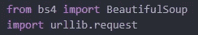
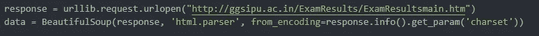
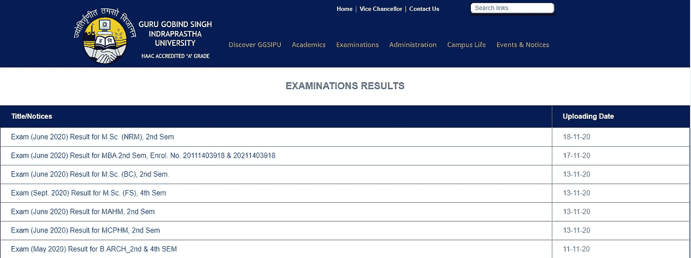
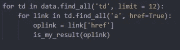
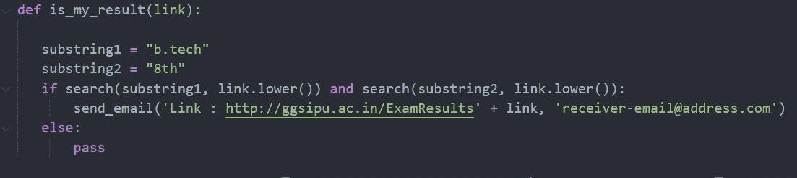
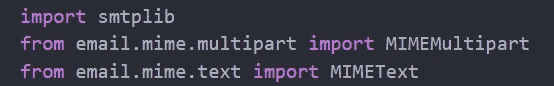
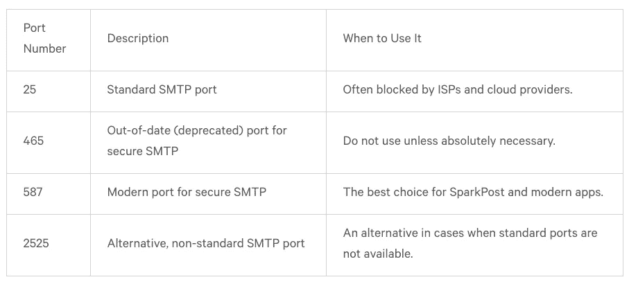
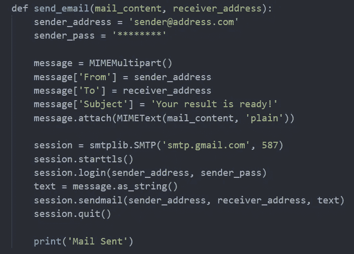
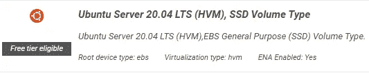

# 开发一个网页抓取脚本，并定期在 AWS 上运行。

> 原文：<https://medium.com/analytics-vidhya/develop-a-web-scraping-script-and-run-it-on-aws-periodically-e2fdc94dbcaa?source=collection_archive---------4----------------------->

## 直接通过电子邮件获取 GGSIPU 学期成绩。

Emile Perron 在 [Unsplash](https://unsplash.com?utm_source=medium&utm_medium=referral) 上的照片

良好的..这似乎很有趣，对吧！

因此，基本上我们想做的是从公共网站获取一些数据，并根据我们的需要过滤掉，然后数据(在这种情况下是链接)需要通过电子邮件发送到请求的地址，这需要定期进行。

首先，技术堆栈。

>我们将使用 Python3 编写脚本，你不需要成为这方面的大师，只需要基本的知识就足够了。

> AWS EC2，用于始终启动和运行的服务器，这样我们就可以使用 cron 作业为 Linux 定期运行脚本。

> 不要担心，我们将只使用 EC2 的免费层，每月提供 750 小时的免费使用。

# *Python 脚本*

我们将瞄准 IPU 网站，让我们的学期成绩直接在我们的电子邮件上弹出。

我们将需要包括这两个模块( *beautifulsoup* 和 *urllib* )，用于打开网页并从中提取数据。
要打开 URL，使用 *urllib.request.urlopen* 函数，将网址作为参数传递，如下图。

使用底部的 BeautifulSoup 函数，可以解析在*响应*中提取的 HTML 页面，以便我们可以轻松地搜索所需的项目。

[http://ggsipu.ac.in/ExamResults/ExamResultsmain.htm](http://ggsipu.ac.in/ExamResults/ExamResultsmain.htm)

该网页有一个表，上载时的结果显示在那里，所以我们需要在这个表中搜索我们想要的结果。

这可以通过对抓取的数据使用 *find_all* 方法来完成，即 *data(在上面的代码片段中定义)*，然后在表格中搜索链接，即*一个带有超链接值的*标签，如图所示；

limit=12 定义了只获取前 12 个条目的函数。

此超链接值是指向结果 pdf 的链接，例如[http://ggs IPU . AC . in/exam results/2020/221120/MBA %20(DM)% 20 result % 204 th % 20 学期% 20ET %考试% 20 九月%202020.pdf](http://ggsipu.ac.in/ExamResults/2020/221120/MBA%20(DM)%20Result%204th%20Semester%20ET%20Exam%20September%202020.pdf)

一旦我们能够找到结果的链接，我们将检查结果是否属于我们正在寻找的课程和学期，为此我们使用 *is_my_result()* 函数，将结果的链接作为参数。

我们使用 *re* 模块中的搜索功能检查结果是否包含我们想要的关键字。

> re *是 python3 中的一个内置模块，它为正则表达式操作提供了搜索等功能。*

上面代码片段中的`substring1`和`substring2`表示我们正在寻找 B.Tech 第八学期的成绩。

一旦链接符合我们的需求，我们就使用`send_email()` 功能发送电子邮件。

为了通过 python 脚本发送电子邮件，您需要包含这些模块。

发送电子邮件要包括的模块

smtplib 模块将用于通过 python 脚本发送电子邮件。

> smptlib 有一个*类* `smtplib.**SMTP**` ( *host=''* ， *port=0* ， *local_hostname=None* ，[ *timeout* ，] *source_address=None* )，*来发送邮件。*

使用这个类，我们能够设置发送电子邮件的主机和端口，例如，
如果您使用 Gmail 帐户发送电子邮件，您将使用端口`587`的`smtp.gmail.com`，使用相同端口`587.`的 outlook `smtp-mail.outlook.com`

有几个端口号可以使用；

来源:[https://www.sparkpost.com/blog/what-smtp-port/](https://www.sparkpost.com/blog/what-smtp-port/)

使用 *smtp* 模块，我们能够构建一个函数，它有一个 from 地址、一个 to 地址、一个主题行和要发送的文本(这是我们的结果链接)。

我们的电子邮件准备就绪后，我们将使用设置传输层安全性，并使用我们的电子邮件凭据登录。此后，我们将发送一封包含发件人地址、收件人地址和文本(消息)的电子邮件。最后，打印“邮件已发送”进行确认。

现在，如果您尝试运行该脚本，您会看到 Gmail 不允许您登录，并将向您发送一封电子邮件通知登录活动。

为了绕过这一点，你必须允许不太安全的应用程序登录到你的帐户；[https://myaccount.google.com/lesssecureapps](https://myaccount.google.com/lesssecureapps)。

> 提示:你应该尝试使用非主要邮件，因为允许不太安全的应用程序登录可能会有安全风险。

完整的 python 脚本可从[这里](https://gist.github.com/sterbon/8ad320507bbe3a4bf557d82001501833)获得。

# **在图片中添加 AWS**

脚本现在已经完成，是时候在 AWS EC2 上运行它了，这样我们就可以定期检查结果。

为此，我们将启动一个 EC2 服务器(免费层),在那里上传我们的脚本，并以 2 分钟的间隔在 crontab 中运行 python 脚本。

登录 [AWS 控制台](http://aws.amazon.com)并进入 EC2 服务。点击**启动实例**，创建一个实例。

在自由层下面选择 Ubuntu Server 20.04 LTS。

让它处于默认选项，并转到*查看和启动。* 最后，点击启动。

如果您没有密钥对，那么您必须创建一个新的密钥对并下载它，这样您就可以使用 Putty SSH 客户端连接到实例。

同意这些条款，您的实例就启动并运行了。
现在，您可以使用 Putty 和密匙对连接到 EC2 实例，一切就绪。

为了能够在 EC2 机器上运行脚本，需要在那里添加脚本。为此，您将需要创建一个新文件触摸
`touch ipu.py`，将整个脚本复制到那里并保存。

现在您已经让 EC2 与脚本一起运行了，您可以进行一些测试运行，看看一切都运行良好，并根据需要进行更改。

# 添加 Cron 作业

这里唯一要做的就是让脚本定期自动运行。为此，我们可以向 EC2 实例添加一个 cron 作业。

要添加 cron 作业，创建一个名为`ipu.cron`的新文件，并在其中写入
`*/2 * * * * python3 ipu.py`，每 2 分钟运行一次脚本。

现在我们需要使用命令
`crontab ipu.cron`将它添加到 crontab 中

要检查所有活动的 cron 作业，请使用以下命令:
`crontab -l`

要删除所有活动的 cron 作业，请使用命令；

cronjob 是活动的，EC2 正在运行，您已经设置好了，只需坐等结果显示在您的电子邮件中。

感谢您花时间阅读这篇文章，祝您愉快！