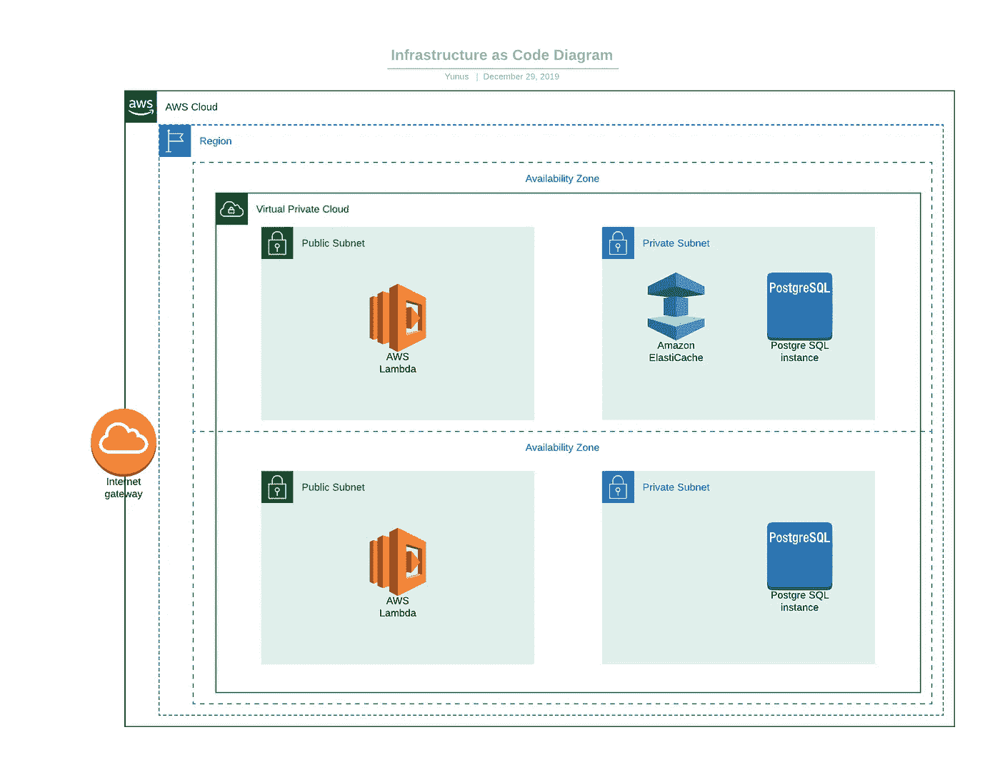

# 使用 CloudFormation 将基础设施开发为代码

> 原文：<https://medium.com/analytics-vidhya/develop-infrastructure-as-code-with-cloudformation-and-sam-5fda322784f5?source=collection_archive---------12----------------------->

软件开发行业变化非常快。DevOps 这个术语变得非常流行之后，仅仅写代码已经不够了。你应该尽可能地自动化软件开发过程。在这篇文章中，我将描述如何通过编写代码来定义我们的基础设施。

*“基础设施即代码，是通过机器可读的定义文件来管理和配置计算机数据中心的过程，而不是物理硬件配置或交互式配置工具”。[1]*

为什么我们需要基础设施作为代码？

*   在移动一个集装箱化的世界后，基础设施可以更频繁地被改变或删除/创建。
*   此外，由于大量不同的设置，跟踪基础设施设置变得非常困难。因此，将这些设置保留在代码中，有助于解决巨大的复杂性。

在这篇文章中，我将使用 CloudFormation 来定义基础设施。

“AWS CloudFormation 为您在云环境中建模和配置 AWS 和第三方应用程序资源提供了一种通用语言。AWS CloudFormation 允许您使用编程语言或一个简单的文本文件，以自动化和安全的方式为所有地区和客户的应用程序建模和提供所需的所有资源。这为您的 AWS 和第三方资源提供了单一的真实来源。”[2]

我在下面画了一个架构图，来演示最终结果。



让我们定义图中存在的组件。

区域:是 AWS 用来存放其基础设施的独立地理区域。它们分布在世界各地，因此客户可以选择离他们最近的地区来托管他们的云基础架构。[3]

可用性区域:是构成 AWS 区域的逻辑构建块。目前有 69 个 az，它们是一个区域内孤立的位置—数据中心。[3]

VPC:使您能够将 AWS 资源启动到您定义的虚拟网络中。这个虚拟网络非常类似于您在自己的数据中心运行的传统网络，具有使用 AWS 的可扩展基础架构的优势。[4]

子网:是“网络的一部分”，换句话说，是整个可用性区域的一部分。每个子网必须完全位于一个可用性区域内，并且不能跨区域。[5]

为简单起见，我将创建 1 个 VPC、2 个公共子网和 2 个私有子网。子网代表不同的可用性区域。

PS:部署代码命令

```
$sam package --template-file template.yaml --s3-bucket BUCKETNAME --output-template-file packaged.yaml
$sam deploy --template-file FILEPATH/packaged.yaml --stack-name test --capabilities CAPABILITY_IAM
```

首先，我们像下面这样定义参数，以备后用。

```
Parameters:
  EnvironmentName:
    Description: An environment name that is prefixed to resource names
    Type: String
    Default: Test

  VpcCIDR:
    Description: Please enter the IP range (CIDR notation) for this VPC
    Type: String
    Default: 10.0.0.0/16

  PublicSubnet1CIDR:
    Description: Please enter the IP range (CIDR notation) for the public subnet in the first Availability Zone
    Type: String
    Default: 10.0.1.0/24

  PublicSubnet2CIDR:
    Description: Please enter the IP range (CIDR notation) for the public subnet in the second Availability Zone
    Type: String
    Default: 10.0.2.0/24

  PrivateSubnet1CIDR:
    Description: Please enter the IP range (CIDR notation) for the private subnet in the first Availability Zone
    Type: String
    Default: 10.0.3.0/24

  PrivateSubnet2CIDR:
    Description: Please enter the IP range (CIDR notation) for the private subnet in the second Availability Zone
    Type: String
    Default: 10.0.4.0/24
```

PS: 10.0.0.0/16:每个数字代表 8 位数，前 16 位(前两位数)保持不变。其余数字可以更改。所以可以分配 256*256 个 Ip。

**创造 VPC**

```
VPC:
  Type: AWS::EC2::VPC
  Properties:
    CidrBlock: !Ref VpcCIDR
    EnableDnsSupport: true
    EnableDnsHostnames: true
    Tags:
      - Key: Name
        Value: !Ref EnvironmentName
```

让我们把这个 VPC 和互联网连接起来。互联网网关用于从 VPC 访问互联网。

```
InternetGateway:
  Type: AWS::EC2::InternetGateway
  Properties:
    Tags:
      - Key: Name
        Value: !Ref EnvironmentName

InternetGatewayAttachment:
  Type: AWS::EC2::VPCGatewayAttachment
  Properties:
    InternetGatewayId: !Ref InternetGateway
    VpcId: !Ref VPC
```

**创建子网**

```
PublicSubnet1:
  Type: AWS::EC2::Subnet
  Properties:
    VpcId: !Ref VPC
    AvailabilityZone: !Select [ 0, !GetAZs '' ]
    CidrBlock: !Ref PublicSubnet1CIDR
    MapPublicIpOnLaunch: true
    Tags:
      - Key: Name
        Value: !Sub ${EnvironmentName} Public Subnet (AZ1)

PublicSubnet2:
  Type: AWS::EC2::Subnet
  Properties:
    VpcId: !Ref VPC
    AvailabilityZone: !Select [ 1, !GetAZs  '' ]
    CidrBlock: !Ref PublicSubnet2CIDR
    MapPublicIpOnLaunch: true
    Tags:
      - Key: Name
        Value: !Sub ${EnvironmentName} Public Subnet (AZ2)

PrivateSubnet1:
  Type: AWS::EC2::Subnet
  Properties:
    VpcId: !Ref VPC
    AvailabilityZone: !Select [ 0, !GetAZs  '' ]
    CidrBlock: !Ref PrivateSubnet1CIDR
    MapPublicIpOnLaunch: false
    Tags:
      - Key: Name
        Value: !Sub ${EnvironmentName} Private Subnet (AZ1)

PrivateSubnet2:
  Type: AWS::EC2::Subnet
  Properties:
    VpcId: !Ref VPC
    AvailabilityZone: !Select [ 1, !GetAZs  '' ]
    CidrBlock: !Ref PrivateSubnet2CIDR
    MapPublicIpOnLaunch: false
    Tags:
      - Key: Name
        Value: !Sub ${EnvironmentName} Private Subnet (AZ2)
```

PublicSubnet1 位于第一个可用区域。

PublicSubnet2 站在第二。

PrivateSubnet1 位于第一个可用区域。

PrivateSubnet2 站在第二。

公共子网应该连接到互联网。为了处理这个问题，我们需要一个路由表。

```
PublicRouteTable:
  Type: AWS::EC2::RouteTable
  Properties:
    VpcId: !Ref VPC
    Tags:
      - Key: Name
        Value: !Sub ${EnvironmentName} Public Routes

DefaultPublicRoute:
  Type: AWS::EC2::Route
  DependsOn: InternetGatewayAttachment
  Properties:
    RouteTableId: !Ref PublicRouteTable
    DestinationCidrBlock: 0.0.0.0/0
    GatewayId: !Ref InternetGateway

PublicSubnet1RouteTableAssociation:
  Type: AWS::EC2::SubnetRouteTableAssociation
  Properties:
    RouteTableId: !Ref PublicRouteTable
    SubnetId: !Ref PublicSubnet1

PublicSubnet2RouteTableAssociation:
  Type: AWS::EC2::SubnetRouteTableAssociation
  Properties:
    RouteTableId: !Ref PublicRouteTable
    SubnetId: !Ref PublicSubnet2
```

任何带有相关公共子网的请求被路由到互联网网关。

PS:如果你想对私有子网做同样的事情，你应该 NAT 网关。

**创建代码为**的 ELASTICACHE 实例

```
ServerlessSecurityGroup:
  DependsOn: VPC
  Type: AWS::EC2::SecurityGroup
  Properties:
    GroupDescription: SecurityGroup for Serverless Functions
    VpcId:
      Ref: VPC

ServerlessStorageSecurityGroup:
  DependsOn: VPC
  Type: AWS::EC2::SecurityGroup
  Properties:
    GroupDescription: Ingress for Redis Cluster
    VpcId:
      Ref: VPC
    SecurityGroupIngress:
      - IpProtocol: tcp
        FromPort: '6379'
        ToPort: '6379'
        SourceSecurityGroupId:
          Ref: ServerlessSecurityGroup

ServerlessCacheSubnetGroup:
  Type: AWS::ElastiCache::SubnetGroup
  Properties:
    Description: "Cache Subnet Group"
    SubnetIds:
      - Ref: PrivateSubnet1

ElasticCacheCluster:
  DependsOn: ServerlessStorageSecurityGroup
  Type: AWS::ElastiCache::CacheCluster
  Properties:
    AutoMinorVersionUpgrade: true
    Engine: redis
    CacheNodeType: cache.t2.micro
    NumCacheNodes: 1
    VpcSecurityGroupIds:
      - "Fn::GetAtt": ServerlessStorageSecurityGroup.GroupId
    CacheSubnetGroupName:
      Ref: ServerlessCacheSubnetGroup
```

出于安全原因，我将 Elasticache 实例放在私有子网内。所以我们需要创建一个安全组来允许 6379 端口连接 Redis。

**从 LAMBDA 函数连接 REDIS】**

```
CacheClientFunction:
  Type: AWS::Serverless::Function
  Properties:
    Tracing: Active
    CodeUri: bin/cacheClient
    Handler: cacheClient
    Runtime: go1.x
    Role: !GetAtt RootRole.Arn
    VpcConfig:
      SecurityGroupIds:
        - Ref: ServerlessSecurityGroup
      SubnetIds:
        - Ref: PublicSubnet1
    Environment:
      Variables:
        redis_url: !GetAtt ElasticCacheCluster.RedisEndpoint.Address
        redis_port: !GetAtt ElasticCacheCluster.RedisEndpoint.Port
```

Lambda 函数位于公共子网中。我们可以根据自己定义创建的 ElasticCache 来定义 redis_url 和 redis_port。在编写代码时，我们可以使用这些环境变量来连接 Redis。

**！！！重要！！！**

Lambda 函数需要一些角色和策略人员。否则创建堆栈将会出错。让我们用代码创建一个角色和策略。

```
SampleManagedPolicy:
  Type: AWS::IAM::ManagedPolicy
  Properties:
    PolicyDocument:
      Version: '2012-10-17'
      Statement:
        - Sid: AllowAllUsersToListAccounts
          Effect: Allow
          Action:
            - ec2:CreateNetworkInterface
            - ec2:DescribeNetworkInterfaces
            - ec2:DeleteNetworkInterface
            - xray:PutTraceSegments
          Resource: "*"

RootRole:
  Type: 'AWS::IAM::Role'
  Properties:
    AssumeRolePolicyDocument:
      Version: '2012-10-17'
      Statement:
        - Effect: Allow
          Principal:
            Service:
              - lambda.amazonaws.com
          Action:
            - 'sts:AssumeRole'
    Path: /
    ManagedPolicyArns:
      - !Ref SampleManagedPolicy
```

将以最低访问权限创建上述策略。

缓存客户端代码:

```
package main

import (
   "context"
   "fmt"
   "github.com/aws/aws-lambda-go/lambda"
   "github.com/go-redis/redis"
   "os"
)

func HandleRequest(ctx context.Context) (string, error) {

   redisUrl := os.Getenv("redis_url")
   redisPort := os.Getenv("redis_port")
   client := redis.NewClient(&redis.Options{
      Addr:     fmt.Sprintf("%s:%s", redisUrl, redisPort),
      Password: "", *// no password set* DB:       0,  *// use default DB* })

   client.Set("1", "1", 0)

   return client.Get("1").String(), nil
}

func main() {
   lambda.Start(HandleRequest)
}
```

**创建代码为**的数据库实例

```
ServerlessDBSecurityGroup:
  DependsOn: VPC
  Type: AWS::EC2::SecurityGroup
  Properties:
    GroupDescription: Ingress for Redis Cluster
    VpcId:
      Ref: VPC
    SecurityGroupIngress:
      - IpProtocol: tcp
        FromPort: '5432'
        ToPort: '5432'
        SourceSecurityGroupId:
          Ref: ServerlessSecurityGroup

ServerlessDBSubnetGroup:
  DependsOn: ServerlessDBSecurityGroup
  Type: AWS::RDS::DBSubnetGroup
  Properties:
    DBSubnetGroupDescription: "DB Subnet Group"
    SubnetIds:
      - Ref: PrivateSubnet1
      - Ref: PrivateSubnet2

PostgresqlInstance:
  DependsOn: VPC
  Type: AWS::RDS::DBInstance
  Properties:
    AllocatedStorage: 30
    DBInstanceClass: db.t2.micro
    DBName: postgres
    Engine: postgres
    MasterUsername: CacheClient
    MasterUserPassword: ChangeIt2
    DBSubnetGroupName: !Ref ServerlessDBSubnetGroup
    VPCSecurityGroups:
      - "Fn::GetAtt": ServerlessDBSecurityGroup.GroupIdDbClientFunction:
  Type: AWS::Serverless::Function
  Properties:
    Tracing: Active
    CodeUri: bin/dbClient
    Handler: dbClient
    Runtime: go1.x
    Role: !GetAtt RootRole.Arn
    VpcConfig:
      SecurityGroupIds:
        - Ref: ServerlessSecurityGroup
      SubnetIds:
        - Ref: PublicSubnet1
    Environment:
      Variables:
        db_url: !GetAtt PostgresqlInstance.Endpoint.Address
        db_port: !GetAtt PostgresqlInstance.Endpoint.Port
```

创建数据库与缓存非常相似。重要一点是，您的数据库实例应该位于至少两个可用性区域上。

数据库客户端代码:

```
package main

import (
   "context"
   "fmt"
   "github.com/aws/aws-lambda-go/lambda"
   "github.com/jinzhu/gorm"
   _ "github.com/jinzhu/gorm/dialects/postgres"
   "os"
)

type MyEvent struct {
   Name string `json:"name"`
}

func HandleRequest(ctx context.Context, name MyEvent) (string, error) {

   dbUrl := os.Getenv("db_url")
   dbURI := fmt.Sprintf("host=%s user=CacheClient dbname=postgres sslmode=disable password=ChangeIt2", dbUrl)
   fmt.Println(dbURI)
   db, err := gorm.Open("postgres", dbURI)
   if err != nil {
      return "err", err
   }

   db.AutoMigrate(&Entity{})
   var ent = &Entity{}
   ent.Text = name.Name
   db.Save(&ent)

   return fmt.Sprint(&ent.ID), nil
}

func main() {
   lambda.Start(HandleRequest)
}package main

import "github.com/jinzhu/gorm"

type Entity struct {
   gorm.Model
   Text string
}
```

一切都结束了。现在我们用代码创建了网络、缓存实例、数据库实例。我们将它们的输出与我们的无服务器函数绑定在一起。缓存和数据库客户端使用代码创建的架构。

template.yaml 完整版:

[https://github.com/yunuskilicdev/infrastructureascode](https://github.com/yunuskilicdev/infrastructureascode)

引用:

1-)[https://stack ify . com/what-is-infra structure-as-code-how-it-works-best-practices-tutorials/](https://stackify.com/what-is-infrastructure-as-code-how-it-works-best-practices-tutorials/)

2-)[https://aws.amazon.com/cloudformation/](https://aws.amazon.com/cloudformation/)

3-)[https://cloud academy . com/blog/AWS-regions-and-avail ability-zones-the-simple-explain-you-ever-found-around/](https://cloudacademy.com/blog/aws-regions-and-availability-zones-the-simplest-explanation-you-will-ever-find-around/)

4-)[https://docs . AWS . Amazon . com/VPC/latest/user guide/what-is-Amazon-VPC . html](https://docs.aws.amazon.com/vpc/latest/userguide/what-is-amazon-vpc.html)

5-)[https://www.infoq.com/articles/aws-vpc-explained/](https://www.infoq.com/articles/aws-vpc-explained/)