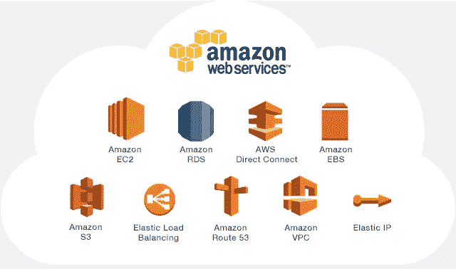
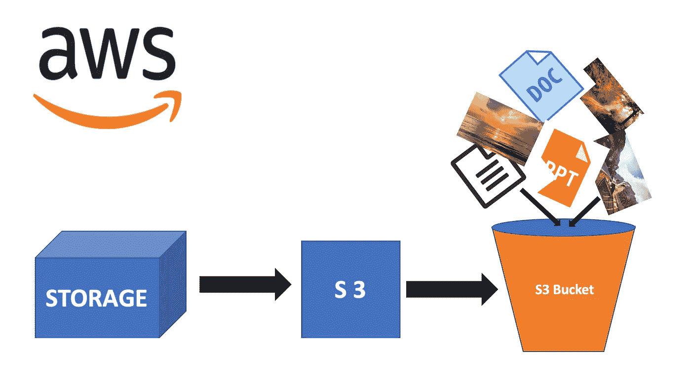

# AWS 术语的开发者草案

> 原文：<https://medium.com/analytics-vidhya/developers-draft-on-aws-jargons-303b7b9b07d9?source=collection_archive---------23----------------------->

作为一名开发人员，几乎不可能忽略一些技术术语，即云计算解决方案(比如说 **AWS** 、 **Azure** 、**谷歌云平台**等)和版本控制系统(比如说 G **it** )。这些都是发展的各个方面的主要参与者，不论其地位或阶段如何。因此，如果我们设法至少在地面上理解它们，并打破与它们有关的神话，这将为我们的旅行增添更多动力。

AWS —云

> 随着计算能力的增强，计算资源的有效利用，实现适当解决方案的快节奏方法世界变得更加简单，联系也更加紧密。目前没有什么太远或太复杂而无法接近和解决。AWS 是这个云领域的主要征服者，他们在为这个世界提供计算解决方案方面促进了最大的灵活性。

**免责声明**:我没有与亚马逊合作，也没有试图用我的内容推广他们。以下所有的意见和建议都是个人的，不属于任何形式的推广。

让我们首先尝试从下面的常见问题中掌握一些基本概念。

## **什么是云计算，为什么它现在到处都是轰动效应？**

让我们回到计算的早期阶段。还记得那些日子吗，那时我们常常在一个安全的受监控的服务器室里管理高端计算资源，如昂贵的服务器，由管理员全天候监控。那些日子对许多早期创业公司来说是白日梦。为什么会这样呢？一个刚刚起步的自举创业公司如何能够让如此昂贵的服务器安装为他们提供动力？如果他们在几周内迅速扩大规模，并且随后出现对此类资源的更多需求，那该怎么办？

让我们用一个例子来说明这一点。经验丰富的企业家约翰在定制的网上蛋糕配送店开始了他的第一次创业。最初，他开始在巴黎内外销售定制蛋糕。令他惊讶的是，业务在一周内增长到更多的交付，他需要更多的计算资源来处理这些在线订单。他注意到他的服务器对客户的请求响应太慢。在一个周末，流量增加到 peek，结果他的网站宕机了 3 个小时。Jhon 花了两天时间来扩展他的服务器设置并提升他的业务。你猜怎么着，不幸的是，由于过去两天糟糕的用户体验，他失去了一些潜在客户。他们被他的竞争对手妥协了。他的用户群减少了，现在他陷入了另一个问题。资源问题。他现在几乎没有发现他的服务器很忙。他觉得额外的服务器大部分时间都处于闲置状态，他已经不再需要它们了。尽管现在没用了，他还是为他们付出了代价。解决办法是什么？Jhon 可以销售额外的服务器设置吗？如果他这样做了，那么当节日来临的时候，他又需要它们来做他的生意怎么办。如果他设法继续为这些资源付费，他能维持整体收入吗？

约翰不是唯一一个面临这个问题的人，数以百万计的企业都需要一个有效的策略来解决这些问题。云计算解决方案出现了。

> ***在这里你只需为你使用的东西付费，并且只在你需要的时候使用***

那是什么意思？约翰现在将他的业务转移到了云上。他的网站运行在 AWS 供电的套件上。

## 向云迁移以何种方式帮助约翰提升了他的业务？

自从 Jhon 采用 AWS 驱动的解决方案以来，他现在只为自己消耗的资源付费。例如:他将所有用户数据和订单相关数据存储在 AWS 提供的 RDS(关系数据库解决方案)中。因此，他只为用光的部分付费。此外，他通过使用 CloudFront 和 S3 提供出色的用户体验，成功增加了网站流量。他的所有资产都是从 S3 交付的，并通过 CloudFront CDN 进行渲染，加载几乎不需要时间。在地下，所有这些服务都由他选择的 AWS EC2 实例提供支持，该实例由亚马逊免费独家维护和提供。确保有限的停机时间和零维护成本。再也不用为大型服务器安排空间和雇佣管理员而头疼了。

> 你知道吗，刚开始的时候，Jhon 设法用一年的 AWS 免费层来运行他的测试版业务，这意味着启动的前期成本为零。

启动你的想法还需要什么？

## 作为一名开发人员，为什么掌握 AWS 概念很重要？

有了前面提到的好处，你很难再找到适合传统服务器设置的业务了。已经有数百万人将他们的业务转移到了云中，因此不可避免的是你也应该开始使用它。

云服务提供商已经大大简化了他们的服务，并不断推动他们关注可用性。因此，很明显，开发人员现在可以为他们的项目独立地处理它们。这并不是说每个部署活动都由 DevOps 专业人员独立完成。有了这些基本知识，您就可以为您的应用程序提供更多的灵活性和安全性。让我提醒你一件事，AWS 系统管理员有与他们的个人资料相关的独特职责，期望他们帮助你处理所有与云相关的事情是不合适的。从现在开始，让你的手接触一些基本的概念，至少开始时接触一下控制台。我敢打赌，如果你不像早期创业公司的开发人员那样熟悉这种云设置，事情就不会那么顺利。

## 作为一名开发人员，我应该对这些服务了解多少？

老实说，学习这些服务和在行业中的使用是没有边界的。如果你真的对学习这些感兴趣并且感到舒服，你可以尝试几乎所有的脏东西。但是有几种东西是你在开发阶段最常遇到的，因此确保很好地掌握它们是很重要的。让我列出 AWS 中一些常用的 up 解决方案，

*   **S3** —云中的可扩展存储(希望它是您所有静态资产驻留的地方)
*   **EC2** —云中的虚拟服务器(你所有的负载都在这里运行)
*   **RDS** —托管关系数据库服务(比如说，您可以将您的用户数据存储在这里)
*   **Route53** —可扩展的 DNS 和域名注册

以及其他一些扩展服务，

*   **VPC** —帮助维护隔离的云资源(将充当您资源的容器)
*   **CloudFront** —全球内容交付网络(可能增强整体加载体验)
*   **dynamo db**—托管的非 SQL 数据库
*   **Cloudwatch** —帮助您监控资源和应用程序(有时可以成为您的救命稻草)

AWS 服务

现在让我们深入到这些基本的服务概念，

## EC2 是什么？你能用它做什么？

**EC2** 无非是云上的计算工具。在电脑的帮助下，你几乎可以做任何你能做的事情。它基本上是一个虚拟机。

使用 EC2，您可以轻松地启动 EC2 实例(比如 Linux 服务器，市场上可以买到的第三方 ami)。

## 那么什么是 AMI 呢？

一个 **Amazon 机器映像** (AMI)提供启动一个实例所需的信息。启动实例时，必须指定一个 AMI。映像基本上是操作系统和相关软件(如 java、python 等)的组合

> 映像=操作系统+软件

## 什么是 cloudwatch，我为什么要关心它？

**Cloudwatch** 是对其他 AWS 服务的监控服务。美妙之处在于，你可能已经在使用它们了，而没有意识到它是 cloudwatch，因为它们通常以集成形式与其他 AWS 服务一起存在。

> 警报+指标—通过电子邮件、消息等发出警报

在许多情况下，它非常方便和有用。例如:自从我开始在自由层试验 AWS 以来，我已经设置了计费警报，这样当 CPU 利用率超过某个限制时，它会通过邮件提醒我。我提出的条件是，

> CPUUtilization < 10000 for 1 datapoints within 5 minutes

This ensured me a more reliable and informed service utility.

## What typical services would I require for a minimal scalable web app?

> EC2 — for app hosting
> 
> Images and assets stored and served via — S3
> 
> All your user's data stored in — dynamo DB or RDS
> 
> Objects (say cart items in e-commerce solutions) — RDS
> 
> Sessions — managed via elastic cache

This could make sense for a scalable web app for a decent user base.

## What is IAM? Why we are so much bothered about it?

Identity and Access Management (IAM) enables you to manage access to AWS services and resources securely. Using IAM, you can create and manage AWS users and groups, and use permissions to allow and deny their access to AWS resources. Let me make it clear how I have been managed with access to my company AWS account.

The company I have been interned with has a joined AWS account which will be extensively used by each member across functions and products. Being an intern, I was working with the company’s marketing website and thus I have been provided access only for it by one of the admin. I requested access to it from one of our admin. Say, if I have been assigned some other work dealing with a different product in the future I should request access to it the same way. It’s important to note that only those who were given access to particular services would be allowed to work with them. This ensures restricted access to services. I was also advised to set up **MFA** (多因素认证)作为 AWS 环境的额外安全层。它要求我在登录与某些设备或虚拟机同步之前输入 MFA 代码。这些事情可以用 **IAM** 控制台有效处理。

你可以用我做的事情很少，

*   [管理 IAM 用户](https://aws.amazon.com/iam/features/manage-users/)和[他们的访问权限](https://aws.amazon.com/iam/features/managing-user-credentials/)
*   [管理 IAM 角色](https://aws.amazon.com/iam/features/manage-roles/)和[他们的权限](https://aws.amazon.com/iam/features/manage-permissions/)
*   [管理联合用户](https://aws.amazon.com/identity/federation/)和[他们的权限](https://aws.amazon.com/iam/features/manage-permissions/)

## S3 是如何储存和管理资产的？

S3——简单存储

**简单存储** (S3)是像 EC2 一样最古老的 AWS 服务之一。它以对象的形式存储任何东西。对象是某种东西，

> 对象=文件+元数据

对象存储在 AWS 桶中。每个存储桶都有一个唯一的存储桶名称。因此，两个桶不能有相同的名称。

## RDS 下有哪些可用的数据库选项？

*   关系型数据库
*   一种数据库系统
*   SQL Server
*   MariaDB
*   Oracle 数据库
*   亚马逊极光

PostgreSQL 是我个人最喜欢的:)

## RDS 在哪些方面是高效的？

传统的数据库设置可能需要您手动执行以下操作，

*   安装和管理数据库—需要完全不同的软件和硬件考虑事项
*   有时需要雇人做
    -软件更新
    -性能
    -备份

通常是按需数据库管理员。这些事情将由 RDS 解决方案负责。既然他们支持，

*   定期软件升级
*   夜间数据库备份
*   监视

还支持以下功能，

*   RDS 备份:
    -定期备份-每天进行
    -备份最多可存储 35 天
    -您可以轻松地从备份快照恢复数据库
*   多 AZ 部署(AZ 代表可用性区域)
    -它允许将数据库复制到不同的区域
*   发生灾难性事件时的自动故障转移
*   数据库读取复制
    ——这实际上是数据库的一个副本，没有在生产中使用

## 作为一名开发者，我们在 AWS 中错过和纠结的一些小细节是什么？

*   确保您熟悉控制台搜索选项的用法。尝试设置 pin 以快速访问您最常用的服务。
*   注意你所处的地区。有时你会在默认的区域值。有时会根据您所在的地区收取服务费，而且地区也会影响速度。
*   务必设置 MFA，因为它可以确保您工作环境的安全性
*   AWS 鼓励您将用户组织成组，并将权限分配给组，而不是单个用户。
*   不要总是搞砸根访问。

## 什么是弹性 IP？

弹性 Ip 只是一个可以与子网相关联的公共 IP。当特定子网被删除时，它保持不变。这样就可以用来和别人交往了。

## 什么是自动扩展组和负载平衡器？

*   **自动缩放组** —根据预定义的规则自动缩小或扩大实例池
*   **负载平衡器** —维护一致 DNS 条目并平衡多个实例请求的路由设备。

AWS 在技术上和描述上还有更多的内容要介绍。但我的目标只是在作为 AWS 开发人员深入研究之前，创建一个开发人员参考标记指南来更新基础知识。我希望这有助于您刷新 AWS 知识。如需进一步的交流和反馈，请写信给 mariappangameo@gmail.com**的我。**