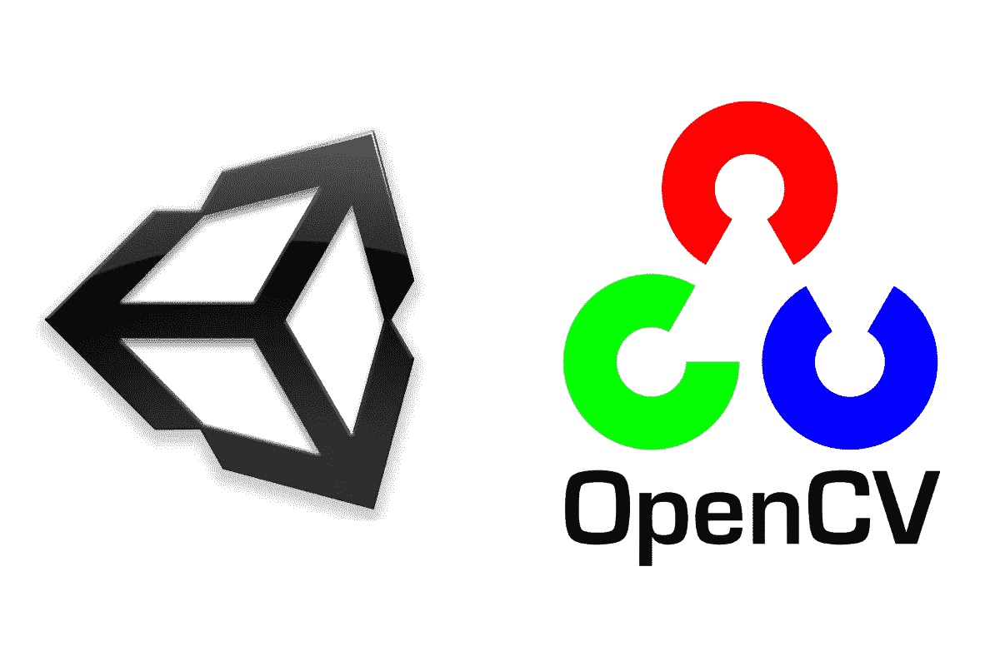
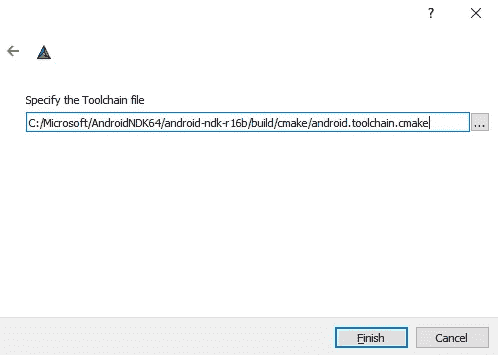
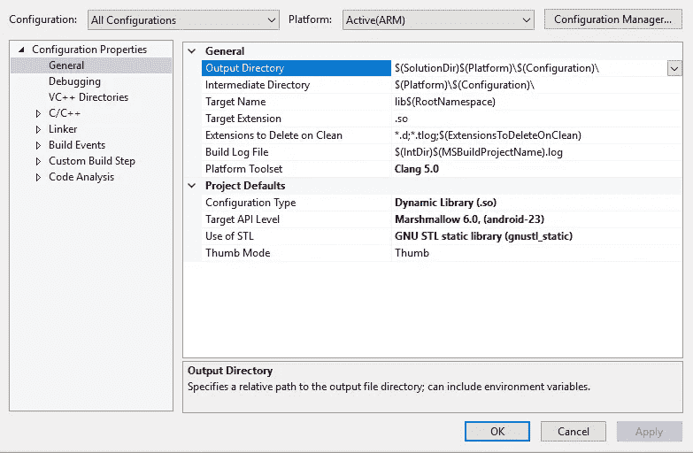
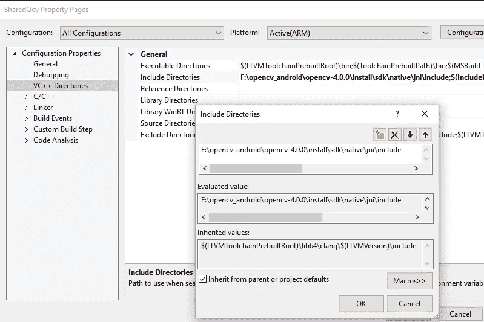
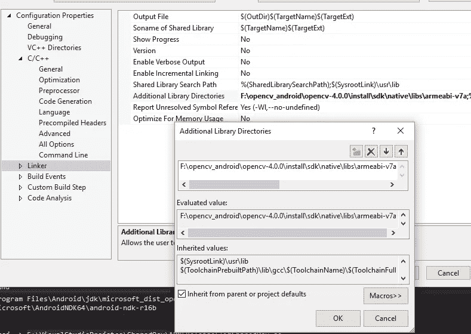
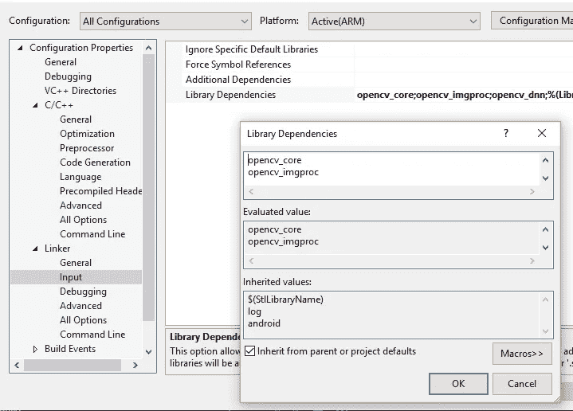
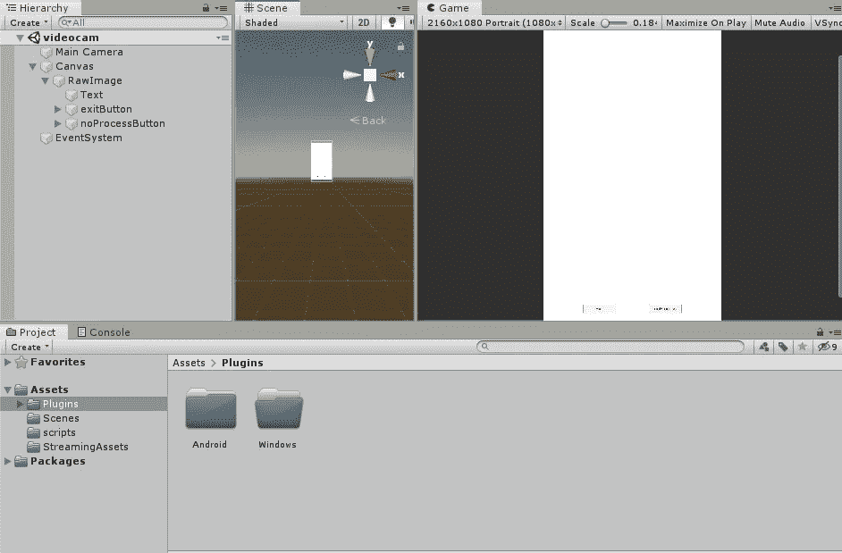
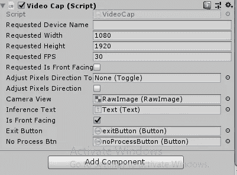

# 使用 Unity3D 和 OpenCV-CPP 插件开发人脸检测器 Android 应用程序

> 原文：<https://medium.com/analytics-vidhya/developing-a-face-detector-android-app-using-unity3d-and-opencv-cpp-plugin-7427413f1656?source=collection_archive---------6----------------------->

曾经想为边缘设备开发任何应用程序吗？曾经想要利用高效的库来构建实时应用程序。这篇博客将帮助你理解和利用 cpp 的效率，使用 unity3d 构建一个高效的 android 应用程序。这里提到的方法是一个通用的方法，可以用来创建类似的方法。

很长一段时间，我试图开发一个基于 android 的应用程序，用于一般的人脸检测。我有一些用 OpenCV 写的旧 c++代码。我在探索创造它的不同方式。一个明显的步骤是将完整的 c++代码移植到 java，并使用 android studio 来构建原生 android 应用程序。由于在 AR/VR 或游戏行业工作的大多数开发人员都使用 [Unity3d](https://unity.com/) 对他们来说，构建高级 UI 应用程序将非常方便。但真正的挑战是处理矩阵运算和其他繁重的计算工作，这是你在构建计算机视觉或任何基于 DL/ML 的应用程序时会遇到的。使用 cpp 编写繁重的计算操作将变得简单而高效。因此，在本文中，我主要关注使用 Unity3D 和原生 CPP 开发一个 android 应用程序。

# **为 Android 编译 OpenCV**

实现这一目标的第一步是从 src 为 android 编译 OpenCV。

1.  从 [Github](https://github.com/opencv/opencv) 下载 OpenCV。
2.  选择**“MinGW Makefiles**”作为生成器
3.  选择“**指定交叉编译的工具链文件**
4.  然后像这样提供工具链路径

5.禁用 BUILD_ANDROID_EXAMPLES，BUILD_ANDROID_PROJECTS，BUILD_TESTS，BUILD_PREF_TESTS，BUILD_FAT_JAVA_LIB，启用 BUILD_SHARED_LIBS

6.然后使用" **mingw32-make"** 命令来构建共享库

7.使用 **make install** 在特定位置安装库

注意:这里我使用的是 visual studios ndk 库工具链，而不是 OpenCV 附带的工具链，以避免 clang 和 gcc 兼容性的问题

# 正在为 Unity3d 创建人脸检测库

现在我们已经为 android 构建了 OpenCV 共享库，是时候为 unity3d 创建一个共享库了。

1.  用 android 开发环境设置 Visual Studio(我用的是 visual studio 2019)
2.  创建“**动态共享库 Android**
3.  使用构建的 OpenCV 库路径和包含路径进行配置
4.  将配置类型设置为**“动态库(。所以)**

5.在“ **VC++目录> >包含目录”**中添加包含路径

6.在**链接器>中>添加库目录**添加库路径

7.添加库到**链接器>输入>库>依赖项**

一旦配置完成，我们就可以编译现有代码来构建共享库了。

sharedocv.h 文件

sharedocv.cpp

“ **sharedocv.h** ”文件实现函数定义，“ **sharedocv.cpp** ”文件实现共享库的函数和导出函数。

# 使用 unity3d 创建 Android 应用程序

1.  为 Android 配置 Unity3d。你可以[勾选这个](https://docs.unity3d.com/Manual/android-BuildProcess.html)。网上有很多[文章](https://www.instructables.com/id/How-to-Make-an-Android-App-Using-Unity/)为 Android 配置 unity3d 以防你遇到困难。
2.  创建一个画布，并添加 RawImage 和按钮，文字如下

3.创建脚本来捕捉视频和检测面部

4.将脚本附加到“**event system”**并链接对象，如下所示

5.现在用“**il 2cpp”**而不是**“Mono”构建应用程序。**要更改，请转到“**播放器设置> >配置> >脚本后端**”。

检查我的 [Github](https://github.com/saikiran321/FacedetectorAndroidUnity) 的完整项目。

如果你想了解更多关于为边缘设备开发高效、实时应用的信息，请通过 LinkedIn 与我联系。

参考资料:

1.  [https://Amin-Ahmadi . com/2019/02/03/how-to-build-opencv-4-x-for-native-Android-development/](https://amin-ahmadi.com/2019/02/03/how-to-build-opencv-4-x-for-native-android-development/)
2.  [https://github . com/spmallick/learnopencv/blob/master/face detection comparison/](https://github.com/spmallick/learnopencv/blob/master/FaceDetectionComparison/)