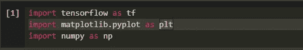
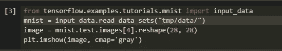
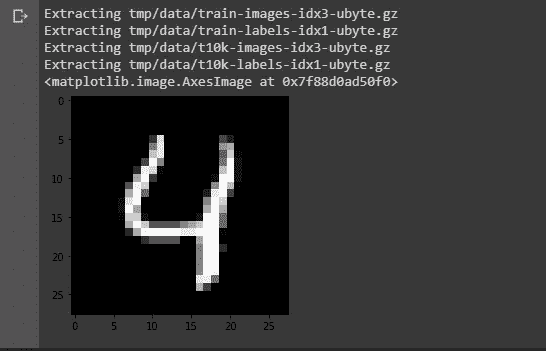
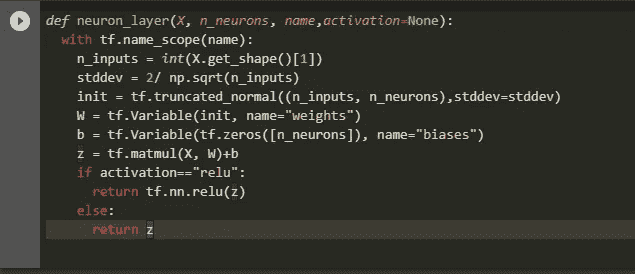
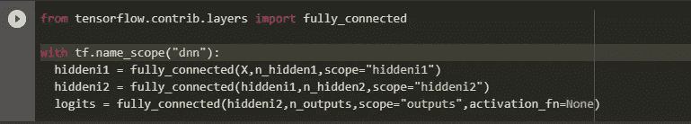
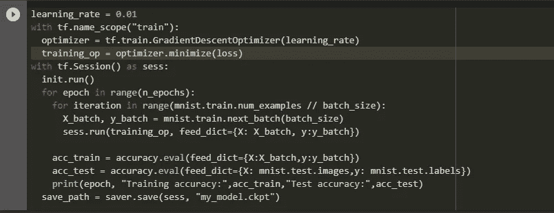
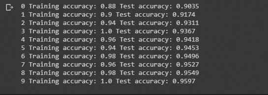
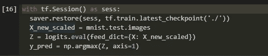

# 开发一个用于手写数字分类的简单深度神经网络(DNN)。

> 原文：<https://medium.com/analytics-vidhya/developing-a-simple-dnn-for-handwritten-digit-classification-7fbdad9da5c5?source=collection_archive---------17----------------------->

作为一名工科学生，我必须告诉你**深度学习**是一个如此迷人的词。这个 ***迷人的词*** 很快就会变成一个 ***迷人的*** ***世界*** 如果兴趣坚持到最后。

这就是我如何开始学习和了解这个主题的，只是**钻研并通过学习深度学习的术语创建一个简单的模型。**

如果你是这个领域的新手，那么请在继续之前阅读[这个故事](https://towardsdatascience.com/what-is-deep-learning-and-how-does-it-work-f7d02aa9d477)。如果你完全是新手，那么你必须读读这本《T21》。

Github 本作链接:[https://github.com/hemantkamat/digit_dnn_tensorflow](https://github.com/hemantkamat/digit_dnn_tensorflow/)/

# **概述:**

深度神经网络(DNN)模型的开发包括四个部分:

*   获取并可视化 MNIST 数据集。
*   定义 DNN 模型的层次。
*   模型的训练。
*   使用训练好的模型进行预测。

## **地面工作:**

首先，在你的笔记本中导入所有必要的模块和文件。

导入所有需要的模块

## **获取并可视化数据:**

然后，为了获取数据，我们将使用来自张量流的 MNIST 数据集。我们将首先读取数据集并将其存储在本地。

获取数据

然后为了可视化，我们将使用 pyplot 并显示每一个图像。在上面的示例中，我们从测试图像中读取数据，我们可以通过将 *mnist.test.images[…]* 替换为 *mnist.train.images[…]* 来进行更改

上面几行代码的输出

## **定义模型及其层:**

为了定义模型，我们应该定义每层中神经元的数量，应该指定输入并声明占位符变量。那部分会在这个 [*github 链接*](https://github.com/hemantkamat/digit_dnn_tensorflow/) *中有。*

为了定义模型，我们可以创建自己的函数，也可以使用 tensorflow 提供的*全连接*函数。

定义模型的神经元 _ 层函数

使用*全连接*功能

为了使用我们定义的函数，*全连接的*应该被替换为*神经元层。*唯一的区别就是激活功能。在*中，全连接*函数 *ReLU* 将默认用作激活函数，但是在我们定义的函数中，激活函数应该是指定的。

## **训练:**

将使用 tensorflow 提供的梯度下降优化器进行训练。随后是迭代方法来运行会话和训练操作。

迭代训练

正在接受培训的模型

## **预测:**

应该保存上面训练好的模型。保存的模型将被恢复，并用于从最后一个检查点预测图像中的数字。 *y_pred* 是包含输入图像集预测的数组。

预测输出的代码

如果在 GPU 上训练模型，可以提高模型的精度。此外，学习率可以调整，以获得最高的准确性。但是应该注意避免模型在训练数据集上的过度拟合。用巨大的数据集训练模型可能有助于过拟合。

上述模型的完整代码可以在我的 [github 资源库](https://github.com/hemantkamat/digit_dnn_tensorflow/)中找到。我就是这样开始我的旅程的。我希望这篇文章/故事会有些用处。谢谢大家！！！