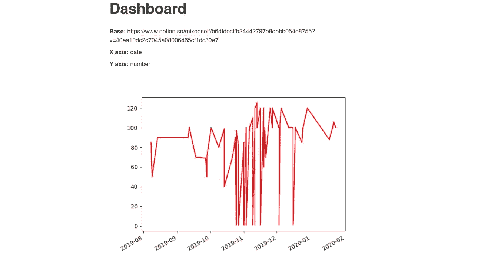
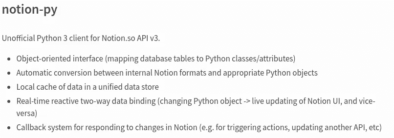

# 开发一个自动绘制概念的工具

> 原文：<https://medium.com/analytics-vidhya/developing-a-tool-which-plots-in-notion-automatically-17c454bb4e2?source=collection_archive---------9----------------------->

事实上，每个人都苦于无法将概念表中的数据可视化。这就是为什么我开发了一个东西，它能自动在观念中画出情节。

从我的角度看是这样的:



# 第一部分。问题陈述

事实上，问题在于这个概念中没有情节。因此，我们需要创造这样的东西:

1.  将采取可能有潜在的情节描述的页面列表。
2.  将从页面中收集情节描述。
3.  将在其描述块后添加一个图形，删除先前版本的绘图。
4.  它会自动完成这项工作(每小时一次)，而且最好是免费的。

# 第二部分。快速解释

我们将在 Django 上编写服务器，因为概念 API 的非官方库是用 Python 编写的。然后我们会把东西上传到 Heroku。从 IFTTT 我们将以一定的频率在 Heroku 上拉我们的东西。



**那么我们实际上应该写些什么呢？**

1.  响应来自 IFTTT 的请求的函数
2.  该功能将搜索图的描述。
3.  该函数将绘制一个图，并将其上传到概念
4.  从描述中提取数据的功能

# 第三部分。编写代码

我们转到概念，按 Ctrl + Shift + J，然后我们转到应用程序-> cookie 并复制 token_v2。我们把它命名为 TOKEN 吧。

我们应该以某种方式存储一个页面数组，其中可能包含情节的描述。其实很简单:

```
PAGES = [     
   "https://www.notion.so/mixedself/Dashboard-  40a3156030fd4d9cb1935993e1f2c7eb" 
]
```

为了以某种方式解析描述本身，我们需要关键字:

1.  X 轴上的数据
2.  将位于 Y 轴上的数据
3.  表视图的 Url

**在代码中，它看起来像这样:**

```
BASE_KEY = "Base:" 
X_AXIS_KEY = "X axis:" 
Y_AXIS_KEY = "Y axis:"
```

情节的空白描述如下所示:

```
def get_empty_object():     
   return {         
      "database": "",
      "x": "",
      "y": ""     
   }
```

我们需要以某种方式检查描述是否为空。为此，我们将编写一个特殊的函数:如果所有字段都不为空，那么我们可以开始绘制绘图。

```
def is_not_empty(thing):     
   return thing != "" def check_for_completeness(object):    
   return is_not_empty(object["database"]) and  is_not_empty(object["x"]) and is_not_empty(object["y"])
```

数据(实际上只是文本)应该以某种方式提取出来，以便生成描述。让我们为此编写几个函数。

**一个小解释:**
观念储存了一种加粗字体(如图)__ 如下 _ _。

```
def br_text(text):     
   return "__" + text + "__" def clear_text(text):     
   return text.replace(br_text(BASE_KEY), "").replace(BASE_KEY, "") \         .replace(br_text(X_AXIS_KEY), "").replace(X_AXIS_KEY, "") \         .replace(br_text(Y_AXIS_KEY), "").replace(Y_AXIS_KEY, "").strip()
```

现在让我们来写，也许，我们的东西的主要功能。代码下面是对这里发生的事情的解释:

```
def plot():
   client = NotionClient(token_v2=TOKEN) for page in PAGES:
      blocks = client.get_block(page)
      thing = get_empty_object() for i in range(len(blocks.children)):
         block = blocks.children[i]
         print(block.type) if block.type != "image":
            title = block.title
            if BASE_KEY in title:
               thing["database"] = clear_text(title).split("](")[0].replace("[", "")

            elif X_AXIS_KEY in title:
               thing["x"] = clear_text(title) elif Y_AXIS_KEY in title:  
               thing["y"] = clear_text(title) if check_for_completeness(thing):
               *# not last block*
               if i != len(blocks.children) - 1:
                  next_block = blocks.children[i + 1]
                  *# if next block is picture, then it is previous
                  # version of the plot, then we should remove it* if blocks.children[i + 1].type == "image":
                     next_block.remove() draw_plot(client, thing, block, blocks)    
               thing = get_empty_object()
```

我们把图书馆和观念联系起来。然后我们浏览一系列可能需要绘图的页面。我们检查这一页的每一行，看看我们的一个密钥是否在其中。如果它在一行中，那么我们从那里清除文本并把它放入对象中。一旦对象完成，我们检查生成的绘图是否已经存在(如果是，我们删除它)并绘制一个新的绘图。

现在让我们编写一个从表中获取数据的函数。

```
def get_lines_array(thing, client):
   database = client.get_collection_view(thing[“database”])
   rows = database.default_query().execute()
   lines_array = []    for i in range(1, len(rows)):
      previous_row = rows[i — 1]
      current_row = rows[i] line = [(get_point_from_row(thing, previous_row)), (get_point_from_row(thing, current_row))]
      lines_array.append(line) return lines_array
```

在这里，我们获取表格内容并遍历所有内容，从点到点形成一个行数组。

而实际上什么是 get_point_from_row 呢？事实是，如果数据是日期，那么我们应该以某种方式重新解析它，以便由 matplotlib 正确处理:

```
def get_point_from_row(thing, row):
   x_property = row.get_property(thing["x"])
   y_property = row.get_property(thing["y"]) if thing["x"] == "date":
      x_property = x_property.start if thing["y"] == "date":
      y_property = y_property.start return x_property, y_property
```

现在我们准备绘制我们的情节。

```
def draw_plot(client, thing, block, page):
   photo = page.children.add_new(ImageBlock)
   photo.move_to(block, "after") array = get_lines_array(thing, client)
   print(array) for i in range(1, len(array)):
      points = reparse_points(array[i - 1:i][0])
      plt.plot(points[0], points[1], color="red") if not path.exists("images"):
      os.mkdir("images") if thing["x"] == "date":
      x_axis_dates() filename = "images/" + random_string(15) + ".png"
   plt.savefig(filename) print("Uploading " + filename)
   photo.upload_file(filename)
```

这里我们添加一个新的块(带照片)，把它移动到情节的描述下面。然后我们重新分析这些点(下面会有更多的介绍)，用 matplotlib 画线，用一个随机文件名保存生成的图像，并将其加载到图像块中。

我们可以得到一个这样的随机文件名:

```
def random_string(string_length=10):
   letters = string.ascii_lowercase
   return ''.join(random.choice(letters) for i in range(string_length))
```

我们需要重新解析这些点，因为 matplotlib 接受与当前实现方式不同的数据表示作为输入。

```
def reparse_points(points):
   return [
      [points[0][0], points[1][0]],
      [points[0][1], points[1][1]]
   ]
```

如果仔细观察，该方法会检查 x 轴上的数据是否是日期。如果是，那么我们需要正确地显示它:

```
def x_axis_dates(ax=None, fig=None):
   if ax is None:
      ax = plt.gca() if fig is None:
      fig = plt.gcf() loc = mdates.AutoDateLocator()
   fmt = mdates.AutoDateFormatter(loc) ax.xaxis.set_major_locator(loc)
   ax.xaxis.set_major_formatter(fmt) fig.autofmt_xdate()
```

现在让我们编写一个函数，当我们收到 POST 请求时，它将启动一个新线程。为什么贴？因为如果需要 POST 请求来开始绘图，那么您就不会错误地启动它(通过转到 URL)。

为什么是新线？IFTTT，我们将使用它作为我们的东西的触发器，不喜欢来自服务器的响应花费太多时间(在我们的情况下，可能要等待很长时间)，过一会儿它就可以停止触发这个东西。

```
@csrf_exempt 
def index(request):
   if request.method == "POST":
      thread = Thread(target=plot)
      thread.start()
      return HttpResponse("Hello, world.")

   else:
      return HttpResponse("Hello, world.")
```

# 第四部分。IFTTT

转到[创建小程序](https://ifttt.com/create)。选择 trigger(在我们的例子中是 Date & time)，勾选“每小时”。选择 webhook 作为触发事件，设置我们(到目前为止)的本地地址以便测试。实际上就是这样。测试。

# 第五部分。赫罗库

你会想，为什么我们要用 IFTTT 作为我们的触发器？因为我们可以使用 heroku，我们的出口商将免费工作。Heroku 有举办我们活动的免费计划。最重要的是，服务器必须每天至少睡 6 个小时。他肯定会的，因为我们每小时触发一次，而不是每分钟。

然后我们做以下事情:去 heroku [创造新产品](https://dashboard.heroku.com/new-app)。然后通过[他们的客户端](https://devcenter.heroku.com/articles/heroku-cli)去安装新的操作系统。然后按照说明去做。

把所有东西上传到 heroku 后，去 IFTTT 的小程序，把旧的 url 换成新的。

现在一切都正常了。

# 第六部分。谢谢你

我希望我的这篇文章能帮助到一些人。

你可以参与发展的事情。[下面是它的 GitHub。](https://github.com/mixeden/Plotion)

## 你可以通过阅读我的其他帖子来帮助我:

[如何使用 IFTTT 和 Django(自动)将 Google 表单导出到概念中](/@mixeden/how-to-export-google-forms-to-notion-using-ifttt-and-django-automatically-f3d002d75bc6)

[用概念和 Python 创建家庭图书馆](/@mixeden/creating-home-library-with-notion-and-python-971171908cc0)