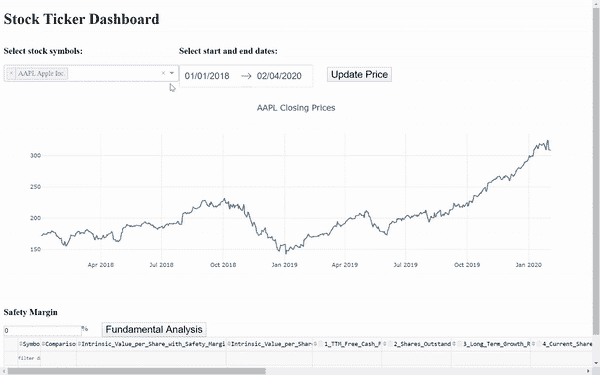
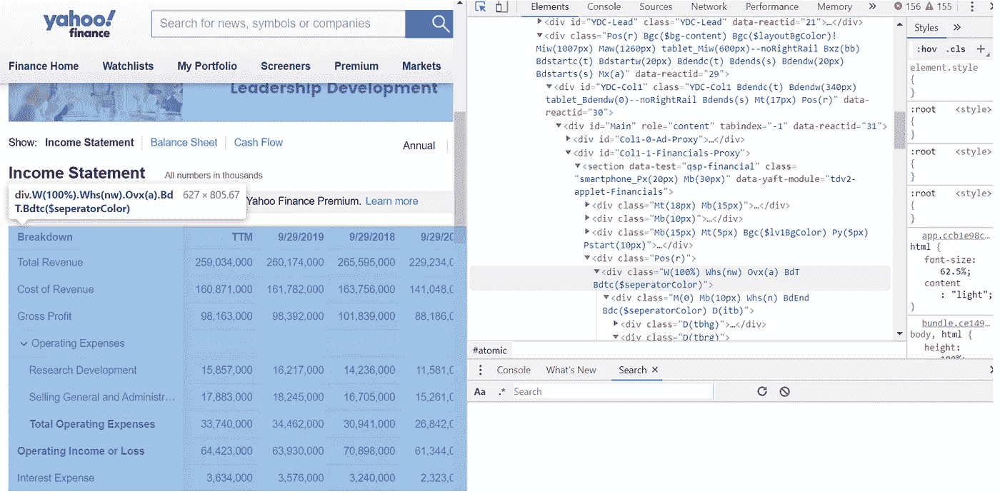
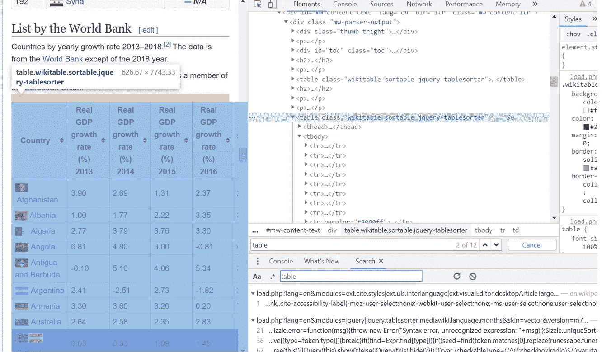
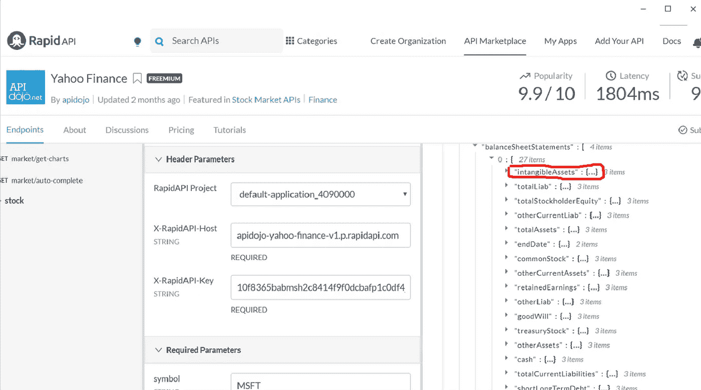
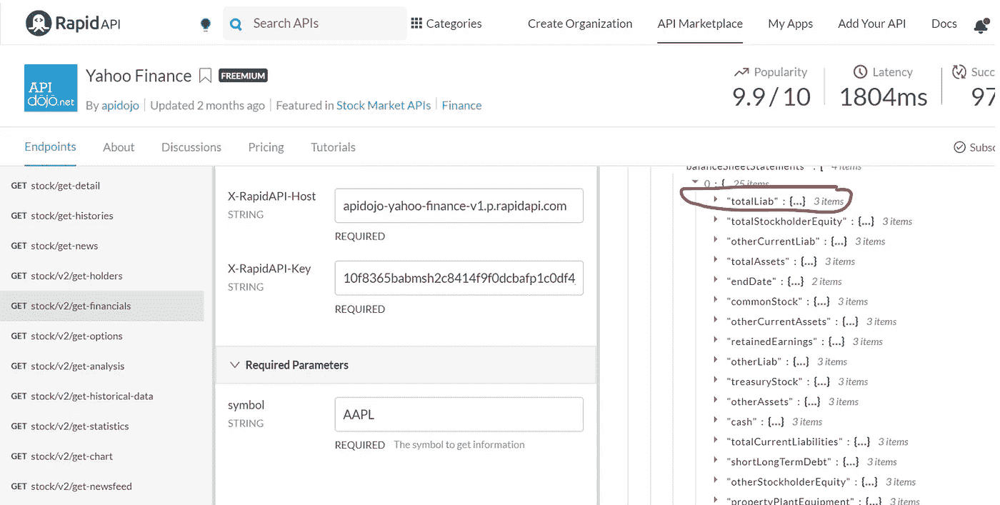
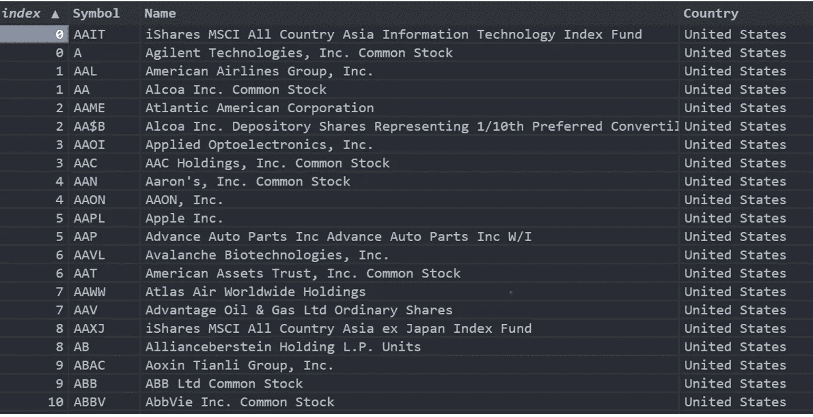
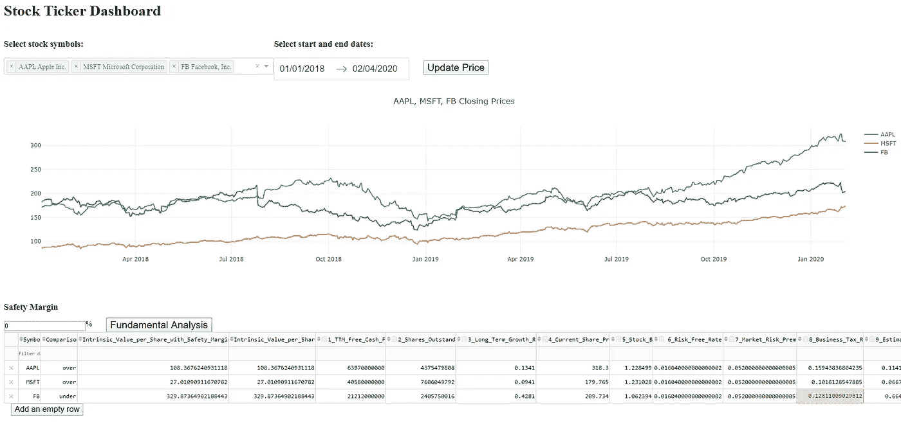

# 用 Python、Dash 和 Pandas 开发价值投资的交互式仪表盘(第二版)

> 原文：<https://medium.com/analytics-vidhya/developing-an-interactive-dashboard-for-value-investment-with-python-dash-and-pandas-version-2-2c2616542b5c?source=collection_archive---------3----------------------->

# 利用 Python, Dash 和 Pandas 建立互動式價值投資工具(第二版)

这是该工具的旧版本。

**请前往更新版本 3:**[**https://medium . com/@ Lester so 1027/developing-an-interactive-dashboard-for-value-investment-with-python-dash-and-pandas-version-3-d 39582 a 710d 7**](/@lesterso1027/developing-an-interactive-dashboard-for-value-investment-with-python-dash-and-pandas-version-3-d39582a710d7)

## **1。最终结果一瞥**

1.1 GIF



工具的图示

1.2 链接

App 链接:[https://stockdashboardlester.herokuapp.com/](https://stockdashboardlester.herokuapp.com/)

请允许仪表板使用一些时间来加载。我只在渲染上使用免费层服务，所以速度可能会受到限制。

Github 链接:[https://github.com/lester1027/ticker_dashboard](https://github.com/lester1027/ticker_dashboard)

1.3 使用步骤

一、输入[https://stockdashboardlester.herokuapp.com/](https://stockdashboardlester.herokuapp.com/)，输入账号为‘莱斯特’，密码为‘通配符’。

二。在下拉列表中选择 tickers(可以通过键入过滤结果)。

三。选择日期范围并更新价格(这一步对于基本面分析是不必要的)。

四。输入百分比形式的安全裕度(用户可以保留默认值)。

动词 （verb 的缩写）点击“获取数据”按钮。

不及物动词点击“计算内在价值”按钮，显示所选股票的财务数据和分析结果。“比较”一栏显示股票是高估还是低估。

七。如果财务数字显示为“9999999999”或“1e+10”，这意味着无法从数据源访问所需的数字，需要手动输入。“比较”列中的单元格将显示“错误”。

八。表格是完全可编辑的。如果出现如上所述的错误，或者用户希望对财务数字进行一些调整，则应编辑显示财务数字 1 至 14 的列。调整后，会自动重新计算内在价值。**应仔细调整“3 _ 长期 _ 增长率”列的值。**

九。如果在下拉列表中找不到要分析的股票，用户可以单击“添加空行”按钮，手动输入所有数字。

1.4 变更日志

2020 年 5 月 24 日

更新了 API 的 URL。

二。该表的显示得到了增强。

2020 年 3 月 5 日

I .在类 Stock 中添加一个 URL 构造私有方法。

二。为财务数据采集增加了错误处理。

三。增加一栏来说明股票是被低估了还是被高估了。

四。该表格现在可编辑。

动词 （verb 的缩写）整个工具部署在 Heroku 上。

## 2.动机

在资本主义社会，没有额外收入的工资不能长期正常维持一个人的日常生活。完成大学学业后，对货币的需求会越来越大。为了有一个长期的被动收益，价值投资可以是一个不错的选择。基于基本面分析的股票价值投资忽略了股票价格的短期或中期波动。相反，它关注企业的基本方面，并提出一个核心问题:公司做得好吗？未来会做得好吗？要回答这个问题，通常需要从公司的资产负债表、现金流量表和损益表中收集大量的财务数据。他/她还必须进行一系列后续计算，以计算公司的内在价值。收集数据并逐一计算每个目标公司的内在价值可能非常耗时。所以这个小项目旨在让人们用便捷的方式做价值投资。

## 3.方法

3.1.定义用于计算内在价值的函数

根据[贴现现金流](https://www.investopedia.com/terms/d/dcf.asp)方法定义函数。参数是下面介绍的财务数字，输出是每股的内在价值。


该仪表板中每股内在价值的计算

```
def calculate_intrinsic_value(ttmFCF,sharesOutstanding,longTermGrowthRate,currentSharePrice,stockBeta,riskFreeRate,riskPremium,taxRate,longTermIntRate,marketCap,mvDebt,totalLiab,cce,gdpGrowthRate):*#a function for calculating the intrinsic value**#this is used later for both after acquiring financial figures and**#after changing values in the interactive table*r_e=riskFreeRate+stockBeta*riskPremiumr_d=longTermIntRate*(1-taxRate)wacc=(marketCap)/(marketCap+mvDebt)*r_e+(mvDebt)/(marketCap+mvDebt)*r_dprojectedFCF=np.array([ttmFCF*(1+longTermGrowthRate)**n for n in range(11)])discountFact=np.array([1/(1+wacc)**n for n in range(11)])discountedFCF=projectedFCF[1:]*discountFact[1:]pvDiscountedFCF=discountedFCF.sum()perpetuityValue=(projectedFCF[-1]*(1+gdpGrowthRate))/(wacc-gdpGrowthRate)terminalValue=perpetuityValue*discountFact[-1]intrinsicValuePerShare=(pvDiscountedFCF+terminalValue+cce-totalLiab)/sharesOutstandingreturn intrinsicValuePerShare
```

3.2.获取财务数据

3.2.1.网络抓取与 API

如上所述，基本面分析涉及到相当多的财务数据。获取实时或持续更新数据的最常见方法是网络抓取和 API。前者通过分析 html 和 json 等格式的网站内容直接获取数据，而后者使用其他公司、权威机构或一些好心人提供的数据源。应该对网络抓取和 API 进行比较。

网页抓取主要是免费的。对于想直接从网络上提取信息的人来说，这是相当有吸引力的。另一篇价值投资的中型文章用的就是这种方法([价值投资仪表盘配 Python 美汤和 Dash Python](https://towardsdatascience.com/value-investing-dashboard-with-python-beautiful-soup-and-dash-python-43002f6a97ca) )。这篇文章启发了我，我找到了一本书[《用 Python 进行网站抓取:使用 BeautifulSoup 和 Scrapy》，作者是加博·拉斯洛·哈伊巴](https://www.apress.com/gp/book/9781484239247)。在阅读了前三章并使用了里面的代码后，我承认对于像我这样想即时制作工具的人来说，学习曲线太陡了。此外，谷歌 Chrome 浏览器中的“检查元素”是一个典型的网络抓取技巧，并不总是能返回理想的结果。例如， [Yahoo Finance](https://finance.yahoo.com/) 没有用< table >标签包装数据，单元格中的数据没有唯一的 id，这些都使得内容很难被抓取。



雅虎财经没有使用通用的 HTML 标签



维基百科使用普通的 HTML 标签

使用网络抓取的另一个缺点是，这种方法容易受到网站结构变化的影响。如果有人试图用一次性的网络抓取方式下载数据集，这是可以的。然而，这不是长期使用的理想解决方案。

API 方法还有其他优点和缺点。使用它不需要任何麻烦的刮擦。你需要做的就是找到一个合适的 API 服务。然而，API 可能不是免费的。许多 API 都在使用“免费增值”的定价方法。也就是说，低于特定请求次数的使用是免费的，而用户需要为超过该数量的任何请求付费。例如，在 RapidAPI 中的 Yahoo [Finance API 有如下定价策略。用户每月可以免费申请 500 次，每月 10 美元可以申请 10，000 次。除了价格问题之外，API 不能确保用户使用一致的数据格式。例如，在 RapidAPI 的雅虎财务 API 中，微软的季度资产负债表包含“无形资产”这一数字，而苹果的则没有。这可能会阻碍投资工具的自动化。](https://rapidapi.com/apidojo/api/yahoo-finance1?endpoint=apiendpoint_2e0b16d4-a66b-469e-bc18-b60cec60661b)



用无形资产



没有无形资产

最初，我的想法是为全球股票市场创造一个工具。然而，我很快发现对于原型工具来说，这是一个过于雄心勃勃的目标。这是因为如果涉及全球市场，数据的不一致性可能会更严重。比如地质上离我住的地方更近的香港和上海市场，就没有发展完善的价格公道的价值投资 API。美国至少有股票市场的埃德加数据。考虑到所有提到的标准，我决定使用[金融建模准备](https://financialmodelingprep.com/developer/docs/)服务来获取数据。这项服务是免费的，每个公司都有一致的数据格式。不幸的是，它只包括美国的股票。我想我现在只能这样了。

并非所有的数据都可以从 API 中收集。我还需要从网站上搜集一些数据。比如，我从维基百科上得到了各国的 [GDP 增长率](https://en.wikipedia.org/wiki/List_of_countries_by_real_GDP_growth_rate)。这很容易做到，因为我使用的网站只包含简单 HTML <表>标签中的数据。

我使用的财务数字列表来自 Udemy 课程[完整的价值投资课程(2020 年更新)](https://www.udemy.com/course/value-investing-essential-guide-to-picking-stocks/)。很好的介绍了价值投资。数字如下。

1.自由现金流

2.已发行股票数量

3.长期增长率

4.当前股价

5.股票贝塔

6.无风险利率

7.市场风险溢价

8.营业税税率

9.估计利率

10.股权的市场价值

11.债务的市值

12.负债总额

13.现金和现金等价物

14.国内生产总值增长率

首先，为所有公司股票定义一个“股票”类别。可以使用股票代号、价格趋势的期望开始日期、价格趋势的期望结束日期和分析的安全边际(稍后解释)将单个公司股票作为对象初始化。

```
class Stock:def __init__(self,symbol,startDate,endDate,margin):self.symbol=symbolself.startDate=startDateself.endDate=endDateself.safetyMargin=marginself.debtPremium=1.3*#the number to indicate a financial figure that cannot be acquired successfully*self.epsilon=9999999999
```

update_source()方法用于将指向对象本身的 API 链接或 web 抓取链接存储为数据。

```
def update_source(self):*#source of priceHistory*self.url_priceHistory =self._get_f_url('priceHistory',format=True)*#source of figures 1*self.url_cashflowQuarter=self._get_f_url('cashflowQuarter',format=True)self.url_cashflow=self._get_f_url('cashflow',format=True)
```

update_price()方法用于从相应的链接中获取股票的历史价格，并将其存储为对象的数据。

```
def update_price(self):*#price history*self.response_priceHistory = requests.request("GET",self.url_priceHistory).json()['historical']self.priceHistory=pd.DataFrame(self.response_priceHistory)self.selectedPriceHistory=self.priceHistory[(self.priceHistory['date']>self.startDate)&(self.priceHistory['date']<self.endDate)]
```

update_data()方法用于从链接中获取所需的财务数字，计算所需的数字，并将它们全部存储为对象的数据。计算使用上文第 3.1 节中定义的函数。

```
def update_data(self):*#Figure 2: Total number of shares outstanding*try:self.sharesOutstanding=float(requests.request('GET',self.url_companyQuote).json()[0]['sharesOutstanding'])except:self.sharesOutstanding=self.epsilon
```

3.3.列出股票代码和公司名称的字典

这个工具涉及美国股票市场纳斯达克和纽约证券交易所。包含两个市场的股票代号和公司名称的 pandas 数据帧被组合在一起，形成一个列表供工具中的用户选择。



组合数据帧

3.4.创建工具的布局

在参加了 Udemy 课程[和 Plotly 以及 Dash](https://www.udemy.com/course/interactive-python-dashboards-with-plotly-and-dash/) 的交互式 Python 仪表盘之后，我发现 Dash 适合我对用于基本面分析的交互式工具的需求。构建交互式表格需要一个名为“dashtable”的附加库。



仪表板布局

在左上角，有仪表板的标题“股票报价机仪表板”。在标题下，有一个下拉组件供用户选择他们想要调查的股票。选择可以是多重的。此外，用户可以在下拉组件上键入内容，以搜索他们想要的公司符号和名称。该下拉组件中包含的选项由 3.2 节中提到的字典列表定义。所选股票符号用于价格趋势显示和下表中的基本面分析。在下拉组件的右侧，有一个日期范围选择器，供用户确定下面显示的价格的日期范围。旁边的“更新价格”按钮用于刷新下图。

在价格趋势图中，股票收盘价以不同的颜色显示，图例显示在右侧。这个图表是交互式的。用户可以放大某个区域，改变坐标轴刻度，切换某些趋势的显示等。

在图表下方，是仪表板工具的核心，即基本面分析部分。在进行分析之前，用户可以输入百分比形式的安全余量。该安全余量用于扣除计算出的具有一定百分比的股票内在价值，使得分析对于一些分析误差具有容限。安全余量旁边的“基本分析”按钮用于刷新下面的交互式表格，以显示重要的数字和分析结果。用户需要将“具有安全边际的每股内在价值”与“4”进行比较。“当前股价”。如果当前价格低于内在价值，且存在安全边际，则“低于”会显示在“比较”栏中，这意味着股票当前被低估，反之亦然。

整个分析表是可编辑的。可以删除行和列。可以对列进行筛选或排序。用户可以更改从数据源获取的财务数字，并自行修改。要为手动数字输入添加一个完全空行，用户可以按表格下方的“添加空行”按钮。

3.5.创建回调函数

在决定了仪表板的布局之后，必须定义回调函数来实现上述特性。这些功能是为仪表板设置的，以便对用户所做的更改做出反应。

点击“更新价格”按钮可触发 update_graph()函数。被触发后，它传递所选的股票符号、所选的开始和结束日期以及安全余量，以便为“股票”类创建新对象。然后调用 get_source()和 get_price()函数来获取价格趋势。返回的图形格式用于替换布局中的原始图形。

```
*#callback functions*@app.callback(Output('my_graph', 'figure'),[Input('price-button', 'n_clicks')],[State('my_ticker_symbol', 'value'),State('my_date_picker', 'start_date'),State('my_date_picker', 'end_date'),State('safety_margin','value')])def update_graph(n_clicks, stock_ticker, start_date, end_date, margin):*#when the 'price-button' is clicked, display the close price data in the graph*traces = []for tic in stock_ticker:equity=Stock(tic,start_date[:10],end_date[:10],margin)equity.update_source()equity.update_price()traces.append({'x':equity.selectedPriceHistory['date'],'y': equity.selectedPriceHistory['close'], 'name':tic})fig = {'data': traces,'layout': {'title':', '.join(stock_ticker)+' Closing Prices'}}return fig
```

update_table()函数可以由三个变化触发。

一、点击“基本面分析”按钮。

二。更改表中的值

三。单击“添加空行”按钮

在被触发后，这个回调函数确定上面的哪个更改是最近完成的。

如果时间戳显示最后一次更改是点击“基本面分析”按钮，它将传递所选的股票符号、所选的开始和结束日期以及安全余量，以便为“股票”类创建新对象。然后调用 update_source()和 update_data()函数来获取财务数据并计算内在值。

如果最后更改的是表中的值，此函数将根据相同的管道重新计算固有值，并刷新结果。

如果最后一次更改是单击“添加空行”按钮，一个新的空行将被追加到表格中。该行也是可编辑的。

```
@app.callback(Output('table', 'data'),[Input('analysis-button', 'n_clicks_timestamp'),Input('table','data_timestamp'),Input('add-row-button','n_clicks_timestamp')],[State('my_ticker_symbol', 'value'),State('my_date_picker', 'start_date'),State('my_date_picker', 'end_date'),State('safety_margin','value'),State('table','data')])def update_table(analysis_timestamp, data_timestamp, add_row_timestamp, stock_ticker, start_date, end_date, margin ,rows):...
```

## 4.结论

这是我第一次尝试创建一个交互式仪表板并在线部署。我从中学到了很多。希望该工具对我自己有帮助，也可能对你们中的一些人有帮助。请随时给我留下任何意见。感谢您的阅读。