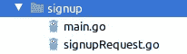

# 使用 AWS Lambda & Go & PostgreSQL &事件驱动的 SQS 队列开发完整的授权模块

> 原文：<https://medium.com/analytics-vidhya/developing-complete-authorization-modules-with-aws-lambda-go-postgresql-event-driven-sqs-ee641622e890?source=collection_archive---------3----------------------->

在本教程中，我将分享一个包含注册，登录，授权，电子邮件验证功能的示例项目。这些函数可以用来启动一个新的无服务器项目。我将在文章的最后在 GitHub 上分享代码，这样人们可以从现有的代码开始。技术堆栈如下:

*   戈朗
*   戈尔姆
*   自动气象站λ
*   AWS API 网关
*   AWS RDS Postgresql
*   AWS SES
*   AWS SQS

你可以用 AWS 自由层开发这个项目。你不需要向 AWS 支付任何费用。


在本教程的后面，我将给出每个模块的一些提示和技巧。

让我们首先用 AWS SAM 创建一个项目。

```
sam init --runtime go1.x --name serverlessExample
```

我想你对 AWS 有些了解，SAM。如果你需要寻找一些关于它的信息，你可以在下面找到我以前的文章。

[](/@yunskilic/go-aws-development-with-serverless-application-model-sam-to-start-functions-locally-53a1f0fd69c8) [## 使用无服务器应用程序模型 SAM 进行 AWS 开发，以在本地启动功能

### 这是我用 Go 语言进行 AWS 之旅的第三篇文章。

medium.com](/@yunskilic/go-aws-development-with-serverless-application-model-sam-to-start-functions-locally-53a1f0fd69c8) 

Sam 为我们创建了初始函数和 template.yaml。

让我们从注册功能开始

**签约功能**

我将在 functions 文件夹中收集所有 lambda 函数。所以创建下面的文件夹结构。


项目结构

注册功能需要数据库连接来创建用户。我用的是亚马逊 RDS Postgresql。

*   创建一个数据库实例，然后使其可公开访问，以便从 AWS 外部连接。

**数据库连接器代码:**

```
package database

import (
   "fmt"
   "github.com/jinzhu/gorm"
   _ "github.com/jinzhu/gorm/dialects/postgres"
   "os"
)

type PostgresConnector struct {
}

func (p *PostgresConnector) GetConnection() (db *gorm.DB, err error) {
   username := os.Getenv("db_user")
   password := os.Getenv("db_pass")
   dbName := os.Getenv("db_name")
   dbHost := os.Getenv("db_host")
   dbURI := fmt.Sprintf("host=%s user=%s dbname=%s sslmode=disable password=%s", dbHost, username, dbName, password)
   fmt.Println(dbURI)
   return gorm.Open("postgres", dbURI)
}
```

连接器从环境变量中读取信息，然后打开连接。

**用户实体编码:**

```
package entity

import "github.com/jinzhu/gorm"

type User struct {
   gorm.Model
   Email         string
   Password      string `json:"-"`
   EmailVerified bool
   LoginTry      int
}
```

简单地说，我的模型非常原始。但是你可以很容易地扩展这个模型。

```
`json:"-"` means do not show at json
```

我们的 gorm 模型和 DB 连接器已经准备好了，所以我们可以轻松地开始编码。

我创建了一个模型来解析请求体。



```
package main

type SignupRequest struct {
   Email    string `validate:"required,email"`
   Password string `validate:"required"`
}
```

注册功能的代码

```
package main

import (
   ...
)

func handler(request events.APIGatewayProxyRequest) (events.APIGatewayProxyResponse, error) {
   ....
} ....func main() {
   lambda.Start(handler)
}
```

源代码很长，我想描述一下这些程序块的一些部分。

以下部分用于将请求正文解组到我的注册请求。

```
var signupRequest SignupRequest
jsonErr := json.Unmarshal([]byte(request.Body), &signupRequest)
if jsonErr != nil {
   body := model.ResponseBody{}
   body.Message = errormessage.StatusText(errormessage.JsonParseError)
   return events.APIGatewayProxyResponse{
      StatusCode: http.StatusBadRequest,
      Body:       body.ConvertToJson(),
   }, nil
}
```

我创建了一个错误消息文件，将所有错误消息保存在一个特定的文件中。

```
package errormessage

const (
   Ok                      = 99
   DatabaseError           = 100
   JsonParseError          = 101
   UserAlreadyExist        = 102
   UserNameOrPasswordWrong = 103
   CaptchaNeeded           = 104
   TokenIsNotValid         = 105
)

var statusText = map[int]string{
   DatabaseError:           "DATABASE_ERROR",
   JsonParseError:          "JSON_PARSE_ERROR",
   UserAlreadyExist:        "USER_ALREADY_EXIST",
   UserNameOrPasswordWrong: "USERNAME_OR_PASSWORD_WRONG",
   Ok:                      "OK",
   CaptchaNeeded:           "CAPTCHA_NEEDED",
   TokenIsNotValid:         "TOKEN_IS_NOT_VALID",
}

func StatusText(code int) string {
   return statusText[code]
}
```

将请求体解析到我的模型后，我需要验证必填字段。我为 Golang 使用了一个开源的[验证器](https://github.com/go-playground/validator/tree/v9.30.0)。下面的代码块显示了如何验证输入。

```
v := validator.New()
validateErr := v.Struct(signupRequest)

if validateErr != nil {
   body := model.ResponseBody{}
   body.Message = errormessage.StatusText(errormessage.JsonParseError)
   return events.APIGatewayProxyResponse{
      StatusCode: http.StatusBadRequest,
      Body:       body.ConvertToJson(),
   }, nil
}
```

在我的注册请求中有一个声明

```
`validate:"required,email"`
```

说明该字段是必需的，并且其类型是电子邮件。

验证输入后，如果没有创建新用户，我们需要检查用户是否存在。

```
postgresConnector := database.PostgresConnector{}
dbConn, dbErr := postgresConnector.GetConnection()
defer dbConn.Close()
if dbErr != nil {
   fmt.Print(dbErr)
   return events.APIGatewayProxyResponse{
      StatusCode: http.StatusInternalServerError,
      Body:       "",
   }, nil
}
dbConn.AutoMigrate(&entity.User{})

var users []entity.User
filter := &entity.User{}
filter.Email = signupRequest.Email
dbConn.Where(filter).Find(&users)

if users != nil && len(users) > 0 {
   body := model.ResponseBody{}
   body.Message = errormessage.StatusText(errormessage.UserAlreadyExist)
   return events.APIGatewayProxyResponse{
      StatusCode: http.StatusBadRequest,
      Body:       body.ConvertToJson(),
   }, nil
}

newUser := &entity.User{}
newUser.Email = signupRequest.Email
newUser.Password = hashAndSalt(signupRequest.Password)
dbConn.Create(&newUser)
```

出于安全原因，您必须保持密码散列。我的哈希函数:

```
func hashAndSalt(pwd string) (hashed string) {
   hash, err := bcrypt.GenerateFromPassword([]byte(pwd), bcrypt.DefaultCost)
   if err != nil {
      log.Println(err)
   }

   return string(hash)
}
```

注册的编码部分已经准备好了。让我们转到 makefile 和 template.yaml

**Makefile**

```
.PHONY: clean build

clean: 
   rm -rf ./bin/signup/signupl

build:
   GOOS=linux GOARCH=amd64 go build -o bin/signup/signup ./functions/signup
```

**Template.yaml**

```
AWSTemplateFormatVersion: '2010-09-09'
Transform: AWS::Serverless-2016-10-31
Description: >
  serverlessExample

  Sample SAM Template for serverlessExample

*# More info about Globals: https://github.com/awslabs/serverless-application-model/blob/master/docs/globals.rst* Globals:
  Function:
    Timeout: 5

Parameters:
  dbname:
    Type: String
    Default: example
  username:
    Type: String
    Default: postgres
  password:
    Type: String
    Default: password
  host:
    Type: String
    Default: localhost

Resources:
  SignupFunction:
    Type: AWS::Serverless::Function *# More info about Function Resource: https://github.com/awslabs/serverless-application-model/blob/master/versions/2016-10-31.md#awsserverlessfunction* Properties:
      CodeUri: bin/signup
      Handler: signup
      Runtime: go1.x
      Tracing: Active *# https://docs.aws.amazon.com/lambda/latest/dg/lambda-x-ray.html* Events:
        Signup:
          Type: Api *# More info about API Event Source: https://github.com/awslabs/serverless-application-model/blob/master/versions/2016-10-31.md#api* Properties:
            Path: /signup
            Method: POST
      Environment: *# More info about Env Vars: https://github.com/awslabs/serverless-application-model/blob/master/versions/2016-10-31.md#environment-object* Variables:
          db_user: !Ref username
          db_pass: !Ref password
          db_name: !Ref dbname
          db_host: !Ref host
Outputs:
  ApiURL:
    Description: "API URL"
    Value: !Sub 'https://${ExampleApi}.execute-api.${AWS::Region}.amazonaws.com/Prod/'
```

上面的模板自动创建一个 lambda 函数及其角色，命令如下。

```
$make clean build
$sam package --template-file template.yaml --s3-bucket YOURS3BUCKETNAME --output-template-file packaged.yaml
$aws cloudformation deploy --template-file PATH/packaged.yaml --stack-name serverlessexample --capabilities CAPABILITY_IAM --parameter-overrides dbname=AA username=BB password=CC host=DD
```

**技巧&招数**

部署期间出现错误，您可以在 CloudFormation 事件中查看详细信息。

您可以在 AWS 控制台或本地进行测试。

**登录功能**

登录功能将比注册功能更复杂。由于授权的要求，也在一些错误的入口之后，我们的程序需要验证码。为简单起见，验证码目前只与用户 id 相关。但是你可以改进这个逻辑。


```
package main

type LoginRequest struct {
   Email           string `validate:"required,email"`
   Password        string `validate:"required"`
   CaptchaId       string
   CaptchaResponse string
}type LoginResponse struct {
   AccessToken  string
   RefreshToken string
}
```

与注册功能一样，登录功能也从解析和验证开始。所以我跳过这些部分。然后检查用户名和密码。

```
if user.LoginTry >= 5 && !validateCaptcha(loginRequest) {
   body := model.ResponseBody{}
   body.Message = errormessage.StatusText(errormessage.CaptchaNeeded)
   response := events.APIGatewayProxyResponse{
      StatusCode: http.StatusUnauthorized,
      Body:       body.ConvertToJson(),
   }
   return createApiLoginFailResponse(response, user, dbConn)
}

passwordErr := bcrypt.CompareHashAndPassword([]byte(user.Password), []byte(loginRequest.Password))

if passwordErr != nil {
   body := model.ResponseBody{}
   body.Message = errormessage.StatusText(errormessage.UserNameOrPasswordWrong)
   response := events.APIGatewayProxyResponse{
      StatusCode: http.StatusUnauthorized,
      Body:       body.ConvertToJson(),
   }
   return createApiLoginFailResponse(response, user, dbConn)
}
```

如果不成功的登录计数大于等于 5，则出现需要验证码的错误。我将在下面描述创建和验证验证码。

```
func createApiLoginFailResponse(response events.APIGatewayProxyResponse, user entity.User, dbConn *gorm.DB) (events.APIGatewayProxyResponse, error) {
   if user.ID > 0 {
      user.LoginTry = user.LoginTry + 1
      dbConn.Save(user)
      if user.LoginTry >= 5 {
         body := model.ResponseBody{}
         body.Message = errormessage.StatusText(errormessage.CaptchaNeeded)
         return events.APIGatewayProxyResponse{
            StatusCode: http.StatusUnauthorized,
            Body:       body.ConvertToJson(),
         }, nil
      } else {
         return response, nil
      }
   } else {
      return response, nil
   }
}
```

如果用户名和密码正确，将生成访问和刷新令牌。github.com/dgrijalva/jwt-go 用于智威汤逊的[作战。](http://github.com/dgrijalva/jwt-go)

```
func CreateTokens(user entity.User) (model.TokenSet, error) {
   accessTokenExpireAt := time.Now().Add(1 * time.Hour)
   tokenStr, signErr := CreateToken(user, "Access", accessTokenExpireAt)

   if signErr != nil {
      return model.TokenSet{}, signErr
   }

   refreshTokenExpireAt := time.Now().Add(24 * time.Hour)
   refreshTokenStr, signErr := CreateToken(user, "Refresh", refreshTokenExpireAt)

   if signErr != nil {
      return model.TokenSet{}, signErr
   }
   return model.TokenSet{AccessToken: tokenStr, ExpireAt: accessTokenExpireAt, RefreshToken: refreshTokenStr, RefreshExpireAt: refreshTokenExpireAt}, nil
}

func ValidateToken(token string) (*jwt.Token, error) {

   return jwt.ParseWithClaims(token, &model.CustomClaims{}, func(token *jwt.Token) (interface{}, error) {
      return []byte(os.Getenv("jwt_key")), nil
   })
}

func CreateToken(user entity.User, tokenType string, expireTime time.Time) (string, error) {
   var claim model.CustomClaims
   claim.Id = string(user.ID)
   claim.Type = tokenType
   expiresAt := expireTime
   claim.ExpiresAt = expiresAt.Unix()
   token := jwt.NewWithClaims(jwt.SigningMethodHS256, claim)
   jwtKey := os.Getenv("jwt_key")
   tokenStr, signErr := token.SignedString([]byte(jwtKey))
   return tokenStr, signErr
}
```

访问令牌的有效期为 1 小时。刷新令牌的有效期为 24 小时。

在签署 jwt 令牌时，本库给你一个标准声明。但是我需要一个字段类型来理解 token 的类型。所以我在下面写了一个自定义令牌。

```
package model

import "github.com/dgrijalva/jwt-go"

type CustomClaims struct {
   jwt.StandardClaims
   Type string
}
```

成功登录后，API 向用户返回访问和刷新令牌。

**创建和验证验证码**

[github.com/dchest/captcha](http://github.com/dchest/captcha)用于验证码操作。

但是我们的无服务器函数在执行后会被杀死。所以你需要把验证码放在缓存里。这个库支持自定义存储，但是你需要花一些时间来开发。

自定义商店代码:

```
package common

import (
   "fmt"
   "github.com/go-redis/redis"
   "log"
   "os"
   "time"
)

type CustomizeRdsStore struct {
   RedisClient *redis.Client
   ExpireAt    time.Duration
}

func GetStore() *CustomizeRdsStore {
   return NewStore(time.Duration(1 * time.Hour))
}

func NewStore(expireAt time.Duration) *CustomizeRdsStore {
   client := redis.NewClient(&redis.Options{
      Addr:     os.Getenv("redis_url"),
      Password: "", *// no password set* DB:       0,  *// use default DB* })

   c := new(CustomizeRdsStore)
   c.RedisClient = client
   c.ExpireAt = expireAt
   return c
}

func (s CustomizeRdsStore) SetWithOverrideExpire(id string, value string, expireAt time.Duration) {
   err := s.RedisClient.Set(id, value, expireAt).Err()
   if err != nil {
      log.Println(err)
   }
}

func (s CustomizeRdsStore) SetWithoutExpire(id string, value string) {
   err := s.RedisClient.Set(id, value, 0).Err()
   if err != nil {
      log.Println(err)
   }
}

*// customizeRdsStore implementing Set method of  Store interface* func (s CustomizeRdsStore) Set(id string, value []byte) {
   err := s.RedisClient.Set(id, string(value), s.ExpireAt).Err()
   if err != nil {
      log.Println(err)
   }
}

*// customizeRdsStore implementing Get method of  Store interface* func (s CustomizeRdsStore) Get(id string, clear bool) (value []byte) {
   val, err := s.RedisClient.Get(id).Result()
   if err != nil {
      log.Println(err)
      return []byte{}
   }
   if clear {
      err := s.RedisClient.Del(id).Err()
      if err != nil {
         log.Println(err)
         return []byte{}
      }
   }
   return []byte(val)
}
```

func (s CustomizeRdsStore)集(id 字符串，值[]字节)和

func (s CustomizeRdsStore) Get(id 字符串，clear bool)

是为商店接口实现的。其他函数是我的助手函数。

创建验证码:

```
package main

import (
   "bytes"
   "encoding/base64"
   "github.com/aws/aws-lambda-go/events"
   "github.com/aws/aws-lambda-go/lambda"
   "github.com/dchest/captcha"
   "github.com/yunuskilicdev/serverlessNear/common"
   "github.com/yunuskilicdev/serverlessNear/common/errormessage"
   "github.com/yunuskilicdev/serverlessNear/common/model"
   "net/http"
   "time"
)

func handler(request events.APIGatewayProxyRequest) (events.APIGatewayProxyResponse, error) {

   store := common.NewStore(time.Duration(5 * time.Minute))
   captcha.SetCustomStore(store)

   captchaResponse := model.CaptchaResponse{}
   captchaId := captcha.New()

   var ImageBuffer bytes.Buffer
   captcha.WriteImage(&ImageBuffer, captchaId, 300, 90)

   captchaResponse.Id = captchaId
   captchaResponse.Image = base64.StdEncoding.EncodeToString(ImageBuffer.Bytes())

   body := model.ResponseBody{}
   body.Message = errormessage.StatusText(errormessage.Ok)
   body.ResponseObject = captchaResponse
   return events.APIGatewayProxyResponse{
      Body:       body.ConvertToJson(),
      StatusCode: http.StatusOK,
   }, nil
}

func main() {
   lambda.Start(handler)
}
```

验证码验证将在登录功能内操作。

```
func validateCaptcha(request LoginRequest) bool {
   if request.CaptchaId == "" || request.CaptchaResponse == "" {
      return false
   }
   store := common.GetStore()
   captcha.SetCustomStore(store)
   return captcha.VerifyString(request.CaptchaId, request.CaptchaResponse)
}
```

在 makefile 和 template.yaml 中添加登录功能，与注册相同。

我们的 API 返回访问令牌，因此我们可以向我们的 API 添加授权。

**授权**

[Aws Lambda Go 有一个示例自定义 auth 函数](https://github.com/aws/aws-lambda-go/blob/master/events/README_ApiGatewayCustomAuthorizer.md)。我重构了这段代码来检查 JWT 令牌。

```
package main

import (
   "context"
   "errors"
   "github.com/aws/aws-lambda-go/events"
   "github.com/aws/aws-lambda-go/lambda"
   "github.com/yunuskilicdev/serverlessExample/common"
)

*// Help function to generate an IAM policy* func generatePolicy(principalId, effect, resource string) events.APIGatewayCustomAuthorizerResponse {
   authResponse := events.APIGatewayCustomAuthorizerResponse{PrincipalID: principalId}

   if effect != "" && resource != "" {
      authResponse.PolicyDocument = events.APIGatewayCustomAuthorizerPolicy{
         Version: "2012-10-17",
         Statement: []events.IAMPolicyStatement{
            {
               Action:   []string{"execute-api:Invoke"},
               Effect:   effect,
               Resource: []string{resource},
            },
         },
      }
   }

   *// Optional output with custom properties of the String, Number or Boolean type.* authResponse.Context = map[string]interface{}{
      "stringKey":  "stringval",
      "numberKey":  123,
      "booleanKey": true,
   }
   return authResponse
}

func handleRequest(ctx context.Context, event events.APIGatewayCustomAuthorizerRequest) (events.APIGatewayCustomAuthorizerResponse, error) {
   token := event.AuthorizationToken
   parse, e := common.ValidateToken(token)
   if e != nil || !parse.Valid {
      return events.APIGatewayCustomAuthorizerResponse{}, errors.New("Unauthorized")
   }
   return generatePolicy("user", "Allow", event.MethodArn), nil
}

func main() {
   lambda.Start(handleRequest)
}
```

我们需要在 template.yaml 中添加一个 API 和函数

```
ExampleApi:
  Type: AWS::Serverless::Api
  Properties:
    StageName: Prod
    Auth:
      DefaultAuthorizer: MyLambdaTokenAuthorizer
      Authorizers:
        MyLambdaTokenAuthorizer:
          FunctionArn: !GetAtt CustomAuthorizerFunction.Arn
CustomAuthorizerFunction:
  Type: AWS::Serverless::Function
  Properties:
    CodeUri: bin/authorizer
    Handler: authorizer
    Runtime: go1.x
    Environment: Variables:
        db_user: !Ref username
        db_pass: !Ref password
        db_name: !Ref dbname
        db_host: !Ref host
        jwt_key: !Ref jwt
        redis_url: !Ref redisurl
```

注册功能不需要访问令牌。所以你需要声明注册函数没有如下的 auth。

```
SignupFunction:
  Type: AWS::Serverless::FunctionProperties:
    CodeUri: bin/signup
    Handler: signup
    Runtime: go1.x
    Tracing: Active Events:
      Signup:
        Type: Api Properties:
          **RestApiId: !Ref ExampleApi
          Auth:
            Authorizer: 'NONE'**
          Path: /signup
          Method: POST
    Environment: Variables:
        db_user: !Ref username
        db_pass: !Ref password
        db_name: !Ref dbname
        db_host: !Ref host
        jwt_key: !Ref jwt
```

**用户信息功能**

访问用户信息需要访问令牌。所以我创建了一个 userinfo 函数来演示 auth 函数的工作。

**小技巧&绝招**

当您在本地启动您的功能时，Auth 不起作用。

用户信息功能

```
package main

import (
   "encoding/binary"
   "github.com/aws/aws-lambda-go/events"
   "github.com/aws/aws-lambda-go/lambda"
   "github.com/yunuskilicdev/serverlessExample/common"
   "github.com/yunuskilicdev/serverlessExample/common/errormessage"
   "github.com/yunuskilicdev/serverlessExample/common/model"
   "github.com/yunuskilicdev/serverlessExample/database"
   "github.com/yunuskilicdev/serverlessExample/database/entity"
   "net/http"
)

func handler(request events.APIGatewayProxyRequest) (events.APIGatewayProxyResponse, error) {

   token := request.Headers["Authorization"]
   userId := common.GetStore().Get(token, false)

   postgresConnector := database.PostgresConnector{}
   dbConn, dbErr := postgresConnector.GetConnection()
   defer dbConn.Close()
   if dbErr != nil {
      body := model.ResponseBody{}
      body.Message = errormessage.StatusText(errormessage.DatabaseError)
      response := events.APIGatewayProxyResponse{
         StatusCode: http.StatusInternalServerError,
         Body:       body.ConvertToJson(),
      }
      return response, nil
   }

   var userFilter entity.User
   u, _ := binary.Uvarint(userId)
   userFilter.ID = uint(u)
   var user entity.User
   dbConn.Where(userFilter).Find(&user)

   body := model.ResponseBody{}
   body.Message = errormessage.StatusText(errormessage.Ok)
   body.ResponseObject = user
   return events.APIGatewayProxyResponse{
      Body:       body.ConvertToJson(),
      StatusCode: http.StatusOK,
   }, nil
}

func main() {
   lambda.Start(handler)
}
```

**发送验证邮件**

注册后，我想给用户发送一封电子邮件来验证他们的电子邮件。发送电子邮件可以由异步处理。所以我将使用 AWS 简单队列服务来编写发送邮件请求。然后另一个 lambda 函数从队列中读取并完成发送电子邮件。

**提示&招数**

当您第一次将功能部署到 AWS 时，将触发角色创建。为了写 SQS，你需要这个角色的许可。

*   接收消息
*   删除邮件
*   GetQueueAttributes
*   发送消息

下面的代码内部注册功能将被添加

```
store := common.GetStore()
expireAt := time.Now().Add(1 * time.Hour)
token, jsonErr := common.CreateToken(*newUser, "Mail", expireAt)
store.SetWithOverrideExpire(token, string(newUser.ID), expireAt.Sub(time.Now()))

var mailRequest model.SendVerificationMailRequest
mailRequest.UserId = newUser.ID
mailRequest.Token = token
mailRequest.Email = newUser.Email
emailJsonData, _ := json.Marshal(mailRequest)
s := string(emailJsonData)
u := string(os.Getenv("email_queue_url"))

sess, err := session.NewSession(&aws.Config{
   Region: aws.String("eu-west-1")},
)
if err != nil {
   fmt.Println(err)
}
sqsClient := sqs.New(sess)
sqsClient.ServiceName = os.Getenv("email_queue")
input := sqs.SendMessageInput{
   MessageBody: &s,
   QueueUrl:    &u,
}
_, jsonErr = sqsClient.SendMessage(&input)
if jsonErr != nil {
   fmt.Println(jsonErr)
}
```

email_queue 和 email_queue_url 参数将用于发送消息。

所以您需要将这些添加到 template.yaml 中

**邮件发送者功能**

```
package main

import (
   "context"
   "encoding/json"
   "fmt"
   "github.com/aws/aws-lambda-go/events"
   "github.com/aws/aws-lambda-go/lambda"
   "github.com/yunuskilicdev/serverlessExample/common"
   "github.com/yunuskilicdev/serverlessExample/common/model"
)

const (
   *// Replace sender@example.com with your "From" address.
   // This address must be verified with Amazon SES.* Sender = "a@gmail.com"

   *// Replace recipient@example.com with a "To" address. If your account
   // is still in the sandbox, this address must be verified.* Recipient = "b@gmail.com"

   *// Specify a configuration set. To use a configuration
   // set, comment the next line and line 92.
   //ConfigurationSet = "ConfigSet"

   // The subject line for the email.* Subject = "Amazon SES Test (AWS SDK for Go)"

   *// The HTML body for the email.* HtmlBody = "<h1>Amazon SES Test Email (AWS SDK for Go)</h1><p>This email was sent with " +
      "<a href='https://aws.amazon.com/ses/'>Amazon SES</a> using the " +
      "<a href='https://aws.amazon.com/sdk-for-go/'>AWS SDK for Go</a>.</p>"

   *//The email body for recipients with non-HTML email clients.* TextBody = "This email was sent with Amazon SES using the AWS SDK for Go."

   *// The character encoding for the email.* CharSet = "UTF-8"
)

func handler(ctx context.Context, sqsEvent events.SQSEvent) error {
   for _, message := range sqsEvent.Records {
      fmt.Printf("The message %s for event source %s = %s \n", message.MessageId, message.EventSource, message.Body)
      var request model.SendVerificationMailRequest
      json.Unmarshal([]byte(message.Body), &request)
      common.SendMail(request.Token)
   }

   return nil
}

func main() {
   lambda.Start(handler)
}
```

这个功能和其他的不一样。因为这个功能会被 SQS 触发。所以它的模板 yaml 配置也不一样。

```
SendMailFunction:
  Type: AWS::Serverless::Function *# More info about Function Resource: https://github.com/awslabs/serverless-application-model/blob/master/versions/2016-10-31.md#awsserverlessfunction* Properties:
    CodeUri: bin/sendemail
    Handler: sendemail
    Runtime: go1.x
    Tracing: Active *# https://docs.aws.amazon.com/lambda/latest/dg/lambda-x-ray.html* Events:
      UserInfo:
        Type: SQS *# More info about API Event Source: https://github.com/awslabs/serverless-application-model/blob/master/versions/2016-10-31.md#api* Properties:
          Queue: !Ref emailQueue *# NOTE: FIFO SQS Queues are not yet supported* BatchSize: 10
          Enabled: false
    Environment: *# More info about Env Vars: https://github.com/awslabs/serverless-application-model/blob/master/versions/2016-10-31.md#environment-object* Variables:
        db_user: !Ref username
        db_pass: !Ref password
        db_name: !Ref dbname
        db_host: !Ref host
        jwt_key: !Ref jwt
        redis_url: !Ref redisurl
        email_queue: !Ref emailQueue
        email_queue_url: !Ref emailQueueUrl
        prod_link: !Sub 'https://${ExampleApi}.execute-api.${AWS::Region}.amazonaws.com/Prod/'
```

常用发送邮件功能

```
package common

import (
   "fmt"
   "github.com/aws/aws-sdk-go/aws"
   "github.com/aws/aws-sdk-go/aws/awserr"
   "github.com/aws/aws-sdk-go/aws/session"
   "github.com/aws/aws-sdk-go/service/ses"
   "os"
)

const (
   *// Replace sender@example.com with your "From" address.
   // This address must be verified with Amazon SES.* Sender = "a@gmail.com"

   *// Replace recipient@example.com with a "To" address. If your account
   // is still in the sandbox, this address must be verified.* Recipient = "b@gmail.com"

   *// Specify a configuration set. To use a configuration
   // set, comment the next line and line 92.
   //ConfigurationSet = "ConfigSet"

   // The subject line for the email.* Subject = "Please verify your mail"

   *// The HTML body for the email.* HtmlBody = "<h1>Email verification mail</h1><p>" +
      "<a href='%s'>Amazon SES</a>"

   *//The email body for recipients with non-HTML email clients.* TextBody = "This email was sent to verify your mail"

   *// The character encoding for the email.* CharSet = "UTF-8"
)

func SendMail(token string) {
   sess, err := session.NewSession(&aws.Config{
      Region: aws.String("eu-west-1")},
   )

   if err != nil {
      fmt.Println(err)
   }

   *// Create an SES session.* svc := ses.New(sess)

   verifyLink := os.Getenv("prod_link") + "verifyemail?token=" + token

   *// Assemble the email.* input := &ses.SendEmailInput{
      Destination: &ses.Destination{
         CcAddresses: []*string{},
         ToAddresses: []*string{
            aws.String(Recipient),
         },
      },
      Message: &ses.Message{
         Body: &ses.Body{
            Html: &ses.Content{
               Charset: aws.String(CharSet),
               Data:    aws.String(fmt.Sprintf(HtmlBody, verifyLink)),
            },
            Text: &ses.Content{
               Charset: aws.String(CharSet),
               Data:    aws.String(TextBody),
            },
         },
         Subject: &ses.Content{
            Charset: aws.String(CharSet),
            Data:    aws.String(Subject),
         },
      },
      Source: aws.String(Sender),
      *// Uncomment to use a configuration set
      //ConfigurationSetName: aws.String(ConfigurationSet),* }

   *// Attempt to send the email.* result, err := svc.SendEmail(input)

   *// Display error messages if they occur.* if err != nil {
      if aerr, ok := err.(awserr.Error); ok {
         switch aerr.Code() {
         case ses.ErrCodeMessageRejected:
            fmt.Println(ses.ErrCodeMessageRejected, aerr.Error())
         case ses.ErrCodeMailFromDomainNotVerifiedException:
            fmt.Println(ses.ErrCodeMailFromDomainNotVerifiedException, aerr.Error())
         case ses.ErrCodeConfigurationSetDoesNotExistException:
            fmt.Println(ses.ErrCodeConfigurationSetDoesNotExistException, aerr.Error())
         default:
            fmt.Println(aerr.Error())
         }
      } else {
         *// Print the error, cast err to awserr.Error to get the Code and
         // Message from an error.* fmt.Println(err.Error())
      }

      return
   }

   fmt.Println("Email Sent to address: " + Recipient)
   fmt.Println(result)
}
```

**招数&招数**

您需要添加 AmazonSESFullAccess 策略来发送电子邮件功能的角色。

**技巧&招数**

您需要在 AWS 控制台验证发件人邮件地址。

**验证邮件功能**

```
package main

import (
   "encoding/binary"
   "fmt"
   "github.com/aws/aws-lambda-go/events"
   "github.com/aws/aws-lambda-go/lambda"
   "github.com/yunuskilicdev/serverlessExample/common"
   "github.com/yunuskilicdev/serverlessExample/common/errormessage"
   "github.com/yunuskilicdev/serverlessExample/common/model"
   "github.com/yunuskilicdev/serverlessExample/database"
   "github.com/yunuskilicdev/serverlessExample/database/entity"
   "net/http"
)

func handler(request events.APIGatewayProxyRequest) (events.APIGatewayProxyResponse, error) {

   token := request.QueryStringParameters["token"]
   validateToken, err := common.ValidateToken(token)
   if err != nil {
      fmt.Println(err)
   }
   claims := validateToken.Claims.(*model.CustomClaims)
   if validateToken.Valid && claims.Type == "Mail" {
      store := common.GetStore()
      value := store.Get(token, true)
      var userFilter entity.User
      u, _ := binary.Uvarint(value)
      userFilter.ID = uint(u)
      postgresConnector := database.PostgresConnector{}
      dbConn, dbErr := postgresConnector.GetConnection()
      defer dbConn.Close()
      if dbErr != nil {
         fmt.Print(dbErr)
         return events.APIGatewayProxyResponse{
            StatusCode: http.StatusInternalServerError,
            Body:       "",
         }, nil
      }
      var user entity.User
      dbConn.Where(userFilter).Find(&user)
      user.EmailVerified = true
      dbConn.Save(&user)
      body := model.ResponseBody{}
      body.Message = errormessage.StatusText(errormessage.Ok)
      body.ResponseObject = user
      return events.APIGatewayProxyResponse{
         Body:       body.ConvertToJson(),
         StatusCode: http.StatusOK,
      }, nil
   }

   body := model.ResponseBody{}
   body.Message = errormessage.StatusText(errormessage.TokenIsNotValid)
   body.ResponseObject = nil
   return events.APIGatewayProxyResponse{
      Body:       body.ConvertToJson(),
      StatusCode: http.StatusBadRequest,
   }, nil

}

func main() {
   lambda.Start(handler)
}
```

所以所有功能都准备好了:)

**技巧&招数**

当我使用 elastic cache 进行缓存时，与 elastic cache 的连接非常长。所以我更喜欢使用安装在 EC2 实例上的 Redis。如果您的函数和 EC2 在同一个 VPC 安全组中，则您的函数可以访问 EC2 例程。

**Github**

[https://github.com/yunuskilicdev/serverlessExample](https://github.com/yunuskilicdev/serverlessExample)