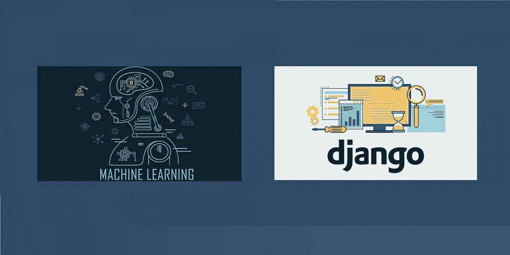

# 使用 Django 开发深度学习 API

> 原文：<https://medium.com/analytics-vidhya/developing-deep-learning-api-using-django-3b9eb6689c14?source=collection_archive---------2----------------------->

我希望你们觉得我的上一篇帖子([将深度学习 Django 应用部署到谷歌云平台](/@akhilh05/deploying-deep-learning-django-app-to-google-cloud-platform-70bab374704c))有用。在这篇文章中，我们将学习使用 Django REST 框架开发深度学习应用程序。如果你想更多地了解姜戈，你可以在这里找到所有的细节。

在本帖中，我们将再次考虑应用程序开发的深度学习模型，其原因…