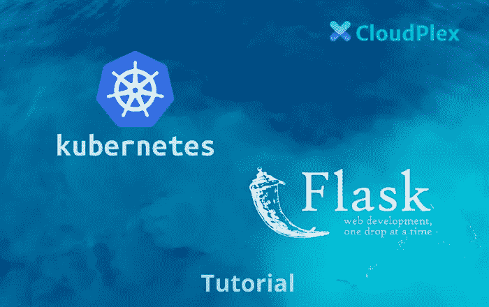
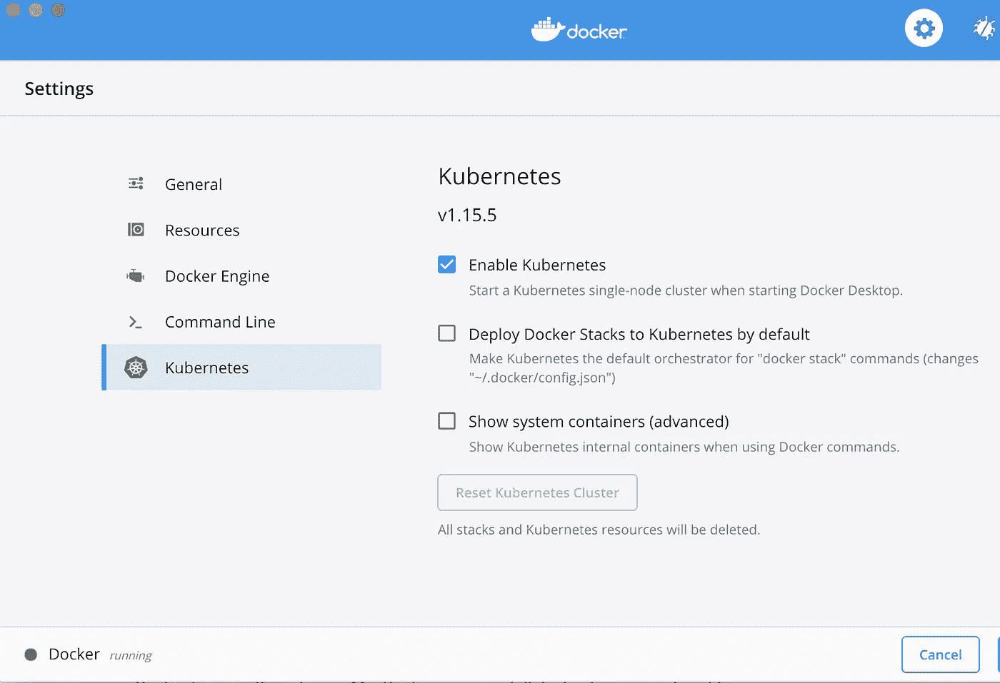

# 在 Kubernetes 上开发、部署和测试 Flask 应用程序—第一部分

> 原文：<https://medium.com/analytics-vidhya/developing-deploying-and-testing-flask-applications-on-kubernetes-part-i-64c24c29cfeb?source=collection_archive---------17----------------------->



# 概观

在这篇逐步介绍如何将 Python Flask 应用程序与 Docker 集成并在 Kubernetes 集群中运行的博文中，我们将讨论以下主题:

*   将现有的 Flask 应用程序归档。
*   使用 docker-compose 部署它。
*   部署到 Kubernetes 集群。
*   检查、测试和缩放

# 要求

在继续之前，请确保您的环境满足这些要求。首先在您的机器上安装以下依赖项。

*   码头工人
*   库伯内特斯
*   饭桶

# 烧瓶应用程序

本文中我们将使用的应用程序是一个简单的 Python 应用程序，它被用作天气 API [OpenWeatherMap](https://samples.openweathermap.org/) 的包装器。该应用程序具有以下 HTTP 端点

*   “/”:这是根路由，它基本上以静态字符串作为响应。此端点可用作应用程序的健康检查。
*   “//”:用于检索给定城市的天气信息的 API 端点。城市和农村都要提供。

完整的应用程序源代码如下所示。应用程序简单地处理请求，并将它们转发给 https://samples.openweathermap.org[的](https://samples.openweathermap.org/)天气 API 端点，然后用从 API 端点检索到的相同数据进行响应。

```
from flask import Flask
import requests

app = Flask(__name__)

API_KEY = "b6907d289e10d714a6e88b30761fae22"

@app.route('/')
def index():
    return 'App Works!'

@app.route('///')
def weather_by_city(country, city):

    url = 'https://samples.openweathermap.org/data/2.5/weather'
    params = dict(
        q=city + "," + country,
        appid= API_KEY,
    )

    response = requests.get(url=url, params=params)
    data = response.json()
    return data

if __name__ == '__main__':
    app.run(host="0.0.0.0", port=5000)
```

# 归档我们的烧瓶申请

编写 python 应用程序的文档是一项简单明了的任务。为此，我们需要将以下文件引入到项目中:

*   需求文件:该文件包含应用程序所需的所有依赖项的列表。例如，我们的应用程序的一个依赖项是 Flask。该文件将用于在 Docker 构建期间安装所有已定义的包。下面是需求文件的内容。

```
certifi==2019.9.11
chardet==3.0.4
Click==7.0
Flask==1.1.1
idna==2.8
itsdangerous==1.1.0
Jinja2==2.10.3
MarkupSafe==1.1.1
requests==2.22.0
urllib3==1.25.7
Werkzeug==0.16.0
```

*   Dockerfile:这个文件包括构建应用程序的 Docker 映像所需的所有 Docker 指令。如以下文件所示，Docker 将执行以下操作来构建 Docker 映像:
*   使用 python:3 作为我们应用程序的基础映像。
*   在映像中创建工作目录，并复制需求文件。(这一步有助于优化 Docker 构建时间。)
*   使用 pip 安装所有依赖项。
*   复制其余的应用程序文件。
*   暴露端口 5000 并为映像设置默认命令(CMD)。

```
FROM python:3
ENV PYTHONUNBUFFERED 1
RUN mkdir /app
WORKDIR /app
COPY requirements.txt /app
RUN pip install --upgrade pip
RUN pip install -r requirements.txt
COPY . /app
EXPOSE 5000
CMD [ "python", "app.py" ]
```

我们现在可以使用下面的命令构建应用程序的 Docker 映像:

```
$> docker build -t weather:v1.0 .
```

# 运行应用程序

我们可以使用 Docker CLI 在本地运行应用程序，如下所示:

```
$> docker run -dit --rm -p 5000:5000 --name weather weather:v1.0
```

或者，我们可以使用 docker-compose 文件来管理本地开发环境中应用程序的构建和部署。例如，下面的合成文件将负责为应用程序构建 Docker 映像并部署它。

```
version: '3.6'
services:
  weather:
    build: .
    ports:
      - "5000:5000"
    volumes:
      - .:/app
```

使用 docker-compose 运行应用程序可以使用:

```
$> docker-compose up
```

应用程序运行后，可以使用 CURL 命令检索伦敦的天气数据，例如:

```
$> curl http://0.0.0.0:5000/london/uk/
```

# Kubernetes 概述

对于生产服务，不建议直接使用 docker 命令甚至 docker-compose 运行服务，因为它不是一个生产就绪的工具。它既不能确保您的应用程序以高可用性模式运行，也不能帮助您扩展您的应用程序。

为了更好地说明最后一点，Compose 仅限于一个 Docker 主机，并且不支持在集群中运行 Docker 服务。

因此，需要使用提供这种羽毛的其他解决方案。最著名和最常用的解决方案之一是 Kubernetes。该工具是一个开源项目，用于自动化容器化应用程序的部署、扩展和管理。它被世界各地的公司和个人广泛使用，原因如下



*   它是免费的:该项目是开源的，由 CNCF 维护。
*   它被谷歌、AWS、微软等大公司采用。
*   有许多云系统提供 Kubernetes 托管服务，如 AWS、Google Cloud 和 DigitalOcean。
*   Kubernetes 社区开发了许多插件和工具来使管理 Kubernetes 变得更加容易和高效。

# 为您的开发环境创建 Kubernetes 集群

Kubernetes 是一个分布式系统，集成了几个组件和二进制文件。这使得构建生产集群具有挑战性，同时在开发环境中运行 Kubernetes 将消耗大部分机器资源。此外，开发人员很难维护本地集群。

这就是为什么真正需要以一种简单流畅的方式在本地运行 Kubernetes。这是一个工具，可以帮助开发人员专注于开发，而不是维护集群。

有几个选项可用于实现这一任务，下面是前三个

*   **Docker for mac:** 如果你有 MacBook，你可以安装 Docker for mac，并从应用程序的配置中启用 Kubernetes，如下图所示。您将在本地部署一个 Kubernetes 集群。


*   [**Microk8s:**](https://github.com/ubuntu/microk8s) 单包完全符合轻量级 Kubernetes，工作于 42 种[风格的 Linux](https://snapcraft.io/microk8s) 。这可以用来在包括 Raspberry Pi 在内的 Linux 系统上本地运行 Kubernetes。可以使用 Snap 命令行在 CentOS 上安装 MicroK8s，如下面的代码片段所示

```
$> sudo yum install epel-release
$> sudo yum install snapd
$> sudo systemctl enable --now snapd.socket
$> sudo ln -s /var/lib/snapd/snap /snap
$> sudo snap install microk8s --classic
```

如果您有不同的 Linux 发行版，您可以在下面的[页面上找到说明。](https://snapcraft.io/microk8s)

*   [**Minikube:**](https://github.com/kubernetes/minikube/) 在 macOS、Linux 和 Windows 上实现本地 Kubernetes 集群，支持大多数 Kubernetes 特性。根据您的操作系统，您可以从这个[页面](https://minikube.sigs.k8s.io/docs/start/)中选择安装 Kubernetes 所需的命令。例如，要在 macOS 上安装并启动应用程序，您可以使用以下命令:

```
$> brew install minikube
$> minikube start
```

一旦安装并运行了 Minikube、Microk8s 或 Docker for Mac，就可以开始使用 Kubernetes 命令行与 Kubernetes 集群进行交互。

上述工具可以很容易地用于引导开发环境，并在本地测试您的 Kubernetes 部署。然而，它们并没有实现 Kubernetes 支持的所有特性，也不是所有的特性都支持多节点集群。

# 结论

Minikube，Microk8s，或者 Docker for Mac 都是本地开发的好工具。但是，对于测试和试运行环境，需要高度可用的集群在类似生产的环境中模拟和测试应用程序。另一方面，为测试环境运行 Kubernetes 集群 24/7 可能非常昂贵。您应该确保仅在需要时运行集群，不再需要时将其关闭，然后在再次需要时重新创建。

[使用 Cloudplex](https://app.cloudplex.io/register?planName=developer-free?ref=blog) ，创建、运行、终止和重新创建集群非常简单。您可以[免费部署您的第一个集群](https://app.cloudplex.io/register?planName=developer-free?ref=blog)。几分钟后，您的集群启动并运行，您可以保存其配置，关闭它，并在需要时重新创建它。

在本系列的第二部分中，我们将介绍如何将我们的应用程序部署到 Kubernetes 测试集群中。我们将为我们的 Flask 应用程序创建 Kubernetes 部署，并使用 Traefik 来管理我们的入口，并将我们的应用程序暴露给外部流量。

阿萨德·法伊兹
创始人兼首席执行官
Cloudplex.io