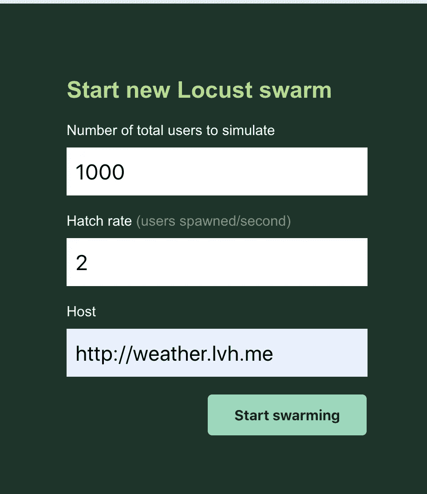
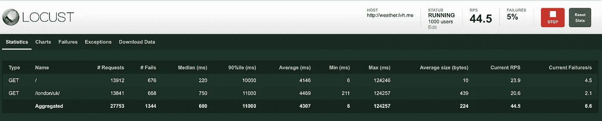
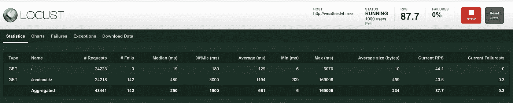

# 在 Kubernetes 上开发、部署和测试 Flask 应用程序—第二部分

> 原文：<https://medium.com/analytics-vidhya/developing-deploying-and-testing-flask-applications-on-kubernetes-part-ii-89438924ed22?source=collection_archive---------21----------------------->


# 概观

在第一篇教程[“在 Kubernetes 上开发、部署和测试 Flask 应用程序-第一部分”](/@asad_5112/developing-deploying-and-testing-flask-applications-on-kubernetes-part-i-64c24c29cfeb)中，我们发现了如何创建本地开发环境。我们已经看到了使用小型集群的利弊。

我们得出了以下结论:Minikube，Microk8s，或者 Docker for Mac 都是很棒的本地开发工具。但是，对于测试和试运行环境，需要高度可用的集群在类似生产的环境中模拟和测试应用程序。

# 为您的测试/生产环境创建 Kubernetes 集群

虽然为测试目的创建一个真正的 Kubernetes 集群似乎是许多开发人员问题的解决方案，但它的成本很高。

降低运行这些环境的成本的一个好主意是实现随需应变的测试环境，一旦您需要部署到测试集群，就可以创建和提供这些环境。每当测试完成后，就可以将环境移走并清理干净。

市场上有几种工具可以用来构建、提供和销毁测试环境。以下是您可以考虑的一些工具:

*   **Terraform:** 是由 HashiCorp 创建的开源基础设施代码软件工具。它使用户能够以描述性的方式配置基础架构组件。
*   **Ansible:** 是一款开源的配置管理和应用部署工具，可用于管理数据中心节点上的软件包和基础设施状态。
*   **Cloudplex:** 使用我们的可视化构建器，您可以[在不到 5 分钟的时间内将一个集群部署到多个云中](https://app.cloudplex.io/register?planName=developer-free?ref=blog)。您可以导出您的群集，然后单击一下即可关闭您的群集。要重新创建同一个集群，您可以导入保存的配置。您的集群已经启动并正在运行。

# 关于 Kubernetes API 和资源的说明

Kubernetes 提供了一个在集群上创建资源的 API，然后它将确保资源总是可用的，并以用户预定义的状态运行。Kubernetes 集群可以创建和管理多种类型的资源，下面是运行我们的应用程序所需的资源列表

*   **部署:**是一个资源对象，负责创建、管理和滚动服务更新。该资源还创建和管理另一种资源类型，即副本集。
*   **ReplicaSet:** 负责维护给定服务的 pod 的已定义复制。
*   **Pod:** 是 Kubernetes 中最小的执行单元，为了简单起见，您可以将这个资源看作一个容器(尽管在某些情况下一个 Pod 可以包含多个容器)
*   **服务:**该资源负责为服务创建接口，并在集群内部或外部公开它们。
*   **入口:**该资源用于定义外部访问集群的规则。

您可以使用 kubectl 命令行检查资源的完整列表:

```
$> kubectl api-resources
```

# 创建 Kubernetes 部署

要在 Kubernetes 集群上部署天气应用程序，我们需要为应用程序所需的每个资源编写资源定义文件。资源定义文件是 YAML 文件，包括创建资源所需的所有属性。

这些文件需要涵盖四个常见的配置部分，如下所示:

**apiVersion:** 描述用于创建资源的 Kubernetes API 版本。
**种类:**描述要创建的资源的类型。
**元数据:**附加关于资源的元信息，如名称或标签。
**规格:**描述资源的规格。

为了运行我们的应用程序，我们在这里需要的第一个资源是 Kubernetes 部署，上面的每个部分都有以下值:

**API version:**apps/v1
种类:部署
元数据:部署名称和标签。
**规格:**包含
**副本的部署对象的规格:**要创建和管理的 Pod 的数量
**选择器:**用于选择由部署管理的 Pod 的条件
**模板:**用于创建 Pod 容器的模板，该模板定义了容器名称、容器 docker 图像和其他选项。

下面的资源文件可用于为天气应用程序创建 Kubernetes 部署

```
apiVersion: apps/v1
kind: Deployment
metadata:
  labels:
    app: weather-api
  name: weather-api
spec:
  replicas: 2
  selector:
    matchLabels:
      app: weather-api-pod
  template:
    metadata:
      labels:
        app: weather-api-pod
    spec:
      containers:
      - name: weather-api
        image: wshihadeh/weather-api-app:latest
        ports:
        - containerPort: 5000
      restartPolicy: Always
```

上述 Kubernetes 部署资源将为我们的服务创建两个 pod，每个都有一个专用的 IP。您可以在 Pods IP 上使用天气 API。但是，不建议这样做，原因如下:

*   如果重新创建 Pod 以进行重新计划，pod IP 将会改变。
*   如果您希望在 pod 之间实现流量负载平衡，您需要使用多个 IP。

由于这些缺点，建议使用服务资源在 Kubernetes 中公开应用程序。该资源为我们提供了一个可用于访问应用程序单元的 IP 地址(它自动对流量进行负载平衡),如果需要，它有助于将应用程序暴露在集群之外。

要为我们的应用程序创建服务资源，我们需要创建另一个包含以下部分的定义文件:

*   **API version:**“v1”
*   **种类:**【服务】
*   **元数据:**服务名和标签。
*   **规格:**服务对象的规格，包括:

1.  **选择器:**用于选择由 Kubernetes 部署管理的 pod 的条件
2.  [**服务类型:**](https://kubernetes.io/docs/concepts/services-networking/service/#publishing-services-service-types) Kubernetes 支持几种[服务类型](https://kubernetes.io/docs/concepts/services-networking/service/#publishing-services-service-types)用于管理内部和外部流量。
3.  **端口:**服务公开的端口。
4.  **目标端口:**吊舱暴露端口。

下面的 YAML 文件显示了服务资源的完整实现，正如您所看到的，它将在端口 8080 上侦听，并将请求转发到端口 5000 上的应用程序 Pods。

```
apiVersion: v1
kind: Service
metadata:
  labels:
    app: weather-api
  name: weather-api-service
spec:
  ports:
  - port: 8080
    targetPort: 5000
  selector:
    app: weather-api-pod
  type: ClusterIP
```

请注意，我们使用了 ClusterIP 服务，这意味着该服务只对集群中的其他应用程序可用。为了对外公开服务，我们需要使用不同的类型，比如 LoadBalancer 或 NodePort。

为集群中的每个应用程序使用这些类型的服务会增加服务管理的开销，并增加运行集群的成本。如果您为我们的每个服务创建一个负载平衡器，成本可能会显著增加。即使在托管的 Kubernetes 中，负载平衡器是由云提供商创建和负责的，但仍然不建议这样做，除非您有一个单独的服务要公开。

另一种方法是在外部公开入口控制器应用程序，并定义管理内部服务流量的入口规则。

# 使用 Traefik 入口

Kubernetes 支持多种入口控制器，可用于管理传入的外部请求。在本帖中，我们将尝试 Traefik。

在 Kubernetes 上运行 Traefik 需要创建几个资源，以便按预期工作。第一步是创建授予 Traefik 对 Kubernetes 的权限所需的资源。它应该能够收集集群中正在运行的应用程序的信息。下面列出了这些资源

*   **ServiceAccount:** 这个资源为在 Pod 中运行的进程提供了一个身份。
*   **ClusterRole:** 该资源定义了代表 Kubernetes 集群的记帐资源权限的规则。
*   **ClusterRoleBinding:** 它将角色绑定到主题，如组、用户或服务帐户。

下面的定义文件包含了上述所有资源。ClusterRole 为集群上的一些资源(如服务、端点和机密)定义了 get、list 和 watch。另一方面，ClusterBindingRole 将创建的 ServiceAccount 与 ClusterRole 链接起来。

```
kind: ClusterRole
apiVersion: rbac.authorization.k8s.io/v1beta1
metadata:
  name: traefik-ingress-controller
rules:
  - apiGroups:
      - ""
    resources:
      - services
      - endpoints
      - secrets
    verbs:
      - get
      - list
      - watch
  - apiGroups:
      - extensions
    resources:
      - ingresses
    verbs:
      - get
      - list
      - watch
  - apiGroups:
      - extensions
    resources:
      - ingresses/status
    verbs:
      - update---
apiVersion: v1
kind: ServiceAccount
metadata:
  name: traefik-ingress-controller---
kind: ClusterRoleBinding
apiVersion: rbac.authorization.k8s.io/v1beta1
metadata:
  name: traefik-ingress-controller
roleRef:
  apiGroup: rbac.authorization.k8s.io
  kind: ClusterRole
  name: traefik-ingress-controller
subjects:
  - kind: ServiceAccount
    name: traefik-ingress-controller
    namespace: default
```

下一步是使用 Kubernetes 部署来部署 Traefik 服务本身，如下面的代码片段所示。将 Kubernetes Ingress 添加到 Traefik 命令行非常重要，如下所示:

```
kind: Deployment
apiVersion: apps/v1
metadata:
  name: traefik
  labels:
    app: traefikspec:
  replicas: 1
  selector:
    matchLabels:
      app: traefik
  template:
    metadata:
      labels:
        app: traefik
    spec:
      serviceAccountName: traefik-ingress-controller
      containers:
        - name: traefik
          image: traefik:v2.2
          args:
            - --log.level=DEBUG
            - --api
            - --api.insecure
            - --entrypoints.web.address=:80
            - --providers.kubernetesingress
          ports:
            - name: web
              containerPort: 80
            - name: admin
              containerPort: 8080
```

为了能够从集群外部访问 Traefik 入口控制器，我们需要为 Traefik 定义一个服务资源，如下所示。

我们使用负载平衡器服务向 Kubernetes 主机公开该服务。公开了两个端口，一个用于托管服务 web 请求，另一个用于 Traefik 管理面板。

```
apiVersion: v1
kind: Service
metadata:
  name: traefik
spec:
  type: LoadBalancer
  selector:
    app: traefik
  ports:
    - protocol: TCP
      port: 80
      name: web
      targetPort: 80
    - protocol: TCP
      port: 8080
      name: admin
      targetPort: 8080
```

最后一步是定义入口规则，该规则将用于将请求从入口控制器转发到天气服务。下面的入口文件根据请求的主机定义了所需的规则。

所有带有主机 weather.lvh.me 的请求都将被转发到天气服务。

请注意，已定义的注释定义了哪些 Traefik 入口点将用于服务请求。

可以使用以下命令之一来部署上面定义的所有资源:

```
$> kubectl apply -f ${file_name}
$> kubectl create -f ${file_name}$> kubectl apply ${k8s_files_directory}
$> kubectl create ${k8s_files_directory}
```

# 让我们在类似生产的集群上运行一个负载测试

测试 web 应用程序的性能是软件生命周期中最关键和最重要的阶段之一:它可以为我们提供在真实用例及已知场景下 web 应用程序性能所需的指标和 KPI，所有这些都是在新版本推出或发布之前完成的。

有几个工具可以用来执行性能测试/用户负载测试，比如 LoadRunner、LoadNinja、Apache JMeter 等等。执行用户负载测试最简单直接的工具之一是 [locust.io.](http://locust.io/) 该工具旨在对 web 应用(或其他资源)进行负载测试，并计算出它可以处理多少并发用户。

我们将对天气应用程序进行基本的用户负载测试。测试用例将覆盖根和天气端点。下面是测试用例文件:

```
from locust import HttpLocust, TaskSet, task, betweenclass WebsiteTasks(TaskSet):
    @task
    def index(self):
        self.client.get("/") @task
    def london(self):
        self.client.get("/london/uk/") class WebsiteUser(HttpLocust):
    task_set = WebsiteTasks
    wait_time = between(5, 15)
```

要开始运行测试，首先，我们需要用下面的命令启动 locust

```
$>  locust -f  test.py
```

下一步是从 Locust UI 开始运行负载测试。为此，使用下面的 URL[http://localhost:8089/](http://localhost:8089/)，并按照屏幕截图所示填写表单。这将启动一个有 1000 个用户的负载测试，孵化率为每秒 2 个用户。



一旦所有 1000 个用户都被加载并并发发送 web 请求，由于服务的高负载，传入的请求可能会开始失败。

下面的截图显示了我们第一次试验的统计数据。误差率为 5%，这是一个相当大的百分比。



将天气服务扩展到 4 个副本后，我们可以用 1000 个用户和相同的孵化率执行相同的负载测试。

```
$> kubectl scale --replicas=4 deployment weather-api
```

如图所示，扩展我们的 Kubernetes 服务极大地提高了应用程序的性能。不仅错误率下降到 0，而且请求的中值和平均响应时间也下降了。



# 结论

本教程中使用的 Flask 代码可以在这个[库](https://github.com/eon01/python-weather-api-example)中找到。在本教程的帮助下，您可以提取相同的存储库，创建 Flask 应用程序，使用 minikube 在本地运行它，创建所需的 Kubernetes 部署和服务，将您的集群部署到 Google Cloud、EKS 或任何其他公共云提供商。最后，您可以使用 Traefik 作为入口控制器，并使用 Locust 对您的集群进行负载测试。

阿萨德·法伊兹
创始人兼首席执行官
Cloudplex.io