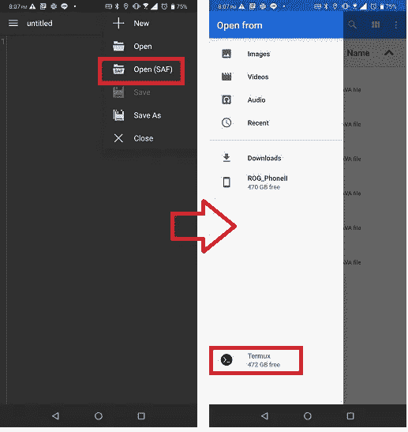
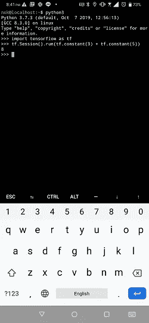

# 在 Android 手机上开发 Tensorflow

> 原文：<https://medium.com/analytics-vidhya/developing-tensorflow-on-android-phone-cfc4297b676e?source=collection_archive---------0----------------------->


我一直在想，我们是否可以安装 Tensorflow，并在我的 android 手机上用人工智能进行编码。我终于让它工作了。所以我想在这里分享我实现它的步骤。

我的设备是华硕 ROG 手机 2。它有 12GB 的内存和 512GB 的存储，足够强大，可以完成许多开发任务…如果我们能找到在其上运行开发生态系统的方法就好了。


第一步是安装 Termux。从谷歌 Play 商店拿就行了。


然后我们会在 Termux 上安装 Ubuntu。我们将在 Ubuntu 中安装所有的东西，因为它们比普通的 Termux 更兼容。Ubuntu 将使用 chroot 运行。

1.  启动 Termux。
2.  确保 Termux 是最新的:`pkg upgrade`
3.  安装 wget 和 proot: `pkg install wget proot`
4.  创建安装 ubuntu 的目录:`mkdir ubuntu && cd ubuntu`
5.  下载 ubuntu chroot 安装脚本:`wget [https://raw.githubusercontent.com/Neo-Oli/termux-ubuntu/master/ubuntu.sh](https://raw.githubusercontent.com/Neo-Oli/termux-ubuntu/master/ubuntu.sh)`
6.  运行安装脚本:`bash ubuntu.sh`

现在，我们可以通过运行脚本来启动 Ubuntu:`./start-ubuntu.sh`

接下来，我们将检查并安装 Ubuntu 映像的更新。

`apt-get update && apt-get upgrade`

安装一些先决条件。

`apt-get install git wget vim zip build-essential python python3 python3-dev python3-pip libhdf5-dev`

> 如果您不想自己从头开始构建 Tensorflow(和 Bazel ),我还在这里提供了构建的 PIP 包:
> 
> [https://drive.google.com/open?id = 1-1am 4 GL 0k 6 u 8 o qpd 39k 4 dydrobtucgh 3](https://drive.google.com/open?id=1-1AM4gl0K6u8OQPd39k4DyDroBTUcGH3)
> 
> 您可以下载并使用 PIP 安装，如下所示:

```
pip3 install tensorflow-1.14.1-cp37-cp37m-linux_aarch64.whl
```

但是，如果您喜欢自己构建它，或者您想使用 Tensorflow 的不同版本，您可以按照下面的指南从源代码构建 Tensorflow。

我们要搭建的 Tensorflow 版本是 1.14。无论如何，这个指南应该也适用于 Tensorflow 的其他版本。您只需要检查哪个版本的 Bazel 将与您的特定版本 Tensorflow 配合使用，并确保下载正确版本的 Bazel。

# **步骤 1:在 Android / Termux 中构建 Bazel**

在开始之前，我建议你在手机上安装一个好的文本/代码编辑器。有几个免费的，但这里有一个最低要求。我们的 Ubuntu 安装在 Termux 数据目录中(将其放在 Termux 数据目录之外会导致文件权限问题，因为 Termux 对其数据目录之外的文件没有完全的访问权限)。通常其他应用程序(文本编辑器)将无法访问 Termux 的数据目录，因为 Android 安全的东西，除非我们根我们的手机。如果我们想在 Ubuntu 中使用文本编辑器编辑文件，这将是个问题。

但是，Android 确实提供了一种访问其他应用程序数据目录中的文件的方法，这种方法被称为 SAF(存储访问框架)。一些文本编辑器应用程序支持它。所以我推荐你安装那些支持的。我在这里列举了其中的一些:

*   https://play.google.com/store/apps/details?[id=com.rhmsoft.edit](https://play.google.com/store/apps/details?id=com.rhmsoft.edit) —这个应用程序支持 SAF 开箱即用。只需使用“打开(SAF)”选项。
*   sublime Text:[https://apk pure . com/sublime-Text-editor-for-Android/com . kibou . sublime](https://apkpure.com/sublime-text-editor-for-android/com.kibou.sublime)——不知何故，这款应用已经不在 Google Playstore 的列表中了。您必须在设置页面中启用 SAF 支持。

使用 SAF，您可以将 Termux 视为另一个驱动器，并可以编辑其数据目录中的文件。



因为 Android 设备不直接支持成熟的 Tensorflow，所以我们需要从源代码中构建它。此外，Tensorflow 需要 Bazel 来编译，而 Bazel 在 Android 中也不受官方支持。因此，我们需要首先从源代码构建 Bazel，然后使用 Bazel 构建 Tensorflow。整个过程可能需要 2 天才能完成。确保你有时间。

在 Termux/Ubuntu 内部，安装 OpenJDK8。巴泽尔需要它。

`apt-get install openjdk-8-jdk`

下载 Bazel 源代码发行版。Tensorflow 的每个版本都需要特定版本的 Bazel 来构建。我们正在构建 Tensorflow 1.14。它需要 Bazel 0.24.1。请注意，您不能从 Bazel 存储库克隆源代码并检出 0.24.1 分支，因为它缺少一些必备模块，例如 Protobuf。源代码分发将包含我们构建 Bazel 所需的所有东西。

`mkdir ~/bazel && cd ~/bazel`

`wget https://github.com/bazelbuild/bazel/releases/download/0.24.1/bazel-0.24.1-dist.zip`

`unzip bazel-0.24.1-dist.zip`

对于 Android，我们需要修改 Bazel 中的一些配置，使其构建成功。首先是增加 JVM 的堆大小。

编辑文件:**script/bootstrap/compile . sh .**

如果在支持 SAF 的情况下使用代码编辑器，它将位于 Termux 数据目录中:

**/Ubuntu/Ubuntu-fs/root/bazel/script/bootstrap/compile . sh**

转到第**行第 130 个**，向 **${JAVAC}** 添加选项，如下所示:

```
run “${JAVAC}” **-verbose -J-Xms1024m -J-Xmx1024m** -classpath …
```

接下来，我们将设置 Bazel 在单个进程中运行，这样我们就不会耗尽手机内存。在 Termux Ubuntu 终端中运行以下命令:

`export EXTRA_BAZEL_ARGS='--jobs 1'`

建造巴泽尔。这个过程可能需要 6 个小时。

`cd ~/bazel`

`./compile.sh`

注意，Bazel 0.24.1 有一个 bug。如果构建失败，您必须删除整个 bazel 目录，并重新开始提取`bazel-0.24.1-dist.zip`的过程。否则，您可能会在第二次运行`./compile.sh`时遇到文件权限错误

构建完成后，将 Bazel 二进制文件复制到系统路径。

`cp ~/bazel/output/bazel /usr/local/bin/`

# 步骤 2:在 Android / Termux 中构建 Tensorflow

克隆 Tensorflow 源代码并检查分支 r1.14。

```
cd ~git clone https://github.com/tensorflow/tensorflow.gitcd tensorflowgit checkout r1.14Install Tensorflow prerequisitespip3 install six numpy wheelpip3 install keras-applications — no-depspip3 install keras-preprocessing — no-deps
```

我们需要对 Tensorflow 源代码应用一些补丁，以使其与 Android 上的 ARM 64 位兼容。您需要的修改如下所示。这些修改主要是使用预处理器开关来避免一些不支持的优化，并禁用 NEON 处理器优化。

> **File:/tensor flow/lite/kernels/internal/depthwiseconv _ quantified _ test . cc**
> 
> 第 167 行:

```
*// This is compiled-in even if dot-product instructions are unavailable.**// However, tests should skip dot-product testing in that case and not**// call this code.*#if defined(__aarch64__) && !defined(GOOGLE_L4T)**// Change this line to the line below:**#if defined(__aarch64__) && !defined(GOOGLE_L4T) && defined(__ANDROID__) && defined(__clang__)
```

> 第 691 行:

```
*void TestOneNeonDot3x3(const TestParam& test_param) {*#if defined(__aarch64__) && !defined(GOOGLE_L4T) **// Change this line to the line below:**#if defined(__aarch64__) && !defined(GOOGLE_L4T) && defined(__ANDROID__) && defined(__clang__)
```

> 第 856 行:

```
*#endif*#if defined(__aarch64__) && !defined(GOOGLE_L4T) **// Change this line to the line below:**#if defined(__aarch64__) && !defined(GOOGLE_L4T) && defined(__ANDROID__) && defined(__clang__)
```

> **File:/tensor flow/lite/kernels/internal/optimized/depthwiseconv _ uint 8 . h**
> 
> 第 2007 行:

```
*// Enable for arm64 except for the Nvidia Linux 4 Tegra (L4T) running on**// Jetson TX-2\. This compiler does not support the offsetof() macro.*#if defined(__aarch64__) && !defined(GOOGLE_L4T) **// Change this line to the line below:**#if defined(__aarch64__) && !defined(GOOGLE_L4T) && defined(__ANDROID__) && defined(__clang__)
```

> **File:/tensor flow/lite/kernels/internal/optimized/depthwiseconv _ uint 8 _ 3x 3 _ filter . h**
> 
> 第 5790 行:

```
*#endif // USE_NEON &&__aarch64__*#if defined(__aarch64__) && !defined(GOOGLE_L4T) **// Change this line to the line below:**#if defined(__aarch64__) && !defined(GOOGLE_L4T) && defined(__ANDROID__) && defined(__clang__)*// Dot product ops hard-coded*
```

> **文件:/第三方/png。构建**
> 
> 第 44 行:

```
**// Remove below lines:**copts = select({ “:windows”: [“-DPNG_INTEL_SSE_OPT=1”], “//conditions:default”: [],}),**// Add below line instead:**copts = [“-DPNG_ARM_NEON_OPT=0”],
```

运行生成配置。

```
cd ~/tensorflow./configure
```

按如下方式回答构建配置(如果下面没有列出问题，则使用默认方式):

```
**Please specify the location of python. :** /usr/bin/python3
**Do you wish to build Tensorflow with XLA JIT support? :** n
```

构建张量流，最多需要一天的时间来完成构建。

```
bazel build — config=opt //tensorflow/tools/pip_package:build_pip_package — jobs 4
```

创建 PIP 包轮文件。

```
bazel-bin/tensorflow/tools/pip_package/build_pip_package /tmp/tensorflow_pkg
```

最后，安装 PIP 包！在这个安装过程中，需要构建一些必需的库。可能需要 1 个小时。

```
cd ~pip3 install /tmp/tensorflow_pkg/tensorflow-1.8.0-cp36-cp36m-linux_aarch64.whl
```

尝试编写一些代码来使用张量流。



仅此而已。在 Android 手机上运行 Tensorflow 无法与在台式机或笔记本电脑上运行 tensor flow 相比。直接从你的手机上训练模型是不实际的。无论如何，对于像我们这样的核心开发人员来说，能够在移动中进行编码、开发和运行一些快速测试或调试，而不必随身携带笔记本电脑，有时是非常方便的。(如果你通读了这个故事，我想你会的)。

运行模型推理从我的经验来看也还不错(嗯，可能取决于你的手机规格)。我可以用这个 Tensorflow 开发代码实时运行 SSD+MobileNetV2 进行对象检测。我以后可能会发布更多关于在 Android 手机上开发 AI 的博客。