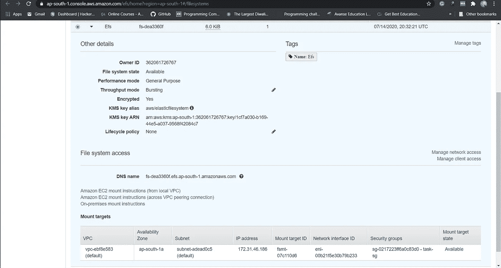
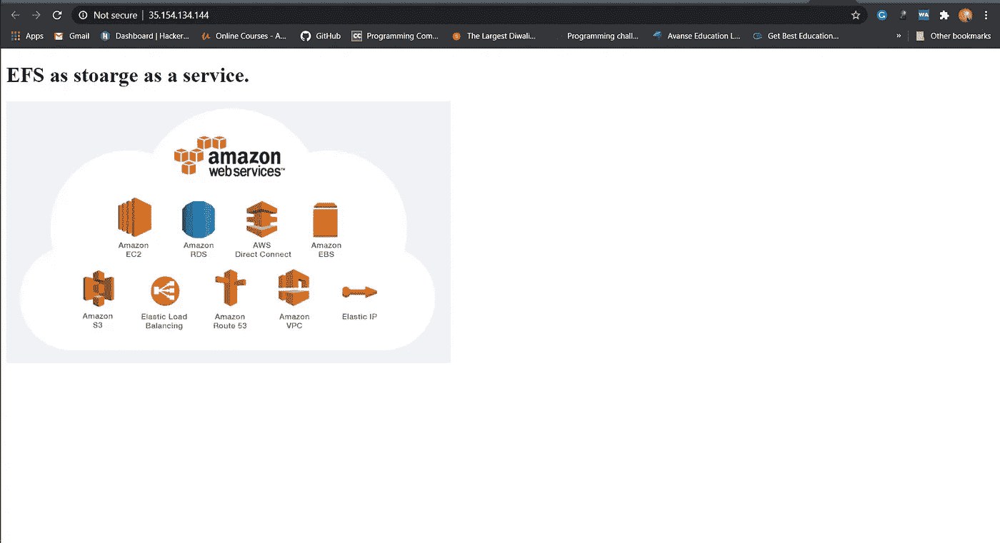

# 使用 EFS 作为存储即服务开发 web 服务器

> 原文：<https://medium.com/analytics-vidhya/developing-webserver-using-efs-as-storage-as-a-service-8654ef86b97b?source=collection_archive---------16----------------------->


## *我们必须做什么？

1.创建一个允许端口 80 的安全组。

2.启动 EC2 实例。

3.在这个 Ec2 实例中，使用我们在步骤 1 中创建的现有密钥或提供的密钥和安全组。

4.使用 EFS 服务启动一个卷并将其附加到您的 vpc 中，然后将该卷挂载到/var/www/html 中。

5.开发人员已经上传到 GitHub 回购代码，回购也有一些图像。

6.将 GitHub repo 代码复制到/var/www/html 中。

7.创建一个 s3 存储桶，将 GitHub repo 中的映像复制/部署到 S3 存储桶中，并将权限更改为 public readable。

8 使用 s3 bucket(包含图像)创建一个 Cloudfront，并使用 Cloudfront URL 更新/var/www/html 中的代码。

> 注意:-
> 
> 除了步骤 4，即创建 EFS 卷并使用 EBS volume 挂载到/var/www/html，您可以在我的上一篇文章(下面的链接)中获得上述任务的所有步骤的详细解释。

[](/@akashdeepg06/automating-aws-cloud-infrastructure-with-terraform-45d9d1160475) [## 使用 Terraform 自动化 AWS 云基础架构

### *我们将要做什么？

medium.com](/@akashdeepg06/automating-aws-cloud-infrastructure-with-terraform-45d9d1160475) 

因此，在解决创建 EFS 卷的部分问题之前，让我们看看什么是 AWS_EFS，以及我们为什么使用而不是 EBS。

> E FS

E FS 是运行任何具有高工作负载、需要可扩展存储并且必须快速产生输出的应用程序的最佳选择。它可以自动扩展，甚至可以应对最突然的工作负载高峰。在高容量存储需求时期过去后，EFS 将自动缩减规模。EFS 可以挂载到不同的 AWS 服务，并且可以从您的所有虚拟机进行访问。使用它来运行共享卷或进行大数据分析。您将始终为您实际使用的存储付费，而不是提前调配存储，这最终会造成浪费。

> 一个马赞 EFS 的好处

P 可扩展以支持任何工作负载的性能:EFS 提供不断变化的工作负载所需的吞吐量。即使对于高达 500，000 IOPS 或每秒 10 GB 的工作负载，它也可以提供与文件系统突然增长相匹配的更高吞吐量。

能源弹性:自动增加或减少你的文件系统存储。删除或添加文件，从不打扰应用程序。一旦创建了 EFS 文件系统，您就可以添加文件，而不必担心存储资源调配。

A 可访问的文件存储:本地服务器和 EC2 实例可以同时访问共享文件系统。EC2 实例还可以通过 VPC 对等访问位于其他 AWS 区域的 EFS 文件系统。

C 全面的托管服务:EFS 是一项完整的托管服务，这意味着您的公司将永远不必修补、部署或维护您的文件系统。

节省成本:您只需为您使用的存储付费，因为没有预先配置、预付费用或承诺。此外，您可以使用[生命周期管理](https://docs.aws.amazon.com/AmazonS3/latest/dev/object-lifecycle-mgmt.html)将一个月未使用的文件转移到更具成本效益的存储类别，这可以降低高达 85%的费用。

T 更强的安全性和合规性:您可以使用当前的安全解决方案安全地访问文件系统，或者使用 [AWS 身份和访问管理(IAM)](https://aws.amazon.com/iam/) 、[亚马逊虚拟私有云(亚马逊 VPC)](https://aws.amazon.com/vpc/) 或 [POSIX](https://docs.aws.amazon.com/redshift/latest/dg/pattern-matching-conditions-posix.html) 权限来控制对 EFS 文件系统的访问。此外，EFS 可以加密您的数据，无论是传输中的还是静态的。这为您提供了可靠的安全性，并使法规遵从性更容易。

> 为什么要用 EFS 而不是 EBS？

虽然 EBS 和 EFS 都提供了出色的功能，但这两种存储解决方案实际上是为两种完全不同的用途而构建的。EBS 卷仅限于单个实例，更重要的是，一次只能由一个实例访问。使用 EFS，您可以让成百上千个实例同时访问文件系统。这使得 AWS EFS 非常适合任何需要良好性能的集中式共享存储的应用，如媒体处理或共享代码库。

您还可以使用 AWS EFS 来提供 web 内容，保存各种备份，并减少存储开支。虽然 EFS 的成本确实高于 EBS(EFS 为每 GB 0.30 美元，而 EBS 为每 GB 0.10 美元)，但您只需为每个 EFS 文件系统支付一次费用。这意味着，如果您附加了十几个实例，您仍将支付相同的金额，就好像您只附加了一个实例一样。使用 EBS 卷，您需要为每卷付费。因此，为了节省存储成本，EFS 有时可以作为 EBS 的替代品。

EFS 随容量一起扩展性能，虽然这在某些情况下非常有益，但也可能是一个严重的缺点。您可能没有足够高的利用率来达到文件系统的预期吞吐量。因为 AWS EBS 为您提供稳定且可预测的性能，EBS 几乎总是更好的选择，除非您需要多个实例同时访问您的存储。

## *解决方案:-

*   正在创建 EFS 卷。

```
# — Creating EFS volumeresource “aws_efs_file_system” “efs” {
 creation_token = “efs”
 performance_mode = “generalPurpose”
 throughput_mode = “bursting”
 encrypted = “true”
 tags = {
 Name = “Efs”
 }
}
```



electrical field stimulation 电场刺激

*   将此 EFS 卷安装到/var/www/html。

```
# — Mounting the EFS volumeresource “aws_efs_mount_target” “efs-mount” {
 depends_on = [
 aws_instance.web_server,
 aws_security_group.sg,
 aws_efs_file_system.efs,
 ]

 file_system_id = “${aws_efs_file_system.efs.id}”
 subnet_id = “${aws_instance.web_server.subnet_id}”
 security_groups = [“${aws_security_group.sg.id}”]

 connection {
 type = “ssh”
 user = “ec2-user”
 private_key = “${tls_private_key.key1.private_key_pem}”
 host = “${aws_instance.web_server.public_ip}”
 }provisioner “remote-exec” {
 inline = [
 “sudo mount ${aws_efs_file_system.efs.id}:/ /var/www/html”,
 “sudo echo ‘${aws_efs_file_system.efs.id}:/ /var/www/html efs defaults,_netdev 0 0’ >> /etc/fstab”,
 “sudo rm -rf /var/www/html/*”,
 “sudo git clone [https://github.com/Akashdeep-47/cloud_task2.git](https://github.com/Akashdeep-47/cloud_task2.git) /var/www/html/”
 ]
 }
}
```

这里，我使用了默认的 vpc 和默认的子网 id。

## *最终结果:-



任务 2 的结果

这个任务的完整代码，请参考我的 Github 库…

[](https://github.com/Akashdeep-47/cloud_task2.git) [## Akashdeep-47/cloud_task2

### 使用 efs 作为存储服务启动 web 服务器。为 Akashdeep-47/cloud_task2 的开发做出贡献

github.com](https://github.com/Akashdeep-47/cloud_task2.git) 

## 请随意给些建议

热烈欢迎所有的叉子和拍手。

> 感谢您抽出宝贵的时间阅读本文。