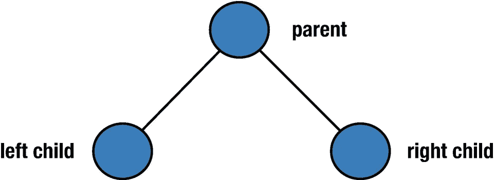
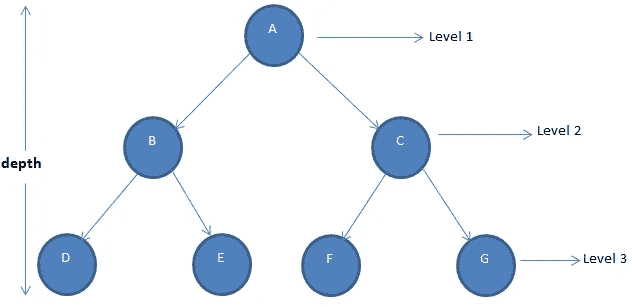
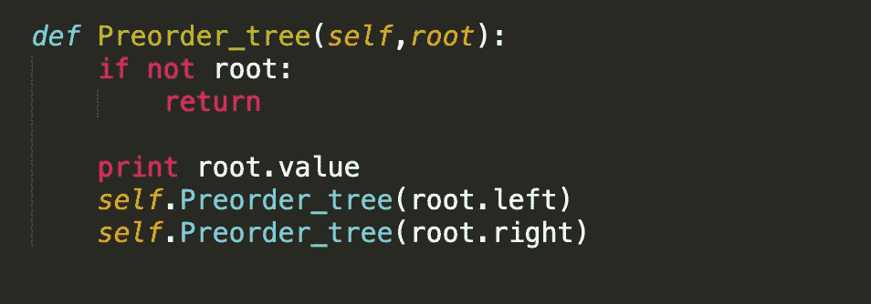
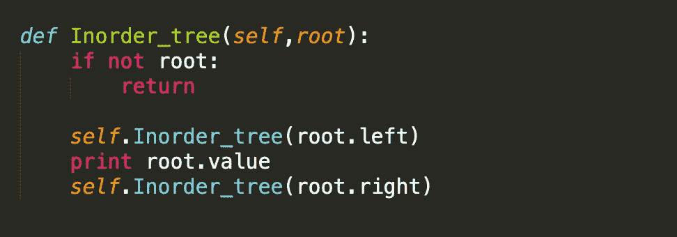
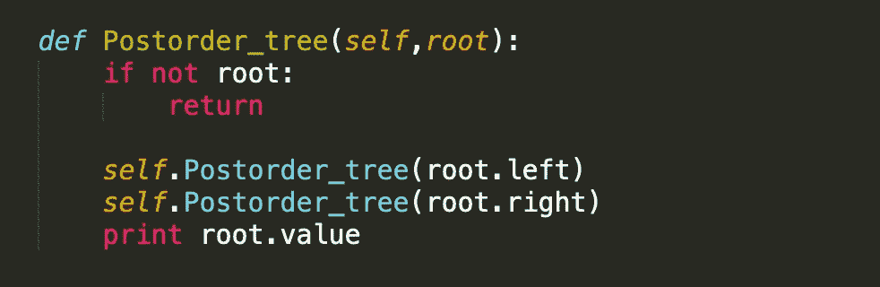

# 二叉树中的 DFS

> 原文：<https://medium.com/analytics-vidhya/dfs-in-binary-tree-c44715d09480?source=collection_archive---------18----------------------->

> 为了理解二叉树中的深度优先搜索，我们首先需要知道它为什么被称为深度优先搜索。

二叉树是承载数据的节点的分层表示。每个节点包含三个字段，一个用于存储我们最终要传递的值，另外两个字段存储左右子节点的地址。

就像每个层次结构一样，树也有一个参考点。我们称之为**根**，是树的最顶端节点，没有父节点。在二叉树中，根最多有两个子节点。

如果你已经注意到了，树不是线性数据结构，我们不能像在线性数据结构(数组、列表、堆栈)中那样通过索引来访问节点。

*那么，我们将如何探索这个看起来复杂的结构呢？*

*在这里，树遍历算法来拯救。我们主要使用两种技术来遍历二叉树。*

> 深度优先搜索
> 
> 横向优先搜索

**顾名思义，DFS 通过递归地深入遍历树，直到可以遍历为止，然后回溯到先前访问过的节点。而 BFS 一层一层地遍历树。**

想象一下，你在一个迷宫游戏中，你选择一条路，标记你走过的那条路，这样你就不会走第二遍，探索直到你找到终点。一旦你到达终点，你回到先前走过的路，从那一点开始探索，重复这个过程直到你找到出口。

嗯，DFS 的工作方式完全一样。

树中有三种类型的 DFS

*   **预订**
*   **为了**
*   **后序**

## 预定:-父→左→右

## 顺序:-左→父→右

## 后序:-左→右→父

正如你在上面注意到的，我们写了三个略有不同的方法。在第一种情况下，我们检查父节点是否存在，如果存在，我们打印当前节点数据。然后，我们进入第二步，递归地调用左边的孩子，直到没有左边的孩子。一旦我们到达那个点，我们移动到父节点的右边，并遵循同样的程序。

在第二种情况下，我们首先探索父节点的左侧，一旦我们到达端点，函数打印当前节点数据并移向右边的子节点。

在后序中也会发生类似的情况，这里我们首先研究了左右子节点，然后再回到父节点。

感谢您阅读本文，希望您喜欢。