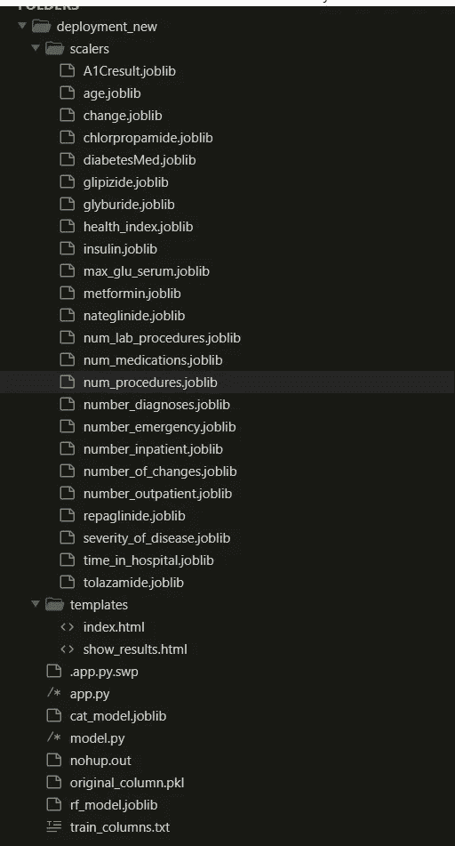

# 1999 年至 2008 年美国 130 家医院的糖尿病。

> 原文：<https://medium.com/analytics-vidhya/diabetes-130-us-hospitals-for-years-1999-2008-e18d69beea4d?source=collection_archive---------1----------------------->

*我们能预测患者是否会再次入院吗？？*


糖尿病

在这篇博客中，我将解释我如何创建机器学习模型，该模型可以使用 130 家美国医院的糖尿病数据集预测患者在 30 天内是否会再次入院。

# 目录:

*   引言。
*   业务问题和限制。
*   数据概述和 ML 公式。
*   绩效指标。
*   数据预处理。
*   特征工程和使用领域知识。
*   探索性数据分析。
*   EDE 与特征工程概述。
*   训练不同的模型。
*   车型对比。
*   模型部署
*   结论。
*   未来的工作。
*   未来连接的配置文件。
*   参考文献。

# 1.介绍

糖尿病是一种慢性疾病，患者体内的血糖水平持续升高。糖尿病受身高、种族、性别、年龄的影响，但一个主要原因被认为是糖浓度。目前对一个大型临床数据库的分析是为了检查美国医院收治的糖尿病患者的糖尿病治疗的历史模式，并为可能改善患者安全性的未来方向提供信息。减少早期再住院是旨在提高医疗质量的政策重点。在这个案例研究中，我们将看到机器学习如何帮助我们解决因重新入院而导致的问题。

# 2.业务问题和限制

据估计，美国 9.3%的人口患有糖尿病，其中 28%未确诊。糖尿病患者 30 天再入院率为 14.4 ~ 22.7%。出院后超过 30 天的再入院率估计甚至更高，超过 26 %的糖尿病患者在 3 个月内再入院，30 %在 1 年内再入院。在美国，与糖尿病患者住院治疗相关的费用为 1240 亿美元，其中估计 250 亿美元可归因于 30 天的再入院，假设再入院率为 20 %。因此，减少糖尿病患者 30 天的再入院有可能大大降低医疗成本，同时改善护理。

# 约束条件:

*   在医疗保健领域，可解释性一直很重要。如果模型预测到一些患者会再次入院，但无法解释为什么会得出这一结论，医生将对此类决定一无所知，而且医生也无法告诉患者他为什么需要再次入院。实际上，这将给医生和患者带来诸多不便。
*   `Latency is not strictly important`大多数医疗保健相关应用都不依赖于延迟。
*   如果不需要再次入院的患者同意再次入院，这将给患者带来经济负担。如果患者需要再次入院，但模型说“不允许再次入院”，那么这将导致医院的再次入院成本，因此，误诊率应尽可能低。

# 3.数据概述和 ML 公式


Dibetis Kaggle 数据集

健康事实数据库(Cerner Corporation，Kansas City，MO)，一个全国性的数据仓库，收集美国各医院的综合临床记录。实际的数据库包含所有患者的数据，但特别是我想处理与糖尿病相关的数据，所以我使用了使用下面提到的五个标准过滤的数据，这些数据可在 UCI 机器学习资源库链接中获得:[数据链接](https://archive.ics.uci.edu/ml/datasets/diabetes+130-us+hospitals+for+years+1999-2008)

*   这是住院病人的遭遇(住院)
*   这是一次“糖尿病”遭遇，也就是说，在此期间，任何类型的糖尿病都被输入系统作为诊断。
*   停留时间最少为 1 天，最多为 14 天。
*   遭遇期间进行了实验室测试。
*   在遭遇期间进行了药物治疗。发现近 10 万条记录满足上述五个标准，数据集有 55 个特征，如性别、体重、遭遇 id、再次入院。数据集可用于分类和聚类任务。我将用它来预测患者是否会在 30 天内再次入院。这是一项分类任务。

这里我们提供了每个特性的简短描述。

*   **遭遇 ID** 遭遇的唯一标识符
*   **患者编号**患者的唯一标识符
*   **种族**价值观:高加索人、亚洲人、非裔美国人、西班牙人和其他人
*   **性别**值:男性、女性、未知/无效
*   **年龄**以 10 年为间隔分组:0，10)，10，20)，…，90，100)
*   **重量**重量单位为磅
*   **入院类型**对应 9 个不同值的整数标识符，例如，急诊、紧急、择期、新生儿和不可用
*   **出院处置**对应 29 个不同值的整数标识符，例如，出院回家、过期、不可用
*   **入院来源**对应于 21 个不同值的整数标识符，例如，医生转诊、急诊室和转院
*   **住院时间**入院和出院之间的整数天
*   **付款人代码**对应 23 个不同值的整数标识符，例如，蓝十字/蓝盾、医疗保险和自费医疗保险
*   **医疗专业**入院医生专业的整数标识符，对应 84 个不同的值，例如，心脏病学、内科、家庭/全科和外科医生
*   **实验室程序数量**遭遇战期间进行的实验室测试数量
*   **程序数量**在遭遇中执行的程序的数字数量(除了实验室测试)
*   **药物数量**遭遇期间使用的不同通用名的数量
*   **门诊人次**患者在就诊前一年的门诊人次
*   **急诊次数**患者在就诊前一年的急诊次数
*   **住院人次**患者在就诊前一年的住院人次
*   **诊断 1** 主要诊断(编码为 ICD9 的前三位)；848 个不同的值
*   **诊断 2** 二级诊断(编码为 ICD9 的前三位)；923 个不同的值
*   **诊断 3** 附加二级诊断(编码为 ICD9 的前三位)；954 个不同的值
*   **诊断数量**输入系统的诊断数量为 0%
*   **葡萄糖血清测试结果**表示结果的范围或是否未进行测试。值:"> 200 "，"  300 "，"正常"，如果没有测量则为"无"
*   **A1c 测试结果**表示结果的范围或是否未进行测试。值:如果结果大于 8%，则为“>8”；如果结果大于 7%但小于 8%，则为“>7”；如果结果小于 7%，则为“正常”；如果未测量，则为“无”。
*   **药物变更**表示糖尿病药物(剂量或通用名)是否有变更。价值观:“改变”和“不改变”
*   **糖尿病药物**显示是否开有任何糖尿病药物。值:“是”和“否”
*   24 种不同的药物。
*   **再入院**天为住院患者再入院。值:如果患者在 30 天内再次入院，则为“❤0”；如果患者在 30 天以上再次入院，则为“30”；如果没有再次入院记录，则为“否”

# 4.性能指标

我们的任务是一个分类问题，因此我们可以使用性能指标，如*精确度、召回率、准确度*和 *F1 得分。*

## 1)精度:

精度为(TP/TP+FP)其中 TP 为真阳性，FP 为假阳性，我们可以将精度视为模型预测为阳性的所有点中有多少点确实是阳性点。当误报成本很高时，精确度是一个很好的衡量标准，在我们的案例研究中就是这种情况。对于不需要再次入院的患者，如果我们的模型预测患者需要再次入院，这是假阳性的，那么医院将让该患者留在医院，这增加了住院成本。

## 2)回忆:

召回率为(TP/TP + FN)其中 TP 为真阳性，FN 为假阴性，我们可以将召回率视为实际为阳性的所有点中有多少点被模型预测为阳性。当假阴性成本很高时使用召回，这里的情况就是如此。对于需要再次入院的患者，如果模型预测不需要，那么医院会让他出院，但患者最终会再次入院，这增加了成本。

## 3)谐波 _ F1 _ 分数:

如上所述，我们知道假阴性成本和假阳性成本对我们来说都很重要，因此如果我们有一个将两者结合起来的衡量标准，那将是一件好事。F1-score 对我们来说也是如此；它将查全率和查准率结合成一个等式。

> F1_score = (2 *精度*召回)/(精度+召回)

在我们的案例中存在不平衡数据的问题。经过仔细分析，我们发现微观的、宏观的 F1 分数对于处理不平衡的数据是没有用的。精度和召回率调和平均被用来处理精度和召回率之间的折衷。这里，我们处于相同的情况，我们希望对应于多数类的 F1_score 不应该支配我们的性能度量，因此我们可以考虑取各个类的 F1 _ score 的调和平均值。

> harmonic _ F1 _ score =(2 * F1 _ class 0 * F1 _ class 1)/(F1 _ class 0+F1 _ class 1)

## 4)AUC:

使用单个阈值来计算正常精度和召回率。这个单一的阈值可能不能正确地对所有的点进行分类。AUC 只不过是 ROC 曲线下的面积，ROC 曲线是通过计算 FPR 和 TPR 并将它们分别放在 x 和 y 轴上而绘制的。因此，AUC 在计算 FPR 和 TPR 列表时采用了所有可能的阈值，从而向我们揭示了该模型的真正威力。

# 5.数据预处理

首先让我们导入所有必需的库，

数据存储在驱动器中的“糖尿病数据. csv”文件中，让我们使用 pandas.read_csv 方法读取它。


## 1.年龄特征:

年龄的值给定为[0–10]，[10–20]，[20–30]年龄特征不是分类的，而是顺序的，因此我们应该将其转换为数字，并将其视为数字特征。我们正在将年龄特征转换为数字特征，如下所示:

[0–10) → 5, [10–20) → 15, [20–30) — -> 25

## 2.处理重复记录:

我们发现，对于某些患者，数据集中有许多条目，这些重复条目对解决任务没有帮助，因此我们删除了这些条目。

## 3.转换和合并成更少的类别:

我们执行了一些转换，如 UP → 10，Down → -10。同样，我们还将类似的类别合并为单个类别，如入院来源 id [2，3] → 1，[5，6，10，22，25] → 4。这些转换和合并过程是不言自明的，您可以通过下面的代码片段来理解转换和合并过程。

## 4.处理缺失值:

此数据集中缺少的值用“？”表示。只有极少数列有缺失值。这些是，

> 种族'，'体重'，'付款人 _ 代码'，'医疗 _ 专业'，'诊断 _1 '，'诊断 _2 '，'诊断 _3 '


我们可以看到权重特征有许多缺失值，所以我们选择删除它，对于 diag_1、diag_2、diag_3，我们使用最常见的值来填充缺失值。

```
diag_1 = Counter(list(data[‘diag_1’])).most_common(1)[0][0]
diag_2 = Counter(list(data[‘diag_2’])).most_common(1)[0][0]
diag_3 = Counter(list(data[‘diag_3’])).most_common(1)[0][0]data[‘diag_1’] = data[‘diag_1’].apply(lambda x : diag_1 if x == ‘?’ else x)
data[‘diag_2’] = data[‘diag_1’].apply(lambda x : diag_2 if x == ‘?’ else x)
data[‘diag_3’] = data[‘diag_3’].apply(lambda x : diag_3 if x == ‘?’ else x)
```

为了填充 medical_specialty 的缺失值，我们创建了新的类别“缺失”和“种族”特征的缺失值通过使用模型插补来填充。我们用五个类训练了一个随机森林模型，

> 西班牙裔'，'亚裔'，'高加索人'，'其他'，'非裔美国人'

我们保留了对应于种族值= '？'的行作为测试集，在训练 RF 模型时，还保留了“重新接纳”类别标签作为特征之一。训练之后，我们将测试数据输入到模型中，并得到了比赛标签。

# 6.特征工程和使用领域知识。

## 6.1)利用医学专业领域知识:

经过研究，我们发现医疗专业是一个重要的功能，但是它有太多不同的值，所以当我们应用一个热编码时，它会不必要地创建许多功能。为了将他们分成更小数量的类别，我们使用了基于频率的方法和领域知识，像所有类型的外科医生都应该放在“外科医生”类别下。我们未能对以下医疗专业进行分组，因此我们将它们归入“未分组”类别。

*   内分泌学→腺体、胃肠病学→胃、妇科→女性生殖系统、血液学→血液
*   血液学/肿瘤学→血液，住院医师→照顾入院患者的人，肿瘤学→癌症，眼科→眼，耳鼻喉科→耳，鼻，喉
*   肺科→呼吸科、放射科——使用医学成像(放射学)程序(检查/测试)如 x 光来诊断和治疗损伤和疾病

## 6.2)使用关于诊断 1、诊断 2 和诊断 3 的领域知识:

diag_1、diag_2、diag_3 是分类特征，但是这些特征具有许多唯一的值。如果我们直接应用一个热编码，它将产生许多特征，最终将引发“维数灾难”问题。我们将使用描述文件中提供的领域知识来创建更少的类别。

1.循环系统→390–459，785 →循环系统疾病
2。呼吸→460–519，786 →呼吸系统疾病
3。消化→520–579，787 →消化系统疾病
4。糖尿病→ 250.xx →糖尿病
5。伤害→800–999→伤害和中毒
6。肌肉骨骼→710–739→肌肉骨骼系统和结缔组织疾病
7。泌尿生殖系统→580–629，788 →泌尿生殖系统疾病
8。肿瘤→140–239→肿瘤
9。怀孕→630–679→妊娠、分娩和产褥期并发症
10。其他的

我们将怀孕作为一个类别添加到原始描述文件中，并将其保存在“其他”类别中，但从研究中我们发现，怀孕会产生独特类型的糖尿病，因此将其作为单独的类别是有意义的。

## 6.3)创建新特征:

我们删除了一些特征，如“遭遇 id”、“患者编号”、“付款人代码”和“体重”，它们在我们的分析中并不重要。

## 3.1)健康指数:

如果一个人去医院的频率很高，那么我们可以认为这个人不太健康，不太健康的病人往往会很快再次入院。让我们创建健康指数变量。健康指数越高，患者再次入院的机会越小(间接比例)

> 健康指数= ( 1 /(急诊人数+住院人数+门诊人数) )

## 3.2)疾病的严重程度

如果患者在医院呆了很长时间，并经历了许多复杂的测试，那么疾病的严重程度就很高，因此，让我们创建疾病的严重程度作为特征之一。为了得到概率解释，让它除以总值。

> 疾病严重程度=(住院时间+手术次数+药物治疗次数+实验室手术次数+诊断次数)

## 3.3)变更次数

研究发现，不断经历药物比例变化(上升/下降)的患者往往会再次入院，因此我们设计了一个名为“变化次数”的新变量。这反映了比例发生变化的药物的数量。我们对每个病人都进行了计算。

## 6.4)使用卡方检验去除最不重要的分类特征:

*   卡方检验用于检验两个分类特征是否有某种关系。在这里，我们希望特征与类标签有一些关系，如果一些特征与类标签没有关系，那么移除它们是有意义的。卡方在内部执行假设检验，并给出 p 值，使用该 p 值，我们可以删除一些不重要的特征。我们将显著性水平/alpha 保持为 0.4，也就是说，如果有超过 60%的可能性该特征是重要的，那么只有我们将该特征保留在我们的最终特征集中。

```
categorical_features = [‘gender’, ‘admission_type_id’, ‘discharge_disposition_id’, ‘admission_source_id’, ‘medical_specialty’, ‘diag_1’, ‘diag_2’, ‘diag_3’, ‘readmitted’]
```

## 6.5)使用 Spearman 相关系数移除最不重要的数字特征

*   让我们使用 Spearman 相关系数来检查数字特征和重新接纳列是相关的还是独立的。如果发现一些特征与重新接纳无关，我们将简单地删除它们。
*   我们发现相关性总是接近于零，但是，Spearman 没有捕捉到非线性关系，因此，我们将使用 p 值而不是相关系数来获得“拒绝的特征列表”,这里假设检验是在假设变量独立时进行的。让我们将显著性水平/alpha 设置为 0.4。现在，我们可以通过声明 p 值> alpha 的要素在统计上独立于类别标签“重新允许”来移除它们。

```
numeric_features = [‘age’,’time_in_hospital’, ‘num_lab_procedures’, ‘num_procedures’, ‘num_medications’, ‘number_outpatient’, ‘number_emergency’, ‘number_inpatient’, ‘number_diagnoses’, ‘health_index’, ‘severity_of_disease’, ‘number_of_changes’, ‘A1Cresult’,‘max_glu_serum’,‘metformin’,’repaglinide’,’nateglinide’,’chlorpropamide’,’glimepiride’,’acetohexamide’,‘glipizide’,’glyburide’,’tolbutamide’,’pioglitazone’,’rosiglitazone’,’acarbose’,’miglitol’,‘troglitazone’,’tolazamide’,’examide’,’citoglipton’,’insulin’,’glyburide-metformin’,’glipizide-metformin’,‘glimepiride-pioglitazone’,’metformin-rosiglitazone’,’metformin-pioglitazone’, ‘change’, ‘diabetesMed’]
```

这是我们将保留以构建模型的最终功能列表:

```
[‘gender’, ‘age’, ‘admission_type_id’, ‘discharge_disposition_id’, ‘admission_source_id’, ‘time_in_hospital’, ‘medical_specialty’, ‘num_lab_procedures’, ‘num_procedures’, ‘num_medications’, ‘number_outpatient’, ‘number_emergency’, ‘number_inpatient’, ‘diag_1’, ‘diag_2’, ‘diag_3’, ‘number_diagnoses’, ‘max_glu_serum’, ‘A1Cresult’, ‘metformin’, ‘repaglinide’, ‘nateglinide’, ‘chlorpropamide’, ‘glipizide’, ‘glyburide’, ‘tolazamide’, ‘insulin’, ‘change’, ‘diabetesMed’, ‘race’, ‘health_index’, ‘severity_of_disease’, ‘number_of_changes’]
```

# 7.探索性数据分析

## 1.不平衡的数据:

从图中我们可以清楚地看到，我们有 91.2%的数据点属于 0 类，其余属于 1 类。我们有数据不平衡的问题。


## 2.出院处置 ID:

从图表中可以清楚地看出，如果出院处置 id 为 18，患者将不会再次入院。


## 3.录取来源 ID:

大多数再次入院的患者的入院来源为 1，因此如果某个患者的来源 id 为 1，他更有可能再次入院。


## 4.糖尿病药物:

该特征告知患者是否服用了糖尿病药物。在我们的数据集中，服用糖尿病药物并“再次入院”的患者数量几乎与服用糖尿病药物并“未再次入院”的患者数量相同。但是，通过与其他功能交互，糖尿病医学可能会揭示许多对给定任务有用的信息。


## 5.实验室程序的数量:

再次入院和未再次入院患者的实验室程序分配号完全相同。但是它有很高的方差。高方差特征被认为是信息丰富的特征。


## 6.在变化和糖尿病之间:

从饼状图可以清楚地看出，如果患者的药物治疗没有变化，并且没有服用任何糖尿病药物，那么他比服用了糖尿病药物但药物治疗没有变化的患者有更多的机会再次入院。


## 7.在住院时间和年龄之间:

大多数病人年龄较大。再次入院的患者年龄较大，住院时间较长。未再次入院的患者住院时间减少。


## 8.年龄和人数之间 _ 住院患者:

越年轻的人越倾向于住院。对于[20-30]年龄组，再次入院的患者具有较高的住院特征值


## 9.在入院来源标识和变更之间:

从饼图中我们可以推断，如果有源 id = 4 患者，且变化特征的值为“否”，那么该患者比入院 id 为[1，9]的患者有更少的再次入院的机会，并且没有变化。


## 10.特征子集之间的配对图:

从图中我们可以清楚地看到，这个问题是严格非线性的，因为+ve 和-ve 数据点像疯了一样混杂在一起。只有复杂的非线性函数才能解决仅考虑两个特征时的问题。如果我们希望它使用两个特征来解决它，我们必须进行数学变换，希望它可以将决策边界从复杂的非线性函数转换为线性函数。


# 8.EDA 与特征工程综述

*   从 EDA 中我们了解到，实验室程序的数量、糖尿病药物治疗、入院等功能在我们的任务中非常重要。像“变化+糖尿病”、“年龄+住院时间”、“年龄+不耐烦次数”和“变化+入院来源 id”这样的特征组合可以给我们提供许多在给定任务中有帮助的信息。
*   我们尝试了基于模型的插补来填充缺失值，但发现应使用基于模型的方法来插补具有非常少的不同值的特征，因此我们使用基于模型的插补来仅填充种族特征的缺失值。
*   在 change、insulin 等列的特征工程中，我们没有稳定的值，但是经过实验，我们发现将它们转换成数字是个好主意。
*   首先，我们保持分类值不变，但使用这种方法，我们得到了非常低的 AUC，因此，我们使用领域知识来减少分类特征的不同类别，这实际上提高了准确性。
*   开始时，我们包含了所有的特性，而大多数特性对于给定的任务并不重要。因此，我们使用皮尔逊相关系数和卡方检验来消除不必要的特征，这提高了我们的模型的准确性。

# 9.培训不同的模型:

为了处理不平衡的数据，我们尝试了不同的技术，如欠采样，过采样，SMOTE。我们还尝试结合 SMOTE 和过采样。我们观察到“过采样技术”与其他技术相比表现良好。我们培训了大约 8 到 10 个不同的模型，这里我们将只展示表现良好的前 4 个模型。对于所有模型，我们保持训练数据大小= 0.8，有效数据大小= 0.1，测试数据大小= 0.1，除了完全遵循不同方法的定制集合模型。我不会解释“模型的工作”和“每个超参数的含义”，你可以在模型的官方文档中读到它们。

## 9.1)逻辑回归:

*   调整线性回归模型

*   设置最佳超参数:

*   结果:

```
AUC_LR = 0.6534044933934898 
F1_POS = 0.22583926754832148 F1_NEG = 0.7950444384594667 HARMONIC_F1_LR = 0.3517584864826567
```

## 9.2)定制 Ensembler 型号:

*   将整个数据集分为训练和测试(80–20)
*   80%的火车集合，我们把它分成 D1 和 D2。(50–50).现在，在 d1，通过替换取样，我们创建了 D1、d2、d3…dk(k 个样本)。然后，我们创建了“k”个模型，并对每个模型进行了训练，如模型 1 将在 d1 样本上进行训练，模型 2 将在 d2 样本上进行训练，等等。
*   在将 D2 集传递给这 k 个模型中的每一个之后，我们将从这 k 个模型中的每一个中获得对 D2 的 k 个预测。
*   使用这 k 个预测，我们创建了一个新的数据集(转换的 D2)，对于 D2，我们已经知道它的相应目标值，所以我们用这 k 个预测训练了一个元模型。
*   现在，对于模型评估，我们使用了我们保留的 20%的数据作为测试集。
*   我们针对基础模型的数量和每个子数据集中的样本数量(d1，d2，..) .调整后，我们得到 n = 95，样本数= 5000 为最佳值
*   设置最佳超参数:

*   结果

```
AUC_CE = 0.6401524560504123 
F1_POS = 0.23093156466686765 F1_NEG = 0.8567899848425309 HARMONIC_F1_CE = 0.3638060712869564
```

## 9.3)催化增强:

*   调整 CatBoost 模型

*   设置最佳超参数

*   结果

```
AUC_CAT = 0.650942309050603 
F1_POS = 0.22088068181818182 F1_NEG = 0.8053584102200142 HARMONIC_F1_CAT = 0.3466796697524027
```

*   特性重要性:这里我们只显示了对 CatBoost 模型非常重要的前 10 个特性。


## 9.4)随机森林:

*   调谐 RF 模型

*   设置最佳超参数

*   结果

```
AUC_RF = 0.6633526103243218 
F1_POS = 0.23723723723723722 F1_NEG = 0.8221288515406163 Harmonic_F1_RF = 0.36821940867963326
```

# 10.模型比较

从图中我们可以清楚地看到，随机森林和自定义系综都给出了非常好的调和 F1 分数。我们可以看到决策树的表现比所有其他模型都差。Logistic 回归、AdaBoost、CatBoost 的表现非常相似。


# 11.模型部署

人们经常忽略这一步，但它是数据科学生命周期中的重要一步。我将使用 Flask 和 AWS EC2 实例部署模型。

先决条件:

*   关于 AWS EC2 实例的知识
*   蟒蛇皮烧瓶
*   HTML，CSS，JavaScript
*   Linux 命令，如 ssh、scp

文件的结构



文件结构

scalers 文件夹、original_column.pkl、rf_model.joblib、train_columns.txt 和 cat_model.joblib 是保存的不同模型的参数，需要这些参数来缩放特征和预测最终结果。

需要将所有 html 相关文件保存在模板文件夹中。index.html 文件将提供包含年龄、胰岛素、医学专业、性别等字段表单。填写信息后，用户可以点击“提交预测”按钮查看预测。如果跳过一些值，它将采用默认值。


重新入院表格

表单中提供的值将被发送到调用“def final_prediction”函数的 flask api 的“/predict”路径。此函数使用 request.form.get('age ')方法收集数据并创建 dataframe。一旦数据以“数据帧”的形式可用，final_prediction 将使用已保存的参数(在 cat_model.joblib 等文件中)来预测结果，并将类别标签发送到“show_result.html”文件。

show_result.html 文件根据类别标签打印“患者将不会再次入院！！!"或“提醒患者将再次入院！！！!"


预言；预测；预告

在 AWS 端，首先需要创建“ubuntu server”的免费 ec2 实例并启动它。确保您在安全组中将入站规则设置为“所有流量”、“所有端口”。你的应用需要低延迟。避免在“final_prediction”函数中重新加载已保存的权重。读取函数外的所有文件，否则会导致不良行为。

成功创建 EC2 实例并与实例连接后，使用以下命令。

```
ssh -i "deployment.pem" ubuntu@ec2-3-21-156-107.us-east-2.compute.amazonaws.com
```

使用以下命令复制实例上的 deployment_new 文件夹:

```
scp -i "deployment.pem" -r deployment_new [ubuntu@ec2-3-21-156-107.us-east-2.compute.amazonaws.com](mailto:ubuntu@ec2-3-21-156-107.us-east-2.compute.amazonaws.com):~/deployment_new
```

这个 EC2 实例可能没有运行 app.py 文件所需的所有库。使用 pip3 install <library name="">命令安装所有所需的库。最后要运行 app use below 命令，</library>

```
nohup python3 app.py &
```

下面是我的 app 的链接你可以试试用:[http://Ubuntu @ ec2-3-21-156-107 . us-east-2 . compute . Amazon AWS . com:8080/index](http://ubuntu@ec2-3-21-156-107.us-east-2.compute.amazonaws.com:8080/index)

# 12.结论

在调整大量模型后，我们能够实现 0.368 的最高谐波 F1 分数和 0.66 的最高 AUC。我们个人发现 SMOTE 在处理职业不平衡问题上表现不佳，因此我们避免使用它。我希望这个案例研究能够帮助您更好地理解医疗保健领域的数据，以及如何在类别不平衡问题普遍存在的医疗保健领域使用机器学习。

# 13.未来的工作

正如我已经说过的，可解释性非常重要，你可以尝试 ELI5，SHAP (Shapely Additive 解释)，LIME(Local interpretable Model Agnostic 解释)来获得可解释性。在这篇博客中，我更关注经典的机器学习算法，像 RNN，CNN，MLP 这样的深度学习算法也可以实现。在特征工程中，我已经实现了基本的技术，但还有很大的空间去冒险使用高级技术，如多项式核、RBF 核、特征的数学变换。

# 14.未来连接的配置文件

*GitHub 链接:-*

[](https://github.com/ranveerkln/Diabetic/blob/main/dibetis_23_12.ipynb) [## ranveerkln/糖尿病

### 通过在 GitHub 上创建一个帐户，为 ranveerkln/糖尿病的发展做出贡献。

github.com](https://github.com/ranveerkln/Diabetic/blob/main/dibetis_23_12.ipynb) 

*LinkedIn 链接:-*

[](https://www.linkedin.com/in/sachin-ranveer-b37360166/) [## Sachin Ranveer -数据工程师-Nykaa.com | LinkedIn

### 经验丰富的数据工程师，有在互联网行业工作的经历。熟练掌握亚马逊红移…

www.linkedin.com](https://www.linkedin.com/in/sachin-ranveer-b37360166/) 

# 15.参考

[使用机器学习来预测患有 Scikit 的糖尿病患者的再次入院——Learn |作者 Andrew Long |迈向数据科学](https://towardsdatascience.com/predicting-hospital-readmission-for-patients-with-diabetes-using-scikit-learn-a2e359b15f0)

[https://www.appliedaicourse.com/](https://www.appliedaicourse.com/)

[https://www . research gate . net/publication/333015077 _ Feature _ Engineering _ FE _ Tools _ and _ Techniques _ for _ Better _ class ification _ Performance](https://www.researchgate.net/publication/333015077_Feature_Engineering_FE_Tools_and_Techniques_for_Better_Classification_Performance)

[link_to_pdf](https://www.ijedr.org/papers/IJEDR1802080.pdf)

[https://www . ka ggle . com/aldrinl/interpretable-ml-for-diabetes-patient-readmissionhttps://www . analyticsvidhya . com/blog/2019/11/Shapley-value-machine-learning-interprebility-game-theory/](https://www.kaggle.com/aldrinl/interpretable-ml-for-diabetes-patient-readmissionhttps://www.analyticsvidhya.com/blog/2019/11/shapley-value-machine-learning-interpretability-game-theory/)