# 糖尿病预测

> 原文：<https://medium.com/analytics-vidhya/diabetic-prediction-13f8cc8f80b?source=collection_archive---------19----------------------->

这是一个预测病人是否患有糖尿病的项目。在这个项目中，我使用了 Pandas，Numpy，Flask，Flask cors 和，Sklearn 库。

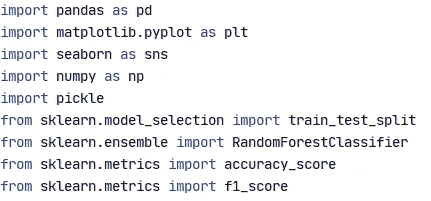

我将数据作为“数据”变量加载，并启动了我的 EDA。我意识到血压、皮肤厚度、胰岛素有很多 0 值。数据集中没有 NaN 值，并且数据集中的所有值都是数值。

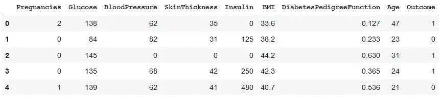

data.head()

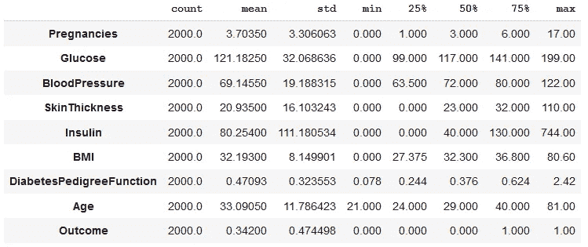

data . description()。转置()

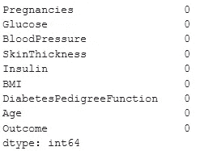

data.isna()。总和()

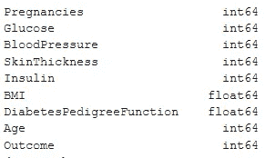

data.dtypes

我用各列的平均值替换了 0 值。此后，我将数据集分为因变量和自变量。并借助 Sklearn 库中的 train_test_split 将它们分成训练集和测试集。

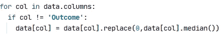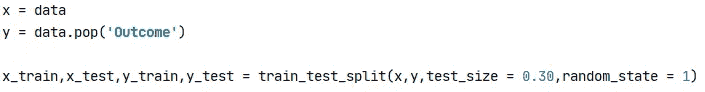

我用来自 Sklearn 的随机森林来拟合训练集，并用测试集来测试模型。我分别得到了 96% & 94%的准确率和 f1 的分数。此后，我在 pickle 库的帮助下制作了模型的 pickle 文件。

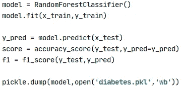

我在 Flask library 的帮助下创建了一个 API，利用我的模型来预测网站上的患者。我创建了一个主页路径来获取细节，创建了预测路径来处理给定的细节&预测糖尿病，并创建了一个结果路径来显示预测。

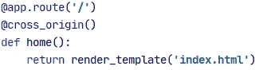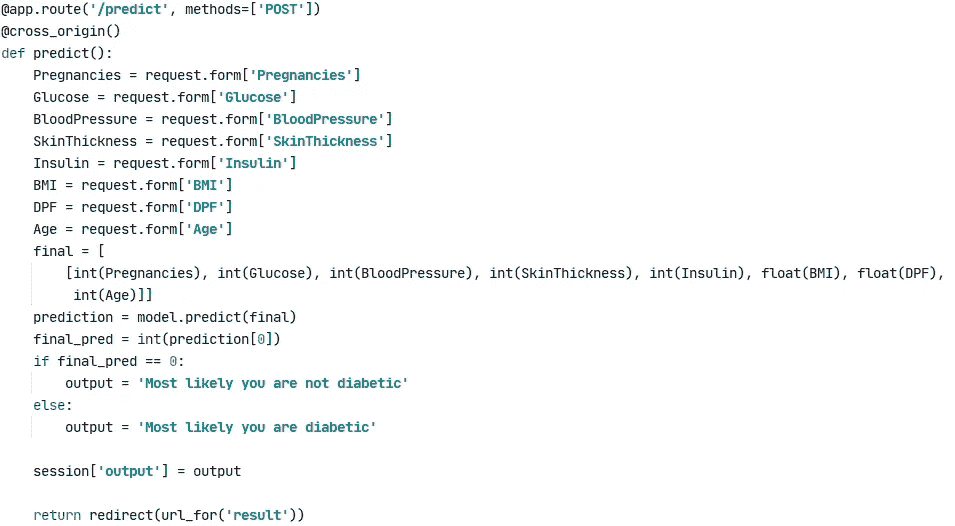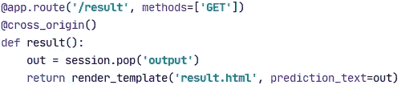

我把所有文件上传到 Github，最后把 API 部署到一个云平台上。

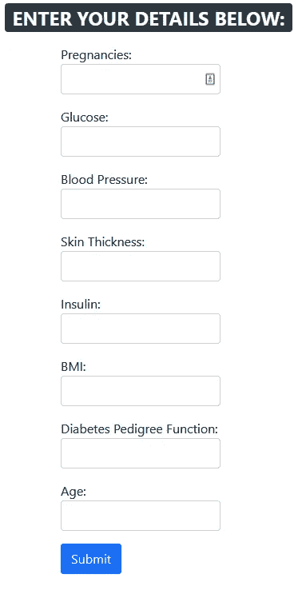

# 结论

我做这些都是为了实践数据科学项目的整个流程，以下是我在做这个项目时学到的所有东西:

> 我学会了如何将模型转换成 API。
> 
> *我学会了如何将 API 部署到云中。*

Github 项目:[糖尿病预测器](https://github.com/codename-hyper/diabetes-predictor)