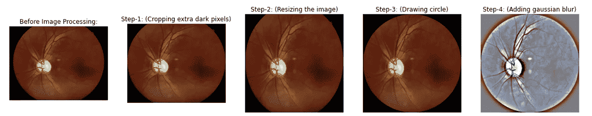
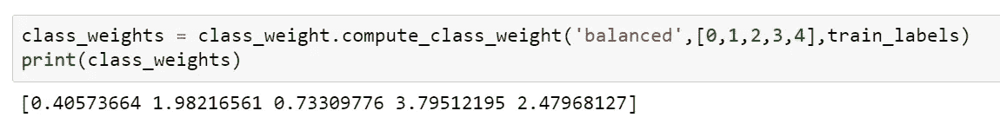

# 糖尿病视网膜病变检测

> 原文：<https://medium.com/analytics-vidhya/diabetic-retinopathy-detection-2c6e0edcebb6?source=collection_archive---------2----------------------->

> 使用扫描的视网膜图像和潜在的深度学习模型快速筛查和早期诊断疾病视网膜病变。

[https://static 01 . nyt . com/images/2019/03/10/business/10 aieyeductor 1/10 aidoctor 1-face book jumbo . jpg](https://static01.nyt.com/images/2019/03/10/business/10aieyedoctor1/10aidoctor1-facebookJumbo.jpg)

我们已经看到了深度学习在解决银行、电子商务和自动交通等复杂商业问题方面的进步。但你有没有想象过，一个 AI 模型可以在没有医生的情况下诊断疾病？是啊！这是真实发生在 [**桑卡拉眼科医院**](https://www.sankaraeye.com/)**孟加拉鲁鲁。让我们使用**深度学习**来深入解决这个案例研究。**

> ****简介:****

> ****什么是糖尿病视网膜病变？****

**糖尿病性视网膜病变是最常见的糖尿病性眼病，通常会影响糖尿病患者多年。糖尿病性眼病的风险是老年人，尤其是农村和贫民窟地区的工作人员。**

**它随着年龄的增长以及血糖和血压水平控制不佳而增加，当受损的血管向视网膜渗漏血液和其他液体时，就会发生这种情况，导致肿胀和视力模糊。血管可能会堵塞，疤痕组织可能会形成，最终可能会发生视网膜脱离。**

****

****正常视网膜和糖尿病视网膜的区别****

**视网膜病变会影响所有的糖尿病患者，如果不进行治疗，会增加失明的风险，从而变得特别危险。这种情况在早期阶段最容易治疗，这就是为什么在治疗变得太晚之前进行常规眼科检查很重要。**

> ****问题陈述:****

**Aravind 眼科医院的技术人员通过在农村地区旅行收集了大量糖尿病患者的视网膜扫描图像，并在 Kaggle 举办了一场比赛，最佳解决方案将通过 [APTOS](https://www.kaggle.com/c/aptos2019-blindness-detection/overview/aptos-2019) 传播给其他眼科医生。**

**他们希望我们建立一个系统，它可以拍摄患者的视网膜图像，并告诉我们糖尿病视网膜病变的严重程度。**

> **为什么我们需要自动化系统？**

**我们有扫描图像，那么为什么不能用训练有素的医生来诊断疾病，而不是用黑匣子系统呢？这里需要自动化吗？是啊！这里有几个优点，如下所示。**

*   **这有助于病人，尤其是那些请不起医生的人。**
*   **它减少了人的努力，尤其是当医生的数量较少时。**
*   **对于难以进行医学筛查的农村地区的人们非常有用。**
*   **它节省了诊断疾病的时间。**

> ****目录:****

****第 1 章:数据提取/导入数据和设置****

****第二章:探索性数据分析****

*   **步骤 2–1:数据集分析。**
*   **步骤 2–2:数据探索。**
*   **步骤 2–3:图像预处理。**

****第 3 章:评估指标****

*   **step _ 3–1:转换输出变量。**
*   **步骤 3–2:科恩卡帕指标。**

****第 4 章:通过深度学习的解决方案-** 卷积神经网络的概念**

*   **step _ 4–1:训练基线模型。**
*   **步骤 4–2:数据扩充。**
*   **步骤 4–3:迁移学习。**

****第 5 章:合奏****

****第 6 章:模型可解释性**——处理黑盒模型。**

*   **step _ 6–1:Grad-Cams 简介。**
*   **步骤 6–2:错误分析。**

****第 7 章:结论****

> ****第 1 章:数据提取/导入数据和设置:****

**我正在使用 Google Colaboratory 来访问高 **RAM** (12 GB)、50 GB **硬盘**空间和 **GPU** 以进行更快的训练。了解更多关于 colab 笔记本[这里](https://cheng-lin-li.github.io/2018/04/04/Google_Colaboratory.html)。**

****数据来源:****

**我已经从 **APTOS 2019 失明检测**比赛下的 Kaggle 中提取了数据。你可以直接从[这里](https://www.kaggle.com/c/aptos2019-blindness-detection/data)下载数据。**

**在普通的本地机器上下载数据大约需要 36 分钟。我使用 curlget(chrome 扩展)来加快下载速度。要了解更多信息，请点击此[链接](https://www.thegeekstuff.com/2012/07/wget-curl/)。**

**它将在 2-3 分钟内给出**aptos 2019-blindness-detection . zip**文件。但是，我们可以通过使用以下命令在 4-5 分钟内解压缩该文件来提取以下所有文件**

****

****解压文件****

**竞赛给出了 5 个文件，占用 9.52 GB 的空间。**

**一、test_images:包含测试图像的目录(共 1928 个文件)。**

**二。train_images:包含训练图像的目录(总共 3662 个文件)。**

**三。sample_submission.csv:参赛作品提交文件格式(28.26 KB)。**

**四。test.csv:作为 id_code 的测试图像的路径(24.48 KB)。**

**动词 （verb 的缩写）train.csv:作为 id_code 的训练图像的路径以及作为诊断的目标类别标签(53.66 KB)。**

> ****第二章:探索性数据分析:****

## ****步骤 2–1:数据集分析:****

****

****训练和测试数据集的大小****

****观察:****

*   **训练和测试数据集都不太大。**
*   **训练数据集比测试数据集大三倍。**
*   **模型训练有过度拟合的风险。**
*   **迁移学习和数据扩充的需要。**

**临床医生对每张图像的糖尿病性视网膜病变的严重程度进行了 0 到 4 级的评级。这是一个有 5 个目标类的多类问题**

****

****糖尿病视网膜病变的严重程度**。参考链接[此处](https://raw.githubusercontent.com/dimitreOliveira/MachineLearning/master/Kaggle/APTOS%202019%20Blindness%20Detection/aux_img.png)。**

****

**0 级和 2 级的优势**

****观察:****

*   **数据集严重失衡**
*   **没有 DR 情况的图像比具有严重情况的图像多 10 倍。**
*   **需要增加类别权重**
*   **0 -无 DR，1 -轻度，2 -中度，3 -重度，4 -增生性 DR**

****图像分析:****

**收集训练数据中所有图像的高度和宽度**

****

*   **在训练图像和测试图像中都没有标准的图像形状。**
*   **我们需要将所有的图像转换到一个标准的分辨率，这个分辨率应该相对较高，否则信息像素会被压缩。**

****分割数据集:****

**拆分数据后，我们需要永久存储文件，以便在未来的培训中不会出现数据泄漏的问题。**

## ****步骤 2–2:数据浏览:****

****

**每行描述了视网膜病的严重程度。在我们的数据集中有四个主要问题，这将使我们的模型难以识别身份。**

*   *****深色光照的图像:*** 有些图像非常暗，会误导我们的模型进行不正确的分类。**

****

*   *****不同颜色反转的图像:*** 这里有些图像的颜色深浅完全不同，像蓝色、粉色、绿色。**

****

*   *****带有无信息额外黑色像素的图像:*** 这是主要问题，因为在调整图像大小时，大多数信息像素会变小。**

****

*   *****不规则裁剪的图像:*** 数据集中有四种不同的裁剪模式。**

********

**大多数训练图像是 I 型和 III 型，测试图像是 III 型。**

## ****步骤 2–3:图像预处理:****

****图像预处理涉及的步骤:****

*   **所有图像都包含黑色背景。我们可以观察到一些图像的边缘有额外的暗像素。因此，在第一步中，需要裁剪掉那些额外的暗像素。**
*   **我们可以看到，图像宽度和图像高度没有固定的大小。因此，我们在步骤 2 中调整了图像的大小。**
*   **许多图像被缩小，一些图像具有圆形形状，一些图像在边缘被裁剪。因此在第三步，我们从中心画一个圆，给所有的图像一个相似的形状。**
*   **正如我们可以观察到的，大多数图像是以不同的分辨率拍摄的。其中一些是在光照条件下拍摄的，一些是在黑暗条件下拍摄的。我们正在添加一种平滑技术，通过对图像使用高斯模糊来去除图像中的噪声。这给出了我们最终的预处理图像。**

****

****图像预处理****

****在对训练数据集应用图像预处理后:****

****

****绘制预处理前后的各类样本图像****

****图像到矢量的转换:****

**图 2 矢量转换**

*   **图像预处理是一个耗时的过程。因此，我将预处理图像存储到一个矢量中，这样就不需要每次运行程序时都运行上面的代码。**

**加载已处理的数据**

**一切都很完美。现在我们准备模型训练:)**

> ****第 3 章:评估指标:****

## **step _ 3–1:转换输出变量:**

**在我们的模型中有五种结果，即[0，1，2，3，4]。现在我们可以转换这些标签**

*   ****一个热编码:**它是指将包含数字分类数据的列拆分成许多列，这取决于该列中存在的类别的数量。每列包含“0”或“1 ”,对应于它被放置的列。**

**例如，如果目标标签是 2，那么它将被编码为[0，0，1，0，0]**

*   ****有序回归**:用于学习对实例的排序或排序，兼具分类和度量回归的属性。有序回归的学习任务是将数据点分配到一组有限有序的类别中，即教师使用 A、B、C、D 和 E (A > B > C > D > E)对学生的表现进行评级**

**例如，如果目标标签是 2，那么它将被编码为[1，1，1，0，0]，这意味着具有类-2 的样本也属于它之前的类(0，1)**

**根据这篇[论文](https://arxiv.org/pdf/0704.1028.pdf)，使用有序回归，特别是在分类目标变量有序的情况下，在医疗保健中也会更有帮助。**

**有序回归**

## **步骤 3–2:科恩卡帕指标:**

**竞赛给出了一个加权的 kappa 分数作为评估标准。让我们看看这是什么意思。**

*   **它用于衡量评分者之间在分类数据上的一致程度。**
*   **它是对准确性的简单扩展，其中它找到简单的百分比一致计算(真实预测/总预测)，而 kappa 评分通过考虑偶然发生的一致而使其更加稳健。**

****

**科恩的卡帕度量。参考链接[此处](https://en.wikipedia.org/wiki/Cohen%27s_kappa)。**

****二次加权科恩卡帕评分:****

*   **加权 kappa 允许对不同意见进行不同的加权，这在对分数进行排序时非常有用。**
*   **它利用了三种矩阵:**

1.  **观察得分矩阵。**
2.  **期望得分矩阵。**
3.  **权重矩阵**

****

**二次加权 Cohen kappa 评分。参考链接[此处](https://www.kaggle.com/aroraaman/quadratic-kappa-metric-explained-in-5-simple-steps)。**

****为什么要使用加权卡帕指标？****

**有很多指标可以用来比较结果，比如混淆矩阵、准确度、召回率、精确度等..，那么为什么要使用新的度量标准呢？**

*   **当目标标签像[0，1，2，3，4]那样排序时，这很有用。**
*   **在不一致的情况下，根据预测和观察元素的距离给出分数。这不仅是照顾协议，而且是对分歧的惩罚。**
*   **如果真实预测值为 3，模型预测值为 2，则得分较高，如果模型预测值为 4，则得分较低。这一特性将非常有帮助，因为在医学上高于预期是可以接受的，因为在以后的诊断中它可以被纠正。但是，如果患者为 1 级，并且预测为 0 级，那么这将是一个问题，因为该患者被忽视，这可能对患者以及医院的声誉产生不利影响。**

**点击这里和[阅读更多关于 kappa 评分](https://www.kaggle.com/aroraaman/quadratic-kappa-metric-explained-in-5-simple-steps)[的信息。](https://en.wikipedia.org/wiki/Cohen%27s_kappa#Weighted_kappa)**

**计算 kappa 度量**

> ****第 4 章:通过深度学习的解决方案—** 卷积神经网络的概念**

## **step _ 4–1:培训基线模型:**

## *****计算类权重:*****

**由于数据集是高度不平衡的，添加类权重可以通过向每个类添加权重来使其平衡。
权重越大的类别代表样本越少。类似地，权重较小的类意味着它们在样本中更多。**

****

**计算类别权重**

****自定义回调:****

**这里，我们将修改 TensorFlow 中的回调类，以便在验证数据的每个时期打印 kappa 度量。**

****自定义回调，用于打印每个时期的验证 kappa 分数****

## **模型培训:**

****卷积神经网络(CNN):****

**随着时间的推移，机器学习研究广泛关注于对象检测问题。但是各种各样的事情使得识别物体变得困难，比如分割、光照、变形等等..,**

**卷积神经网络可以用于从手写数字到 3D 对象的所有与对象识别相关的工作。CNN 的真正价值是在 ImageNet 上的 **ILSVRC-2012** 比赛中显现出来的 ImageNet 是一个拥有大约 120 万张高分辨率训练图像的数据集。竞赛的获胜者[**Alex Krizhevsky(NIPS 2012)**](http://www.image-net.org/challenges/LSVRC/2012/supervision.pdf)开发了一种由 Yann LeCun 开创的非常深度的卷积神经网络。这些使他们如此受欢迎。**

**首先，我从基线模型开始，以估计最终得分，并在模型训练中进行必要的更改。这里我用了简单的**

*   **3 个卷积层，内核大小固定为 2x2，填充=与 Relu 激活相同。**
*   **2 个最大池层，固定内核大小为 2x2。**
*   **最大池后的全局平均池层**
*   **一个脱落层**
*   **4 个致密层**

****基线模型的实施****

**在运行了 30 个时期的模型后，我得到的 kappa_score 为 **0.6931** ，这是一个相对较好的开始。**

****验证数据集的性能指标:****

****

****基准模型的性能指标****

*   **我们可以看到，在 class-2 中有大量的错过分类。**
*   **来自类别 1 和类别 4 的大多数样本被预测为类别 2。**
*   **此外，根本没有关于第 4 类的正确预测。这意味着该模型使我们能够在区分第 4 类样本时绘制有意义的模式。**

**现在让我们尝试用 Alexnet 架构进行模型训练。**

****

****AlexNet 架构**。参考链接[此处](https://www.jeremyjordan.me/content/images/2018/04/Screen-Shot-2018-04-16-at-11.34.51-AM.png)。**

****论文亮点:****

*   **使用 Relu 激活代替 Tanh 来增加非线性。**
*   **局部反应正常化。**
*   **重叠池。**
*   **辍学者。**
*   **使用
    1 在多个 GPU 上进行培训。模型平行度
    2。数据并行性**

****Alex net 架构的实施****

**在运行了 30 个时期的模型后，我在验证数据上得到的 kappa 值为 **0.7758** ，比基线模型好。**

****验证数据集的性能指标:****

****

****Alex net 模型的性能指标****

*   **这里，来自类别 1、类别 3 的大多数样本都被预测为类别 2。**
*   **它开始对第一类和第四类进行大量的预测。**
*   **这种模型训练比基线模型训练更能区分不同的类别。**

## **步骤 4–2:数据扩充:**

**我们几乎没有 3k 左右的训练图像和 500 左右的验证图像。任何具有小数据集的深度学习模型都容易过度拟合，这在 baseline 和 alexnet 中不存在，但仍然有一个大数据集是好的。**

**通过扩充，我们可以在运行时增加数据集的大小，而无需实际将它们存储在我们的系统中。我使用了以下四种增强技术，这将使我们的数据集增加 4 倍。**

1.  **水平翻转**
2.  **垂直翻转**
3.  **旋转范围**
4.  **缩放范围**

**点击阅读更多增强技术[。](https://towardsdatascience.com/data-augmentation-techniques-in-python-f216ef5eed69#:~:text=Basic%20data%20augmentation%20techniques%201%20Flipping%3A%20flipping%20the,in%2C%20Zoom%20out%206%20Changing%20brightness%20or%20contrast)**

****数据增强****

****

****一个样本放大后生成的图像****

## **步骤 4–3:迁移学习:**

**迁移学习侧重于存储在解决一个问题时获得的知识，并将其应用于另一个不同但相关的问题。**

**我使用的是在 **imagenet** 数据集上训练的预训练模型。**

> ****它在模型训练中如何有用？:****

*   **想象一下，你想解决任务 A，但没有足够的数据来训练一个深度神经。完全符合我们的案子。**
*   **在学习识别一个问题(汽车)时获得的知识可以应用于识别另一个问题(卡车)。**
*   **为了更好的结果。这些模型在一大组图像上进行训练，并能够提取有意义的特征来区分一组类别。**

**所有预训练的模型架构都扩展了以下三层。**

1.  ****全局平均池 2D:**
    来自任何预训练模型的最后一个卷积层，该预训练模型生成与目标类数量一样多的特征图，并对每个特征图应用全局平均池，以便通过取其平均值将每个特征图转换成一个值。**
2.  ****Dropout**
    Dropout 通过在训练阶段的每次更新时将隐藏单元的输出边缘随机设置为 0 来工作。这将被用作一种正则化，以避免模型训练期间的过拟合。**
3.  ****密集**
    该层包含 5 个单元，每个单元代表具有 sigmoid 激活的个体类。
    **优化器:**亚当
    **损失:**二元交叉熵
    **度量:**准确度和加权 kappa**

****实施全球平均汇集 2D、漏失和密集层****

****视觉几何组(VGG):****

*   **VGG 有 16 或 19 层，从第一卷积层中的简单 3×3 滤波器开始。**
*   **通道数随着 2 的增加而增加，Nh，Nw 随着 2 的减少而减少。**
*   **虽然它包含许多参数，但该模型很简单，具有固定的 3×3 滤波器和 stride=1，并且在卷积层中具有相同的填充。**
*   **最大池层中跨距=2 的 2x2 过滤器。**

****

****VGG-16 架构**。参考链接[此处](https://neurohive.io/wp-content/uploads/2018/11/vgg16.png)。**

**VGG16 架构**

****冲浪板可视化:****

****

**VGG-16 模型训练**

*   **我们可以看到，训练和验证之间没有太大的区别。因此，我们可以说我们的模型没有过度拟合。**

**在对模型进行 30 个时期的训练后，我在验证数据上获得了 0.8931 的 kappa 分数。**

****验证数据集的性能指标:****

****

****VGG 新协议 16 的绩效指标****

****

****VGG-19 架构**。参考链接[此处](https://raw.githubusercontent.com/FrancescoSaverioZuppichini/PytorchModuleStorage/master/images/vgg-19.png)。**

**VGG19 架构**

****张量板可视化:****

****

**VGG-19 模型训练**

*   **我们可以看到，训练和验证之间没有太大的区别。因此，我们可以说我们的模型没有过度拟合。**

**在对模型进行 30 个时期的训练后，我在验证数据上获得了 0.9128 的 kappa 分数。**

****验证数据集的性能指标:****

****

****VGG-19 的绩效指标****

****DenseNet 架构:****

*   **DenseNet 是专门为改善高级神经网络中因梯度消失而导致的精度下降而开发的。**
*   **由于输入层和输出层之间的路径较长，信息在到达目的地之前就消失了。**
*   **它是一个 5 层致密块体，增长率 k = 4。**
*   **通过使用复合函数运算，前一层的输出充当第二层的输入。这个复合操作由卷积层、汇集层、批量标准化和非线性激活层组成。**

****

****DenseNet 建筑。**参考链接[此处](https://www.researchgate.net/publication/340662488/figure/fig1/AS:880794788696064@1587009250669/DenseNet-architecture-20.jpg)。**

****121 层 dense net:****

**=> 5+(6+12+24+16)*2 = 121**

*   **5 —卷积和池层**
*   **3 —过渡层(6，12，24)**
*   **1 —分类层(16)**
*   **2 —高密度数据块(1x1 和 3x3 Conv)**

****DenseNet 架构****

****张量板可视化:****

****

**DenseNet 模型培训**

*   **我们可以看到，训练和验证之间没有太大的区别。因此，我们可以说我们的模型没有过度拟合。**

**在对模型进行 30 个时期的训练后，我在验证数据上获得了 0.923 的 kappa 分数。**

****验证数据集的性能指标:****

****

****dense net 的性能指标****

*   **模型对所有类别进行了大量预测。**

****剩余网络:****

*   **而不是直接堆叠几层来适应底层的 H(x)映射。显式地让这些层拟合一个残差映射 F(x)。
    现在，
    F(x) = H(x) — x
    H(x) = F(x) + x**

****

****跳过连接的剩余块****

*   **现在，这个剩余映射(F(x)+x)被称为跳过一个或多个层的跳过连接。**
*   **这些连接执行身份映射，并且它们的输出被添加到堆叠层的输出中。**
*   **这些连接既不增加额外的参数，也不增加计算复杂性。**

****

****ResNet-50 架构**。参考链接[此处](https://ai2-s2-public.s3.amazonaws.com/figures/2017-08-08/7b30817561c8aa87fa4d72ef6a75080000ef5ea0/6-Figure2-1.png)。**

**Resnet 架构**

****张量板可视化:****

****

**Resnet-50 模型培训**

*   **我们可以看到，训练和验证之间没有太大的区别。因此，我们可以说我们的模型没有过度拟合。**

**在对模型进行 30 个时期的训练后，我在验证数据上获得了 0.9091 的 kappa 分数。**

****验证数据集的性能指标:****

****

****ResNet-50 的性能指标****

****

****ResNet-152 架构**。参考链接[此处](https://miro.medium.com/max/1200/1*S-8Te9IM9tKNznzGJ1JnmQ.png)。**

****ResNet-152 架构****

****张量板可视化:****

****

**ResNet-152 模型训练**

*   **我们可以看到，训练和验证之间没有太大的区别。因此，我们可以说我们的模型没有过度拟合。**

**在对模型进行 30 个时期的训练后，我在验证数据上获得了 0.9146**的 kappa 分数。****

****验证数据集的性能指标:****

****

****ResNet-152 的性能指标****

****盗梦空间网络:****

*   **inception 模型允许我们在同一级别上应用多个过滤器(1x1、3x3、5x5)甚至 max-pooling 层，并连接结果。因此，这个网络基本上会变得“更宽”而不是“更深”。**

****

**参考链接[此处](https://cdn-images-1.medium.com/max/1600/1*U_McJnp7Fnif-lw9iIC5Bw.png)。**

****

****盗梦空间 V3 架构**。参考链接[此处](https://alexisbcook.github.io/assets/inception.png)。**

**Inception v3 架构。**

****冲浪板可视化:****

****

**Inception-V3 模型培训**

*   **我们可以看到，训练和验证之间没有太大的区别。因此，我们可以说我们的模型没有过度拟合。**

**在对模型进行 30 个时期的训练后，我在验证数据上获得了 0.9014 的 kappa 分数。**

****验证数据集的性能指标:****

****

****Inception-v3 的性能指标****

****高效网络网络:****

*   **从茎开始。**

****

**树干建筑**

*   **一般来说，模型做得太宽、太深，或者分辨率太高。增加这些特征最初有助于模型，但是它很快饱和，并且所制作的模型只是具有更多的参数，因此效率不高。在 EfficientNet 中，它们以更有原则的方式进行扩展，即逐渐增加所有内容。**
*   **该架构由 7 个模块组成。这些块还具有数量变化的子块，这些子块的数量增加。**
*   **最终以最终层结束。**

****

**最终架构。**

**点击阅读更多关于高效网络[的信息。](https://towardsdatascience.com/complete-architectural-details-of-all-efficientnet-models-5fd5b736142)**

****

****EfficientNet-B0 架构**。参考链接[此处](https://miro.medium.com/max/1500/1*rnhgFRXetwD8PvxhZIpwIA.png)。**

**高效 Net-B0 架构**

**张量板可视化:**

****

**EfficientNet-B0 模型培训**

*   **我们可以看到，训练和验证之间没有太大的区别。因此，我们可以说我们的模型没有过度拟合。**

**在对模型进行 30 个时期的训练后，我在验证数据上获得了 0.9144 的 kappa 分数。**

****验证数据集的性能指标:****

****

****efficient net-B0 的性能指标****

*   **模型对所有类别进行了大量预测。**

****

**B3 建筑公司。参考链接[此处](https://miro.medium.com/max/1500/1*8oE4jOMfOXeEzgsHjSB5ww.png)。**

****高效网络-B3 架构****

****张量板可视化:****

****

**高效网络-b3 模型培训**

*   **我们可以看到，训练和验证之间没有太大的区别。因此，我们可以说我们的模型没有过度拟合。**

**在对模型进行 30 个时期的训练后，我在验证数据上获得了 0.9199 的 kappa 分数。**

****验证数据集的性能指标:****

****

****B3 效率网的绩效指标****

*   **模型对所有类别进行了大量预测。**

****

****EfficientNet-B4 架构**。参考链接[此处](https://miro.medium.com/max/1500/1*4-w-cb0WpFb4pBdf6ZCA7w.png)。**

****EfficientNet-B4 架构****

****张量板可视化:****

****

**EfficientNet-b4 模型培训**

*   **我们可以看到，训练和验证之间没有太大的区别。因此，我们可以说我们的模型没有过度拟合。**

**在对模型进行 30 个时期的训练后，我在验证数据上获得了 0.9193 的 kappa 分数。**

****验证数据集的性能指标:****

****

****efficient net-B4 的性能指标****

****例外架构:****

****

****异常架构****

**Xception 是一种高效的架构，它依赖于两个要点:**

*   **深度方向可分离卷积:
    为了克服这种运算的成本，已经引入了深度方向可分离卷积。
    它们本身分为两个主要步骤:**

1.  **深度方向卷积**
2.  **逐点卷积**

*   **Resnet 中卷积块之间的快捷方式:
    这些是在 ResNet 中引入的跳过连接。**

**点击阅读更多关于例外网[的信息。](https://maelfabien.github.io/deeplearning/xception/#ii-in-keras)**

****异常架构****

****张量板可视化:****

****

**XceptionNet 模型训练**

*   **我们可以看到该模型在 15 个时期后试图过度拟合。此外，训练将对验证数据集的分数产生不利影响。**

**在对模型进行 30 个时期的训练后，我在验证数据上获得了 0.9161 的 kappa 分数。**

****验证数据集的性能指标:****

****

****异常网络的性能指标****

**预训练模型所做的所有预测都存储在一个. CSV 文件中，分别用于训练、验证和测试数据集。**

> ****第 5 章:合奏****

**集成方法是一种机器学习技术，它结合了几个基本模型来产生一个最佳预测模型。**

*   **聚集弱学习者的数量来建立一个更强大的模型。**
*   **它用于减少预测的方差和泛化误差。**

**有两种应用集合模型的主要技术**

1.  **Bagging(引导聚合)。**
2.  **助推。**

****

**组装**

**取 N 个模型预测，取最大标签数作为最终类别预测。
例如[1，0，0，1，1，1，2]这是 N 个模型预测，那么最后一类将被预测为 1，因为 4 个模型预测为 1，2 个模型预测为 0，1 个模型预测为 2。因此，类别预测=标签的最大数量，即 1**

****实现系综****

**系综的确认 kappa 分数为 **0.9314。**所有车型中哪个成绩最好。**

****验证数据集的性能指标:****

****

****系综的性能指标****

****总成绩:****

****

****模型训练的总体结果****

> ****第六章:模型可解释性** —黑盒模型的工作**

> **使用模型可解释性的需求是什么？**

*   **如果我们不做预测，而是告诉我们是什么让这个样本成为这个类的，会怎么样呢？这就是模型可解释性的作用。它有助于人类理解达到这一结果的过程。**
*   **对于机器学习来说，这很简单，但是深度学习呢？？
    在这里，我们可以利用在整个培训过程中学到的梯度。梯度值越大，表明该点的激活程度越高。**
*   **在医疗、银行问题中，模型的可解释性非常重要。因为错误的预测会让一家公司亏损，或者可能夺走一个人的生命。**
*   **因此，在得出结论之前，最好先看看这个过程是如何到达那个阶段的。**

****“幻想总是比愚蠢的结论好”****

## ****Step _ 6–1:Grad-Cams 简介:****

****

**Grad Cams 的工作**

*   ****步骤-1** :获取图像并将其传递给模型，并且还通过利用预测的类别标签来获取关于特定卷积层(主要是最后一个卷积层)的每个特征的梯度。**
*   ****步骤 2** :将渐变调整到图像的大小。**
*   ****步骤 3** :绘制该梯度的热图，以了解在预测关于输入图像的类别标签时的激活。**

****

**图像的梯度图**

**其中青色表示在预测类别时激活程度较高(此处为球)。**

**点击阅读更多关于 Grad-Cam [的信息。](http://www.hackevolve.com/where-cnn-is-looking-grad-cam/)**

**实施 Grad-Cam**

**绘制每个类别样本的模型可解释性。这里每一行都描述了疾病的严重程度。**

**绘图可解释性**

****来自验证数据的 0 类(无 DR)的一些预测:****

****

****0 类随机样本预测****

****观察:****

*   **对于 0 级，模型在所有像素上都具有高激活。**
*   **该模型主要集中在神经上，并且如果没有斑点(棉花伤口、血凝块),它预测为 0。**
*   **For (0，0)模型预测为 class-4，并且在右下角具有高激活度。但实际预测是 0。**

****来自验证数据的 1 级(轻度)的一些预测:****

****

****类别 1 的随机样本预测****

****观察:****

*   **该模型在眼球上神经和排泄物(脂肪沉积)[(1，0)，(1，1)]的异常生长[(0，0)，(2，1)]处具有高活性。**
*   **模型在 1 类和 2 类预测之间切换。**
*   **部分训练中类别 1 和类别 2 的更多数据可以使模型区分这两个类别。**

****来自验证数据的第二类(中等)的一些预测:****

****

****第二类随机样本预测****

****观察:****

*   **在这类预测中，模型集中于眼球中的少量出血(出血)[(0，1)，(1，1)]和渗出物[(1，1)，(2，0)]形成。**
*   **它在棉絮的地方有很高的活性。**

****来自验证数据的 3 级(严重)预测:****

****

****类别 3 的随机样本预测****

****观察:****

*   **它具有代替硬执行[(2，0)]和小棉絮[(1，0)]的高激活。**
*   **如果它们的数量很大，则模型预测为 3 else 2。**
*   **该模型在类别 3 和类别 4 之间切换，并且能够预测正确的类别。**
*   **更多的数据可以改善 3 级预测。**

****来自验证数据的第 4 类(增殖性 DR)的一些预测:****

****

****4 类随机样本预测****

****观察:****

*   **在大棉絮[(1，0)，(1，1)]和硬执行[(0，0) [1，1)]的情况下，该模型具有高的激活度，并预测它具有 3。**
*   **根据严重程度和大小，斑点的数量，它是分类的类。**

## **步骤 6–2:错误分析:**

**错误率=该类别的错误预测/该类别的总预测**

****

**对每类错误预测的分析**

*   **0 级错误率为 2.05**
*   **一级错误率为 27.84**
*   **二级错误率为 24.92**
*   **三级错误率为 34.72**
*   **四级错误率为 28.47**

****少于真实预测的预测数:****

****

**这里，10 个样本实际上属于 1 类，但被预测为 0 类。这 10 个病例是最需要检查的，因为这些患者实际上患有视网膜病(轻度)，但被预测为没有视网膜病。**

****绘制这 10 个样本:****

****

> **第七章:结论**

****我们问题陈述的最终解决方案:****

*   **在应用了几个预训练的模型之后，集合这些模型给出了最高分 **0.9314。****
*   **但是在这里，我们的目标不仅仅是给出最好的分数，而是提供一个可以做出解释的预测系统。**
*   **在这里，我选择了 DenseNet，它给出了模型可解释性的下一个最佳分数 **0.923** val kappa 分数，以及用于最终模型预测的所有预训练模型的集合。**

****关于模特培训:****

*   **使用有序回归对分类标签进行编码。**
*   **添加类权重以平衡数据集。**
*   **二进制交叉熵作为损失函数与 Adam 优化。**
*   **使用在 imagenet 数据集上预先训练的 Densenet 架构。在运行该模型 30 个时期后，该模型在验证数据集上给出了 0.923 的分数，该分数将用于模型的可解释性**
*   **最终模型预测的集合。**

****

****问题陈述的最终解决方案****

## **案例研究的总体观察:**

*   **我们可以看到在 2 级和 3 级之间有很高的错误分类率。**
*   **更多的训练样本数据可以提高这些类的性能。**
*   **更多的预处理和不同的 sigmax(低于实际值)在预测中是有用的。**
*   **方形作物图像的数据收缩几率很高。因此，我们需要想出不同的方法(手动裁剪是最好的)。**
*   **在图像上画圈使得所有样本都相等，这也有助于解释模型预测。部分解决了过度曝光和曝光不足的问题。**
*   **在我们的情况下，合奏效果最好。但是它失去了可解释性。**
*   **复杂数据集上的高级预训练模型，特别是在医学(眼科)上训练的模型，可以很好地改进我们的模型。**
*   **需要想出不同的扩充技术来增加数据集的大小。**

****未来工作:****

*   **深度学习是用多个参数进行实验的任务。因此，我想用更多的可能值超参数。**
*   **使用不同的扩充技术来增加数据集的大小。**
*   **利用 Kaggle 中 2015 年的数据(类似二分类的问题)。**
*   **想做一个 web API，让每个眼科医生都可以访问我的工作。**
*   **我想通过在每个模型架构中添加更多卷积层来进行试验。**
*   **利用超分辨率 GANS 提高图像分辨率。**

****参考文献:****

*   **[www.appliedaicourse.com](https://www.appliedaicourse.com/courses/)(学习 ML 的好地方& DL)**
*   **[https://www . research gate . net/publication/339737332 _ Deep _ Learning _ Approach _ to _ Diabetic _ Retinopathy _ Detection](https://www.researchgate.net/publication/339737332_Deep_Learning_Approach_to_Diabetic_Retinopathy_Detection)**
*   **[https://medium . com/analytics-vid hya/the-eyes-of-an-eye-doctor-detect-blind-with-deep-learning-51ce 763 a 008 b](/analytics-vidhya/the-eyes-of-an-eye-doctor-detect-blindness-with-deep-learning-51ce763a008b)**
*   **[https://www . ijltemas . in/digital library/vol . 6 issues 7/112-119 . pdf](https://www.ijltemas.in/DigitalLibrary/Vol.6Issue7/112-119.pdf)**
*   **[https://medium . com/@ gasimov . huse yn/detecting-eye-disease-using-ai-ka ggle-bronze-place-ce 4 ab 310 c 089](/@gasimov.huseyn/detecting-eye-disease-using-ai-kaggle-bronze-place-ce4ab310c089)**
*   **【https://www.ncbi.nlm.nih.gov/pmc/articles/PMC5961805/ **
*   **[https://www . ka ggle . com/ratthachat/aptos-eye-preprocessing-in-diabetic-retinopathy](https://www.kaggle.com/ratthachat/aptos-eye-preprocessing-in-diabetic-retinopathy)**
*   **[https://www . ka ggle . com/ratthachat/aptos-augmentation-visualize-diabetic-retinopathy](https://www.kaggle.com/ratthachat/aptos-augmentation-visualize-diabetic-retinopathy)**

**作为一名渴望成为数据科学家的人，我来到了这里。这包括我对这个案例研究的最后工作。感谢您阅读我的文章。**

**你也可以在这里阅读我的其他文章和案例研究。**

**您可以查看。ipynb 在我的 [**Github 存储库中获得了这个案例研究的完整代码片段。**](https://github.com/ChaitanyaNarva/Diabetic_Retinopathy_Detection)**

****关注我**了解更多关于数据科学中不同真实案例研究的文章和实现！也可以通过 [**LinkedIn**](http://www.linkedin.com/in/sai-chaitanya-narava-20b3571a0) 和**[**Github**](https://github.com/ChaitanyaNarva/ChaitanyaNarva)与我联系****

****我希望你从这件事中学到了一些东西。这方面的学习永无止境，所以快乐学习吧！！bye 的签约:)****