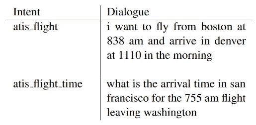
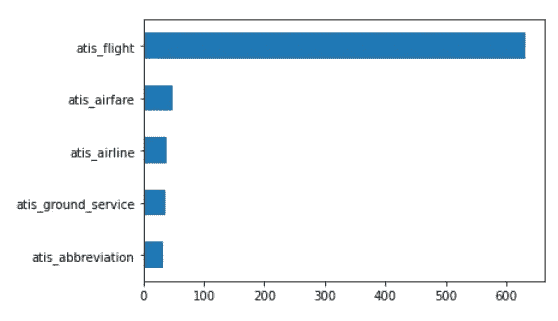
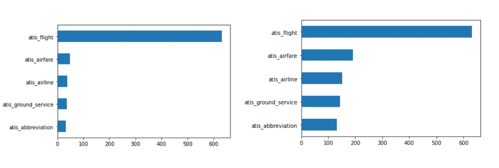

# 对话增强和意图检测

> 原文：<https://medium.com/analytics-vidhya/dialog-augmentation-and-intent-detection-5d76bdf0fcb8?source=collection_archive---------10----------------------->

米盖尔·Á的照片。来自 Pexels 的 Padri 和 Aseem Srivastava

对话系统中的意图检测是将对话系统中的对话推向正确方向的决定性步骤。通常，在构建对话系统时，对语言理解部分的关注较少，从而导致不明确的响应生成。我们将尝试重新构建众所周知的少数民族意图的意图检测问题陈述，并增加具有类似意图的对话，以便更好地理解少数民族意图。所提出的体系结构和机制在 dialog 上显示了良好的结果，并且这种特殊的增强机制也可以扩展到其他与 dialog 相关的分类问题。在这项研究中，它的工作将使用最先进的机器学习模型和最先进的深度学习技术，在面向目标的对话系统上使用更少的意图分类器来产生更好的理解。在深度学习时代，对话系统中的意图检测不再是一个经典的机器学习问题。

*下面附上 Google Colab 笔记本、GitHub 代码和数据集链接，供大家参考。*

# 直觉

在用机器学习革新对话系统时，对话对话中的意图检测(ID)是非常关键的阶段。利用自然语言理解(LU)，意图检测有助于在对话管理中即兴语言生成和进步。以前，意图检测的任务已经用不同的数据集做过多次。这里，我们将尝试精确地检测训练样本数量非常少的缩进，并遇到聊天机器人无法理解用户意图的阶段。

对于对话系统，尤其是面向目标的对话系统，聊天机器人应该足够健壮，能够检测用户的意图，而不需要考虑任何特殊的假设。这就是我们处理的地方，即使在数据集中分类的意图数量较少，也能在测试阶段正确识别缩进。为此，我们将使用由 *Sonos 于 2017 年 6 月*发布的 ATIS 数据集。我们将在数据集部分看到更多关于数据的内容。

> 复述生成技术利用具有少数人意图的对话并扩充相似的对话导致对对话系统中的对话有更好的理解。

# 为什么这很重要？

对话系统是为了完成他们所接受的任务或领域而构建的。一般来说，研究者很少关注带有意图部分的“路”来诊断话语中很少出现的意图。在各种机器学习技术的帮助下，ID 将帮助我们更好地理解人类的意图和对话流。

同时，我们的输出也会对对话管理系统产生积极的影响，从而重现更好的语言生成模型。

根据提取的信息，系统可以决定要采取的适当行动，以帮助用户实现他们的需求。逻辑单元应用在我们的日常生活中变得越来越重要。许多设备，如智能手机，都有使用 LU 技术构建的个人助理。
帮助中心等多个产品支持系统使用该 ID，以减少对大量员工复制粘贴无聊的常见问题解答的需求。聊天机器人，自动电子邮件应答器，回答来自知识库的问题和答案的推荐者。

# ATIS 数据集

表 1:上表显示了从用户到机器人的示例对话框以及 ATIS 数据集中相应的注释意图。

用于 ID 任务的数据集是**ATIS-航空公司旅行信息系统，这是最初由微软发布的基准数据集。**在数据集中，我们正在处理与航空旅行和航班调度协议相关的 8 个不同意图。

图 1:从项目中的 ATIS 数据集使用的意图及其对应的频率图。

此外，ATIS 数据集包含 4，978 个训练样本以及 943 个词汇。基准数据集通常也用于槽填充问题语句，提供 129 个槽计数。我们感兴趣的部分是意图计数，总计 26。对于我们的实验，我们要处理 5 种不同的意图。

# 系统模型化

我们的方法是两种不同成分的混合，首先通过增加对话话语的释义来利用具有少数意图的对话。因为这些话语属于与父对话相同的意图，所以 ATIS 数据集可以被扩充三次。在我们的工作中，我们增加了来自 4 个次要意图类的对话数据。为了生成释义，我们使用了一个预先训练好的 T5 模型。其次，伴随着这些对话，在 BERT 嵌入的基础上从头开始训练神经网络。

在我们的方法中，我们结合前馈神经网络的实现，使用了变压器架构中基于 BERT 的编码器部分。整个架构如图 2 所示。

作为输入，我们使用了在无监督语料库上进行预处理的 BERT 嵌入。这些输入被馈送到前馈神经网络(图 2)。该模块由一个液滴层和两个隐藏尺寸为 512 的前馈层组成。

图 2:提出的模型的体系结构，进一步分为两个部分:(I)释义生成部分。(二)分类器前馈神经网络。接收到的输出是意图类的软最大概率分布

## 1.释义生成

为了处理有限数据问题，我们首次引入了新的数据增强集成意图检测问题。我们的复述生成模型使用 T5 模型，该模型对于许多 NLP 任务是鲁棒的。T5 是来自 Google 的 transformer 模型，它以端到端的方式进行训练，以文本作为输入，以修改后的文本作为输出。T5 模型使用在巨大文本语料库上训练的相同文本到文本转换器，在许多 NLP 问题语句上实现了最先进的结果，如摘要、句子提取、机器翻译等。

在这个项目中，我们以原始句子作为输入，以转述(ATIS 数据集的重复句子)句子作为输出来训练 T5。

图 3:使用 Google T5 模型的对话增强通过生成对话的释义保持多数类不变，利用了少数类的对话。

## 2.意图分类器神经网络

我们使用 BERT 嵌入从 3 层前馈神经网络传递，给出 5 个输出，最后通过 softmax 层。

我们的前馈神经网络在开始时包含一个丢弃层，丢弃值为 0.5，在其上应用 ReLU 激活函数。来自该激活函数的输出通过第一线性层，将 768 维作为输入，并产生 512 维输出到下一隐藏层。现在，第二线性层为意图分类产生 5 个输出，其进一步通过 softmax 函数以获得概率分布。
在 i5 处理器的常规 8GB RAM 上对模型进行 30 个时期和 32 个批量的训练花费了 2 个小时用于数据扩充，并且花费了大约 12 个小时在分类架构上训练模型。

# 结果

我们使用一个常规的准确性度量来比较基线和其他模型的结果。我们还评估了我们的模型的 F1 分数，但是由于没有使用其他模型，所以比较变得无关紧要。然而，精确度、召回率、f1 分数都是在代码文件中计算和显示的。

表 2:我们消融研究的结果和最终架构的结果。

上述项目的代码/数据可以在我的 GitHub 链接中找到(请给一些星星！):[https://github . com/as 3 EEM/Dialog-Intent-Augmentation-and-Detection](https://github.com/as3eem/Dialog-Intent-Augmentation-and-Detection)