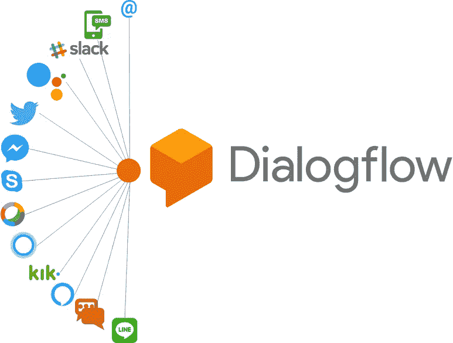

# 使用 Python 的带有 webhooks 的 Dialogflow 聊天机器人

> 原文：<https://medium.com/analytics-vidhya/dialogflow-chatbot-with-webhooks-using-python-c1e7fc46faf6?source=collection_archive---------1----------------------->

图片-1

嗨，我又一次带着一个新话题回来了，我相信这个话题会鼓励你建立一个聊天机器人。我会尽我所能给你们大家一个伟大的工作，它将支持你建立自己的聊天机器人。所以让我们开始吧。

因此，任何开始构建聊天机器人的人都会对 webhooks 感到困惑。没问题，这很正常。我是来解释的。我们来简单解释一下…