# 钻石是珍贵的，也是可预测的！

> 原文：<https://medium.com/analytics-vidhya/diamonds-are-precious-and-predictable-2412da9f690e?source=collection_archive---------8----------------------->

我们今天预测钻石，想加入吗？

这是 R-studio 中内置的数据集。我们打算根据可用的特征来预测钻石价格。数据集中有 53940 条记录。作为惯例，让我们将数据分为测试(30%)和训练(70%)。

现在我们有了训练数据，让我们检查数据集的结构。我用 R 进行分析。

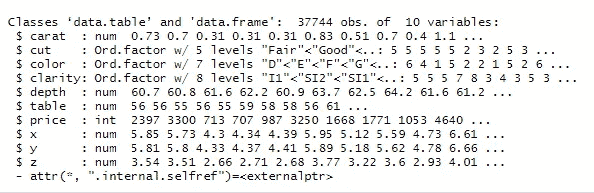

4c 到底是怎么回事——克拉、切割、颜色、净度？

作为一名数据分析师，有趣的一部分是有机会跨领域学习，今天也不例外。在我们进一步分析数据之前，让我们理解数据集中每一列的含义。我们需要谁来帮助我们呢？美国宝石学院。因此，让我们来解读数据集中的每个 4c 和其他字段。

1.  **克拉重量:**代表钻石的重量。越大越好(如果其他因素保持不变)。

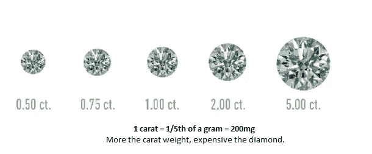

图片提供:美国宝石学院(GIA)

**2。净度:**指没有夹杂物和瑕疵。钻石越清晰，越好，越昂贵(其他因素保持不变)。

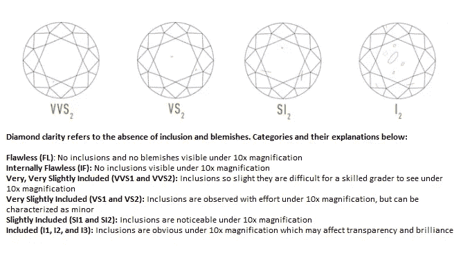

图片提供:GIA

**3。颜色:**颜色是指钻石中没有颜色。

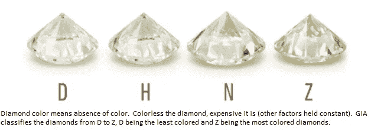

图片来源:GIA

**4。切割:**根据不同的尺寸，钻石被赋予切割等级。这个范围从优秀到差。我们的数据集具有以下切割等级:

**尚可<良好<非常好<溢价<理想**

切割等级越高，钻石越贵(其他因素保持不变)。

**5。深度，台面，x，y，z:** 钻石的物理尺寸如下:

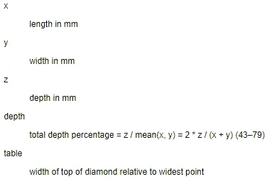

图片提供:R-Studio

这些与钻石价格有什么关系？我不知道，但是，嘿，数据有什么用！我们潜水吧。

首先，让我们检查因变量的分布。

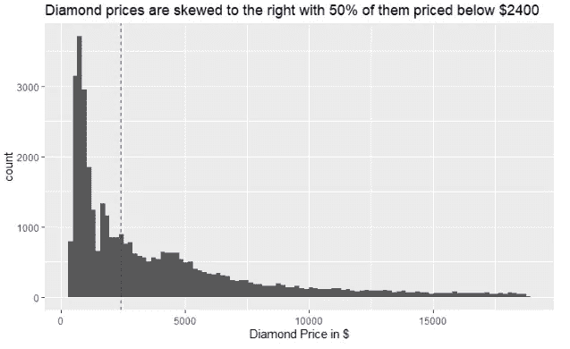

既然我们知道价格如何变化，让我们检查它与数据集中独立变量(预测值)的关系。

**价格 v/s 克拉重量:**不出所料，克拉重量的增加会导致钻石价格的上涨。

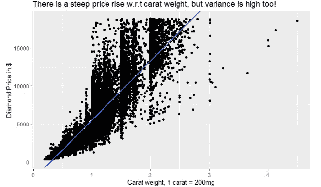

**价格 v/s 切割类型:**人们会认为钻石价格会随着切割的改善而上涨，但在我们的数据集中，情况似乎并非如此。

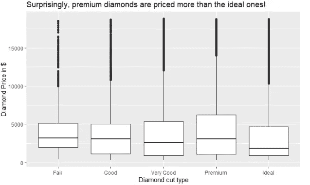

切割等级越高，钻石价格应该越高，也许还有其他因素在起作用。克拉重量的变化类似于价格的变化，也许克拉重量超过了切割等级？也许吧！

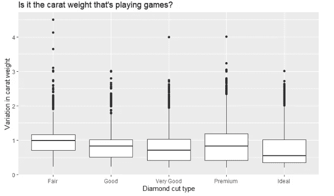

**价格 v/s 颜色类型:**根据我们的领域专业知识，我们应该已经看到价格从颜色类型 D 下降到 j。但是在这里，我们再次感到惊讶。

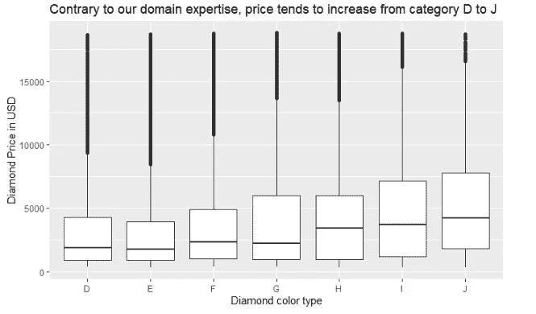

克拉重量似乎超过了颜色，如下图所示:

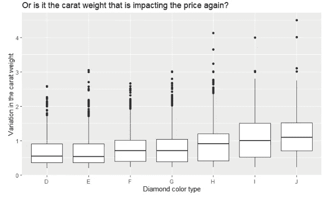

**价格 v/s 清晰度:**数据与我们的领域知识不符。随着清晰度的提高，我们应该会看到价格上涨，但这似乎并不明显。

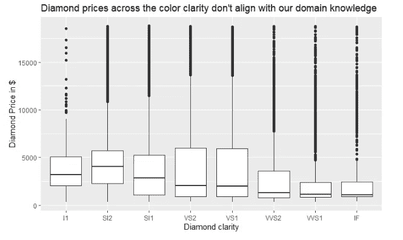

经检查，克拉似乎在影响价格。

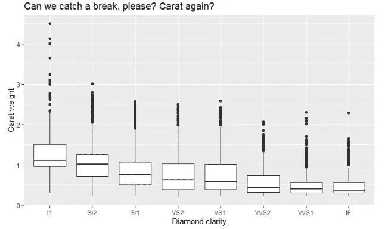

**深度 v/s 价格:**对于给定的深度，钻石价格从高到低波动。可能是它们之间没有关联。

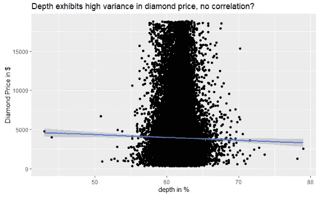

**表格 v/s 价格:**表格和价格之间的关联也不明显，因为价格在表格宽度范围内变化很大。

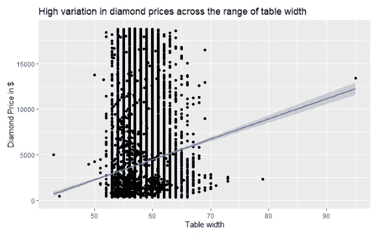

**x(长度)、y(宽度)和 z(深度)v/s 价格和克拉重量:**钻石价格往往会随着尺寸的增加呈指数上升。

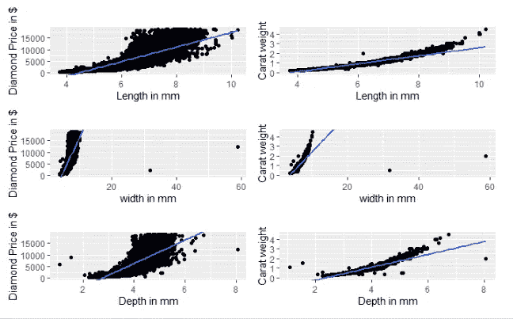

x、y 或 z 等维度的增加也会影响克拉重量，因此检查这些预测值之间的共线性是有意义的。相关矩阵如下所示:

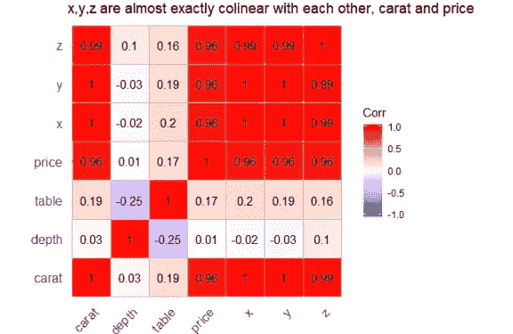

预测值之间的关系不是线性的，而是单调的。因此，Spearman 的相关系数被认为是代替 Pearson 的。由于 x、y 和 z 与克拉重量和价格几乎完全共线，因此从这里开始，它们将从模型中删除。

**对分类列进行一键编码:**分类变量(如净度、颜色和切割)用序数值表示。在我看来，这是不正确的，因为公平和良好的切割与良好和非常好的切割是不同的。这同样适用于其他分类字段。因此，这些列是一次性编码的。一键编码后的相关矩阵如下所示:

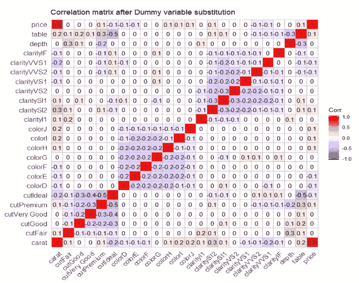

人们不禁会注意到克拉重量和价格之间的强烈相关性，也许我们应该开始考虑基线模型。

**选择基线模型:**

在回归的情况下，我们经常选择平均值作为基线。在这里，我将采用平均值和中位数作为基线模型，因为数据是右偏的，我相信中位数将是一个更好的选择。

我们使用平均绝对百分比误差(MAPE)来衡量模型的效率。MAPE 越低，模型越好。

基准均值在训练数据上的 MAPE 为 188%。好吧，这是可悲的，但嘿，让我们来解决它。

训练数据的基线中位数 MAPE 为 110%。这意味着比基线有所改善，但仍有很长的路要走。

**想线性:**

正如我们从上面的相关矩阵中看到的，克拉或许是一个与钻石价格密切相关的预测因素。我们从拟合一个以克拉重量作为预测值的线性模型开始我们的旅程。

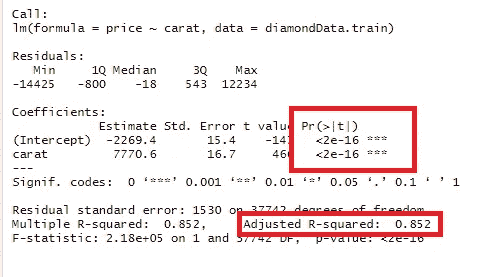

模型是重要的，但它是一致的吗？

不出所料，克拉重量的增加会提高钻石的价格。建立的模型符合这一概念。获得负截距以最小化残差平方和。这没有什么意义，但是一个负截距肯定会低估低克拉重量的价格。

人们一定也很想知道该模型的预测能力在整个钻石价格范围内是否是恒定的？

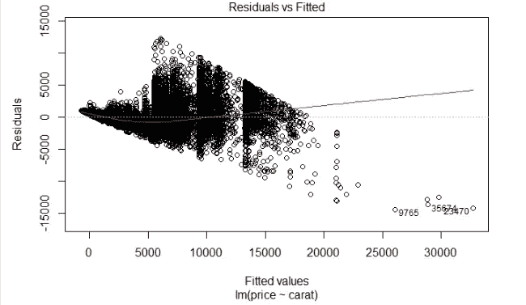

残差中的方差不是常数

以 carat 作为唯一预测因子的线性模型不显示同质性。

简单回归模型对训练数据的 MAPE 为 38.3%，这是朝着正确方向迈出的一步。

现在让我们继续前进，包括所有的预测，并建立一个多元回归。

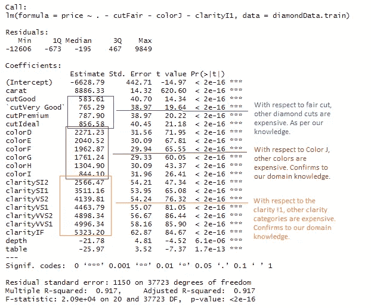

预测值 CutFair、ColorJ 和 ClarityI1 从模型中排除，以防止虚拟变量陷阱

模型中的所有预测值都达到了 1%的显著性水平。调整后的 R 平方为 0.917，表明多元线性回归模型能够很好地解释钻石价格在其均值上的变化。我们还可以使用残差 v/s 拟合图检查线性模型是否在预测值范围内具有稳定的预测。

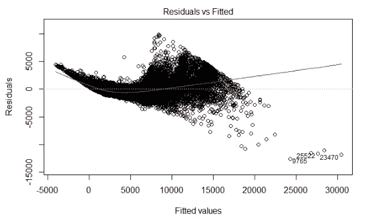

谁来消除异方差，拜托！

该模型在预测值的范围内继续显示不一致的残差。我们必须超越线性模式，探索其他选择。

多元线性回归对训练数据的 MAPE 为 44.8%。越多越开心？—不在这里！

一位智者曾经说过，如果你很懒(我就是这样)，决策树就是为你准备的。这就是说，如果我们不知道/不确定我们的预测和反应变量之间的实际关系，尝试决策树。让我们探讨一下这个选项:

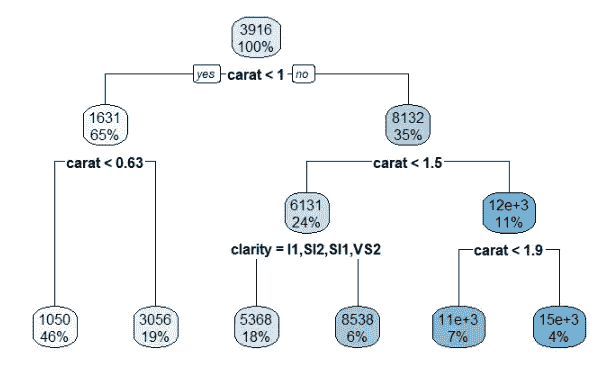

一路都是克拉重量

正如迄今为止在 EDA 和回归模型中所注意到的，在决定钻石的价格价值方面，克拉重量似乎压倒了其他预测因素。这一点从分割线上也很明显。该模型在训练数据上的 MAPE 为 32.8%，这也并不令人印象深刻。

**合奏方式:**

决策树经常过度拟合数据。防止这种情况发生的一种方法是基于集成技术进行预测，在集成技术中，使用多个树来预测基于聚合的值。

**装袋:**我们从装袋开始我们的旅程。我们创建了 10 到 30 个引导样本，并针对每个样本构建了一个决策树。我们看到，在 15 个树之后，没有超出范围的误差保持不变。因此，选择了 15 棵树的袋装模型(对于极客来说，调整后超参数 nbags= 15！).

这个模型有 32.3%的 MAPE，这也没有给我们预期的准确预测。

**随机森林:**我们切换到随机森林，在这里我们建立了一个由许多树(多达 150 棵)组成的集合，并且看到在 100 棵之后，出袋误差几乎是恒定的，但是我们仍然选择了一个由 150 棵树组成的随机森林集合，并汇总我们的结果。

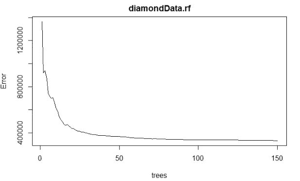

OOB 误差在 100 棵树后几乎相同

我们将随机森林设置为有 150 棵树，并预测训练模型，以查看其 MAPE 为 6.77%。相当可观！

如果这个令人印象深刻的 MAPE 是真实的，让我们快速浏览一下剩余的 v/s 拟合图。

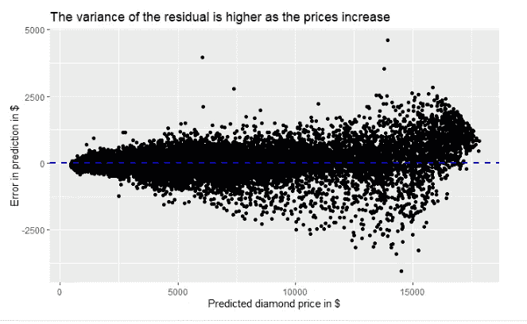

虚线是所有残差的平均值

零的平均残差和相对稳定的预测使我们相信，我们可以信任为我们的预测而构建的随机森林。但是，嘿，解释在哪里？

这就是打包和随机森林等综合技术做得不好的地方。因为输出是许多树聚合的结果，所以没有单一的解释(如在单一决策树中)可用。这些也被亲切地称为黑盒模型。容易获得的是模型中每个预测值的重要性，如下所示:

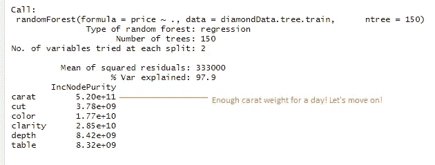

随机森林中的 150 棵树，以克拉作为预测的最重要特征

现在让我们根据测试数据验证我们所有的模型(还记得我们在开始时留出的 30%吗？).结果如下:

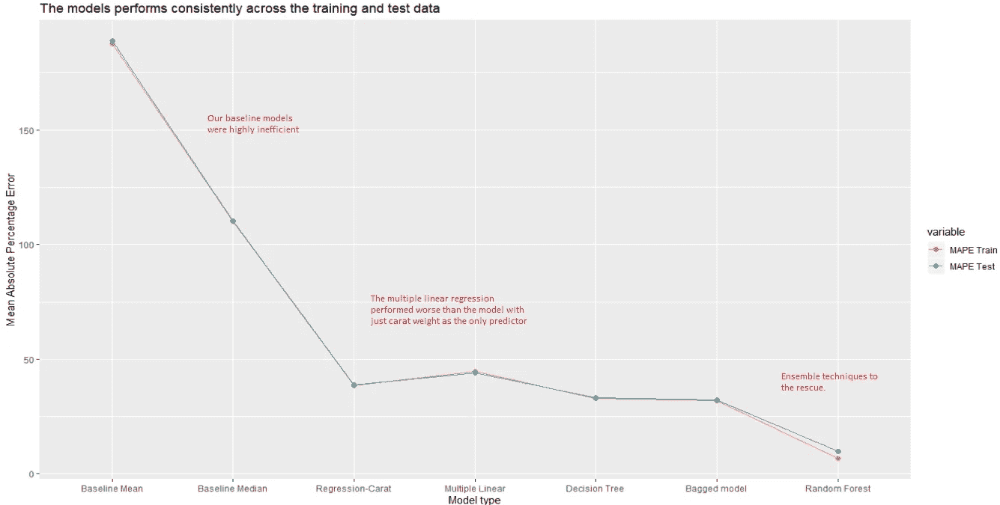

这些模型在训练和测试数据中表现一致**。**

**总结**

我们研究了钻石的 4c 标准以及它们如何影响定价。

我们的基线模型在训练数据上有 188%的 MAPE。通过一系列操作(线性、多重线性、决策树、装袋)，我们能够使用随机森林树集合将 MAPE 降低到 6.77%。然而，问题是随机森林的可解释性，这导致了较低的 MAPE(更好的模型)，但缺乏可解释性。

还有比这更低 MAPE 的模型吗？太好了。但现在，这是我停下来的地方。当有有价值的东西要添加时，我会保持项目和文章的更新。

该项目的源代码如下:

https://github . com/rohitTheSupplyChainGuy/Diamonds-is-precious-and-Predictable-/blob/main/aDiamondIsForever。Rmd