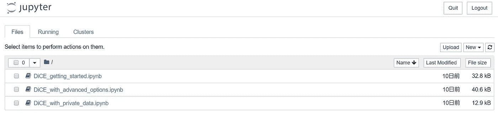

# DiCE -ML 模型对泰坦尼克号沉没的反事实解释-

> 原文：<https://medium.com/analytics-vidhya/dice-ml-models-with-counterfactual-explanations-for-the-sunk-titanic-30aa035056e0?source=collection_archive---------1----------------------->

# 介绍

2020 年的人工智能/人工智能有一些可预见的和正在发展的趋势，如 AutoML、MLOps、人工智能伦理，这些都是为了使人工智能/人工智能在行业中民主化。AutoML 可以通过 MLOps 在 AI/ML 生命周期中自动部署和优化 ML 模型。它反映了 It 的一个方面，将某个领域抽象为系统的无意识层，一旦它嵌入到系统中，人们就不再需要关心下面的层。例如，随着云服务的出现，一些人在某种程度上不需要关心网络、服务器和存储。同理，随着 AI/ML 的普遍蔓延，[*【AI】*](https://en.wikipedia.org/wiki/Artificial_intelligence)这个词本身终将淡出潮流场景。 [*【人工智能】*](https://en.wikipedia.org/wiki/Artificial_intelligence)*[*【物联网】*](https://en.wikipedia.org/wiki/Internet_of_things)*[*【区块链】*](https://en.wikipedia.org/wiki/Blockchain) 显然是当下的流行语，但未来十年这些词将不会像我们在日常生活中使用和听到的那样频繁。**

**另一个大趋势显然是[](https://en.wikipedia.org/wiki/Explainable_artificial_intelligence)*【XAI】指的是应用[*【AI】*](https://en.wikipedia.org/wiki/Artificial_intelligence)的方法和技巧，解决的结果可以通过人的感知来理解和解释。虽然最近的渐进技术被称为生成*【黑盒】*模型，如深度学习(深度神经网络)，但相对经典的方法，如决策树、线性回归和一些统计方法被称为*【白盒】*模型，给出了该模型中给定特征影响结果的可理解的原因。深度学习(深度神经网络)，boosting 和随机森林，高度非线性回归模型对人类来说还不是那么透明，这意味着人们不能很容易地理解为什么一个结果是以一种可解释的方式从给定的模型中获得的。[【1】](https://en.wikipedia.org/wiki/Explainable_artificial_intelligence)***

****

**图片由 [adriano7492](https://pixabay.com/users/adriano7492-6485549/?utm_source=link-attribution&utm_medium=referral&utm_campaign=image&utm_content=2788986) 来自 [Pixabay](https://pixabay.com/?utm_source=link-attribution&utm_medium=referral&utm_campaign=image&utm_content=2788986)**

**[*【交代艾】*](https://en.wikipedia.org/wiki/Explainable_artificial_intelligence)【XAI】已经是大势所趋，可能是必不可少的。**

**2020 年人工智能趋势的精选列表。[【2】](https://towardsdatascience.com/a-distilled-list-of-ai-trends-for-2020-e2fc83a9b092)**

**[](https://towardsdatascience.com/a-distilled-list-of-ai-trends-for-2020-e2fc83a9b092) [## 2020 年人工智能趋势的精选列表

### 随着 2020 年的临近，新年前夕总是对这一年做一些考虑的好时机…

towardsdatascience.com](https://towardsdatascience.com/a-distilled-list-of-ai-trends-for-2020-e2fc83a9b092) 

2020 年数据科学和人工智能十大预测。[【3】](https://towardsdatascience.com/ten-predictions-for-data-science-and-ai-in-2020-f6abb0c3977d)

[](https://towardsdatascience.com/ten-predictions-for-data-science-and-ai-in-2020-f6abb0c3977d) [## 2020 年数据科学和人工智能的十大预测

### 内部数据科学团队对 2020 年可能为利用数据科学和人工智能的组织带来什么的看法

towardsdatascience.com](https://towardsdatascience.com/ten-predictions-for-data-science-and-ai-in-2020-f6abb0c3977d) 

为什么它最近受到关注并被认为对 AI/ML 至关重要？可能有两个方面，一个属于伦理原因，当模型应用的一些规则似乎对我们的伦理和道德思想产生不公平和不值得的结果时；另一个属于商业原因，AI/ML 应该揭示为什么它的回归或分类(或作为输出的某些东西)导致了特定的答案。当人工智能的采用在商业中广泛传播，并在我们的社会中无处不在时，这些已经变得更加重要。下面我们就来详细看看那几个方面。

*   **伦理原因——人工授精/人工授精导致的无意识偏差**

我们通常不知道*“黑箱”*模型如何给我们结果，以及这些模型如何具有算法偏差和不公平性。[剑桥分析公司丑闻](https://www.theguardian.com/news/series/cambridge-analytica-files)和[亚马逊废弃其对女性有偏见的秘密人工智能招聘工具](https://www.reuters.com/article/us-amazon-com-jobs-automation-insight/amazon-scraps-secret-ai-recruiting-tool-that-showed-bias-against-women-idUSKCN1MK08G)是我们必须在这里回忆的著名事件。如果我们没有注意到那些在某些人群中带来有害差异和不平等的偏见和不公平，情况会更糟。在后一个亚马逊案例中，我们发现该系统在招聘过程中以不那么性别中立的方式给男性候选人高分，因为这反映了当时男性在科技行业的主导地位。从这个角度来看，任何系统都可以怀疑他们是否有这样的偏见，因为这些系统可以设计出其他方式来评估人或事物，只需在当今的 AI/ML 生命周期中自动收集数据。 [*fairlearn*](https://github.com/fairlearn/fairlearn) 是一个评估项目，用于评估您的系统的公平性，并减轻 AI/ML 开发中观察到的不公平。[【4】](https://github.com/fairlearn/fairlearn)

*   **业务原因—AI/ML 导致的未知原因**

让我们考虑一个退休预测案例(或流失案例)。我们有一堆关于我们员工的数据，需要预测谁将离开公司，以防止你的公司让你的人才离开。假设我们从数据中生成了一个模型，这个模型揭示了你们中的一个工程师可能很快就会离开公司，但是为什么要等呢？好吧，也许他会离开，但我们需要知道的不是他会离开什么，而是他为什么会离开公司。该模型可以从给定的数据中很容易地预测谁可能离开公司，但是该模型没有告诉你我们可以采取什么措施来防止他一眼就离开公司。为了避免可能的后果，我们会问模型*“如果他在两年内加薪会怎样”*或*如果他每月加班少于 30 小时会怎样，等等。*

*利用人工智能/人工智能模型，包括在深度学习(深度神经网络)、boosting 和随机森林中生成的*、*，被认为可以减少对人类主观意见的依赖，但当我们采用这种人工智能时，我们必须克服一个不同的障碍。那些可解释和可解释的原因在*【黑箱】*模型输出中是看不见的。在最近的调查和研究中，现在可以获得哪些条件会使模型预测与 [*反事实解释*](https://christophm.github.io/interpretable-ml-book/counterfactual.html) 发生逆转，就像*【如果】*假设的例子一样，我们想对相同的输入提出一个问题。我们将通过下面的 DiCE(不同的反事实解释)实现之一来寻求 ML 模型*的 [*反事实解释*](https://christophm.github.io/interpretable-ml-book/counterfactual.html) 。**

*[](https://christophm.github.io/interpretable-ml-book/counterfactual.html) [## 6.1 反事实解释|可解释的机器学习

### 一个反事实的解释以这样的形式描述了一个因果关系:“如果 X 没有发生，Y 也不会…

christophm.github.io](https://christophm.github.io/interpretable-ml-book/counterfactual.html)* 

# *骰子(不同的反事实解释)*

*微软研究院[Ramaravind Kommiya mothil al](https://arxiv.org/search/cs?searchtype=author&query=Mothilal%2C+R+K)、 [Amit Sharma](https://arxiv.org/search/cs?searchtype=author&query=Sharma%2C+A) 、[陈豪谭](https://arxiv.org/search/cs?searchtype=author&query=Tan%2C+C)于今年 1 月在 github 发表了他们最近的研究 [*“通过多样的反事实例子解释机器学习分类器”*](https://www.microsoft.com/en-us/research/publication/explaining-machine-learning-classifiers-through-diverse-counterfactual-examples/) 和 DiCE 实现。骰子首先是什么？骰子是其中的一种 [*反事实解释*](https://christophm.github.io/interpretable-ml-book/counterfactual.html) 由他们研究实现。这种实现是基于他们最近的研究为**任何 ML 模型**产生多样的 [*反事实解释*](https://christophm.github.io/interpretable-ml-book/counterfactual.html) 。[【5】](https://github.com/microsoft/dice)*

*[](https://github.com/microsoft/dice) [## 微软/骰子

### 如何解释一个机器学习模型，这样的解释对模型是真实的，但又可以解释给…

github.com](https://github.com/microsoft/dice) 

> DiCE 实现了[反事实(CF)解释](https://arxiv.org/abs/1711.00399)，通过显示同一案例的特征扰动版本来提供此类信息……换句话说，它为模型输出提供了“假设”解释，并且可以作为其他解释方法的有益补充，对最终用户和模型开发人员都是如此。

这是进一步深入研究。 [*DiCE*](https://github.com/microsoft/dice) 是一个很有用的库，它实现了 [*反事实(CF)解释*](https://arxiv.org/abs/1711.00399) ，通过显示具有不同预测的相同案例的特征扰动版本，提供了那些*“如果”*案例。这种实现还带来了给定用户上下文和约束的反事实动作的可行性，以及由可调参数呈现的反事实之间的多样性，以生成不同种类的解释。我们可以为反事实解释的可行性和多样性提供一些论据，这很好。

*   邻近性和多样性权重

*proximity_weight* (缺省值:0.5)和 *diversity_weight* (缺省值:1.0)是我们生成反事实示例时的可变值(我们将在后面介绍示例用法)。对于邻近性和多样性，应该配置的值(分别为 0.5 和 1.0)与默认值相差多少还有点模糊。一个想法是为这些参数设置一个迭代变量，并使用一个循环来生成不同的反事实解释集。

```
# change proximity_weight from default value of 0.5 to 1.5
dice_exp = exp.generate_counterfactuals(query_instance, total_CFs=4, desired_class="opposite", **proximity_weight=1.5**, **diversity_weight=1.0**)
```

*   特征 _ 权重

*feature_weight* 是一个字典参数，我们可以为每个数字特征提供它，以配置它改变特征值的难度，用于反事实解释。默认情况下，DiCE 会在内部计算 MAD 的倒数，并将连续要素之间的距离除以训练集中要素值的 MAD。

```
# assigning new weights
**feature_weights = {'age': 10, 'hours_per_week': 5}**
# Now generating explanations using the new feature weights
dice_exp = exp.generate_counterfactuals(query_instance,
                total_CFs=4, desired_class="opposite",
                **feature_weights=feature_weights**)
```

*   特性变化列表

一些生成的解释暗示了不容易改变的特征的变化(比如年龄)，或者像种族或性别这样的敏感属性。因此，DiCE 允许输入允许通过 *features_to_vary* 参数变化的特性列表。该列表只能为同一案件的*可操作的*备选概况提供一组现实的反事实解释。

```
# assign varying features as a list
dice_exp = exp.generate_counterfactuals(query_instance,
                total_CFs=4, desired_class="opposite",
                **features_to_vary=['age','workclass','education','occupation','hours_per_week']**)
``` 

*在上一篇文章中，我用一些额外的包构建了 Anaconda3 容器。让我们用骰子和为此目的所需的额外包装再次包装容器。对于数据科学家来说，Anaconda3 有很多好处，可以在不进行繁琐的安装工作的情况下开发、测试和训练 ML 模型。对于人们来说，这是一个多合一的软件包，因为它保持了可维护性和可用性。只要安装的库满足您的需求，您就不需要迷失在库依赖的迷宫中。[【6】](https://www.anaconda.com/distribution/)*

> *数据科学家可以直接从平台中开发和部署人工智能和机器学习模型，而无需涉及 DevOps。Anaconda 提供了所需的工具。*

*   *快速下载 7，500 多个 Python/R 数据科学包*
*   *使用 [Conda](https://conda.io/docs/) 管理库、依赖项和环境*
*   *用 [scikit-learn](https://scikit-learn.org/stable/) 、 [TensorFlow](https://www.tensorflow.org/) 、[the no](https://pypi.org/project/Theano/)开发和训练机器学习和深度学习模型*
*   *使用 [Dask](https://dask.org/) 、 [NumPy](http://www.numpy.org/) 、 [pandas](https://pandas.pydata.org/) 和 [Numba](http://numba.pydata.org/) 分析具有可伸缩性和性能的数据*
*   *用 [Matplotlib](https://matplotlib.org/) 、[散景](https://bokeh.pydata.org/en/latest/)、[数据阴影](http://datashader.org/)和[全息视图](http://holoviews.org/)可视化结果*

**

*Docker 容器是主机上一个松散隔离的环境，直接在主机内核级运行。Docker 使我们能够像管理应用程序一样交付基础设施。这种环境带来了 CI/CD、DockerHub registry(类似于代码存储库)和基础设施领域的版本控制。有了容器技术，管理和维护我们的基础设施变得可行，就像我们管理和维护我们的应用程序一样，这太棒了。Docker 映像可以在开发人员之间共享以供重用，他们不再需要从头开始构建环境。*

*   *Docker 容器是轻量级和可携带的，因为它不需要任何额外的 hypervizor 层，并且可以作为 Docker 映像进行复制*
*   *Docker 平台提供了一个管理容器的工具，容器有利于 CI/CD(持续集成和持续交付)。*
*   *Docker 映像是可移植的，可以从存储库(DockerHub 或云/私有存储库)中取出来进行复制*
*   *Docker 图像可以定义为名为*“docker file”*的文本文件，这意味着该文件也可以像代码一样进行管理和维护*
*   *Docker 图像是可定制的，它由基于其他图像的层组成，或者可以使用*“docker file”*从头开始创建*

*容器在编排或 CI/CD 流程的上下文中是可处置的。例如，在测试环境中用于自动化测试和验证阶段的容器可以在部署管道中构建并推送到生产环境中。它必须是有效的，因为测试和验证通过了测试容器的环境。一致的平台和隔离环境特性有助于应用程序开发，通过 Docker 平台简化基础设施和应用程序的生命周期。在本文中，我们将 Docker 容器视为可移植的环境，它可以在任何环境中重现，例如本地 PC、远程服务器或客户端环境。作为先决条件，代码(Dockerfile)或图像应该预先存储在存储库或注册表中。*

# *创建 DockerFile 文件*

*Dockerfile 基于官方的 Anaconda3 Dockerfile，带有引导 DiCE 安装。如果您对创建这个 Dockerfile 文件不感兴趣，您可以只运行这些命令来在本地构建一个映像，并生成一个包含示例笔记本的容器。请注意，Jupyter 笔记本的默认端口在此图中设置为 8888。[【7】](https://github.com/ContinuumIO/docker-images/blob/master/anaconda3/debian/Dockerfile)*

```
*$ git clone 
$ cd dice-test
$ docker build -t dice .
$ docker run -p 3000:8888 -v ${PWD}/notebooks:/opt/notebooks dice*
```

*[](https://github.com/ContinuumIO/docker-images/blob/master/anaconda3/debian/Dockerfile) [## 连续视频/docker 图像

### GitHub 是 4000 多万开发人员的家园，他们一起工作来托管和审查代码、管理项目和构建…

github.com](https://github.com/ContinuumIO/docker-images/blob/master/anaconda3/debian/Dockerfile) 

基于连续视频/停靠图像的骰子容器图像

该图像调用`docker-entrypoint.sh` entrypoint shell 脚本来运行 Jupyter Notebook，如下所示。您可以使用`--port==`选项更改指定的端口号。

DiCE docker-entrypoint.sh

通过运行`docker build -t dice .`命令，您应该看到库`dice-ml`已经成功安装在控制台中。

```
**Successfully built dice-ml**
Installing collected packages: numpy, dice-ml
  Found existing installation: numpy 1.16.4
    Uninstalling numpy-1.16.4:
      Successfully uninstalled numpy-1.16.4
Successfully installed dice-ml-0.2 numpy-1.16.0
Collecting package metadata (current_repodata.json): ...working... done
Solving environment: ...working... done
``` 

*`conda list`在容器下面显示了截至写作时的库版本。*

```
*numpy                     1.16.0                   pypi_0    pypi
scikit-learn              0.21.2           py37hd81dba3_0
scikit-image              0.15.0           py37he6710b0_0
pandas                    0.24.2           py37he6710b0_0
h5py                      2.9.0            py37h7918eee_0
tensorboard               2.1.1                    pypi_0    pypi
tensorflow                2.1.0                    pypi_0    pypi
tensorflow-estimator      2.1.0                    pypi_0    pypi*
```

*如果您想为所需的库使用这些固定版本，不要自己创建映像，而是从 DockerHub 中提取构建的映像。[【8】](https://hub.docker.com/r/suganoyuya/dice)*

 *[## 码头枢纽

### 编辑描述

hub.docker.com](https://hub.docker.com/r/suganoyuya/dice)* 

*Jupyter 笔记本现在可以在本地或远程服务器上通过指定的端口访问。三个示例笔记本必须至少可以确认。*

**

*骰子笔记本示例*

# *泰坦尼克先生是如何从沉船中生还的？*

*泰坦尼克号事故发生在 1912 年。RMS 泰坦尼克号在[北大西洋](https://en.wikipedia.org/wiki/North_Atlantic_Ocean)与冰山相撞后沉没，这是该船从[南安普顿](https://en.wikipedia.org/wiki/Southampton)到[纽约市](https://en.wikipedia.org/wiki/New_York_City)的[首航](https://en.wikipedia.org/wiki/Maiden_voyage)的第四天。不幸的是，没有足够的救生艇容纳船上的每个人，导致估计 2224 名乘客和船员中的 1502 人死亡。现在有趣的是将骰子应用于这个数据集 [*【泰坦尼克号】*](https://www.kaggle.com/c/titanic/overview) 列车组，并验证哪种人更有可能从沉船中幸存。我们只使用数据集的`train.csv`,因为它保留了列。[【9】](https://www.kaggle.com/c/titanic/overview)*

*可以自己报名 Kaggle 获取`train.csv`数据。*

*[](https://www.kaggle.com/c/titanic/overview) [## 泰坦尼克号:机器从灾难中学习

### 从这里开始！预测泰坦尼克号上的生存并熟悉 ML 基础知识

www.kaggle.com](https://www.kaggle.com/c/titanic/overview) 

你可能已经知道，与其他头衔如夫人和小姐相比，先生的存活率相对较低。所以我在这里的问题是，什么条件可以拯救一个有*“如果”*假设的例子，你可以考虑，特别是如果你我们是一个男人(例如，如果你是第一排的人布劳德，欧文·哈里斯先生，他是 3 班 22 岁的男人，有一个兄弟姐妹。请参见下面 dataframe 格式的原始 csv 数据。


泰坦尼克号列车. csv 带幸存列


每本书的存活率* 

*在典型特征工程下，我们可以处理缺失值，并从兄弟姐妹和父母信息中添加列*“家庭大小”*。在用 Keras 训练一个模型后，我们必须给我们训练好的模型骰子模型对象，如下。现在我们已经准备好用数据对象`d`和模型对象`m`来做 DiCE，实例化一个 DiCE 类来生成反事实解释。*

```
*# provide the trained ML model to DiCE's model object
**backend = 'TF'+tf.__version__[0]**
m = dice_ml.Model(model=ann_model, **backend=backend**)*
```

**

*请注意，您需要分别为模型库的类型、TensorFlow 1.x、TensorFlow 2.x 或 PyTorch 给出`backend`参数。[【10】](https://github.com/microsoft/DiCE/blob/master/notebooks/DiCE_getting_started.ipynb)*

> *下面的变量 *backend* 表示我们想要使用的骰子的实现类型。我们在后端='TF1 '的笔记本中使用 TensorFlow 1.x。您可以将后端设置为“TF2”或“PYT ”,以分别与 TensorFlow 2.x 或 PyTorch 一起使用骰子。我们要注意的是，用 Tensorflow 2.x 的急切执行风格寻找反事实所需的时间明显大于用 TensorFlow 1.x 的图形执行。*

*启动 DiCE 类并生成反事实样本非常简单。从这个随机结果来看，第一个和第二个例子仍然是男性，与样本人“布劳德·欧文·哈里斯先生”本人年龄相同。第三个案例与性别和头衔的误导相矛盾。它表明，如果他的头衔是主人或者他有 8 个兄弟姐妹，那么他可能从沉船中幸存下来。现在，我们不要考虑改变反事实集的标题或兄弟姐妹/父母的数量，而是通过使用 features_to_vary 参数来寻找他的更多类似的备选简档。因为主人样本的数量相对较少，而且有 8 个兄弟姐妹看起来太极端了，以至于不能把这些结果当作假设。*

**

*生成的反事实集*

*我将邻近度从默认值 0.5 和 features_to_vary 配置为只有 4 个特征(pclass、age、fare、embarked)。因此，反事实的例子将不会改变性别，家庭的事情和标题。这种优化似乎在某种程度上工作良好。第三个例子表明，如果他能支付更高的 14.01 英镑(接近 pclass 2 的中间值)，并且登机地点是瑟堡而不是南安普顿，他可能会得救。其余三个案例说明，在这种情况下，婴儿或儿童显然有可能获救。*

**

*优化反事实集*

*[下面是](https://github.com/yuyasugano/dice-test/blob/master/notebooks/DiCE_with_Titanic_train.ipynb)这个泰坦尼克号骰子反事实设定实现的笔记本。*

*【https://github.com/yuyasugano/dice-test *

# *参考*

*   *[1] [维基百科——可解释的人工智能](https://en.wikipedia.org/wiki/Explainable_artificial_intelligence)*
*   *[2][2020 年人工智能趋势的精选列表](https://towardsdatascience.com/a-distilled-list-of-ai-trends-for-2020-e2fc83a9b092)*
*   *[3][2020 年数据科学与 AI 十大预测](https://towardsdatascience.com/ten-predictions-for-data-science-and-ai-in-2020-f6abb0c3977d)*
*   *[4] [费尔勒/费尔勒](https://github.com/fairlearn/fairlearn)*
*   *[5] [微软/骰子](https://github.com/microsoft/dice)*
*   *[巨蟒分布](https://www.anaconda.com/distribution/)*
*   *[7] [连续视频/对接图像](https://github.com/ContinuumIO/docker-images/blob/master/anaconda3/debian/Dockerfile)*
*   *[菅谷/骰子](https://hub.docker.com/r/suganoyuya/dice)*
*   *【9】[ka ggle—泰坦尼克号:机器从灾难中学习](https://www.kaggle.com/c/titanic/overview)*
*   *[10][DiCE/notebooks/DiCE _ getting _ started . ipynb](https://github.com/microsoft/DiCE/blob/master/notebooks/DiCE_getting_started.ipynb)*
*   *[11][yuyasugano/dice-test](https://github.com/yuyasugano/dice-test)*
*   *[12] [DiCE -ML 模型与泰坦尼克号沉没数据的反事实解释-](https://techflare.blog/dice-ml-models-with-counterfactual-explanations-for-the-sunk-titanic-data/)***