# C/C++中的冒险问题

> 原文：<https://medium.com/analytics-vidhya/dicey-issues-in-c-c-3c546acd0bbe?source=collection_archive---------14----------------------->

## C/C++问题

如果你熟悉 C/c++，那么你一定遇到过一些不寻常的事情，如果你没有，那么你就要遇到了。下面的代码在添加之前检查了两次，所以请随意与您的朋友分享这篇文章。下面显示了一些问题:

1.  在打印功能中使用多个变量
2.  比较有符号整数和无符号整数
3.  在循环语句的末尾加上分号
4.  c 预处理器不需要分号
5.  绳子的大小很重要
6.  宏和方程不是好朋友
7.  不要将浮点数据类型与双精度数据类型进行比较
8.  数组有边界
9.  字符常量不同于字符串文字
10.  单等号(=)和双等号(==)的区别。

以下代码不会产生错误，因为打印函数可以接受任意数量的输入，但是会与变量不匹配。print 函数用于在输出屏幕上显示字符、字符串、整数、浮点、八进制和十六进制值。格式说明符用于显示变量的值。

1.  %d 表示整数格式说明符
2.  %f 表示浮点格式说明符
3.  %c 表示字符格式说明符
4.  %s 表示字符串格式说明符
5.  %u 表示无符号整数格式说明符
6.  %ld 表示长整型格式说明符

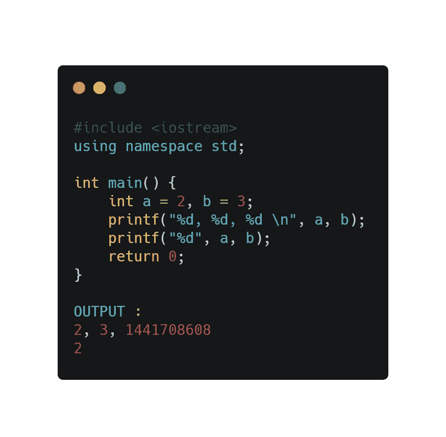

有符号整数是一个 32 位数据，它对[-2147483648 到 2147483647]范围内的整数进行编码。无符号整数是一个 32 位数据，它对范围[0 到 4294967295]内的非负整数进行编码。有符号整数用二进制补码表示。在下面的代码中，有符号整数将被转换为最大无符号整数，然后与无符号整数进行比较。

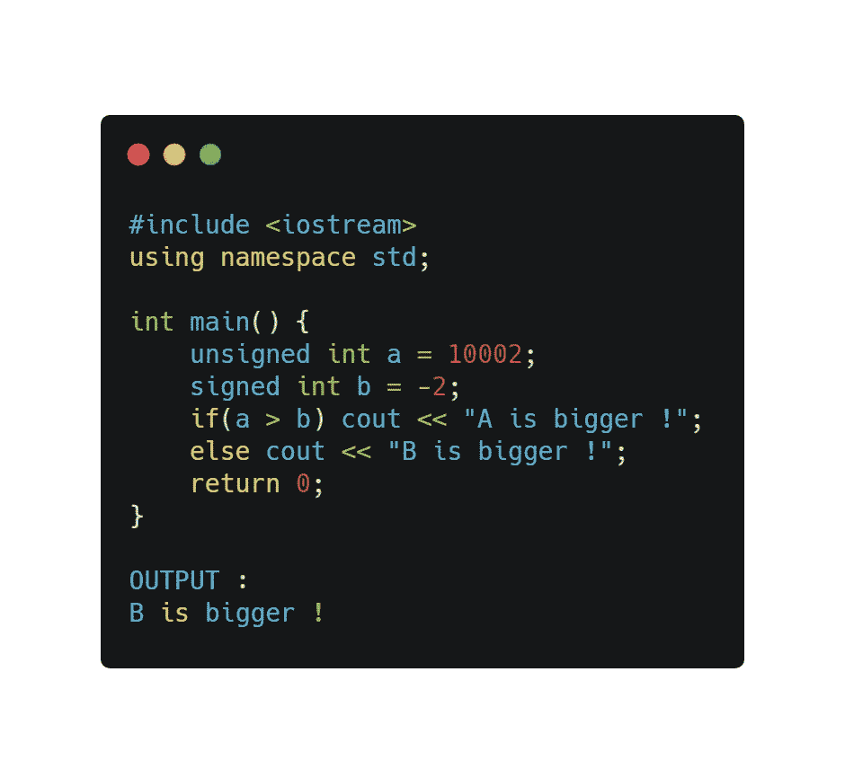

for 循环是一种控制结构，允许您多次执行一个代码块。C 编程语言中 for 循环的语法是-

> for(init；条件；增量){
> 语句；
> }

分号表示语句的结束。loop 语句末尾的分号将进行迭代，直到满足条件，然后继续执行内部的语句。

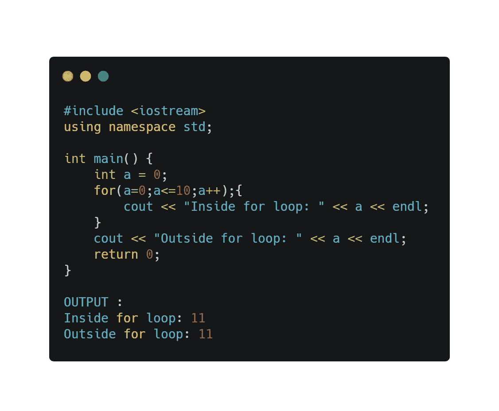

C 预处理器是一个在源程序被传递给编译器之前对其进行处理的程序。预处理命令(称为指令)几乎可以被认为是 C 语言中的一种语言。预处理器用于以下内容:

1.  宏扩展
2.  文件包含
3.  条件编译
4.  杂项指令

看看下面的程序。

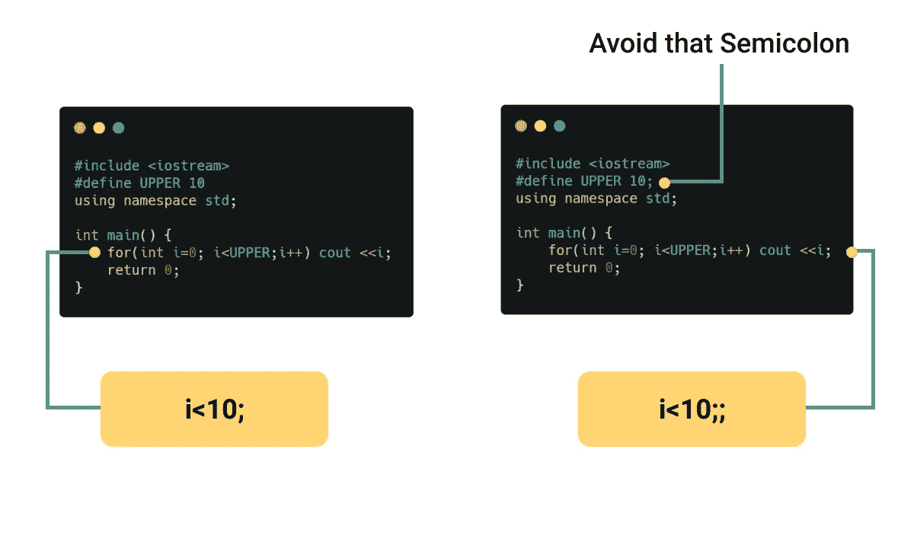

在这个程序中，添加到宏中的分号会产生一个错误，这就是为什么您应该避免在宏中使用分号。

字符串是以空字符结束的字符序列。您可以使用扫描功能来读取字符串。scan 函数读取字符序列，直到遇到空白(空格、换行符、制表符等)。用户输入可能超过数组的大小。聪明的程序员使用这种技术来避免潜在的黑客利用字符串缓冲区。

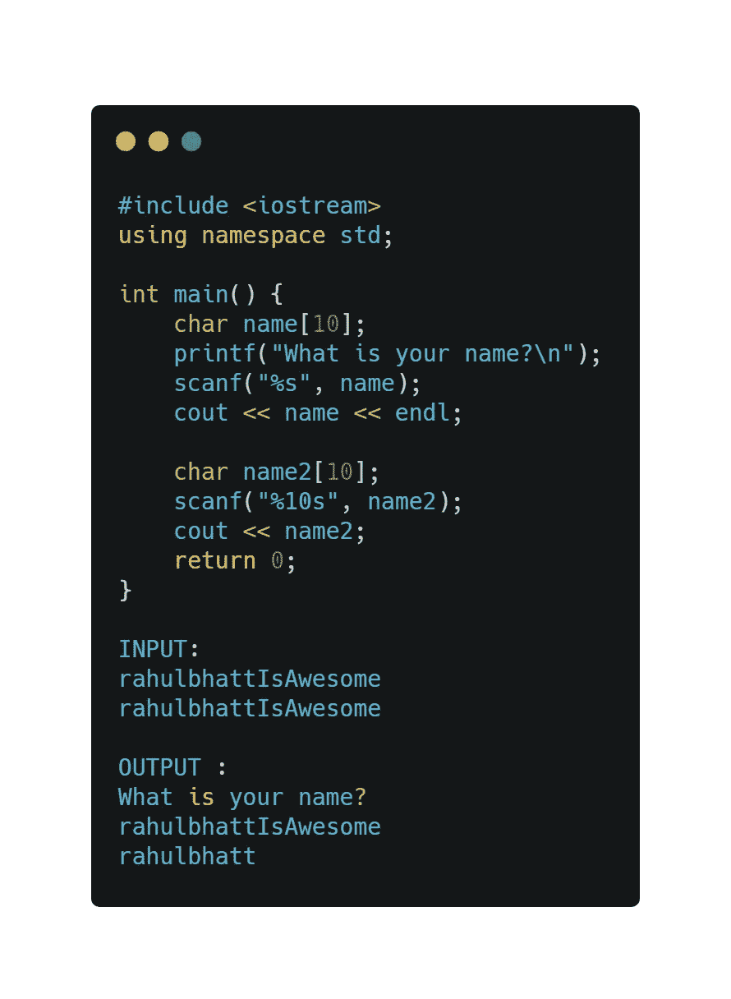

宏是一段已经命名的代码。无论何时使用该名称，它都会被宏的内容所替换。有两种类型的宏——类似对象的宏在使用时类似于数据对象，类似函数的宏类似于函数调用。类似对象的宏是一个简单的标识符，它将被一个代码片段替换。一个类似函数的宏只有在它的名字后面有一对括号时才会展开。

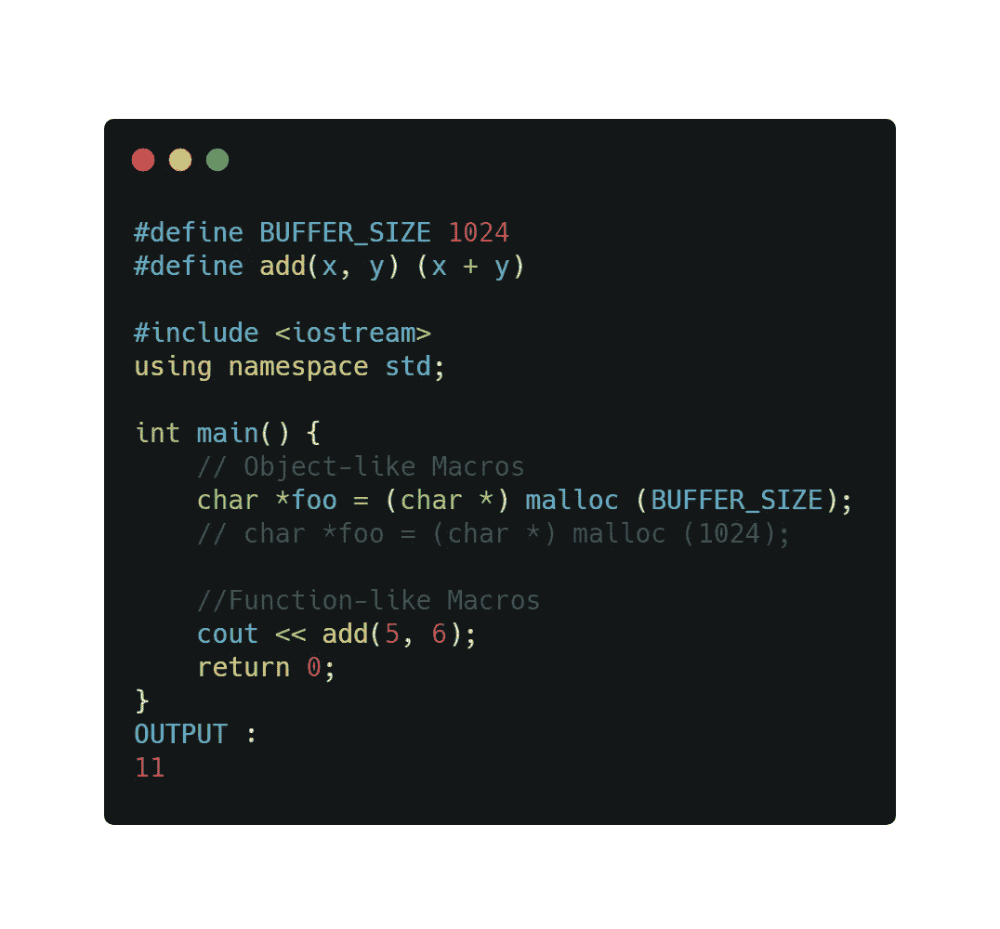

在下面的代码中，程序员希望输出 9，但得到的是 5。这可能是由于优先顺序，即:

1.  [求幂](https://en.wikipedia.org/wiki/Exponentiation)和[求根](https://en.wikipedia.org/wiki/Root_extraction)
2.  [乘法](https://en.wikipedia.org/wiki/Multiplication)和[除法](https://en.wikipedia.org/wiki/Division_(mathematics))
3.  [加法](https://en.wikipedia.org/wiki/Addition)和[减法](https://en.wikipedia.org/wiki/Subtraction)

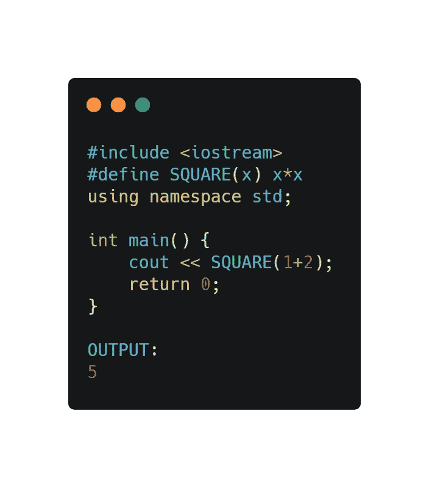

在下面的代码中，n1 被初始化并被舍入到单精度，结果得到值 0.10000000149011612。然后，n1 被转换回双精度，以便与 0.1 文字(等于 0.1000000000000001)进行比较，这会产生不匹配。

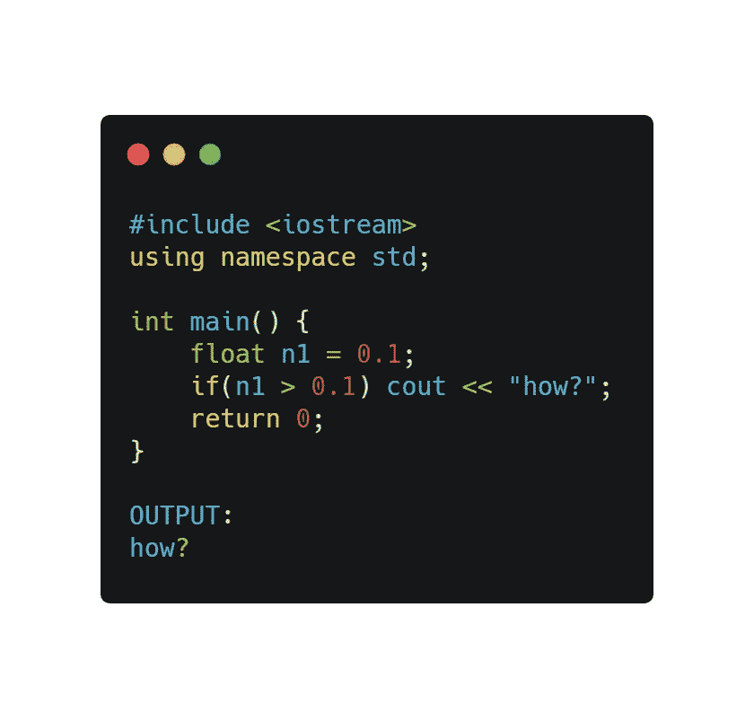

数组是一种按顺序存储元素的数据结构。数组中的元素线性存储在内存中。程序员应该避免在循环语句中直接使用数组大小的值。当程序超出数组边界时，将显示垃圾值。

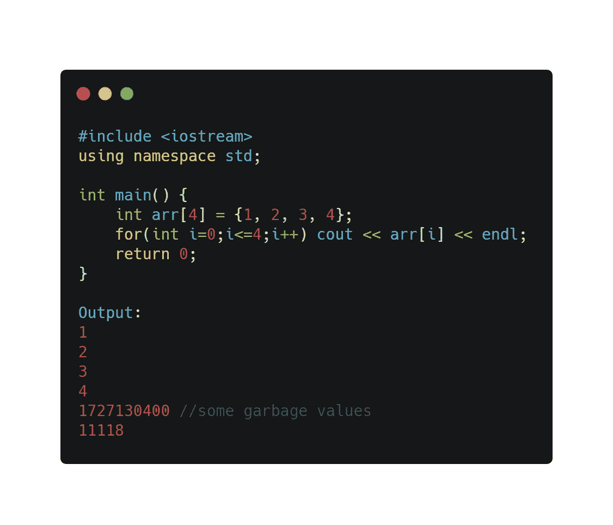

在 C 编程中，字符常量不同于字符串文字。用单引号括起来的字符是字符常量。字符常量是一个整数，其值是代表字符的字符代码。用双引号括起来的零个或多个字符是字符串文字。字符串是一个不可变的数组，它的元素是 char 类型的。

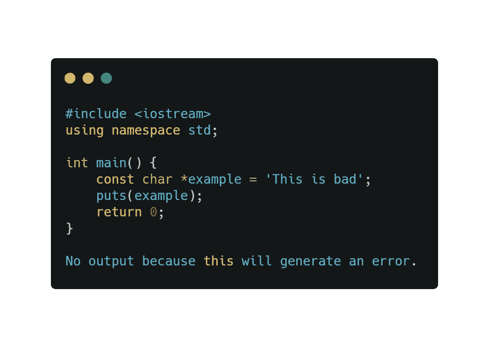

等号(=)用于将值存储在变量中。等号(==)表示两个值或变量之间的比较。下面的代码描述了在错误的地方使用等号(=)的好处。

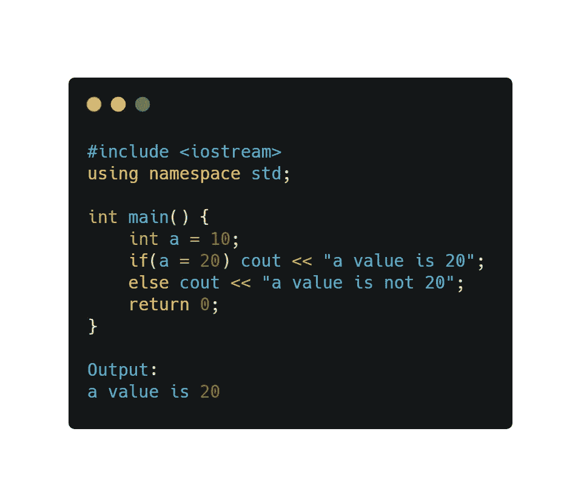

希望你对 c/c++的问题有更多的了解，谢谢你的阅读。