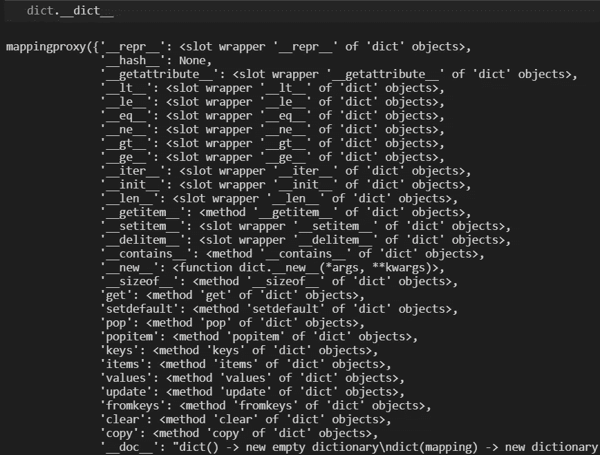
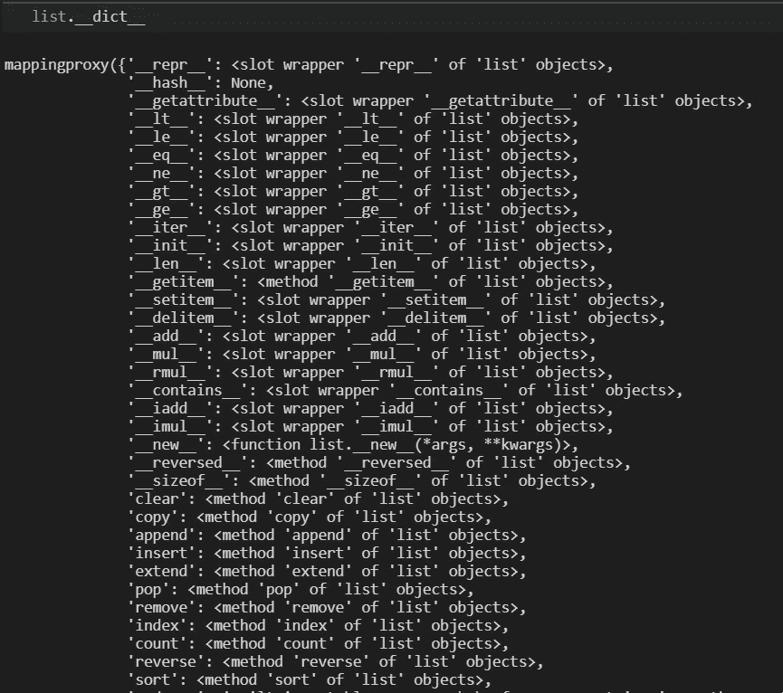
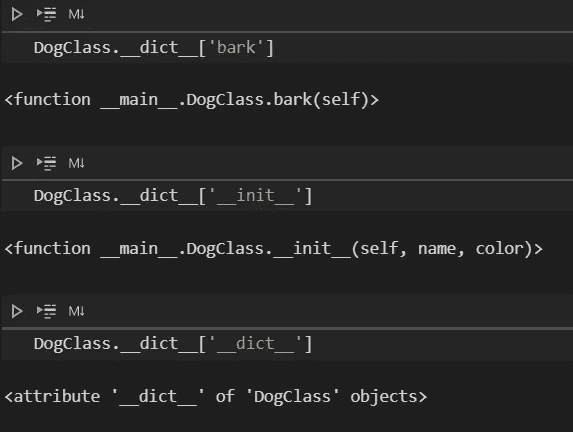
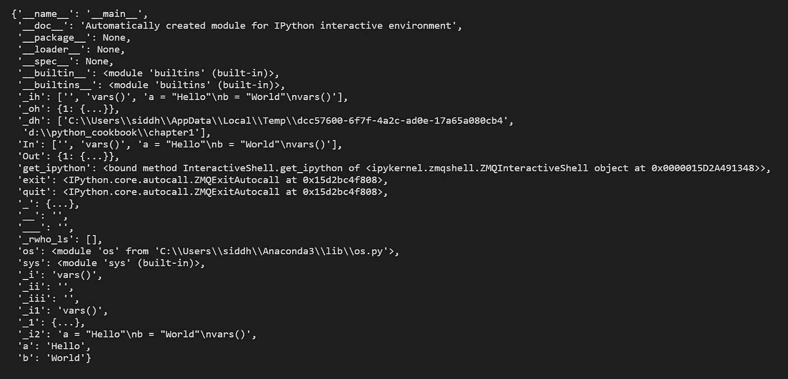
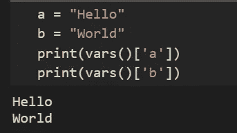
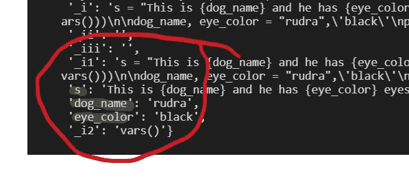

# python 中的 __dict__ 属性和 vars()函数。

> 原文：<https://medium.com/analytics-vidhya/dict-attribute-and-vars-function-in-python-42d82dbaba73?source=collection_archive---------0----------------------->

> __dict__ method 是什么？

1.  根据 python [文档的](https://docs.python.org/3/library/stdtypes.html#object.__dict__)对象。 *__dict__* 是一个字典或其他映射对象，用于存储对象的(可写)属性。
2.  或者用简单的话来说，python 中的每个对象都有一个属性，用 *__dict__ 来表示。*
3.  并且该对象包含为该对象定义的所有属性。__dict__ 也称为 *mappingproxy* 对象。

## 考虑 python 中的 dict 和 list 对象，让我们在这些对象中使用这个方法。



词典



目录

对用户定义的对象和类使用 __dict__ 方法。

从上面的代码中，我们可以观察到，当对 DogClass 类的对象调用 __dict__ 时，我们得到了已定义属性的字典，当对该类直接调用相同的函数时，我们得到了所有内置的已定义变量。



> 现在来说说 python 中的 *vars()* 函数。

1.  *vars(object)* 函数返回对象的 __dict__ 属性，因为我们知道 __dict__ 属性是一个包含对象可变属性的字典。
2.  如果没有为 *vars()* 函数指定值，它将充当 python*locals()*方法。

无参数调用 *vars()* 。在本例中，我们定义了两个全局变量 *a* 和 *b.*

```
a = "Hello"b = "World"vars()
```



var



var

正如我们所知，vars()为我们提供了定义的 python 脚本范围内所有已定义变量的字典表示。让我们为内置对象和用户定义的对象调用这个变量。这与在对象上调用 __dict__ 是一样的。

## vars()的示例(此内容是可选的)

您希望创建一个字符串，其中嵌入的变量名被替换为变量值的字符串表示形式。

在上面的例子中，第一种方法使用一个众所周知的方法来替换变量，但是第二种方法使用 *vars()* 函数来替换脚本范围(全局范围)中定义的变量。

让我们通过调用 vars()来看看脚本的作用域，在这里它们被定义为 dog_name 和 eye_color 在全局作用域中被定义为键值对，format 使用这些键来替换这些值。



现在，string.format()的主要问题是，如果发现缺少的值，我们会得到一个错误。因此，在这里我们可以利用 python 自己的 __missing__() dunder 方法。下面定义的 MissingClass 继承了 dict 对象，如果键丢失了，我们可以给出自定义输出。

> 参考资料:

[](https://www.journaldev.com/23151/python-vars) [## Python vars() - JournalDev

### python vars()函数，python vars __dict__ dictionary，python vars() TypeError，类的 Python vars，实例…

www.journaldev.com](https://www.journaldev.com/23151/python-vars)  [## Python 字符串格式 _map()

### 在说 format_map()之前。让我们看看 str.format(**mapping)如何为 Python 字典工作。点=…

www.programiz.com](https://www.programiz.com/python-programming/methods/string/format_map) [](https://www.oreilly.com/library/view/python-cookbook-3rd/9781449357337/) [## Python 食谱，第三版

### 如果你需要用 Python 3 写程序的帮助，或者想更新旧的 Python 2 代码，这本书正好合适。

www.oreilly.com](https://www.oreilly.com/library/view/python-cookbook-3rd/9781449357337/)