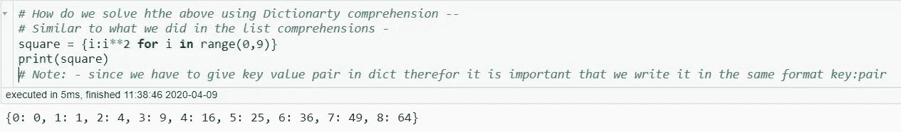

# 字典和集合理解

> 原文：<https://medium.com/analytics-vidhya/dictionary-set-comprehensions-a970a9552327?source=collection_archive---------9----------------------->

字典理解与列表理解非常相似——但是我们用密钥对值代替值。如果你没有看过我在[列表理解](/analytics-vidhya/list-comprehensions-9de2f2752c72?source=friends_link&sk=6f45c55e9af6eee9da0c1fa976f3bd0f)上的上一篇博客。我建议你在我们跳到字典理解之前先看一下它

链接至 List Comprehensions—[https://medium . com/analytics-vid hya/List-Comprehensions-9de 2f 2752 c 72？source = friends _ link&sk = 6 f 45 c 55 e 9 af 6 eee 9 da 0 C1 fa 976 F3 BD 0 f](/analytics-vidhya/list-comprehensions-9de2f2752c72?source=friends_link&sk=6f45c55e9af6eee9da0c1fa976f3bd0f)

看看早先的例子，数字的平方从 0 到 8(类似于我们在列表中所做的)。让我们用这样的字典打印数字的平方——square = { 1:1，2:4…}

这正是 ***的基本方法——***

注意:因为右元素不在范围内，所以为了得到从 0 到 8 的平方，我们必须给出到 9 的范围。

从 0 到 8 的数字的平方

我们如何使用字典理解 —
解决上面的**(类似于我们在列表理解中所做的-)**

首先，我们编写我们想要的输出(在本例中我们想要 x**2 ),然后是 for 循环。

从 0 到 8 的数字的平方

如果你想在单独的行中打印它们，只需运行如下所示的 for 循环

以上输出打印在单独的行中

让我们把它变得漂亮一点——我们给它加上一个“f”字符串怎么样——

这个输出现在看起来好多了:)

让我们看看其他的例子-

***面试中最常见的例子和最重要的问题还有— ******
使用字典统计字符串中字符的出现次数—
因此，我们需要了解一些基本的字符串函数，例如— **统计字符串中字符的函数是—*string . Count(char)***
假设我们有一个*string 1—‘sunny’*，我们想统计字符在

> 这是我们如何使用**字典**来做的

计算字符串中唯一字符的出现次数

> 我们如何使用**字典理解**来解决上面的例子

计算字符串中唯一字符的出现次数

> *如果我们有一个句子，而不是一个单词，并且我们想计算这个字符串中每个单词的出现次数，该怎么办*

让我们使用 **split()** 方法将字符串转换成一个列表。如果你需要字符串操作和函数的详细解释。请在评论区告诉我。我会发表一篇相关的博客。

使用 split()方法将字符串转换为列表

现在让我们创建一个空字典 string2 = {}，然后在该列表上实现一个 for 循环，以获得每个单词的计数，如下所示

让我们看看如何使用**字典理解-** 解决上述问题陈述

**步骤—**

我们首先在花括号内写出我们想要的输出(因为它是一个字典)。在这种情况下，我们希望我们的输出看起来像**、T5、【字典】:1..等等..(key: value pair)** 这里的*【字典】*是我们的*键**1*是我们的*值* -

正如我们所知，为了得到字符串的计数，我们有一个函数***string . count(char)***所以使用这个函数我们可以把输出写成*keys:string 1 . count(keys)**后跟 for 循环*中的键 1**

**

# ***词典释义中的 If-Else***

*假设我们想要一个字典，它包含范围从 0 到 10 的偶数的平方和奇数的立方
，我们如何使用字典实现这个*

************

***如果您希望输出在单独的行中—实现如下所示的 for 循环—***

******

***让我们看看如何使用**字典理解-** 来实现这一点***

******

***让我们使用 for 循环将它们打印在单独的行中***

******

# ***太好了，我们完成了字典理解。***

******

***让我们进入下一部分——***

# ***集合理解***

***让我们看看如何使用集合理解——虽然它很少在编码中使用，但知道它总是好的:)
我们都知道集合是唯一项 ***的无序集合*** 因此没有定义固定的顺序——输出可以按任何顺序打印
这类似于我们一直在用**列表**和**字典**所做的事情。让我们直接移动到它的实现
**例如——**
如果我们想打印范围从 0，11 的数字的平方那么——这就是我们在**集合理解**中的做法——***

************

***正如我们所看到的，我们得到的输出没有按顺序排列——因为**集合**是一个无序的 *集合* ***唯一的*** *条目*。运行它时，您可能会得到不同的答案。
在字典中，我们指定了*键*和*值*，但是在集合中，我们只指定值。***

***让我们来看看上面提到的 ***square_cube 示例******

******

***我希望你们都喜欢这个关于**集合和词典理解**的教程。***

******

***你可以在这里找到[列表理解](/analytics-vidhya/list-comprehensions-9de2f2752c72?source=friends_link&sk=6f45c55e9af6eee9da0c1fa976f3bd0f)的详细解释。***

***不断学习。注意安全。我的 Github 链接是—***

*** [## DeeptiAgl -概述

### 在 GitHub 上注册你自己的个人资料，这是托管代码、管理项目和构建软件的最佳地方…

github.com](https://github.com/DeeptiAgl?tab=repositories) 

领英-【https://www.linkedin.com/in/deepti-aggarwal/ 

*注:—图片取自剪贴画库****