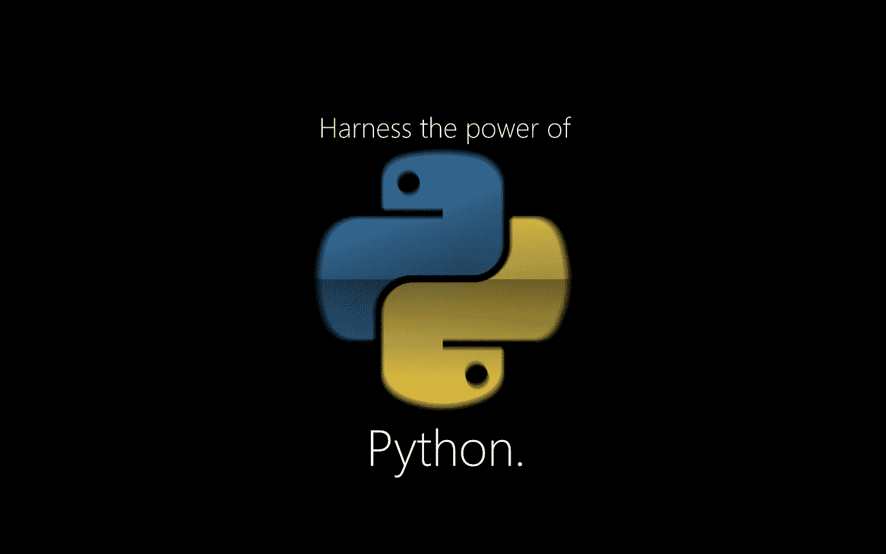
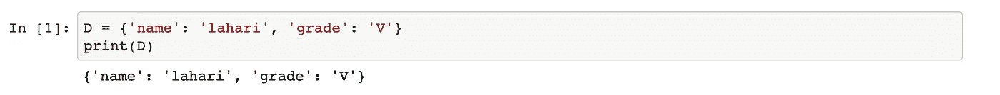

# 字典遍历 Python

> 原文：<https://medium.com/analytics-vidhya/dictionary-walk-through-python-74274b2baf71?source=collection_archive---------13----------------------->

Dictionary 是包含一组元素的映射数据结构，其中每个元素都是一个键值对。其他编程语言中的字典被称为散列或关联数组。字典是由关键字索引的，而不是像列表或元组那样由整数索引的。下面是一个简单字典的例子。

简单字典程序示例

**创建字典的替代方法**

我们也可以使用 dict 构造函数创建一个字典。dict()函数直接从键值对列表中创建一个字典。另一种方法是使用关键字参数创建字典，其中关键字必须指定为字符串。这两种机制如下所示。

创建字典的替代方法

**向字典添加元素**

向字典中添加元素非常简单，不需要任何函数，比如在列表中添加。为不存在的键赋值会自动向其中添加一个元素。如果密钥已经存在，它将覆盖给定的新值。下面是一个演示相同内容的示例。

向字典中添加元素

**如何访问字典中的元素？**

如果我们有一个检索值的键，就可以访问字典中的元素，反之则不然。如果我们尝试使用值访问一个键，将会导致键错误。下面是一个演示相同内容的示例。

访问字典示例中的元素

键是唯一的吗？

字典中的键必须是唯一的，否则当您更新相同的键时，键的最新值将覆盖旧值。值不必是唯一的，甚至可以有重复的值。下面是一个描述相同情况的例子。

字典键唯一性

**什么类型的对象可能是键？**

虽然我们可以将任何对象作为字典的值，但是对于用作键的对象有一定的限制。字典中的键必须是不可变的对象数据类型。这意味着任何一旦创建就不能改变其值的对象都可以用作键。

python 中的一些不可变对象是整数、浮点、复杂、字符串、布尔、元组、范围运算符、冻结集、Unicode 等。所有这些对象一旦被创建就不能被修改，因此可以用作字典中的关键字。以下是一些例子。

用作密钥的不同对象

在上面的例子中，Object 被用作一个键，因为它是不可变的，并且对象引用地址在创建后不会改变。

要深入了解 Python 内部，请在 Linkedin 上关注我-[https://www.linkedin.com/in/krishnabvv/](https://www.linkedin.com/in/krishnabvv/)