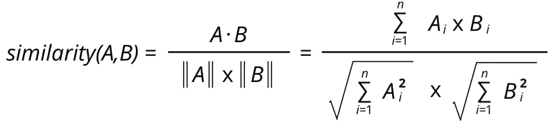

# 亚马逊刚刚向你推荐了你想买的商品吗？

> 原文：<https://medium.com/analytics-vidhya/did-amazon-just-recommend-you-the-item-you-wanted-to-buy-b56622b6051d?source=collection_archive---------26----------------------->

想知道网飞/亚马逊是如何推荐你购买电影/产品的吗？嗯，几乎所有的时间，他们让你的兴趣显示出来。

# 推荐系统

> 欢迎光临！！在这篇文章中，我们将深入探讨我们每天不知不觉遇到的最有趣的话题。

来源:谷歌

推荐算法因其在电子商务网站上的应用而广为人知，在电子商务网站上，它们使用关于客户兴趣的输入来生成推荐项目的列表。

在 Amazon.com，推荐算法被用来为每个顾客个性化在线商店。商店根据顾客的兴趣彻底改变。给热心读者的书，给母亲的婴儿用品，你懂的。

> 那么推荐系统是如何工作的呢？

在此之前，让我们知道有两种主要的方法来解决推荐问题。

1.  传统的协同过滤。
2.  基于搜索的方法。

事实上，亚马逊使用了一种叫做“项目对项目协同过滤”的东西，我们将在稍后讨论。让我们首先理解上面提到的方法。

# **传统协同过滤:**

这种方法最初基于偏好识别相似的用户。这可以通过以下公式实现:

图片来源:谷歌

第二步，算法根据与用户最相似的几个客户的评分生成推荐。

该算法还可以使用各种方法从相似的客户项目中选择推荐，一种常见的技术是根据有多少相似的客户购买了每个项目来对其进行排序。

## 缺点:

使用这种方法计算量很大。这里，最坏的情况往往是 O(MN)，‘M’是客户的数量，而‘N’是产品目录项目的数量。虽然我们可以使用聚类或主成分分析(PCA)等降维方法来减少这种情况，但它们也往往会以几种方式降低推荐质量。
的另一个主要缺点，是用户偏好往往会随着时间而改变。

# 基于搜索的方法

搜索或基于内容的方法将推荐问题视为搜索相关项目。给定用户购买和评级的项目，该算法进行搜索查询以找出同一作者、艺术家的其他流行项目。如果用户很少购买或评级，基于搜索的算法规模和性能良好

## 缺点:

如果用户购买了数千种商品，那么基于所有商品进行查询就变得不切实际了。该算法被迫使用数据的子集，这最终降低了模型的质量。在这些情况下，建议要么非常笼统，要么过于狭隘。

# 最后，Amazon.com 用的那个

> Amazon.com 广泛使用推荐算法来个性化其网站，以满足每个客户的兴趣。因为上面提到的算法，无法规模化数千万的客户和产品，亚马逊开发了被称为**单品到单品协同过滤**的东西。

点击“推荐给你”，打开一个区域，他们可以按产品线和主题领域提交推荐。

Amazon.com

## 工作:

这种方法不是简单地将用户与相似的用户进行匹配，而是将用户购买和评价的每个项目进行匹配，然后将这些相似的项目组合成一个推荐列表。

为了确定给定商品的最相似匹配，该算法通过查找顾客倾向于一起购买的商品来构建相似商品表。给定一个相似项目表，该算法查找与用户的购买和评级相似的项目，并聚合这些项目，然后推荐最受欢迎或最相关的项目。这种计算非常快，仅取决于用户购买或评价的项目数量。

这个方法的关键在于*相似物品表是离线创建的。*算法在线组件——为用户的购买和评级查找类似商品——独立于客户总数进行扩展。这仅仅取决于用户已经购买了多少个标题。

我希望我能给你提供一个小小的机会，让你了解我们在数字生活中是如何被推荐的。

你可以在 [LinkedIn](https://www.linkedin.com/in/lokeshrathi/) 和 [GitHub](https://github.com/Lokeshrathi) 上关注我，了解更多类似的有趣话题。