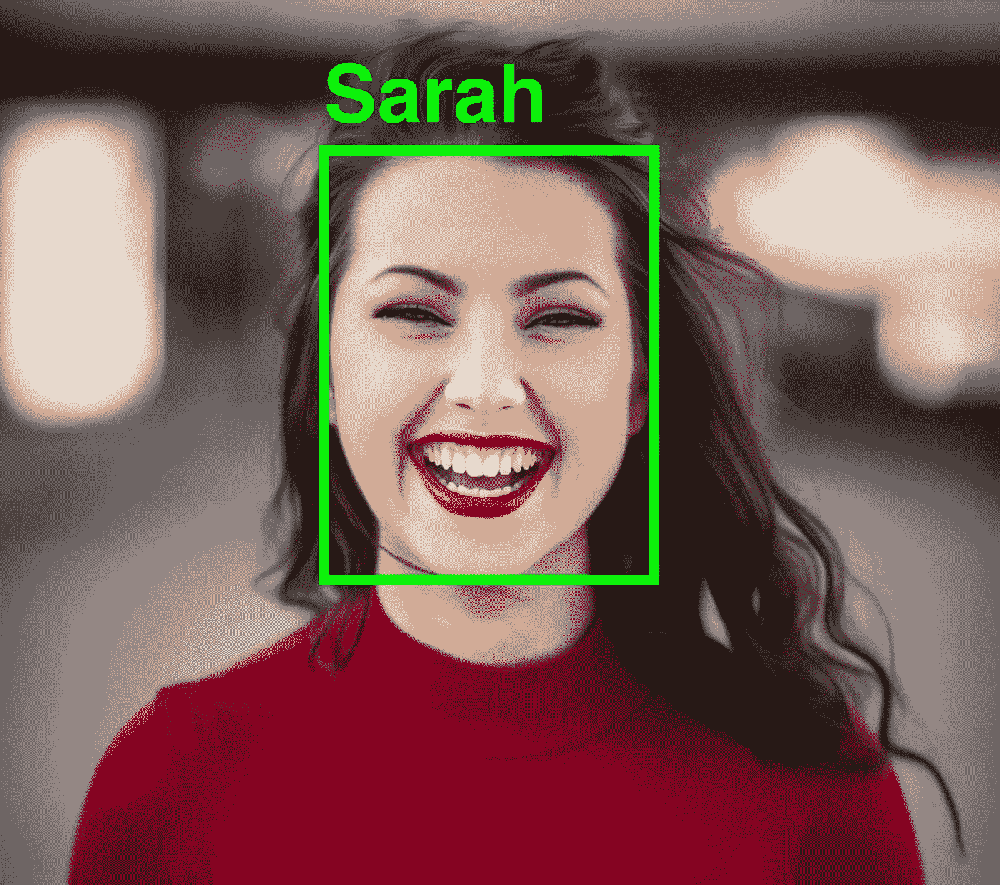
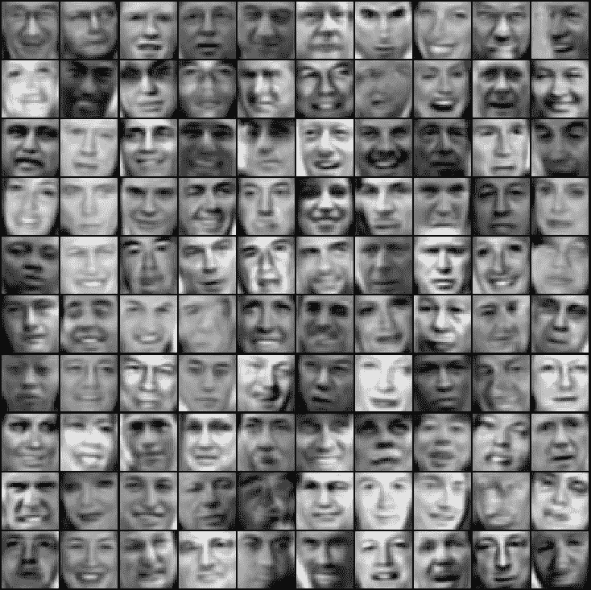
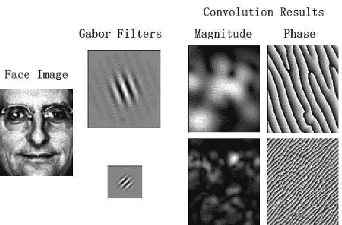
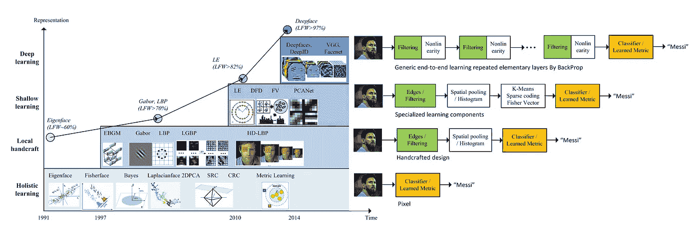
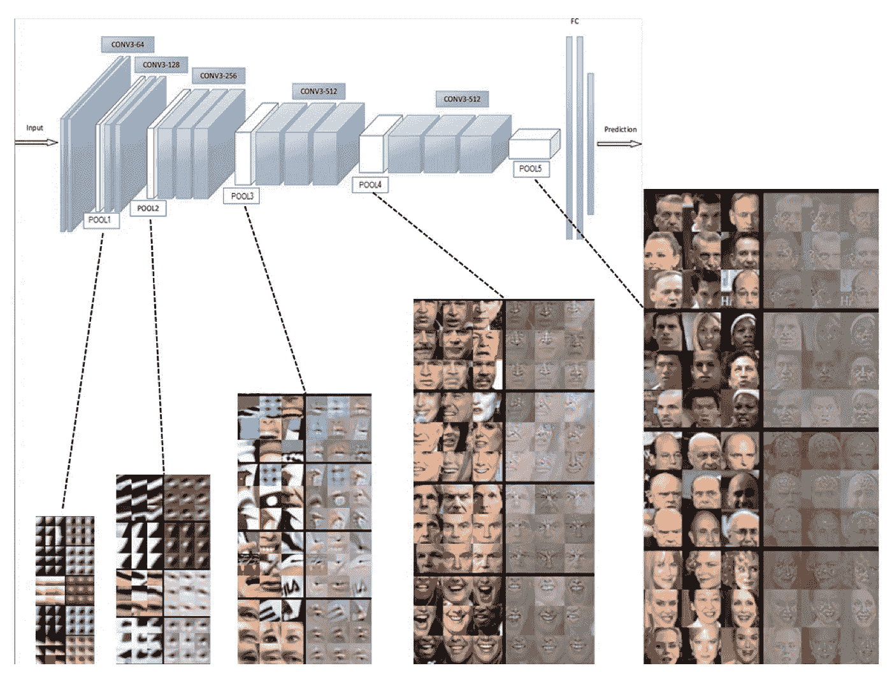

# 你知道面部识别在 20 世纪 60 年代就存在了吗？

> 原文：<https://medium.com/analytics-vidhya/did-you-know-facial-recognition-existed-in-1960s-2f0961e1bf5b?source=collection_archive---------8----------------------->

## 为什么现在流行起来了？

人脸识别(原始图片来自 Unsplash)

*原载于*[*【www.xailient.com/blog】*](http://xailient.com/post/facial-recognition-evolution)*。*

人脸识别的概念并不新鲜，它的实现也不新鲜。使用计算机识别人脸可以追溯到 20 世纪 60 年代。

是的，没错，我说的是 20 世纪 60 年代。

> 从 1964 年到 1966 年，伍德罗·w·布莱索与加利福尼亚帕洛阿尔托全景研究公司的海伦·陈和查尔斯·比森一起，研究编程计算机识别人脸(布莱索 1966a，1966b 布莱索和陈 1965)[4]

从那以后，人脸识别经历了多次演变。在 20 世纪 90 年代初，整体方法主导了面部识别社区。在此期间，人脸图像的低维特征是由特征脸方法得到的。

图像显示了前 36 个特征脸[5]

在 21 世纪初，引入了基于局部特征的人脸识别，其中使用手工制作的滤波器(如 Gabor 和 LBP)提取区别特征。

*两个 Gabor 滤波器对人脸图像的卷积结果。[3]*

在 2010 年代早期，引入了基于学习的局部描述符，其中学习了局部滤波器和编码器。

*人脸识别进化时间线[1]*

2014 年是人脸识别历史上重要的一年，因为它重塑了这项技术的研究前景。这一年，脸书的 DeepFace 模型在 LFW 基准数据集上的准确率(97.35%)首次接近人类的表现(97.53%)。在这一突破后的短短三年时间里，人脸识别准确率达到了 99.80%。

那么，这些年发生了什么变化？

直到 2014 年，所有方法都使用一层或两层表示法，如过滤、特征码直方图或字典原子分布来识别人脸。然而，基于深度学习的模型使用多层级联进行特征提取和转换。较低层学习类似于 Gabor 和 SIFT 的低级特征，而较高层学习较高级别的抽象。这意味着，当时不同的人脸识别方法可以单独完成的事情，现在可以只使用一种基于深度学习的方法来完成。

*表示深度学习网络中不同层的人脸的特征向量【1】*

*面部识别是否处于这场进化的巅峰？还是你相信这只是冰山一角？* ***在下面留下你的想法作为评论。***

*想用世界上最小的人脸识别？* [*点击这里*](https://share.hsforms.com/1UivIQ9DATe23nMVVa_8q5w3l9un)

*还是对最小最快的人脸检测器更感兴趣？然后* [*点击这里。*](http://console.xailient.com)

***关于作者***

*Sabina Pokhrel 在*[*xai lient*](http://www.xailient.com/)*工作，这是一家计算机视觉初创公司，已经建造了世界上最快的边缘优化物体探测器。*

***参考文献***

[1]梅，王，，邓.“深度人脸识别:一项调查。” *arXiv 预印本 arXiv:1804.06655* 1 (2018)。

[2] Zulfiqar，Maheen 等人，“用于生物特征认证的深度人脸识别” *2019 国际电气、通信和计算机工程会议(ICECCE)* 。IEEE，2019。

[3]高，雍等.“利用最具鉴别性的局部和全局特征进行人脸识别.”*第 18 届国际模式识别会议(ICPR’06)*。第一卷。IEEE，2006 年。

[https://www.historyofinformation.com/detail.php?id=2126](https://www.historyofinformation.com/detail.php?id=2126)

[https://mikedusenberry.com/on-eigenfaces](https://mikedusenberry.com/on-eigenfaces)