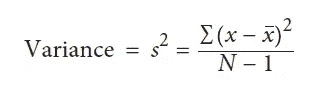
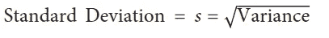

# 你知道为什么我们在计算方差时用 N-1 除吗..

> 原文：<https://medium.com/analytics-vidhya/did-you-know-why-we-divide-with-n-1-while-calculating-variance-8abde31c0661?source=collection_archive---------17----------------------->

差异

本文将带您了解为什么我们在计算方差时在分母中使用 N-1 而不是 N。

如果你除以 N，那么它将导致一个有偏差的估计，因为你最终会低估人口中标准差的真实值

标准偏差

一定在想**为什么 N 会导致有偏差的估计？** —整个事情围绕着**的概念*自由度。***

**自由度**在计算估计值时考虑了约束条件的数量。这里，由于方差取决于样本均值的计算，因此我们有一个约束，因此自由度是 N-1。

因此，如果除以 N-1，那么标准差就变成了无偏估计。

希望你喜欢。更多此类文章请关注我的 Github。

链接:-[https://github.com/DeeptiAgl?tab=repositories](https://github.com/DeeptiAgl?tab=repositories)