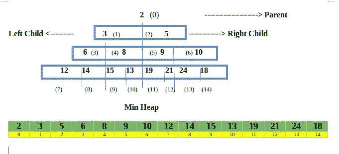
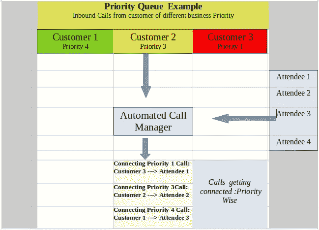
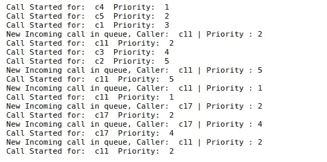

# 没看懂堆？让我们来执行和了解。

> 原文：<https://medium.com/analytics-vidhya/didnt-understand-heap-lets-implement-and-know-eeb80395198?source=collection_archive---------18----------------------->

优先排队的一个例子，优先考虑紧急业务。


# **堆数据结构**

二叉堆是一种基于*树的数据结构*拥有一棵完整的“二叉树”。

> 堆可以分为两类，**最小堆**和**最大堆**



**最小堆**:左子和右子都必须大于父堆，因此最小堆在顶部，而在**最大堆中:**父堆大于两个子堆，因此最大堆在顶部

# **堆的用例，优先级队列。**

当不断添加和删除数据时，堆是有用的。假设我们有一个元素列表，我们需要一次画出最高的元素，但是与此同时，有一个元素的实时添加正在进行。让我们用下面的例子来理解它。

**呼叫中心案例**

在某个地方有一个呼叫中心，雇佣了六个电话参与者，电话如潮水般涌来，有些电话是关于基本问题的，有些是关于真正的商业问题的。自动化系统将如何识别并优先处理这些问题？这里，使用优先级队列是一个可行的选择，因此**堆数据结构**成为一个完美的候选对象。为了更好的理解，请看下图。



来电将根据其重要性进行优先排序

我们可以自己创建堆，但是 Python 有一个名为" **heapq"** 的内置库，为了保持代码简短，我们使用它**。**如果你还想给自己代码堆，可以从“geeksforgeeks.org”上的文章列表中找到适合自己的代码→ [**点击这里**](https://www.geeksforgeeks.org/medium/heap/2/) **。**

所以让我们来看看编码部分，了解它的本质。

# **启动**

```
#Importing Libraries
import heapq
import time
import random
import schedule# Adding some calls into the list of tuples
# Priority(1 to 5), ‘Caller name’)
call_queue = [
 (3, ‘c1’),
 (1, ‘c4’),
 (4, ‘c3’),
 (5, ‘c2’),
 (2, ‘c5’),
 ]# heapify function makes a heap of the given list
heapq.heapify(call_queue)
```

# **添加功能**

**随机呼叫添加:**因为我们正在创建一个示例，所以我将通过调度在队列中添加额外的随机呼叫。

```
def add_call(): # With some Random Priorities and Random users
    call_tuple = (
              random.randint(1,5), 
              random.choice(['c13','c15','c17','c18','c11','c14',]))

    print('New Incoming call in queue, Caller: ',call_tuple[1],
          '| Priority :',call_tuple[0])

    heapq.heappush(call_queue,call_tuple)
```

**弹出“下一个优先级”调用**

```
def call_manager(): 
if len(call_queue)==0:
     return
 else:
     popped = heapq.heappop(call_queue)
     print(‘Call Started for: ‘,popped[1],’ Priority: ‘,popped[0])
```

# **安排作业并运行时间表**

```
# Scheduling Sample Calls
schedule.every(3).seconds.do(call_manager)
schedule.every(10).seconds.do(add_call)# Running the Schedule
while True:
    schedule.run_pending() 
    time.sleep(1)
```

**输出:**让我们看看终端发生了什么



每当添加一个“高优先级呼叫”时，它将获得“第一优先级”

这是一个基于最小堆的优先级队列的例子。可以有其他用途，如从不断追加新元素的列表中查找最小值、最大值或中值，查找具有最大活动 Covid 情况的时间段。寻找人口最少或最多的一天。

在 Heap 的下一篇博客中，我将为上述呼叫中心案例创建一个例子，很可能是一个应用程序。


> 希望你喜欢这篇文章。
> 
> **请喜欢并跟随。**
> 
> 再见！！！！！过得愉快