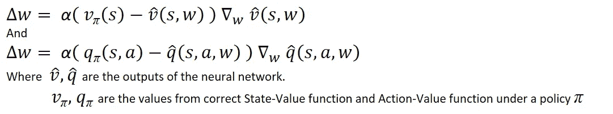

# 差分 b/w 监督学习和强化学习

> 原文：<https://medium.com/analytics-vidhya/difference-b-w-supervised-learning-and-reinforcement-learning-ee7fd1ffb945?source=collection_archive---------15----------------------->

用数学来解释这两个学科之间的细微差别

鉴于机器学习、深度学习等的丰富资源、内容和例子，在这个学科中总有一个问题会阻碍我们掌握这些技能的计划。其中一个问题是监督学习和强化学习之间的区别。这个问题的答案可以增加清晰度、直觉和加深对这些学科的理解。这篇文章的目的是在数学方程的层面上解释这种差异。

在追求这个问题的过程中，你会偶然发现机器学习、深度学习、监督和非监督学习以及强化学习的基础知识。假设有了这些基本知识，我们将直接解决头脑中的问题。

首先，监督学习(SL)和强化学习(RL)之间有很多表面上的差异。然而，这些差异在更高的层次上起作用，而没有提供任何关于潜在的微妙差异的直觉。(介意修改一下吗？…点击[这里](https://www.educba.com/supervised-learning-vs-reinforcement-learning/)

# 监督学习

现在，考虑监督学习，

1.  我们有一个数据集，数据集的每个成员都有标签注释。
2.  我们使用数据集来训练神经网络(NN)，以便它学习一种将相应数据映射到其标签的方法。
3.  我们使用经过训练的模型来检查其在测试(或真实生活)数据上的性能，并评估其性能。

在上面的解释中，最重要的一步(**第二步**)决定了模型的**效率**。在这个训练步骤中，我们使用**梯度下降算法。**(为什么用这个？… [查看此处了解详情](https://towardsdatascience.com/understanding-the-mathematics-behind-gradient-descent-dde5dc9be06e))

数学上表示的算法如下所示:

梯度下降表示方程**【1】**

其中***【wᵢ】***表示网络的权重
***α***表示学习率。

关注**误差函数**，它描述了两个量之间的差异:

1.  值 **ŷ** :神经网络的输出值。
2.  值 **y** :地面真实标签值(从带标签的**数据集**中获得)

在监督学习的最简单的情况下，如果使用的误差函数是"**平均绝对误差** " ( [在这里检查其他类型](https://heartbeat.fritz.ai/5-regression-loss-functions-all-machine-learners-should-know-4fb140e9d4b0))，那么误差看起来像:

监督学习的误差方程**【2】**

其中 ***b*** 是网络的偏置参数。
有了对[2]所代表的方程的理解，我们对答案已经走了一半。

# 强化学习

现在考虑下面的**强化学习**的情况:

**RL 框架** ( [来源](https://www.kdnuggets.com/2018/03/5-things-reinforcement-learning.html))**【3】**

1.  我们有**智能体**、**神经网络**(或**模型**)和**环境**。
2.  我们使用**状态**、**动作**、**奖励**、**下一状态**策略来训练由神经网络表示的模型。
3.  代理被训练并基于(接近)最优策略执行动作，该策略使来自环境的**累积回报**最大化。

在上面对强化学习的粗略解释中，最重要的步骤(显然)是训练网络。讽刺的是，我们在这里也使用了**梯度下降算法**。但是怎么做呢？

梯度下降算法的数学表达式保持不变(从 1 导出)。但是，问题是**错误函数**。在强化学习中，我们可以根据**动作值**函数和**状态值**函数计算误差。在这两种情况下，区别应该是这样的:

基于**状态值**、**动作值**功能**、**的误差方程

# 差别

令人惊讶的是从方程来看(**【2】&【4】)**，这两类机器学习不止相似(**不是吗？** )
**其实没有**。尽管在数学上描述相同，但这两个等式在一个特定的性能点上有所不同。基于上述等式的 **SL** 和 **RL** 之间最细微的差别如下…

在监督学习中，我们有一个**地面真实标签** **值** ( ***yᵢ*** )来比较我们网络的结果( ***ŷ*** )，但是在强化学习的情况下，我们实际上**没有**正确的状态值**(***【v(π)***)和**动作值**没有**实体**，它会通知我们关于**最优状态值( *v(π)* )** 和**动作值( *q(π)* )** 的函数。代理的目标是与环境交互并为方程计算正确的值函数。**

那么，**我们是在用价值函数计算来自网络的价值函数吗？**(这是一个**方程式——悖论**？！)
这就是**ε-贪婪政策**(这是什么？ [**…**](https://prakhartechviz.blogspot.com/2019/02/epsilon-greedy-reinforcement-learning.html) )来帮助我们达到最佳值。在强化学习中大多数流行的学习算法( **SARSA，Q-Learning** )下，网络用随机值**w**进行初始化，这里使用的**策略** (π)是基于来自神经元的**动作值 *q(s，a，w)*** 的 **ε** - **贪婪策略**
所以，我们使用ε-贪婪策略，根据奖励( ***R*** )和下一个状态 ***q(s `，a，w)*** 的 action-value 采取行动并更新值。

深度学习的梯度下降**【5】**

其中 ***γ*** 为**折现率**，决定**未来奖励**对**代理**的重要程度。([……](https://stats.stackexchange.com/questions/221402/understanding-the-role-of-the-discount-factor-in-reinforcement-learning))

**总之，运行*监督学习*和*强化学习*的需求、运行环境、变量都有很大的不同。但是，数学方程描述了这两种机器学习之间最微妙和最重要的区别。**是我们吗？或者说，这种解释应该归功于数学？！

嗯，有了数学，设计任何系统的直觉总是变得比以前更好更有趣！