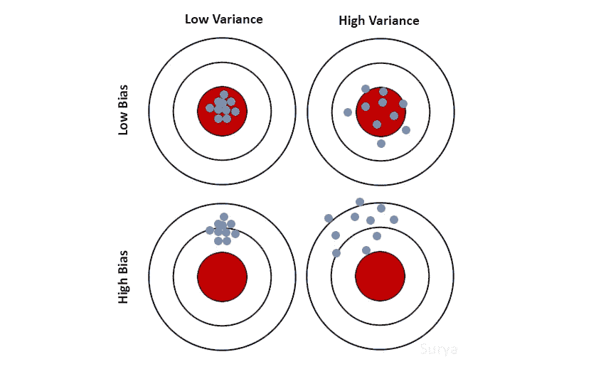
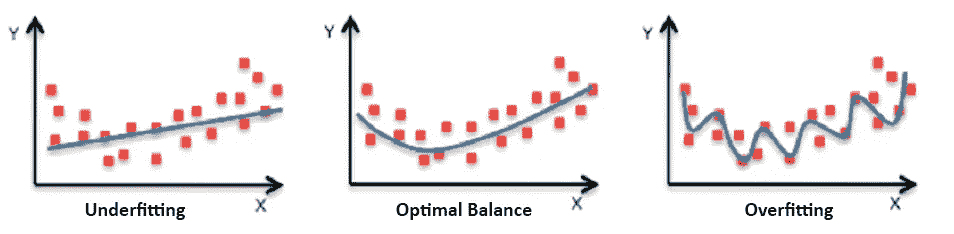
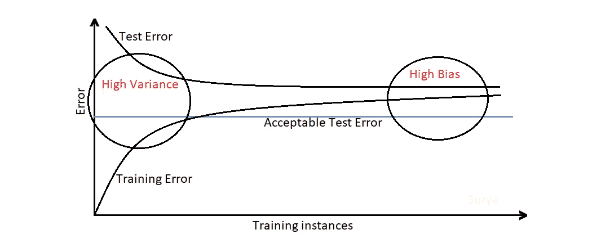
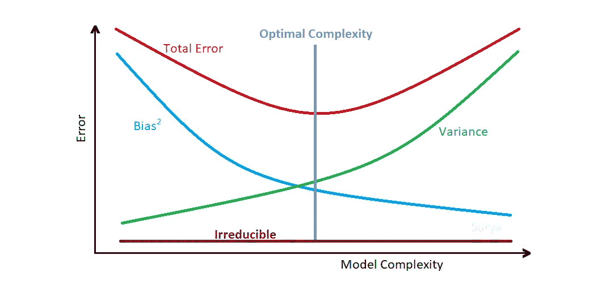

# 简单来说就是偏差和方差！

> 原文：<https://medium.com/analytics-vidhya/difference-between-bias-and-variance-in-machine-learning-fec71880c757?source=collection_archive---------1----------------------->

机器学习中偏差和方差的区别、识别、高值问题、解决方案和权衡

## 什么是偏见？

偏差是平均预测值和正确值之间的差异。又称为 ***偏置误差*** 或 ***偏置误差*** 。

**低偏向模型:**k-最近邻(k=1)，决策树，支持向量机。
**高偏倚模型:**线性回归和 Logistic 回归。

## **什么是方差？**

方差是如果使用不同的训练数据集，预测将改变的量。它测量由于不同的训练数据集，预测值与正确值之间有多分散(不一致)。
又称 ***方差误差*** 或 ***因方差*** 而产生的误差。

**低方差模型:**线性回归和 Logistic 回归。
**高方差模型:**k-最近邻(k=1)、决策树和支持向量机。

## 什么是不可约误差？

不可约误差是指无论模型如何都不能减少的误差。它是对我们的数据中由于未知变量而产生的噪声量的一种度量。此错误无法删除。

## **偏差、方差和不可约误差是如何关联的？**

机器学习模型中的误差是可约误差和不可约误差的总和。
*误差=可约误差+不可约误差*

可约误差是偏差和方差的平方和。
*可约误差=偏差+方差*

结合以上两个方程，我们得到
*误差=偏差+方差+不可约误差*

***数学表示:***

点 x 处的预期平方预测误差由下式表示

## 什么是欠拟合和过拟合 w.r.t 偏差和方差？

偏差和方差组合的表示

**过拟合**:低偏差高方差模型。一般来说，决策树容易过度拟合。

**欠拟合**:高偏差低方差模型。一般来说，线性和逻辑回归容易拟合不足。

欠拟合-最佳平衡-过拟合图

## 不同的偏差-方差组合会带来什么问题？

**高偏差-低方差** ( ***欠拟合*** ):预测一致，但平均不准确。当模型使用很少的参数时，会发生这种情况。

**高偏差-高方差**:预测不一致，平均不准确。

**低偏差-低方差**:理想模型。但是，我们不能做到这一点。

**低偏差-高方差** ( ***过拟合*** ):预测不一致，平均准确。当模型使用大量参数时，可能会发生这种情况。

## 如何识别高方差或高偏倚？

识别高差异/高偏差

当我们具备以下条件时，可以识别高差异:

*   低训练误差(低于可接受的测试误差)
*   高测试误差(高于可接受的测试误差)

当我们有以下情况时，可以确定高偏差:

*   高训练误差(高于可接受的测试误差)
*   测试误差几乎与训练误差相同

## 如何解决高方差或高偏差？

高差异是由于试图拟合大多数训练数据集点的模型使其变得复杂。考虑以下因素以减少高差异:

*   减少输入要素(因为您过度拟合)
*   使用不太复杂的模型
*   包括更多的训练数据
*   增加正则项

高偏差是由于一个简单的模型。考虑以下因素以降低高偏差:

*   使用更复杂的模型(例如:添加多项式特征)
*   增加输入功能
*   减少正则项

## 什么是偏差-方差权衡？

为了提高预测的准确性，我们需要低方差和低偏差的模型。但是，由于以下原因，我们无法实现这一目标:

*   减少方差将增加偏差
*   减少偏差会增加方差

我们需要在偏差和方差之间有一个最佳的模型复杂度(最佳点),它永远不会过拟合或过拟合。

偏差-方差权衡

**感谢**阅读！请👏如果你喜欢这篇文章，请跟我来，因为它鼓励我写更多！