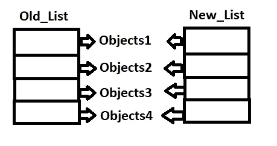
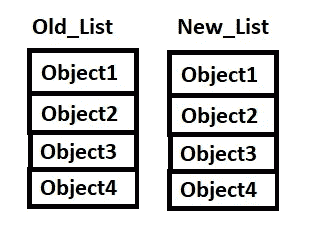

# Python 中深层拷贝和浅层拷贝的区别

> 原文：<https://medium.com/analytics-vidhya/difference-between-deep-copy-and-shallow-copy-in-python-8c7ebc3fca8?source=collection_archive---------3----------------------->

使用复制模块在 python 中复制列表有两种流行的方法:

1.  浅拷贝
2.  深层拷贝

假设我们将内容从 old_list 复制到 new_list。

***浅拷贝:*** 当我们进行浅拷贝时，新列表被创建，旧列表中的对象被分配给新列表。所以两个列表中的对象将共享内存中的**相同的引用**

两个列表中的对象共享相同的引用

让我们看看代码，

我们可以在下面的代码中观察到 Old_list 和 New_list 的对象在内存中没有相同的位置

但是 old_list 和 new _list 中的对象在内存中具有相同的位置

因此，如果我们试图改变 new_list 中的对象，old_list 中具有相同对象的对象也将被改变

***深度复制:*** 这个方法会将 old_list 的内容逐字复制到 new_list，并将 old_list 里面的对象克隆到 new_list。new_list 中的对象不会与 old_list 共享引用 id 或内存位置。

old_list 和 new_list 的对象具有相同的值，但两者存储在不同的位置

Old_list 和 New_list 的对象在内存中的位置不同

旧列表和新列表中的对象具有相同的内容，但在内存中的位置不同

因此，如果我们试图改变 new_list 中的对象，old_list 中具有相同对象的对象将不会被改变

如有任何关于此内容的问题，请随时联系我们。

保持蟒蛇！！