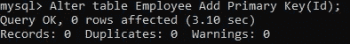
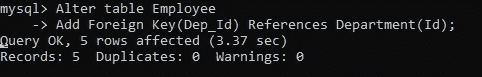

# SQL 键之间的差异(主键、超级键、候选键、外键)

> 原文：<https://medium.com/analytics-vidhya/difference-between-sql-keys-primary-key-super-key-candidate-key-foreign-key-d3b54097feeb?source=collection_archive---------15----------------------->

# 介绍

> SQL Keys 是您在分析领域取得成功的关键！

数据正以指数速度增长，对精通数据库的专业人员的需求也在增长。

世界各地的组织都在寻找能够从海量数据中得出有意义见解的数据科学家和分析师。处理数据库的最重要的语言之一是 SQL。这就是为什么那些有 SQL 背景的专业人士在处理数据库时比他们的同行更有优势。

使用数据库的一个重要方面是实际创建一个数据库。与从数据库中检索数据相比，创建数据库完全是另一回事。为什么这样嗯，创建一个数据库需要彻底了解数据库中的表如何相互关联，以及如何处理记录以避免重复数据。

创建数据库的一个非常重要的方面是理解 SQL 中键的概念。这些只是一组列，可以帮助您唯一地标识表中的行。但是像任何其他实体一样，SQL 中有很多种键。

在本文中，我将讨论一些最常见的 SQL 键，任何数据科学家或分析师在开始使用数据库之前都应该知道这些键！

*如果你是 SQL 新手，我建议你去看看数据科学的* [*SQL 课程*](https://courses.analyticsvidhya.com/courses/structured-query-language-sql-for-data-science?utm_source=blog&utm_medium=8-sql-techniques-data-analysis-analytics-data-science?utm_source=blog&utm_medium=SQL_Keys_in_DBMS) *。*

# 目录

*   DBMS 中的键是什么？
*   超级键
*   候选关键字
*   主关键字
*   备用或辅助密钥
*   外键
*   复合键

# DBMS 中的键是什么？

数据库用于存储跨多个表存储的大量信息。每个表可能会运行成千上万行。不用说，会有许多包含冗余信息的重复行。我们该如何应对？我们如何管理记录，以便只存储唯一的数据？我们如何将数据库中的多个表联系起来？

SQL 键是所有这些查询的答案。

> *SQL 键可以是一个单独的列(或属性),也可以是一组可以唯一标识表中行(或元组)的列。*

SQL 键确保没有包含重复信息的行。不仅如此，它们还有助于在数据库中的多个表之间建立关系。因此，了解 SQL 中不同的键变得非常必要。

# SQL 中的超级键是什么？

> *超级键是可以唯一标识表中元组的单个键或一组多个键。*

超级键可以包含多个属性，这些属性可能无法独立地标识表中的元组，但是当与某些键组合在一起时，它们可以唯一地标识元组。

让我举个例子来澄清上面的说法。请看下表。

考虑到 *Id* 属性对于每个雇员都是唯一的。在这种情况下，我们可以说 *Id* 属性可以惟一地标识这个表的元组。所以， *Id* 是这个表的超级键。注意，在这个表中我们还可以有其他的超级键。

比如— *(Id，姓名)，(Id，邮箱)，(Id，姓名，邮箱)*等。都可以是超级键，因为它们都可以唯一地标识表的元组。这是因为存在能够唯一标识元组的 *Id* 属性。键中的其他属性是不必要的。然而，他们仍然可以识别元组。

# 什么是候选键？

> *候选键是唯一标识表中各行的单个键或一组多个键。*

候选关键字是超级关键字的子集，并且没有任何对于唯一标识元组不重要的不必要属性。

候选关键字的值对于所有元组都是唯一的和非空的。每个表必须至少有一个候选键。但是也可以有多个候选键。

例如，在我们前面的例子中，Id 为*的*和电子邮件为*的*都可以作为表的候选，因为它们包含唯一的非空值。

另一方面，我们不能使用像 *City* 或 *Gender* 这样的属性从表中检索元组，因为它们没有唯一值。

而在查询表上的 *Id* 属性将帮助我们检索唯一的元组。

# SQL 中的主键

> *主键是数据库管理员选择的候选键，用来唯一标识表中的元组。*

在一个表的所有可能的候选键中，只能有一个键用于从表中检索唯一元组。这个候选键称为主键。

一个表只能有一个主键。根据候选键的构造方式，主键可以是单个属性或一组属性。但是需要记住的重要一点是，主键应该是唯一的非空属性。

有两种方法可以为表创建主键。第一种方法是改变已经创建的表，在属性上添加主键约束。如下所示:

现在，如果我试图添加一个具有重复 Id 值的新行，它会给我一个错误消息。

添加主键的第二种方式是在创建表本身的过程中。在定义了表中的所有属性之后，您所要做的就是在末尾添加主键约束。

要在多个属性上定义 Primary Key 约束，可以在括号中列出所有属性，如下所示。

但是请记住，这些属性应该定义为非空值，否则使用主键唯一标识元组的整个目的就失败了。

# SQL 中的备用键或辅助键

> 备选关键字是那些不是主键的候选关键字。

一个表只能有一个主键。因此，所有剩余的候选键都被称为备用键或辅助键。它们还可以唯一地标识表中的元组，但是数据库管理员选择了不同的键作为主键。

如果我们再次查看雇员表，因为我已经选择了 *Id* 作为主键，所以另一个候选键( *Email* )成为该表的备用键。

# SQL 中的外键

> *外键是在其父表中作为主键的属性，但在另一个主机表中作为属性包含。*

外键生成父表和主机表之间的关系。例如，除了包含雇员个人详细信息的*雇员*表之外，我们可能还有另一个包含雇员所在部门相关信息的表*部门*。

该表中的主键是部门 *Id* 。我们可以将这个属性添加到 Employee 中，使它成为表中的外键。我们可以在创建表时这样做，也可以在以后修改表来添加外键约束。这里我已经修改了表，但是在创建表的过程中创建外键类似于创建主键。

这里， *Dep_Id* 现在是 Employee 表中的外键，而它是 Department 表中的主键。

外键允许您在数据库中的两个表之间创建关系。这些表中的每一个都描述了与特定领域(这里是雇员和部门)相关的数据。使用外键，我们可以很容易地从两个表中检索数据。

*注意:要对外键进行操作，你需要了解一些关于连接的知识，这些知识你可以在* [*这篇文章*](https://www.analyticsvidhya.com/blog/2020/02/understanding-sql-joins/?utm_source=blog&utm_medium=SQL_Keys_in_DBMS) *中找到。*

使用外键可以在需要时更容易地更新数据库。这是因为我们只需在有限的行中进行必要的更改。例如，如果*营销*部门从*加尔各答*转移到*浦那*，而不是更新*雇员*表中的所有相关行，我们可以简单地更新*部门*表中的位置。这确保了只需要更新几个地方，并且降低了在不同地方拥有不同数据的风险。

# 什么是组合键？

> *组合键是由多个属性组成的候选键或主键。*

有时可能没有单个属性具有唯一标识表中元组的属性。在这种情况下，我们可以使用一组属性来保证唯一性。组合这些属性将唯一地标识表中的元组。

请考虑下表:

这里，两个属性都不包含唯一的值来标识元组。因此，我们可以组合两个或多个属性来创建一个可以唯一标识元组的键。例如，我们可以对 *Transaction_Id* 和 *Product_Id* 进行分组，以创建一个可以唯一标识元组的键。这些被称为组合键。

# SQL 键之间的键差异

*   **SQL 关键字**用于唯一标识表中的行。
*   **SQL 键可以是单个列，也可以是一组列。**
*   **超级键**是可以唯一标识表中元组的单个键或一组多个键。
*   **超级键**可以包含对于识别元组可能不重要的冗余属性。
*   **候选键**是**超级键**的子集。它们只包含唯一标识元组所需的那些属性。
*   所有的**候选键**都是**超级键**。但反之则不然。
*   **主键**是一个**候选键**，用来唯一地标识表中的元组。
*   **主键**值应该是唯一的且非空。
*   一个表中可以有多个**超级键**和**候选键**，但是一个表中只能有一个**主键**。
*   **备选键**是那些没有被选为表主键的**候选键**。
*   **组合键**是由多个属性组成的**候选键**。
*   **外键**是一个属性，该属性在其父表中是一个**主键**，但是作为一个属性包含在主机表中。
*   **外键**可能接受非唯一值和空值。

# 尾注

在本文中，我们介绍了最常见和最广泛使用的键，任何希望使用数据库的专业人员都应该了解这些键。

如果你想在 Python 中使用 SQL，那么我建议你浏览一下这篇文章。或者，如果您正在寻找一些 SQL 技术来进行更好的数据分析，那么您不应该错过[这篇伟大的文章](https://www.analyticsvidhya.com/blog/2020/07/8-sql-techniques-data-analysis-analytics-data-science/?utm_source=blog&utm_medium=SQL_Keys_in_DBMS)。

我希望你喜欢这篇文章，如果你对这个话题有任何疑问，请在评论中联系我们！

您也可以在我们的移动应用程序上阅读这篇文章

*原载于 2020 年 7 月 15 日 https://www.analyticsvidhya.com***。**