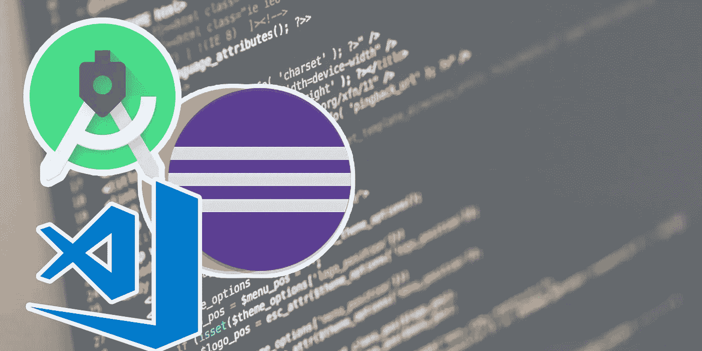
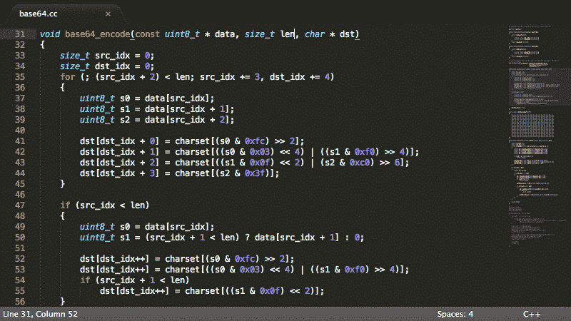
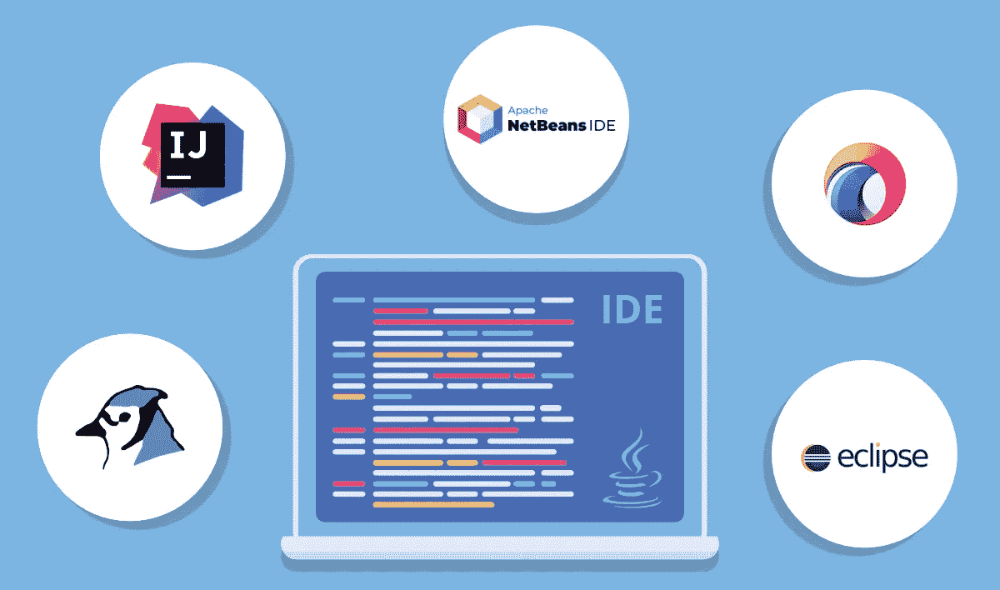

# 文本编辑器和 IDE(集成开发环境)的区别

> 原文：<https://medium.com/analytics-vidhya/difference-between-text-editor-and-ide-integrated-development-environment-73f8b2368de6?source=collection_archive---------7----------------------->

“文本编辑器”和“IDE”这两个名称对于开发人员词典来说并不陌生。如果那些对他们来说是新的，那么他们不是开发者。因为 IDE 和文本编辑器经常被用来漂亮整洁地编写代码。它们提高了用户的生产力，并使用户能够对他们的代码执行一些操作。但是，大多数开发者都不知道这两者之间的区别。所以，我认为这个教程可以帮助你理解其中的区别。

什么是文本编辑器？

文本编辑器拥有比 IDE 更广泛的方法。因为，在文本编辑器的帮助下，我们有能力使用不同的语言进行编码。我们要做的是，安装一些预安装，如插件和我们要编码的特定语言的包。最著名的文本编辑器是，

1.  [VS 代码](https://code.visualstudio.com/)
2.  [原子](https://atom.io/)
3.  [升华](https://www.sublimetext.com/)

提前，这些文本编辑有一个更广泛的社区。因此社区驱动的插件是可用的。举个例子，VS 代码中有一个插件叫做 [Live Server，由 Ritwick Dey](https://marketplace.visualstudio.com/items?itemName=ritwickdey.LiveServer) 开发。它使我们能够为静态和动态页面启动一个具有动态重新加载特性的开发本地服务器。此外，这些文本编辑器中还有数百万个插件和扩展。

**什么是 IDE？**

IDE 代表集成开发环境(你可以在某处找到集成设计环境或集成调试环境)。这个词在 IDE 中被集成，因为它包含/集成了程序员想在他们的项目中做的所有事情。

IDE 的示例如下:

1.  [日食](https://www.eclipse.org/)
2.  [Netbeans](https://netbeans.org/)
3.  [安卓工作室](https://developer.android.com/)

下面是 IDE 中提供的一些集成功能，这些功能在简单的文本编辑器中是不可用的。

*   对于部署和版本控制，您可以在 IDE 中找到 SVN 和 CVS 支持。
*   FTP 和 SFTP 支持。
*   从本地或 FTP 导入项目向导。
*   代码折叠。
*   支持 Symphony 或 Zend 之类的框架。
*   像 smarty 这样的模板支持。

一些文本编辑器有这些特性，但是不完全是 IDE，作为一个例子 VS 代码，它有很多 IDE 功能，但是实际上仍然是一个代码编辑器。

一般来说，如果它有自己的“项目”文件格式，那么它就是一个 IDE，如果没有，它就是一个文本编辑器。

**文本编辑器和 IDE 的区别**

基本上，IDE 提供了比文本编辑器更大的编程特性。一些特性包括自动完成关键字和内置函数名，突出语法。在文本编辑器中，唯一的目标是拥有一个可以编辑代码的环境。您将不得不离开编辑器来运行/调试代码，可视化用户界面等。

**使用 IDE 的好处**

1.  自动完成关键字，如变量名、函数名
2.  IDE 附带了一些针对特定编程语言的预安装库。
3.  语法突出特性。它使开发变得更容易和更快。
4.  提供一个控制台，您可以在其中查看执行结果。

**使用文本编辑器的好处**

1.  轻量级选手
2.  可用的社区驱动插件
3.  它使我们能够为基于不同语言的多个项目使用单个应用程序(文本编辑器)。

> **结论**
> 
> 上述信息将通过帮助你运用批判性思维来指导你的选择。但是，对你来说，最好的解决方案是与工作范围相匹配的，让你在投入工作时感到放松。那么，“文本编辑器还是 IDE？”取决于你。