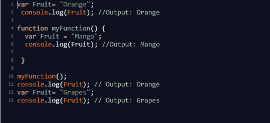
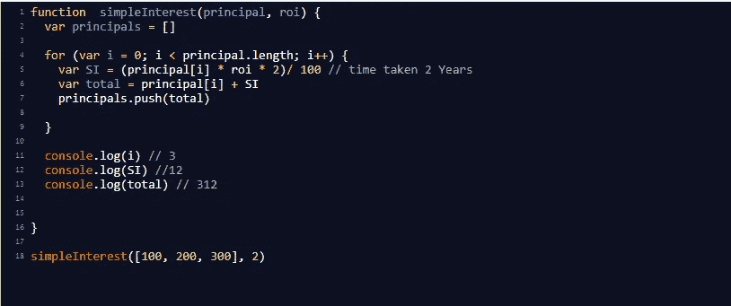
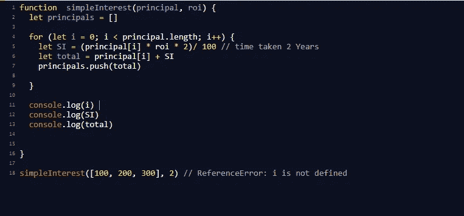
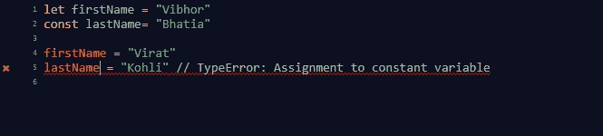

# var、let 和 const 之间的差异

> 原文：<https://medium.com/analytics-vidhya/difference-between-var-let-and-const-b234e8801d46?source=collection_archive---------10----------------------->

在 javascript 中，我们可以用`*let*` **、** `*var*` 、`*const*` **来创建变量。**但是创建变量的规则很少:

1.  名称可以以 _、$、字母开头。
2.  名称区分大小写。
3.  名称不能以数字开头。
4.  JavaScipt 的保留字不能用作变量名。

# 定义变量

> 使用`var`声明的变量是在任何代码执行之前在一个称为提升的过程中创建的。它们的初始值是未定义的

用 **var** 关键字声明的变量的作用域可以是局部作用域，也可以是全局作用域。

函数作用域变量——只能在函数内访问，不能在函数外访问的变量称为**函数**作用域变量**。**

全局作用域变量——在代码中可以被全局访问的变量被称为**全局作用域变量**

我们将通过下面的例子来理解`*var*` 关键字，我们有一个数组的本金和计算单利。

由于变量是用`*var*` 关键字**、**声明的，所以可以在函数外部访问。这里 I、SI 和 total 的值分别为 **3** 、 **12** 、 **312** 。

但是当我们用**声明变量，让**和**为常量时，结果会改变。**

# **让**

> 我们可以用`*let*`关键字声明变量，为变量提供块范围，而 **var** 关键字不能为变量提供块范围。

在上面的例子中，我们现在用`*let*`而不是 var 来声明变量:

正如在脚本语言中，代码的执行将是逐行的，我们将得到一个错误(**reference error**:**I is not define**)，因为用 **let** 关键字声明的变量只有阻塞的作用域，而我正在循环的**之外得到打印。**

当变量用`*var*` 声明并在声明前访问时会给出**未定义的**，而当变量用`*let*` 声明并在声明前访问时会给出**引用错误:变量未定义。**

使用`*let*` 来声明一个变量有助于我们需要重新赋值的地方，比如在 for 循环中或者使用它作为计数器。

# **常量**

> 变量可以像 let 一样用 const 关键字声明，但是用 const 关键字赋值的变量不能被重新赋值。

这里的 lastname 值是“Bhatia”，用`*const*` 声明。在第 5 行，同样的变量被赋值给“Kohli”，但是它抛出了一个错误(**type error:assignment**t**to constant variable**)，因为使用`*const*`我们不能重新赋值。

我们可以得出结论，如果变量在用`*var*`关键字声明之前试图访问，那么输出将是**未定义的**，但是用`*let*`和`*const*` 会给出**引用错误，** `*var*` **和****可以被重新分配，但是用`*const*`声明的变量不能被重新分配。**

**我希望你清楚 var，let 和 const 之间的区别，如果有任何疑问，你可以通过 [**LinkedIn**](https://www.linkedin.com/in/vibhor-bhatia-26ab0710a/) 联系我**