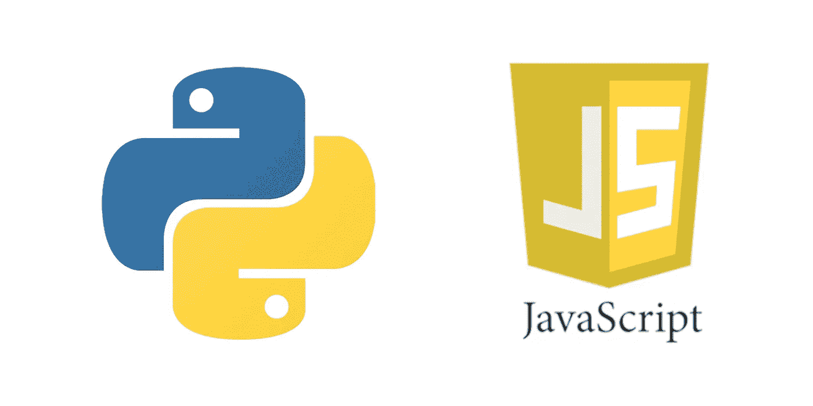

# Python 和 JavaScript 在编码上的区别

> 原文：<https://medium.com/analytics-vidhya/differences-between-python-javascript-in-coding-a13c8b551839?source=collection_archive---------18----------------------->



Python 和 JavaScript

同时学习两门语言不容易。我在上学期完成新加坡理工学院[网络和编程](https://www.sp.edu.sg/pace/courses/course-type/part-time-and-post-diplomas/ofr_ap/diploma-(conversion)-in-web-and-programming)文凭时遇到过这种情况。

这两种语言相似，但又不同。有时，我会搞混不同的语法。

# **差异**

JavaScript 使用花括号，而 Python 使用缩进。

JavaScript 是一种松散类型的语言，而 Python 则更加结构化。

Python 被广泛用于数据分析、机器学习、后端 web 应用和桌面应用。

JavaScript 主要用于 web 应用、前端 web 开发和游戏开发。

# **标识符**

标识符是用来标识变量、函数、类、模块或属性的名称。

JavaScript 标识符可以包含美元符号($)，但是 Python 不允许使用@、$、和%等标点符号。

两个标识符都可以以字母开头，但不能以数字开头。标识符中通常使用字母 A 到 Z 或 A 到 Z 或下划线(_)。

# **控制结构**

使用相同的变量名，您会注意到编码方式的不同。

**If-else**

JavaScript 使用 ***if*** 和****else****。*分号(；)用于分隔语句。*

```
*if (marks >= 80)
   grade = "A";
else if (marks >= 70)
   grade = "B";
else if (marks >= 60)
   grade = "C";
else if (marks >= 50)
   grade = "D";
else
   grade = "F";*
```

*Python 使用 ***if*** ， ***elif*** 和 ***else*** *。请注意，冒号(:)放在它们后面。
在 JavaScript 中， ***else 如果用*** 替换 Python 中的 ***elif*** 。**

```
*if marks >= 80:
   grade = “A”
elif marks >= 70:
   grade = “B”
elif marks >= 60:
   grade = “C”
elif marks >= 50:
   grade = “D”
else:
   grade = “F”*
```

***为循环***

*让我们使用下面的例子作为我们想要使用两种语言实现的输出。*

```
*The number is 0
The number is 1
The number is 2
The number is 3
The number is 4*
```

*这是 JavaScript 看起来的样子。*

```
*for (i = 0; i < 5; i++) {
    text += “The number is “ + i + “<br>”;
}*
```

*这是 Python 的样子。*

```
*for i in range(0, 5):
     print(“The number is “, i,”\n”)*
```

***While 循环***

*使用同一个输出示例，让我们看看 JavaScript 是什么样子的:*

```
*var text = “”;
var i = 0;
while (i < 5) {
   text += “<br>The number is “ + i;
   i++;
}*
```

*这是 Python 的样子:*

```
*i =- 1
while (i < 4):
   i += 1
   print(“The number is “, i,”\n”)*
```

*注意到`i++`和`i += 1`的区别了吗？这就是有时我自己也会感到困惑的区别。*

*JavaScript 有另一个 Python 没有的 do-while 循环。*

# *功能*

*如果我们需要 15 的输出，JavaScript 应该是这样的:*

```
*function simpleMath() {
   return 5 * 3;
}*
```

*这是 Python 的样子:*

```
*def simpleMath():
    return 5 * 3*
```

*使用相同的函数名，这里的区别是 Python 使用带冒号的 def。*

# ***相似之处***

*两种语言标识符都区分大小写。例如 **A** 苹果和 **a** 苹果是两个不同的标识符。*

*标识符不能与两种语言的保留字相同。*

*骆驼格在两种语言中都有使用。事实上，所有编程语言都使用 camel case。*

*两者都有相似的数据类型(列表、数组、字符串、布尔值)、操作符和控制结构。*

# ***结论***

*同时学习两种语言是可以实现的。*

*这里有一个提示，你可能希望先学习 Python，然后再钻研 JavaScript，因为 Python 更结构化，也更容易学习。对我自己来说，在我转向 JavaScript 之前，我首先学习了 Python(HTML 和 CSS 的一些背景知识会有所帮助！).*

*接下来，如果你想在同一时期学习两者，给自己分配不同的时间段。这是为了避免混淆。*

*比如周六学 Python，那就把周日拨出来学 JavaScript。试着安排不同的日子来学习不同的语言。专注于每一天。*