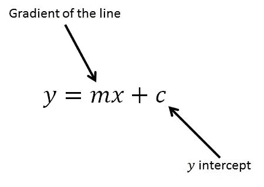
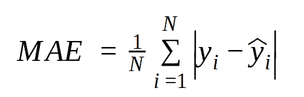
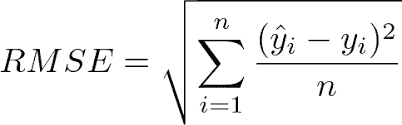
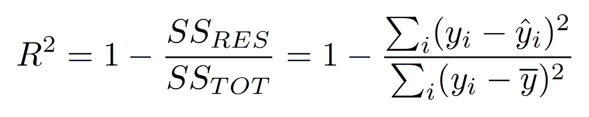
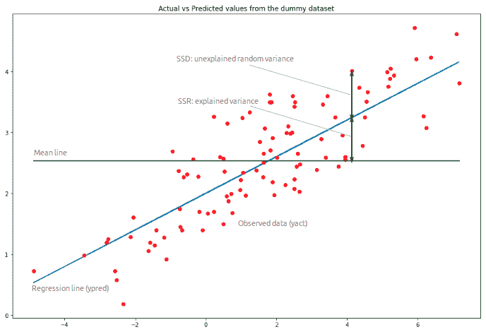

# 回归技术的评估标准

> 原文：<https://medium.com/analytics-vidhya/different-evaluation-metrics-for-regression-1b04b12e0254?source=collection_archive---------30----------------------->

为了能够在现有的不同评估指标中进行选择，让我们来看看“什么是回归？”

> 回归是一种统计方法，用于根据与我们的预测变量相关的一些其他变量来预测因变量。

让我们举一个经典的例子来更好地理解它，

> 假设我们想根据房子的平方英尺这个变量来预测房子的价格。我们可以使用回归来预测价格，其中我们的因变量是“价格”，自变量是“平方英尺”，价格的预测可以使用线性回归来完成。

上图描述了用于预测因变量的公式，为了使用自变量(x)预测因变量(y ),我们需要计算直线的梯度(m)和 y 截距(c)。

这样我们就可以根据房子的平方用线性回归来预测房价了。

现在，我们已经理解了“什么是回归？”还用它预测了房价，但是我们怎么能确定预测的价格是正确的呢？

这是评估指标发挥作用的时候了。

> 顾名思义，评估指标用于检查我们预测的价格是否正确，简单来说就是用于验证我们的发现。

因此，有 3 个常用的指标，解释如下:

1.  **平均绝对误差(MAE):** 平均绝对误差，它计算我们的实际值和预测值之间的绝对差值。

> 好的预测将具有较低的 MAE 值，因为实际值和预测值之间的差异较小。

**2。均方根误差(RMSE):** 均方根误差给出了实际值和预测值之间的平方差的平均值，最后取平方根。

> 当不希望出现大误差时，RMSE 最有用。

**3。R 平方误差:** R 平方是从自变量可预测的因变量中方差的比例。

> R 平方值不应太小或太大。

在哪里，

n=培训示例的数量

yi=实际值

yhati=预测值

ybari=平均值

SSRES=实际值和预测值的平方差

SSTOT=实际值和平均值的平方差

> **注意:**对于一个好的模型，它应该具有较低的 MAE、RMSE 和较高的 R 平方值。

> 俗话说“一张图片胜过千言万语”，所以，让我们用下面的图片来理解这些错误。

1.  **MAE** 是训练数据中所有值的观测数据( **yact** )和回归线( **ypred** )的绝对垂直距离之和。
2.  **RMSE** 是 **yact** 和 **ypred** 之间垂直距离的均方根和。
3.  **SSRES** 是 **yact** 距离**回归线**的垂直距离的平方和。
4.  **SSTOT** 是 **yact** 距离**中线**的垂直距离的平方和。

现在，您已经完全具备了回归和评估指标。

希望这能有所帮助。