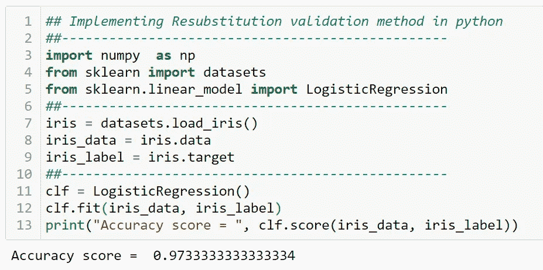
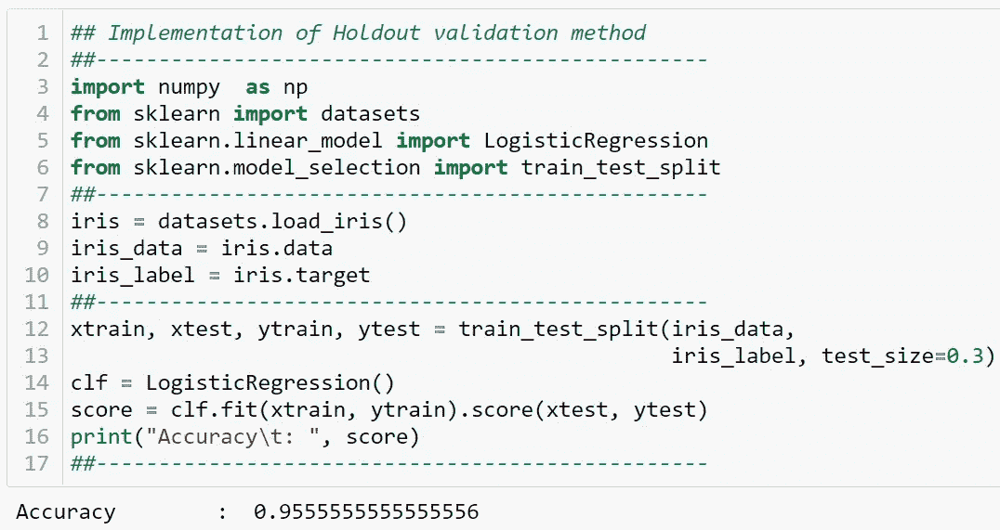
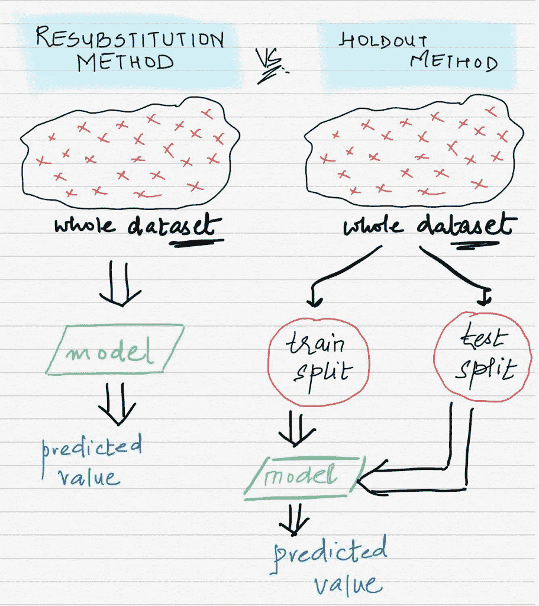
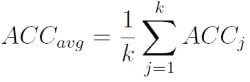
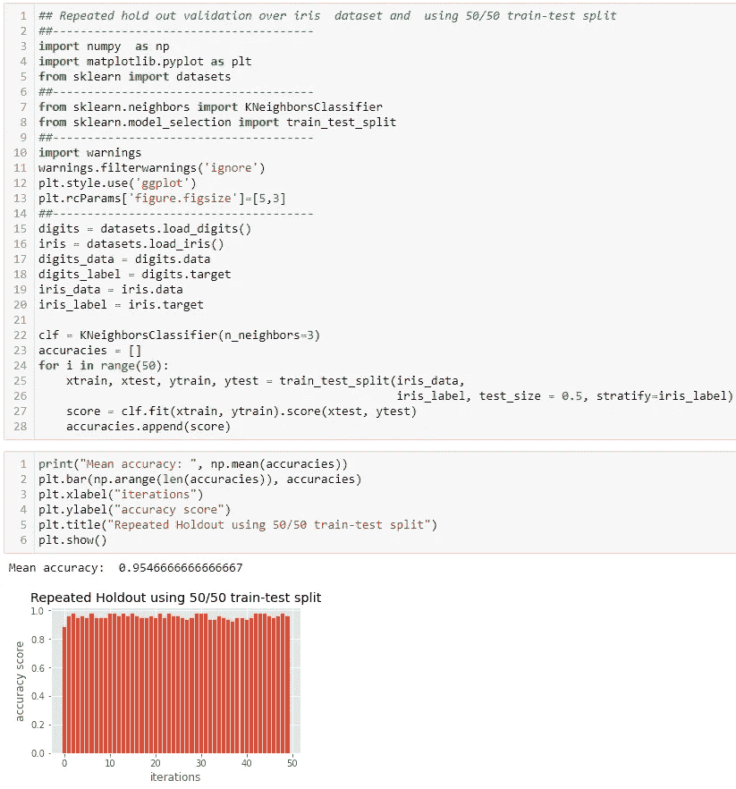
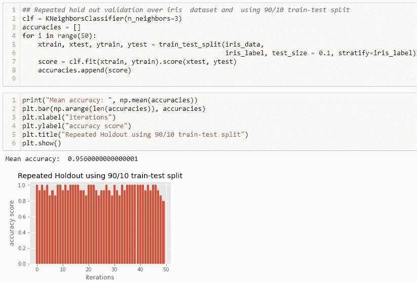
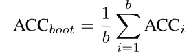
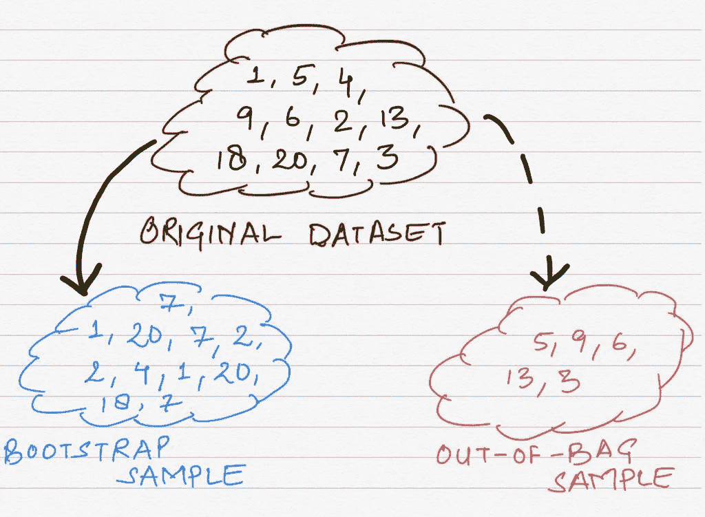

# 不同的模型评估方法—第 2 部分

> 原文：<https://medium.com/analytics-vidhya/different-model-evaluation-methodologies-part-2-679fcb064c55?source=collection_archive---------10----------------------->

照片由昆泰·德威迪拍摄

在 [***上一部***](/@kountaydwivedi/why-is-model-evaluation-a-crucial-step-in-machine-learning-part-1-eeb4882e7c8a) 中，我们回答了以下主线任务:

*   对模型评估方法的需求。
*   差值 b/w a ***参数*** 和 a ***超参数。***
*   差异 b/w ***欠拟合*** 和 ***过拟合*** 。
*   究竟什么是 ***偏差*** 和 ***偏差*** 。

现在，让我们进入核心话题…

> 模型评估技术

> **再替代评估:**

**替代法，**也称为*剩余法*，是最基本的方法，由于其**过拟合问题，不推荐用于模型评估。**

*   ***关键思想:*
    ****** 使用所有可用的数据集来拟合使用任何适当的机器学习算法的模型；此后，根据数据集和我们可用的地面实况评估模型。
*   ***为什么不推荐？*** 恢复替换方法使用所有可用的数据集进行模型拟合。因此，我们不会留下任何看不见的数据来评估*的泛化精度。因此，我们别无选择，只能测量地面实况的准确度。但是，由于模型已经看到了相应的数据集，因此当实时或不可见的数据输入其中时，它将显示出令人敬畏的训练准确度分数(也称为替代准确度分数)，但泛化或预测准确度分数很差。这导致**高方差**超过看不见的数据。*
*   以下代码片段说明了使用 python 在 iris 数据集上实现 resubstitution 方法。

实施替代方法(照片由 Kountay Dwivedi 拍摄)

> **维持评估:**

维持评估方法考虑到了重新替代方法的缺点，但也带来了一些缺点:

*   ***关键思想:***
    首先，我们把数据集分成两部分——**一个训练集和一个测试集。然后，我们使用训练集和适当的机器学习算法来拟合模型。最后，当我们得到最佳模型时，我们输入测试集，以便计算*的泛化精度。***
*   ***缺点:
    * ****Holdout 方法的**第一个缺点**与数据集的*简单随机分裂*有关。如*第 1 部分所述，*简单的随机分割可能会扭曲数据集中存在的子类比例。因此，最好使用数据集的*分层随机分裂*成训练集和测试集。
    **** ******第二个缺点**与*数据集*数量不足有关。**如果我们没有足够的数据集将它分成两部分**该怎么办？在那种情况下，模型将永远无法学习到它的全部能力(第一部分中的*图— 1)。对于容量，我们指的是模型的复杂性。因此，即使我们建立了一个合适的模型来处理手头问题的复杂性，由于学习数据量较少，该模型也无法达到其容量。*
*   以下代码对应于 iris 数据集上训练/测试分割比为 **0.7/0.3、**的维持方法。您可以调整分割比率，玩玩代码，看看准确性如何受到自己的影响。

实施单一维持验证步骤(照片由 Kountay Dwivedi 拍摄)

说明了不同的 b/w 替换方法和保持方法。(Kountay Dwivedi 摄)

*   **重复维持方法(修改后的维持评估):** 这是一个修改后的、更加健壮的模型评估变体。这个方法没有什么新东西，除了我们只对数据集执行一次简单的维持方法；在重复维持方法中，**我们重复过程 *k* 次，每次迭代使用不同的随机种子，这样我们每次都不会得到相同的分割。**因此，我们对 *k 次*迭代执行训练/测试分割，并且在每次迭代中，我们存储计算的预测准确度分数。最后，我们对所有迭代中计算的精度进行平均。假设 *ACC_j* 是第 *j* 次迭代的精度得分，则 *ACC_avg* 为:

说明**重复保持方法**，列车测试分割= 50/50。请注意精确度分数栏。它们从未达到其最大能力(由于缺乏列车组)，但装备的可变性非常低。(Kountay Dwivedi 摄)

这是使用 90/10 的训练测试比率的**重复保持的另一种实现。请注意，当我们改变训练测试分割比时，准确度分数是如何变化的**

> **自举法:**

*   我们讨论了维持方法在数据集问题上的不足。重复的维持评估在一定程度上克服了这一缺点，但并不完全。
*   bootstrap 方法是模型评估的一种替代方法，当我们需要的数据集数量不足时，通常会考虑这种方法。它是专门为解决小数据集问题而设计的。
*   ***关键思想:*** 在自举中，我们从原始数据集中反复抽取 ***样本进行替换。*** 也就是说，假设我们有一袋数据集，我们从其中挑选一个数据点，复制到一个单独的***“bootstrap sample”(即训练集)*** 中，再放回袋中。
    我们将此过程重复 *n* 次，其中 *n* 等于我们袋中的数据点数。之后，我们将查看没有被选作引导样本一部分的点，并将它们保存在一个单独的集合中。这一组被称为“ ***”的自付样本(即测试组)。*** 最后，我们使用 bootstrap 样本拟合一个模型，并计算随机样本的精确度。
*   以上过程实际上是对“ ***b 自举轮”*** 的重复(即 *b* 迭代*)。*最后，总精度计算为“b”引导轮计算的所有精度的平均值，类似于重复维持评估。设 *ACC_i* 为第 *i* 轮引导的精度，则 *ACC_boot (* 整体精度)为:

*   具体到上述方法的一件事是——它实际上被称为**留一个自举(LOOB)**；一种特定类型的引导方法，其中我们不使用所有数据进行训练，而是将数据集分成*引导样本*和*出袋样本。*

图示了一个分为“自举样本”和“*袋外样本*”的自举样本(照片由 Kountay Dwivedi 拍摄)

*   ***一个短暂的缺点:* 虽然自举评测看似朗朗上口，但它有一点不好的地方，*即。*它还患有*悲观偏见。但是，这是一个不同的故事，所以更多的关于这一点。***

这些是一些流行的模型评估技术。关键要点是:

*   替代法是一种非常幼稚的方法，不推荐使用，因为它忽视了对看不见的数据进行测试的重要性，因此会带来非常高的方差。
*   维持方法可以被认为是一种标准的模型评估方法。当数据集不足时，缺点就出现了。因此，可以得出结论，当数据集非常大时，**维持法(尤其是重复维持法)最适合模型评估。**
*   另一方面，我们刚刚看到了 Bootstrap 方法及其环境。并且，毫无疑问，我们可以得出结论，当数据集不足时， **Bootstrap 方法是一个很好的方法。**请注意，自举并不是最好的方法。我们将在接下来的[最后一部](/@kountaydwivedi/model-selection-techniques-part-3-d5ebb6ea4c77)中看到更多。

> 接下来—第 3 部分

我希望这篇文章能让你保持完整和兴趣。希望你已经掌握了主要的**模型选择技巧。**那么，不再多说，让我们进入下一个也是最后一个部分，第三部分——模型选择技术。*敬请关注，快乐学习。
:-}*