# 深度神经网络的不同优化算法:完全指南

> 原文：<https://medium.com/analytics-vidhya/different-optimization-algorithm-for-deep-neural-networks-complete-guide-7f3e49eb7d42?source=collection_archive---------2----------------------->

在深度学习无处不在的世界中，从农业到医学、汽车、教育、国防、安全和其他领域。该算法必须高效，神经网络才能获得更好的结果。当人们期望从神经网络获得更好更快的结果时，优化技术成为深度学习算法的核心，在这些优化算法技术之间的选择可以在等待数小时或数天以获得优异的准确性之间产生巨大的差异。关于神经网络的优化有一些要点。

1.  更好的优化算法
2.  更好的激活功能
3.  更好的初始化方法
4.  更好的正规化

在本文中，我们将只关注深度神经网络(DNN)的更好的优化算法。在本文中，我们将这种优化算法称为学习算法。有几种众所周知的学习算法。让我们来看看它们。

## 基于动量的学习算法

1.  香草梯度下降(物品)
2.  基于动量的梯度下降
3.  内斯特罗夫加速梯度下降法

## 基于批量学习的学习算法

1.  随机更新
2.  小批量更新

## 基于自适应学习速率的学习算法

1.  阿达格拉德
2.  RMS Prop
3.  Adam(RMS Prop 和基于动量的 GD 的混合)

# **基于动量学习算法**

梯度下降是执行优化的最流行和最常用的学习算法之一，也是优化神经网络的最古老的技术。这是一种主要受著名技术“局部最小值”或“爬山”启发的算法。它于 1944 年首次推出。

现在我们来看看梯度下降算法的基本直觉。

假设你正沿着山谷走，你的目标是到达全局最小值的地方。但是从你现在的位置，你不能跳到那个位置，或者你不能看到你的目标。在每一个职位上，你都要根据你目前的职位做出决定。

*   你可能向上或向下
*   你的步长取决于两个因素，你当前位置的斜率，即下降和预定义的步长(学习率)。

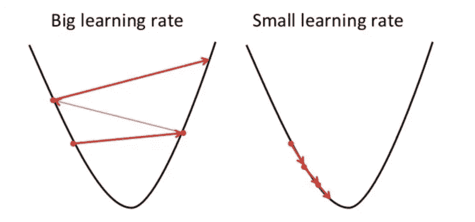

现在，如果你有一个更大的步长，你可以超越你的目标。但是如果你的步长很小，要达到期望的目标状态需要很长时间。所以你必须在它们之间进行平衡，以获得更好的结果。

这是梯度下降法的基本直觉，我们将在不同的基于 GD 的学习算法中看到更多。

## **香草渐变下降**

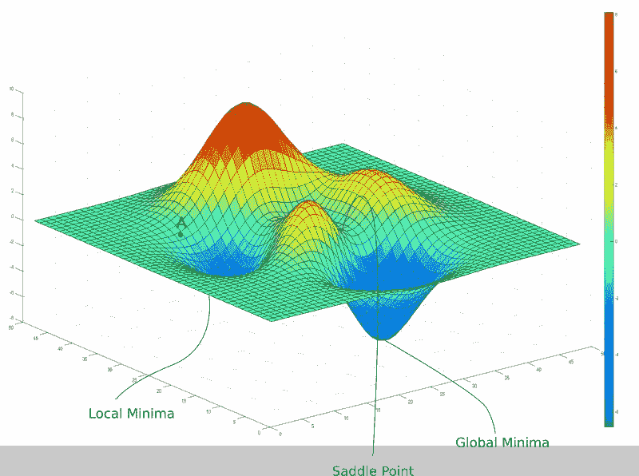

现在让我们看看香草梯度下降算法的主要动机，它是一个基本的 GD 算法，没有任何修改。

在图中，红色表示高损耗，蓝色区域表示最小损耗。比方说，我们从 A 开始我们的旅程，我们的目标是以最少的步数达到全局最小值。

我们来看看梯度下降的主要更新规则。

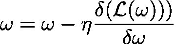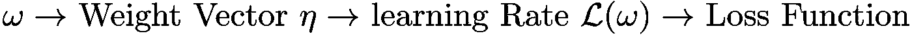

我们将在另一篇文章中讨论损失函数，现在，我们将只关注主函数。

这里的主要思想是通过计算函数的导数/斜率，我们可以找到函数的最小值。而学习率会帮助我们设置步长。我们越接近全局最小值，损失函数 L(w)将变得最小，这就是为什么我们的更新将是最小的。

让我们来看看代码部分:

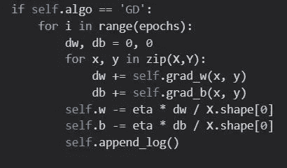

梯度下降的 Python 代码

这里 X 是数据点，Y 是相应的标签。

**优点:** 1。易于实施

**缺点:** 1。该算法一次性获取整个数据集，并计算导数来更新权重，这需要大量内存和时间。2。该算法可能卡在局部最小值或鞍点

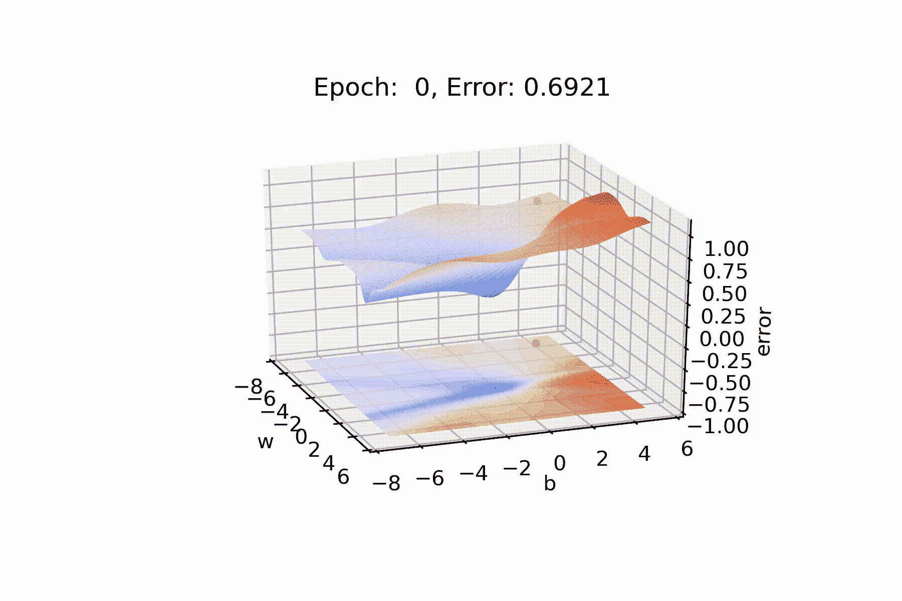

香草渐变停留在局部最小值

## **基于动量的梯度下降**

现在在 GD 算法之后，我们需要思考两个问题。

1.  **你如何使用渐变？**
    我们只使用当前的渐变来更新之前的权重值。
2.  **我们能想出比这更好的更新规则吗？**
    能否将之前的渐变与当前的渐变一起使用，形成更好的更新规则？我认为这是个好主意。这叫做基于动量的梯度下降。在这里我们根据 prev 梯度计算动量。

让我们来看看它们:

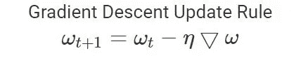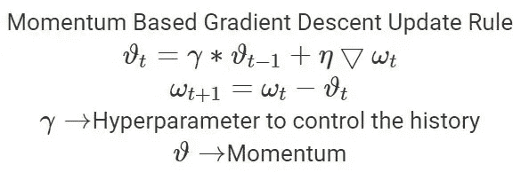

现在很清楚，从上面的等式如果加上γ=0，我们将得到普通的 GD 等式，即如果我们不想加上历史。

现在让我们看一下代码:

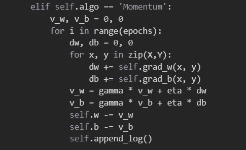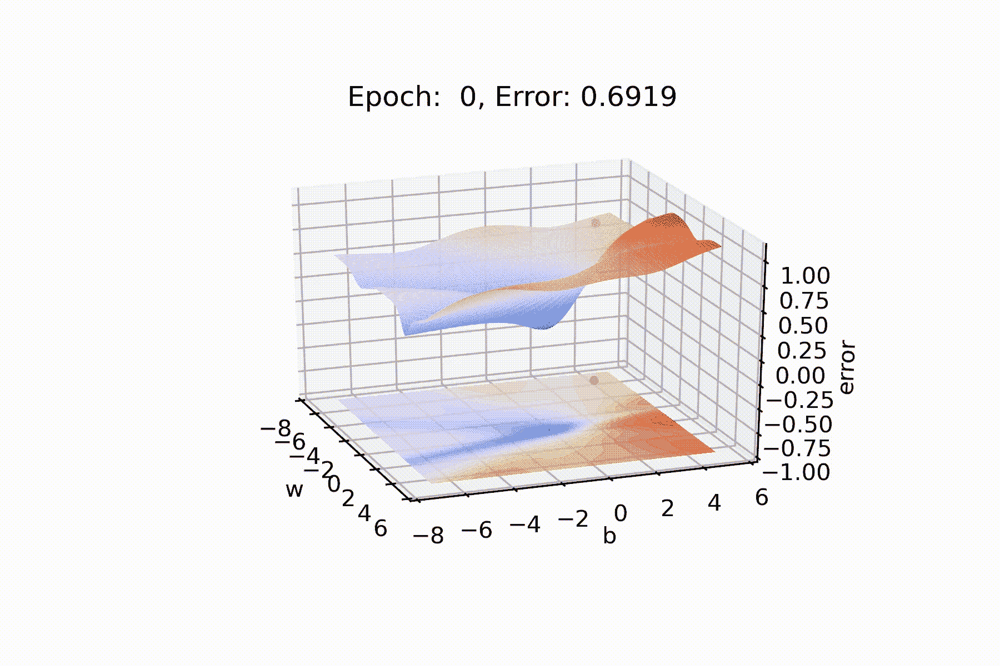

现在我们可以清楚地看到，它正在走出局部最小值，甚至在 700 个纪元后达到全球最小值。

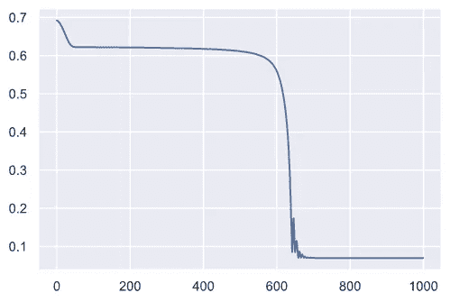

**优点:** 1。减少参数的振荡和高方差。
2。比梯度下降收敛得更快

**缺点:** 1。即使是现在也需要更长的时间来收敛，因为它移动得太快了，所以它可能会拐错弯。

如果我们在 2D 绘制图表，那么我们可以看到，在最后一部分，它超过了全球最小值，并且有一些振荡。
2。又增加了一个超参数，需要手动精确选择。

## 内斯特罗夫加速梯度下降法

所以基于动量的 GD 是相当好的，但仍然有一些缺点。行动迅速总是好的吗？我们如何纠正它。

内斯特罗夫加速梯度下降以某种方式解决了这些困难。让我们看看它是如何执行操作的。

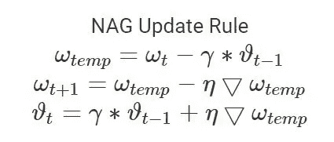

这里，它的作用是防止过冲，它创建 **ωtemp** ，这是该梯度的一个前瞻点，它从该前瞻点计算动量，并决定在最初移动到该位置之前走哪条路。

通过这种方式，它缓慢但准确而稳定地向原始全局最小值移动，而不会超过它们。

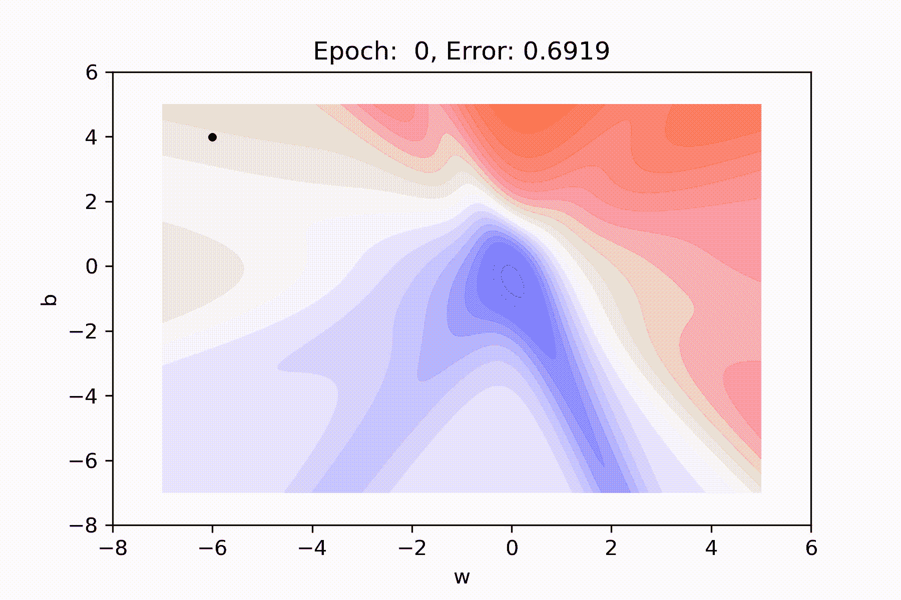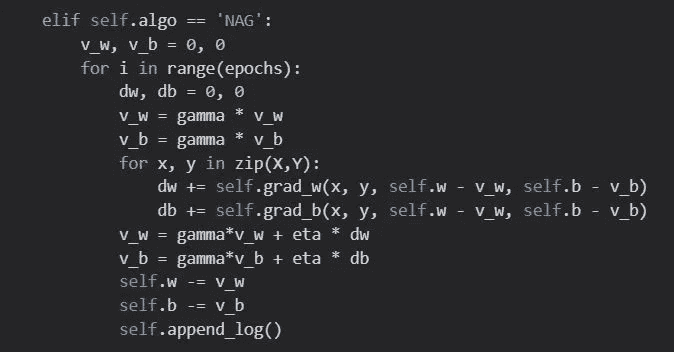

NAG 代码

**优点:** 1。少荡于失。
2。朝着全局最小值稳步前进。

**缺点:**
1。可能比基于动量的梯度下降需要更长的时间。

# 基于批量学习的学习算法

到目前为止，我们在看到一整批数据后，正在更新我们的权重。有时这种方法会使速度变慢。看看批量更新会怎么样。

## 随机梯度下降

在这种梯度下降的变体中，它试图在从数据集中看到一个数据后更新权重，所以基本上它更新得更频繁。因此，如果数据集有 100 个数据，它将在一个时期内更新 100 次。让我们看看它的表现如何。

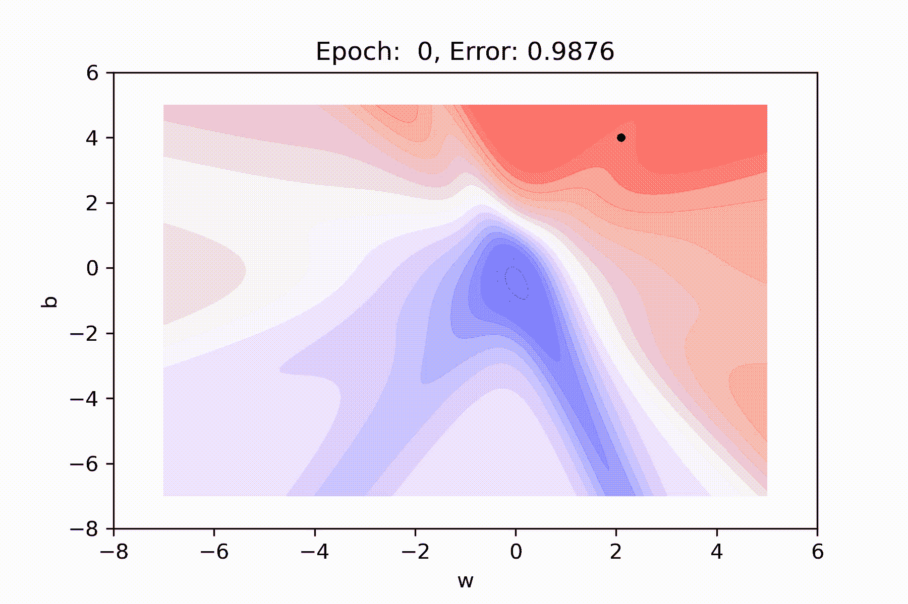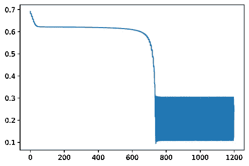

从这两张照片，我们可以清楚地看到，有这么多的振荡。因为它经常更新，一个更新抵消了其他更新。

**优点:** 1。更新更快。
2。一次数据传递中的多次更新
3。需要较少的内存

**缺点:** 1。近似坡度
2。几乎就像只扔一次硬币，然后计算 P(正面)的值。
3。为了获得与其他算法相同的收敛性，需要缓慢降低学习率的值
4。达到全局最小值后可能超调，振荡很大。

## 小批量更新

在这种方法中，我们将稍微增加批量(> 1)。它将减少一个时代的更新。现在，它将仅在每一批次后更新模型权重或参数。因此，数据集被分成不同的批次，在每一批次之后，参数被更新。

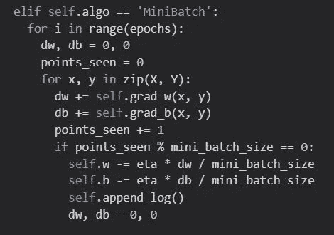

**优点:** 1。这种方法频繁地更新模型权重，并且具有更小的方差，性能优于随机 GD。
2。需要中等大小的内存

# 基于自适应学习速率的学习算法

现在问题来了，为什么我们需要一个自适应的基于学习速率的算法？在现实问题中，数据集中可能有大量权重。它们中的许多可以是稀疏的，许多可以是密集的。而我们的求导主要和那个特征值的值成正比。因此，密集要素将比稀疏要素获得更频繁的更新。所以这就是为什么不同的特性需要不同的学习率。

## 阿达格拉德

Adagard 衰减参数的学习率与其更新历史成比例(更新越少，衰减越少)。让我们看看阿达格拉德的方程式。

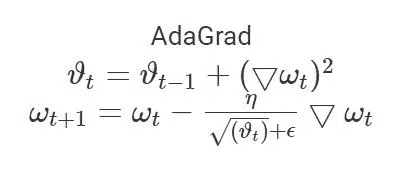

这里ϑt 计算更新历史。增加ϵ是为了数值的稳定性，因为有时我们可能会得到ϑt 值为 0。更新历史越多，学习率就越大。并且如果更新历史小于，则该特征的衰减将较小。

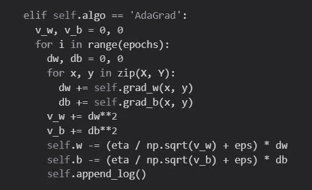

因此，很明显，在第一阶段，它的方向是错误的，但经过一段时间后，它会根据当前位置找到一个很好的学习速度和方向，并且收敛速度比以前的任何算法都快。我在小数据点进行了测试，当我们将它应用到更大的网络时，我们会得到更好的结果。

**优点:**
1。每个训练参数的学习率变化。
2。不需要手动调整学习率。
3。对应于稀疏特征的参数得到更好的更新。

**缺点:**
1。随着分母的增长，学习率急剧下降(对于对应于密集特征的参数来说，这不是好事)

## RMS Prop

现在 RMS 支柱背后的主要直觉是，我们能衰减分母并阻止它的快速增长吗？是的，有了 RMS Prop，我们可以防止这种情况。带有一个额外的参数。

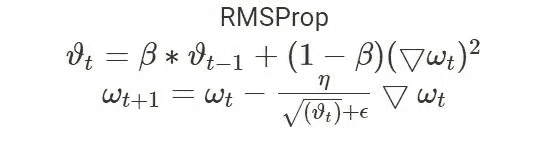

有了额外的参数β，我们可以防止ϑt 变大。它将减少先前权重值的衰减。

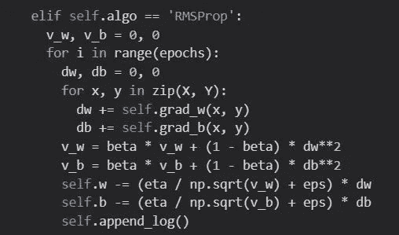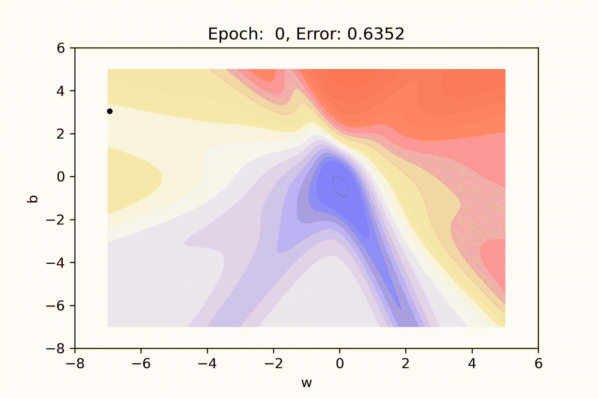

从这个动画中，我们可以看到它阻止了分母变大，这就是为什么我们的学习速度加快了。

## 圣经》和《古兰经》传统中）亚当（人类第一人的名字

我认为这是最有效的算法。这是基于**动量的 GD** 和 **RMSProp 的完美融合。**需要两个历史，一个是动量，一个是学习率。亚当算法就是这样结合了两种算法的优点。一项确保学习率不会因权重而被扼杀，另一项确保梯度更新不仅取决于当前导数，还取决于前一导数。

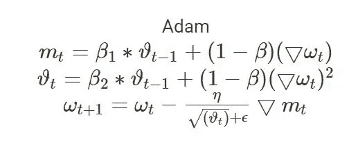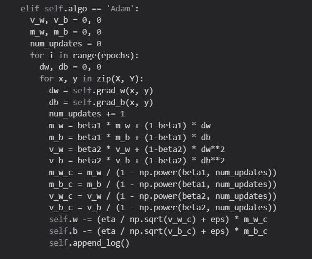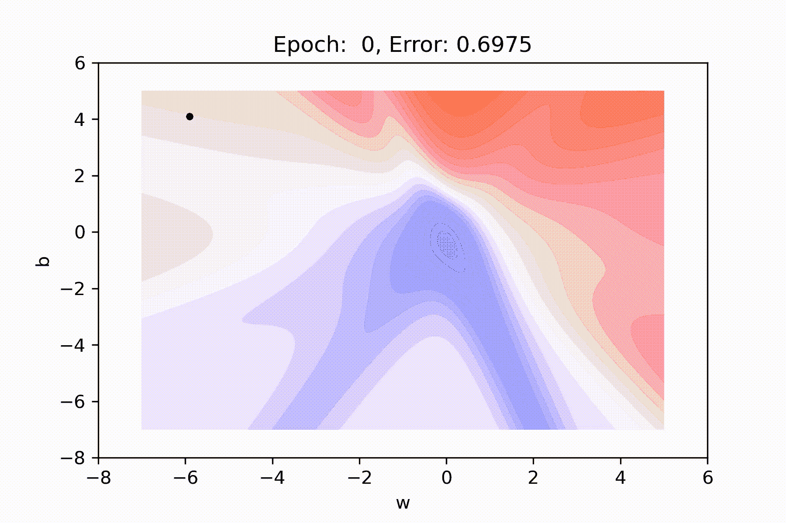

所以在上面的例子中，清楚地显示了在一些初始步骤之后，它向全局最小值稳步移动。当然，这不是最好的例子，但它确实解决了我们学习算法的几乎所有问题。用超参数进行更多的修改(我们现在有三个)可以得到更好的结果。

# 结论

因此，在比较了所有这些算法之后，我们可以说 Adam 是最好的优化算法。我们可以使用 Adam 和小批量方法来获得更好的结果。
Adam optimizer 可以在更短的时间内更高效地训练一个神经网络。

我希望你喜欢这篇文章，并且能够对不同的学习或优化算法以及它们之间的比较有一个很好的直觉。给我你的反馈。

链接到我的 Github。[https://github.com/somnath119/Deep_Learning_Basics](https://github.com/somnath119/Deep_Learning_Basics)

关于我:
**Somnath Paul**
海得拉巴大学 MTech AI 学生。
联系方式:-[https://www.linkedin.com/in/somnathpaul/](https://www.linkedin.com/in/somnathpaul/)邮箱-somnathpaul119@gmail.com