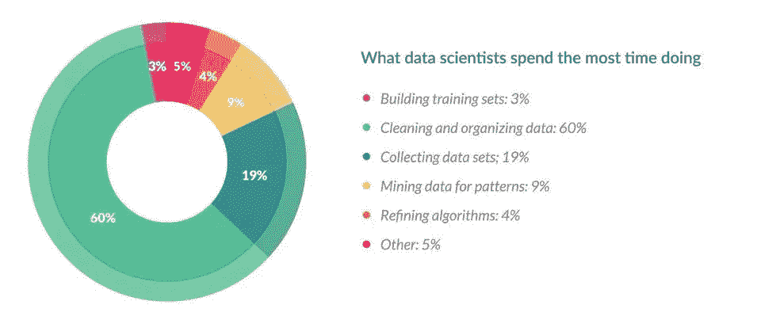
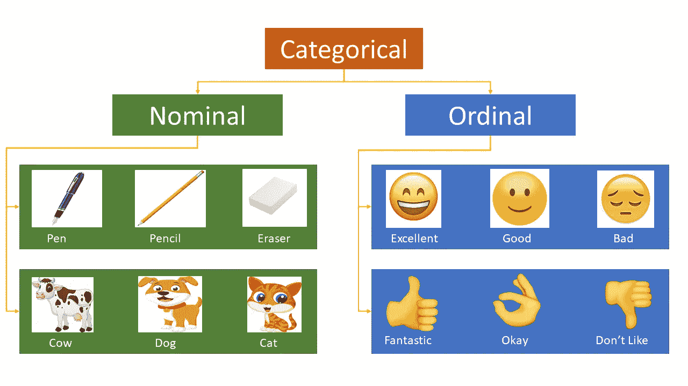
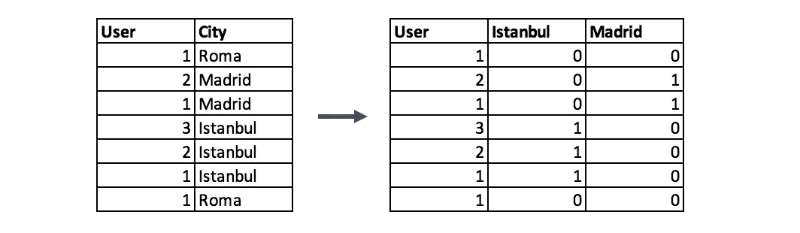
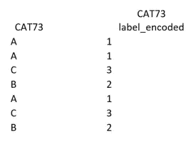
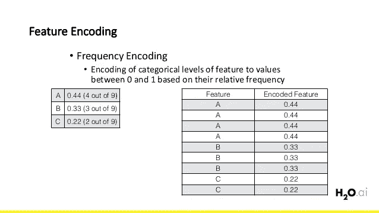
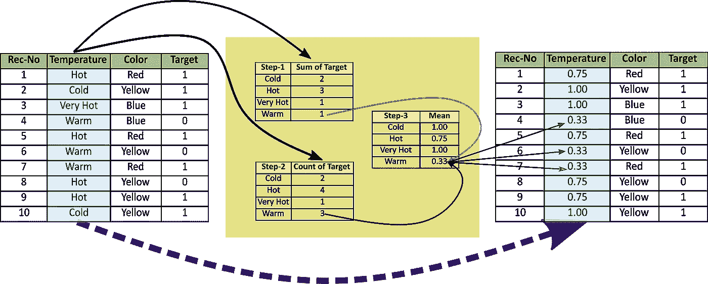

# 用于分类变量编码的不同类型的特征工程编码技术

> 原文：<https://medium.com/analytics-vidhya/different-type-of-feature-engineering-encoding-techniques-for-categorical-variable-encoding-214363a016fb?source=collection_archive---------0----------------------->

[https://elitedata science . com/WP-content/uploads/2018/05/Feature-Engineering-Banner-940 px . jpg](https://elitedatascience.com/wp-content/uploads/2018/05/Feature-Engineering-Banner-940px.jpg)

**“**让我们在现有功能的基础上创造**新功能**”

我们将在本文中讨论的内容

*   什么是特征工程？
*   为什么特征工程很重要。
*   什么是编码技术？(也是编码技术的类型)

**什么是特征工程？**

**特征工程**是使用数据的领域知识来创建使机器学习算法工作的特征的过程。特征工程是机器学习应用的基础，既困难又昂贵。自动特征学习可以消除对人工特征工程的需求。

特征工程是一个非正式的话题，但在应用机器学习中被认为是必不可少的。

> 想出特性是困难的，耗时的，需要专业知识。“应用机器学习”基本上是特征工程。
> 
> ——[*吴恩达*](https://en.wikipedia.org/wiki/Andrew_Ng) *，机器学习和人工智能通过大脑模拟*

**为什么特性工程很重要？**

如果特征工程做得正确，它可以通过从原始数据中创建有助于促进机器学习过程的特征来提高机器学习算法的预测能力。特征工程是一门艺术。

要解决任何机器学习问题，我们都必须遵循一些步骤

*   收集数据。
*   正在清理数据。
*   **特色工程。**
*   定义模型。
*   训练、测试模型和预测输出。

基本上，所有的机器学习算法都使用一些输入数据来创建输出。该输入数据包括特征，这些特征通常是结构化列的形式。算法需要具有某些特定特征的功能才能正常工作。

数据科学家花费**80%的时间在**数据准备上:****

****

****什么是编码技术？编码技术的种类****

**在许多实际的数据科学活动中，数据集将包含分类变量。这些变量通常存储为文本值”。由于机器学习是基于数学方程的，当我们保持分类变量不变时，它会引起一个问题。许多算法无需进一步操作就支持分类值，但在这些情况下，是否对变量进行编码仍然是一个讨论的话题。在这种情况下，不支持分类值的算法只能采用编码方法。**

****编码方法****

****名义编码:——**数据顺序无关紧要**

**在名义编码中，我们有各种技术:**

*   **一个热编码**
*   **一个热门编码有多个类别**
*   **平均编码**

****顺序编码:——**数据的顺序很重要**

**在顺序编码中，我们也有各种各样的技术**

*   **标签编码**
*   **目标引导顺序编码**

****

****我们来谈谈一些编码技术:-****

****一种热编码:——**在这种方法中，我们将每个类别映射到一个向量，该向量包含表示该特征是否存在的 1 和 0。向量的数量取决于我们想要保留的类别。对于高基数特性，这种方法会产生大量的列，大大降低了学习的速度。在热编码和虚拟编码之间以及何时使用热编码存在争议。它们非常相似，除了一个热编码产生的列数等于类别数，而伪编码产生的列数少一个。这最终应该由建模者在验证过程中相应地处理。**

****

**一个热编码**

****标签编码:—** 在这种编码中，每个类别被赋予一个从 1 到 N 的值(这里 N 是特征的类别数)。它可能看起来像(汽车<公共汽车<卡车……0<1<2)。有一些联系或彼此接近的类别在编码后会丢失一些信息。**

****

**标签编码**

****频率编码:——**利用类别的频率作为标签的一种方式。在频率与目标变量有一定关系的情况下，它有助于模型理解并根据数据的性质按正比例和反比例分配权重。**

****

**频率编码**

****均值编码:——**均值编码或目标编码是一种非常流行的编码方法，被卡格勒所遵循。均值编码类似于标签编码，只是这里标签与目标直接相关。例如，特征标签中每个类别的平均目标编码由训练数据上目标变量的平均值决定。**

**平均目标编码的优点是它**不影响数据量**并有助于更快的学习。**

****

**平均编码**

**暂时就这样了。**

**如果你觉得这篇文章有趣、有帮助，或者你从这篇文章中学到了什么，请分享你的反馈。**

****感谢阅读！****

**看看我的新文章“[网上推荐系统的实际实现](/datadriveninvestor/product-recommendation-based-on-visual-similarity-on-the-web-machine-learning-project-end-to-end-6d38d68d414f)**

****参考资料:-****

**[**https://towardsdatascience . com/all-about-category-variable-encoding-305 f 3361 FD 02**](https://towardsdatascience.com/all-about-categorical-variable-encoding-305f3361fd02)**

**[**https://www . data camp . com/community/tutorials/encoding-methodologies**](https://www.datacamp.com/community/tutorials/encoding-methodologies)**

****还有，让我们在**[**Twitter**](https://twitter.com/iam_himanshu0)**[**insta gram**](https://instagram.com/iamhimanshu0/)**[**Github**](https://github.com/iamhimanshu0)**，以及** [**脸书**](https://www.facebook.com/iamhimanshu0) **上成为朋友吧。********